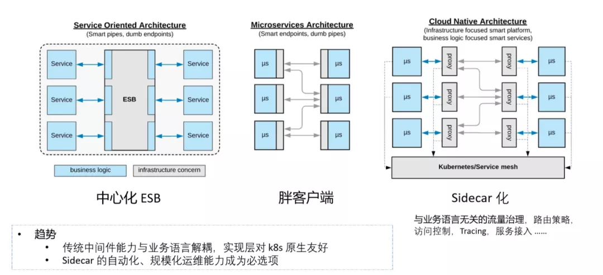
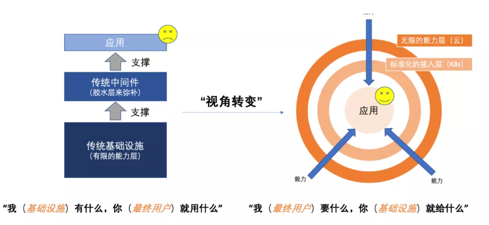

# 【转载】云原生五大趋势预测，K8s 安卓化位列其一

[原文《云原生五大趋势预测，K8s 安卓化位列其一》](https://www.kubernetes.org.cn/7995.html)

作者 | 李响、张磊

Kubernetes 本身并不直接产生商业价值，你不会花钱去购买 Kubernetes 。这就跟安卓一样，你不会直接掏钱去买一个安卓系统。Kubernetes 真正产生价值的地方也在于它的上层应用生态。

“未来的软件一定是生长于云上的”，这是云原生理念的最核心假设。而所谓“云原生”，实际上就是在定义一条能够让应用最大程度利用云的能力、发挥云的价值的最佳路径。因此，云原生其实是一套指导软件架构设计的思想。按照这样的思想而设计出来的软件：首先，天然就“生在云上，长在云上”；其次，能够最大化地发挥云的能力，使得我们开发的软件和“云”能够天然地集成在一起，发挥出“云”的最大价值。

云原生的概念大家并不陌生，很多企业也已经基于云原生的架构和技术理念落地相关实践。那么，这么多企业和开发者热衷和推崇的云原生，未来的发展趋势如何？如何才能顺应云原生的主流方向去发展？

我们邀请到阿里云资深技术专家、CNCF 技术监督委员会代表，etcd 作者李响和阿里云高级技术专家、CNCF 应用交付领域 co-chair 张磊分享云原生的理念、发展以及未来趋势，为大家打开新的思路和眼界。

以下内容共享给大家。

## Kubernetes 项目的安卓化

云原生里有一个非常关键的项目，就是 Kubernetes。Kubernetes 的发展非常迅速，它是整个云原生体系发展的基石。今天我们来观察 Kubernetes 项目的发展特点，首先，Kubernetes 无处不在，无论是在云上，还是用户自建的数据中心里，甚至一些我们想象不到的场景里，都有 Kubernetes 的存在。

第二，所有云原生的用户使用 Kubernetes 的目的，都是为了交付和管理应用。当然这个应用是一个泛化的概念，可以是一个网站，也可以是淘宝这样非常庞大的电商主站，或者是 AI 作业、计算任务、函数、甚至虚拟机等，这些都是用户可以使用 Kubernetes 去交付和管理的应用类型。

第三，今天我们来看 Kubernetes 所处的位置，实际上是承上启下。Kubernetes 对上暴露基础设施能力的格式化数据抽象，比如 Service、Ingress、Pod、Deployment，这些都是 Kubernetes 本身原生 API 给用户暴露出来的能力。而对下，Kubernetes 提供的是基础设施能力接入的标准接口，比如说 CNI、CSI、DevicePlugin、CRD，让云能够作为一个能力提供商，以一个标准化的方式把能力接入到 Kubernetes 的体系中。

这一点其实跟安卓非常类似，安卓虽然装在你的设备里，但是它能够让你的硬件、手机、电视、汽车等都能接入到一个平台里。对上则暴露统一的一套应用管理接口，让你能够基于安卓系统来编写应用，去访问或者享受到这些基础设施能力，这也是 Kubernetes 和安卓的相似之处。

最后， Kubernetes 本身并不直接产生商业价值，你不会花钱去购买 Kubernetes。这就跟安卓一样，你不会直接掏钱去买一个安卓系统。Kubernetes 真正产生价值的地方也在于它的上层应用生态。对安卓来说，它今天已经具备了一个庞大的移动端或设备端应用的开发生态，而对于 Kubernetes 来说也是类似的，只不过现在还在于比较早的阶段。但我们已经能够看到，今天在 Kubernetes 上构建的商业层很多是垂直解决方案，是面向用户、面向应用这一侧真正能够产生商业价值的东西，而不是 Kubernetes 本身这一层。这就是为什么我说 Kubernetes 发展跟安卓很像，当然这可能也是谷歌比较擅长的一个“打法”：全力地去免费推广一个“操作系统”，真正获取商业价值的方式则是是去“收割”操作系统上层的生态价值而不是操作系统本身。

基于这些现象，我们将 Kubernetes 的发展趋势概括为以下几点：

### 1. 云的价值回归到应用本身

用户使用 Kubernetes 的本质目的是去交付和管理应用。从这个现象来看，如果 Kubernetes 发展下去，那么世界上所有的数据中心和基础设施上面都会有一层 Kubernetes ，自然而然用户就会开始以 Kubernetes 为基础去编写和交付以及管理其应用，就跟现在我们会以安卓这样一个操作系统为基础去编写移动应用是类似的。

这就会导致云上的大多数软件和云产品都是第三方开发的。第三方开发是指所有人都可以面向一个标准界面去开发和交付软件，这个软件本身既可以是自己的软件，也可以是一个云产品。未来，越来越多的第三方开源项目，如 MongoDB、Elasticsearch 等，都会以云原生理念去开发、部署和运维，最后直接演进成为一种云服务。

### 2. 云端“豌豆荚”的出现

有了 Kubernetes 这样一个标准，开发者面对的就是一个类似于操作系统的界面。由于有更多的应用是面向 Kubernetes 诞生的，或者说面向 Kubernetes 去交付的，那么就需要有一个类似于“豌豆荚”的产品，来作为云上的应用商店或者云上的应用分发系统，它的关键能力在于把应用无差别地交付给全世界任何一个 Kubernetes 上面，就跟用豌豆荚把任何一个安卓应用交付在任何一个安卓设备上的原理是一样的。

其实今天谷歌已经在做这类产品的尝试了，比如 Anthos （面向混合云的应用交付平台），虽然是一款混合云产品，但它本质上是把谷歌云的服务，比如数据库服务、大数据服务，去直接交付于任何一个基于 Kubernetes 的混合云环境里面去，其实就相当于一款云端的“豌豆荚”。

### 3. 基于 Kubernetes 可扩展能力的开放应用平台会取代 PaaS 成为主流

由于未来整个应用生态会面向 Kubernetes 去构建，那么基于 Kubernetes 可扩展能力的开放应用平台会逐渐取代传统 PaaS 而成为主流。基于 Kubernetes 可扩展能力去构建一个开放的应用平台，其能力是可插拔的，能够去交付和管理的应用类型是多样化的，这才更符合 Kubernetes 所构建的趋势和生态，所以一些真正高可扩展的平台层项目会大量产生。

另外，今天我们看到的 Kubernetes ，跟“理想”中的云原生应用生态之间其实还有很多路要走，这也是阿里云原生团队一直在做的事情，基于 Kubernetes 在应用层构建更丰富的应用生态，帮助用户实现多样化的需求。

## 应用与能力的“ Operator 化”

纵观云原生时代应用或者云的能力的发展方向，你会发现另一个趋势，就是 Operator 化。Operator 是 Kubernetes 的一个概念，是指 Kubernetes 交付的一个实体，这个实体有一个基础模型存在，这个模型分为两部分：一部分是 Kubernetes 的  API  对象（CRD），另一部分是一个控制器（Controller），如下图所示：

这里要区分两个概念，自定义和自动化。很多人会说 Operator 可以帮助我做自定义，因为很多人都会觉得 Kubernetes 内置的能力是不够用的，所以用户会利用它的可扩展能力去写一个 Controller ，从而实现跟多自定义的需求。但自定义只是 Operator 中很小的一部分价值，我们今天对应用和能力做 Operator 化的核心动力在于其实是为了实现自动化，而且只有自动化了，我们才能讲云原生。

这是因为，云原生带来的最大的红利是可以让我们最大限度、最高效地使用云的能力，二这种最高效、最大化的方式一定没办法通过人工来实现的。换句话说，只有通过自动化的方式去开发、运维应用以及与云进行交互，才能真正把云原生的价值发挥出来。

而如果要通过自动化的方式跟云进行交互，那么在云原生生态里，必须有一个类似于Controller 或者 Operator 这样的插件的存在。今天阿里巴巴在云上交付的 PolarDB、OceanBase 等，其实都有一个跟 Kubernetes 衔接的 Controller 的存在。通过 Controller 与基础设施、云进行交互，把云的能力输入到产品里面去。

在未来，会有大量的云上的应用和对应的运维能力、管理能力都会以 Kubernetes Operator 的方式交付。在这个背景下， Kubernetes 真正扮演的一个角色就是能力的接入层和标准界面。如下图所示，这是一个非常典型的用户侧 Kubernetes 集群的样子。

一个用户的 Kubernetes 只有红框里面这部分是 Kubernetes 原生提供的 API ，而大量的能力都是以插件化或者说 Operator 化的方式存在。就比如上图右边所有这些自定义的资源和能力全部来自于第三方开发，通过 Operator 这样一个标准的形态开发出来的能力来服务最终用户的。这就意味着在未来云原生的生态里面，基于 CRD Operator 的而非 Kubernetes 原生 API 的应用和能力会占到绝大多数。

随着这个趋势的不断演进，越来越多的软件和能力通过 Kubernetes Operator 去描述和定义，云产品也会开始默认以 Kubernetes 为底座，基于 Operator 进行交付。

正是因为越来越多的 Operator 的出现，这里就会逐步需要一个中心化的方式去解决 Operator 潜在的稳定性、可发现性和性能问题，也就是说在未来很可能会有一个横向的 Operator 管理平台出现，对所有基于 Kubernetes Operator 开发的应用和能力进行统一管理，从而更好、更专业地服务用户。

此外，由于未来每一个能力、每一个应用都需要去编写 Operator ，所以说对开发者友好的 Operator 编写框架也是未来一个很重要的趋势。这个编写框架可以支持不同语言，如 Go、Java、C、Rust 语言等，并且编写过程是专注于运维逻辑和应用的管理、能力的管理，而不是专注在 Kubernetes 的语义和细节上面。

最后，随着云原生生态的普及，云服务也将实现 Operator 化，并且面向多集群/混合云场景出现面向应用层的云服务标准化定义与抽象，并在云原生领域逐渐取代 IaC 项目（比如 Terraform 等）成为云服管理与消费的主流方式。

## 应用中间件能力进一步下沉

随着云原生以及整个生态的发展，我们看到应用中间件领域也随之发生了很多改变。从原先最开始的中心化 ESB ，到后来的胖客户端，逐步演化到今天我们经常提到的 Service Mesh 这样一种 Sidecar 化的方式。

其实今天你会发现，无论是云的能力还是基础设施的能力，都在不断丰富，很多原先只能通过中间件做的事情，现在可以很容易通过云服务来实现。**应用中间件不再是能力的提供方，而是能力接入的标准界面，并且这个标准界面的构建不再基于胖客户端，而是通过非常普通的 HTTP 协议、 gRPC 协议去做，然后通过 Sidecar 方式把整个服务的接入层跟应用业务逻辑做一个解耦，这其实就是 Service Mesh 的思想。**

目前 Service Mesh 只做了传统中间件里面的流量治理、路由策略、访问控制这一层的事情。而实际上， Sidecar 这个模型可以应用到所有中间件的场景里，实现中间件逻辑跟应用业务逻辑完全解耦，让应用中间件能力“下沉”，变成 Kubernetes 能力的一部分。这样应用本身会更加专一化，更多的关注业务逻辑本身。

伴随着这个趋势，在 Kubernetes 这一层还会有另外一个趋势出现，就是 Sidecar 的自动化的、规模化的运维能力会成为一个必选项。因为 Sidecar 的数量会极其庞大，应用中间件很可能会演化成 Sidecar 集群，那么这些 Sidecar 的管理和规模化的运维能力，会是集群或者云产品的一个必备选项。

## 下一代 DevOps 模型与体系

随着云原生生态的不断发展，云原生理念的不断普及， DevOps 的思想很可能也会发生一个本质的变化，即下一代 DevOps 模型与体系。随着 Kubernetes 的能力越来越多、越来越强大，基础设施也会变得越来越复杂，那么基于这样一个强大的基础设施去构建一个应用平台就会非常简单，并且这个应用平台最终会取代传统的PaaS平台。

**我们现在之所以在用 DevOps 这一套思想，实际上是由于基础设施本身不够强大，不够标准化，不够好用，所以我们需要在业务研发侧做一套工具去黏合研发人员和基础设施。**例如，基础设施提供的能力是一个虚拟机，怎么能让虚拟机变成研发侧想要的蓝绿发布或者一个渐进式的应用交付系统呢？这就需要一系列的 DevOps 的工具、 CI/CD 的流水线来完成。

但是现在的情况已经发生了变化。基于 Kubernetes 的基础设施本身的能力已经非常丰富，像蓝绿发布这些能力本身就是 Kubernetes 可以提供的能力。在这样的背景下， DevOps 的发展趋势也会发生很大的改变：

### 1. 关注点分离

在 Kubernetes 的背景下，“软件”不再是一个由应用 Owner 掌控的单一交付物，而是多个 Kubernetes 对象的集合，而这一堆 Kubernetes 里面的对象只有很少一部分其实才跟研发有关，所以说有很多对象会不在应用 Owner 的认知范围内，这就导致平台必须去做关注点分离，研发侧的关注点和运维侧、系统侧的关注点是完全不一样的东西。也就是研发不用再考虑运维方面的细节，比如蓝绿发布怎么做，水平扩容什么策略，只要把业务代码写完交付就好。

伴随着 Kubernetes 和基础设施越来越复杂，概念越来越多，作为平台层是不大可能让研发了解所有的概念，因此未来云原生生态一定会做抽象和分层。每一层的角色只跟属于自己的数据抽象去交互，研发侧有一套自己的声明式 API 对象，运维侧有一套自己的声明式 API 对象，每一层的关注点也是不一样的，这会是未来整个 DevOps 体系里发展的一个重要的背景。

### 2. Serverless 泛化

云原生本身的关注点就是应用，在这样一个背景下，Serverless 本身不再是一个独立场景，不再局限在某几个非常垂直的领域，而会变成云原生应用管理体系的一种泛化思想和天然组成部分。我从两个层面解释一下：一是在能力侧，“轻运维”“ NoOps ”以及“自助式运维能力”会成为应用运维的主流方式。云原生生态上的应用管理会体现出一种轻运维的状态，就是说应用运维不再是一个人工的、非常复杂的过程，而是一组开箱即用的、非常简单的模块化操作。无论是通过 Kubernetes 还是通过云原生能力，都是对下层基础设施的一个模块化的分装，这跟 Serverless 所提倡的 NoOps 理念非常类似。

二是在应用侧，应用描述会广泛地进行用户侧的抽象，事件驱动和 Serverless 理念被拆分和泛化，可以被应用于多样化的场景中而不仅仅是今天狭义的 Serverless 场景比如 FaaS 或者 Container Instance，未来所有的应用都可以实现 scale-to-zero 。

### 3. 基于 Infrastructure as Data（IaD）思想的应用层技术渐成主流

第一，基于 Infrastructure as Data（IaD）的思想会成为一个主流技术，IaD 实际就是 Kubernetes 的声明式 API ，声明式 API 的核心在于把基础设施、应用、能力以一个声明式的文件、声明式的对象去描述，那么这个文件或者对象本身就是“数据”。而 Kubernetes 或者基础设施这一层是通过数据去驱动的，这就是 Infrastructure as Data。这样的思想会延伸出很多技术和前沿的思想，比如 GitOps 、管道型 YAML 操作工具（Kustomize/kpt）等。这样的管道型应用管理会成为云原生生态里面一个非常主流的应用管理方式。

第二，声明式应用定义模型（比如 OAM），以及声明式的 CI/CD 系统和 Pipeline 会成为一个新的应用交付的模式。比如传统的 Jenkins 是一个命令式的组织方式，而随着声明式的 Pipeline 的出现，加上云原生生态、Kubernetes 的普及，基于 Infrastructure as Data 思想的流水线和下一代的 CI/CD 系统也会成为业界的主流。这跟以前的 CI/CD 和流水线有本质的区别，因为这个 CI/CD 系统里面所有的操作都是一个声明式描述。正因为是声明式描述，所有这些操作以及 CI/CD 里面的环节都可以托管到 Git 上，哪怕一个人工审核（Manual Approve）这样的动作都可以托管在 Git 里面，通过 Git 去审计和做版本管理等。

Infrastructure as Data 的出现就是告诉我们，未来云原生的系统。一切皆对象，一切皆数据。随着对象和数据越来越多，对他们的管理、审计、验证等就变得越来越复杂，那么围绕它们的策略引擎（Policy Engine）会成为一个非常重要的需求。策略引擎会成为一个非常重要的组件，未来 Kubernetes 所有的应用平台可能都需要一个策略引擎的存在，帮助用户处理不同场景下对数据的操作策略。

### 4. 构建于 IaD 之上的最终用户体验层

需要注意的一点是，虽然 Infrastructure as Data 会成为应用层的主流技术，但是它有一个“硬伤”，就是对最终用户并不友好。因为人的大脑比较容易去处理流程化的、规则化的事情，而不是去处理一个静态的数据，所以说在 IaD 之上会有一层面向最终用户的体验层的存在。这就意味着 Kubernetes 不会把声明式的数据直接交给最终用户，而是通过其他方式来操作这些数据，比如通过一种能够理解 Kubernetes 数据模型的动态配置语言（DSL）来完成，或者通过基于 API 对象的 CLI 或者 dashboard 来完成，也可能是通过一种以应用为中心的交互与协作流程来完成。而最终用户体验层会决定产品有没有黏性，这是云原生的这套体系有没有黏性，是不是用户友好的一个关键环节。

### 5. DevSecOps

随着如前所述的下一代 DevOps 体系的发展，安全会从一开始就变成应用交付的一部分。在业界大家称之为 DevSecOps ，就是从 day zero 开始就把安全策略、对安全的考量、安全配置作为应用的一部分，而不是等到应用交付出去了甚至应用已经上线了再去做事后的安全审计和管理。

## 底层基础设施的 Serverless 云原生化

随着云原生体系的发展，云的价值逐渐走向应用层，不断向基于声明式 API 、基于 IaD 的理念去发展，那么下层的基础设施也会发生相应的变化。第一个变化是基础设施能力声明式 API 化、自助化。今天的云是基础设施能力的集大成者，**可以认为是一个无限的能力层，今天我们能想象到的基础设施上所有的能力，云都可以提供**，这跟以前的基础设施完全不一样。**以前云的能力很薄弱，基础设施的能力也很薄弱，所以才需要一个庞大的中间件体系和精密的 DevOps 体系来做一个“胶水层”，去弥补基础设施跟应用、研发、运维人员之间的鸿沟。**

而未来，应用才是整个云原生生态的主角。**应用需要使用某个能力，那么云就会提供这个能力，并且是通过一个标准化的接入层来提供，而不是直接跟基础设施打交道。**云原生生态的发展会使得用户侧的视角发生很大的改变，从面向基础设施变为面向应用，从基础设施有什么用户才能用什么，变成用户要什么，基础设施就可以提供什么。以应用为中心的基础设施会是未来基础设施的一个基本形态。

这个理念跟 Serverless 理念非常类似，我们可以将它称为底层基础设施的 Serverless 原生化，这意味着**基础设施会在未来也逐渐的声明式 API 化**，而声明式 API 化带来的一个直接结果就是他会变成一个自助化的基础设施。

另外，由于基础设施能够实现声明式 API 化，实现自助化，那么打造更加智能化的基础设施就成为一个重要方向。因为基础设施系统的模块化能力变成了一个数据化的定义方式，那么就可以和容易的通过监控数据、历史数据来驱动基础设施的运转，也就是“自动驾驶的基础设施”。数据驱动的智能化基础设施会在未来成为可能，当然其前提是基础设施本身实现声明式 API 化和自助化。

与此同时，由于**应用层本身会 Serverless 泛化**，像 “scale to 0” 和 “pay as you go” 这些功能，会成为应用的一个基础的假设，导致**资源层也会走向极致弹性+无限资源池的方向**。作为一个智能化的基础设施，可以去做更加智能的调度与混部，从而提供极致的资源利用效能，实现成本的极低化。

与此同时，由于要实现极致的资源效能，就意味着底层一定是一个强多租架构，并且这个强多租架构是面向 Kubernetes 的，跟 Kubernetes 有一个天然的、非常融合的集成。这体现在两个方面：第一，在运行时这一层，这个**基础设施会倾向走基于硬件虚拟化的容器运行时而非传统虚拟机的方向**，比如 Kata Container ，并且认为神龙裸金属服务器更适合做宿主机。伴随着这套技术的发展，轻量化的 VMM（虚拟化管理技术）会成为优化容器运行时、优化整个基础设施敏捷度的一个关键技术和关键链路。

第二，强多租的控制面会针对不同租户做物理隔离，而不只是逻辑隔离，这是 Kubernetes 数据模型的要求，即租户的控制面板之间需要有强的物理隔离，这就是为什么我们讲未来的强多租架构一定会面向 Kubernetes 来构建。阿里内部也是看到了这样的趋势，在不断做一些尝试，去更好地响应未来 Serverless 原生化的基础设施的发展趋势。
