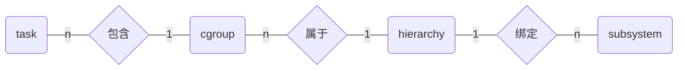

# Linux Cgroups (Control Groups)

[Docker背后的内核知识——cgroups资源限制](http://www.sel.zju.edu.cn/?p=573)

通俗的来说，cgroups可以**限制、记录、隔离进程组所使用的物理资源**（包括：CPU、memory、IO等），为容器实现虚拟化提供了基本保证，是构建Docker等一系列虚拟化管理工具的基石。实现cgroups的主要目的是为不同用户层面的资源管理提供一个统一化的接口。从单个进程的资源控制到操作系统层面的虚拟化。Cgroups提供了以下四大功能：

* 资源限制（Resource Limitation）：cgroups可以对进程组使用的资源总额进行限制。如设定应用运行时使用内存的上限，一旦超过这个配额就发出OOM（Out of Memory）。
* 优先级分配（Prioritization）：通过分配的CPU时间片数量及硬盘IO带宽大小，实际上就相当于控制了进程运行的优先级。
* 资源统计（Accounting）： cgroups可以统计系统的资源使用量，如CPU使用时长、内存用量等等，这个功能非常适用于计费。
* 进程控制（Control）：cgroups可以对进程组执行挂起、恢复等操作。

## 相关定义

1. task：一个进程
2. cgroup：按某种资源控制标准划分而成的task组，包含一个或多个subsystem
3. subsystem：资源调度控制器，Linux支持12种subsystem，比如CPU subsystem可以控制CPU时间分配，内存 subsystem可以限制cgroup内存使用量
4. hierarchy：一系列cgroup以一个树状结构排列而成，每个hierarchy通过绑定对应的subsystem进行资源调度

## 基本规则

### task、cgroup、subsystem、hierarchy关系

1. 同一个hierarchy可以附加零到多个subsystem
2. 一个subsystem只可以附加到一个hierarchy
3. 每一个hierarchy里面，都包含Linux系统中的所有task
4. 一个task可以在多个hierarchy里，但不能在同一个hierarchy的多个cgroup中



`/proc/cgroups`文件中可以看到当前的subsystem情况，例如：

```sh
#subsys_name    hierarchy       num_cgroups     enabled
cpuset          11              1               1
cpu             3               64              1
cpuacct         3               64              1
blkio           8               64              1
memory          9               104             1
devices         5               64              1
freezer         10              4               1
net_cls         6               1               1
perf_event      7               1               1
net_prio        6               1               1
hugetlb         4               1               1
pids            2               68              1
```

其中：

* `subsys_name`表示subsystem名称
* `hierarchy`表示该subsystem绑定的hierarchy编号
* `num_cgroups`表示该subsystem绑定的hierarchy中的task数量
* `enabled`表示该subsystem是否启动

#### subsystem分类

* cpu (since Linux 2.6.24; CONFIG_CGROUP_SCHED)
  * 用来限制cgroup的CPU使用率。
* cpuacct (since Linux 2.6.24; CONFIG_CGROUP_CPUACCT)
  * 统计cgroup的CPU的使用率。
* cpuset (since Linux 2.6.24; CONFIG_CPUSETS)
  * 绑定cgroup到指定CPUs和NUMA节点。
* memory (since Linux 2.6.25; CONFIG_MEMCG)
  * 统计和限制cgroup的内存的使用率，包括process memory, kernel memory, 和swap。
* devices (since Linux 2.6.26; CONFIG_CGROUP_DEVICE)
  * 限制cgroup创建(mknod)和访问设备的权限。
* freezer (since Linux 2.6.28; CONFIG_CGROUP_FREEZER)
  * suspend和restore一个cgroup中的所有进程。
* net_cls (since Linux 2.6.29; CONFIG_CGROUP_NET_CLASSID)
  * 将一个cgroup中进程创建的所有网络包加上一个classid标记，用于tc和iptables。 只对发出去的网络包生效，对收到的网络包不起作用。
* blkio (since Linux 2.6.33; CONFIG_BLK_CGROUP)
  * 限制cgroup访问块设备的IO速度。
* perf_event (since Linux 2.6.39; CONFIG_CGROUP_PERF)
  * 对cgroup进行性能监控
net_prio (since Linux 3.3; CONFIG_CGROUP_NET_PRIO)
  * 针对每个网络接口设置cgroup的访问优先级。
* hugetlb (since Linux 3.5; CONFIG_CGROUP_HUGETLB)
  * 限制cgroup的huge pages的使用量。
* pids (since Linux 4.3; CONFIG_CGROUP_PIDS)
  * 限制一个cgroup及其子孙cgroup中的总进程数。

### cgroups运行规则

1. 新建一个hierarchy时，系统上当前运行的所有进程构成该hierarchy中的第一个cgroup，称为root cgroup
2. 把一个cgroup中的task添加到同一个hierarchy中的另一个cgroup中，则会自动从之前cgroup中移除
3. 创建子进程时，子进程与父进程在同一个cgroup，但是子进程随后可以自由移动到其他cgroup

## cgroup的使用

### 创建hierarchy及root cgroup

cgroup相关的所有操作都是基于内核中的cgroup virtual filesystem，使用cgroup很简单，使用`mount -t cgroup -o cpu,cpuacct`挂载一个文件系统就可以了，需要哪个subsystem就挂载到哪个subsystem的目录下。挂载到任何目录都可以，一般情况下都是挂载到`/sys/fs/cgroup`目录下。例如：

创建一个绑定所有subsystem的hierarchy：
```sh
mount -t cgroup [hierarchy目录] /sys/fs/cgroup
```

创建一个绑定cpuset subsystem的hierarchy：
```sh
mkdir /sys/fs/cgroup/cpuset
mount -t cgroup -o cpuset [hierarchy目录] /sys/fs/cgroup/cpuset
```

创建一个绑定cpu和cpuacct subsystem的hierarchy：
```sh
mkdir /sys/fs/cgroup/cpu,cpuacct
mount -t cgroup -o cpu,cpuacct [hierarchy目录] /sys/fs/cgroup/cpu,cpuacct
```

创建一个不绑定任何subsystem的hierarchy，下面就是linux中systemd所用到的方式：
```sh
mkdir /sys/fs/cgroup/systemd
mount -t cgroup -o none,name=systemd xxx /sys/fs/cgroup/systemd
```

如果要绑定一个已经被绑定到其他hierarchy的subsystem，则会报错。例如：
```sh
mount -t cgroup -o devices,pids new-devices-pids ./devices,pids
mount: new-devices-pids is already mounted or /home/dev/cgroup/devices,pids busy
```

### 创建/删除子cgroup

创建子cgroup即在cgroup目录下创建一个文件夹：
```sh
mkdir [cgroup文件夹]
```

删除子cgroup即删除这个文件夹：
```sh
rmdir [cgroup文件夹]
```

如果要删除的cgroup包含有子cgroup或进程，则会报错：
```sh
rmdir: failed to remove '[cgroup文件夹]/': Device or resource busy
```

### cgroup目录下的文件

当挂载hierarchy或在创建子cgroup文件夹时，一些文件会自动生成。例如：

```sh
ls /sys/fs/cgroup/cpu
cgroup.clone_children  cgroup.procs  cgroup.sane_behavior  notify_on_release  release_agent pids.current tasks
```

* cgroup.clone_children：当该文件的内容为1时，新创建的cgroup将会继承父cgroup的配置，即从父cgroup里面拷贝配置文件来初始化新cgroup
  * 只对cpuset（subsystem）有影响
* cgroup.procs：当前cgroup中的所有**进程**ID
* tasks：当前cgroup中的所有**线程**ID
* notify_on_release：该文件的内容为1时，**当cgroup退出时（不再包含任何进程和子cgroup），将调用release_agent里面配置的命令**
  * 新cgroup被创建时将默认继承父cgroup的这项配置。
* release_agent：cgroup退出时将会执行的命令，系统调用该命令时会将相应cgroup的相对路径当作参数传进去
  * 这个文件只会存在于root cgroup文件夹下
* cgroup.sane_behavior：与下一代CGroup中的sane_behavior有关
* pids.current: 表示当前cgroup及其所有子孙cgroup中现有的总的进程数量

除上述文件之外，还可能会有：

* pids.current: 表示当前cgroup及其所有子孙cgroup中现有的总的进程数量
* pids.max: 当前cgroup及其所有子孙cgroup中所允许创建的总的最大进程数量
  * root cgroup下没有这个文件，原因显而易见，因为我们没有必要限制整个系统所能创建的进程数量

#### 注：[下一代的CGroup和sane behavior介绍](./sane_behavior.md)

### 添加进程

执行添加进程操作只要在cgroup.procs写入PID即可，有cgroup.procs写入权限即可：

```sh
echo [进程PID] > cgroup.procs
```

如果此进程已经在同hierarchy的另一个cgroup里面了，上述操作会自动从原来的cgroup中删除。

注：进程移动时，进程下的线程会随之一起移动，可以在`tasks`文件中看到