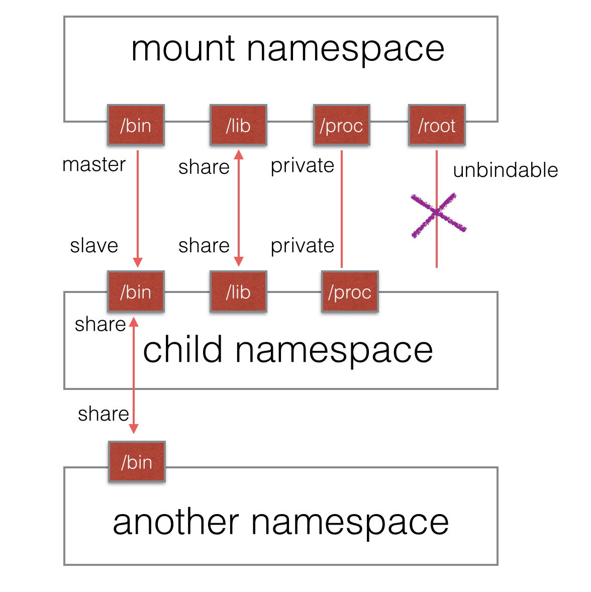

# Mount namespace

它是历史上第一个Linux namespace，所以它的标识位比较特殊，就是CLONE_NEWNS。

Mount namespace通过**隔离文件系统挂载点**对隔离文件系统提供支持，当我们使用 clone 函数或 unshare 函数并传入 CLONE_NEWNS 标志创建新的 mount namespace 时， 新 mount namespace 中的挂载点其实是**从调用者所在的 mount namespace 中拷贝的**。但是在新的 mount namespace 创建之后，这两个 mount namespace 及其挂载点就基本上没啥关系了(除了 shared subtree 的情况)，两个 mount namespace 是相互隔离的。

可以通过`/proc/[pid]/mounts`查看到所有挂载在当前namespace中的文件系统，还可以通过`/proc/[pid]/mountstats`看到mount namespace中文件设备的统计信息，包括挂载文件的名字、文件系统类型、挂载位置等等。

配合`pivot_root`系统调用，可以为进程创建一个独立的目录空间。比如，若要在Ubuntu系统下运行CentOS：

1. 创建一个mount Namespace
2. 将CentOS的系统文件`mount`到某个目录
3. `pivot_root`指定该目录为根目录
4. 运行init

附：`pivot_root`和`chroot`的区别：

* `pivot_root`改变**当前工作目录的所有进程或线程的工作目录**；`chroot`是**改变即将运行的某进程的根目录**
* `pivot_root`主要是把整个系统切换到一个新的root目录，而**移除对之前root文件系统的依赖**；chroot只针对某个进程，系统的其它部分依旧运行于旧的root目录

## 共享子树(shared subtree)，或称“挂载传播”：在 mount namespace 之间自动地或者是受控地传播 mount 和 umount 事件

### 什么是“挂载点”

Linux是树型目录结构，与windows的C,D,E盘完全不同，Linux只有一个根目录`/`，其余各个目录都是基于这个根目录发散，就是树形结构。因此Linux分区跟Windows的C,D,E盘分区完全不同，而是将某个分区挂到一个对应的目录上，**例如`/home`对应一块分区，`home`目录就是这块分区的挂载点**、`/boot`对应一块分区,`boot`目录就是这块分区的挂载点、`/usr`对应一块分区,`usr`目录就是这块分区的挂载点。

一个分区可以挂载到多个挂载点，挂载点A也可以作为分区挂载到挂载点B：

```sh
mount --bind <mount-point-A> <mount-point-B>
```

### 挂载点之间的关系

* 共享关系（share relationship）：如果两个挂载点具有共享关系，那么**一个挂载点中的挂载事件会传播到另一个挂载点**，反之亦然。
* 从属关系（slave relationship）：如果两个挂载点形成从属关系，那么**master挂载点中的挂载事件会传播到slave挂载点**，但是**反过来不行**；在这种关系中，slave挂载点是事件的接收者。

### (未完成)挂载点的传播类型(propagation type)

将挂载点A`<mount-point-A>`挂载到挂载点B`<mount-point-B>`时，如果不指定传播类型：

```sh
mount --bind <mount-point-A> <mount-point-B>
```

则挂载点B的传播类型将继承挂载点A的传播类型；若A的传播类型未指定（A可能是一个磁盘而不是挂载点从而不存在传播类型），则默认为private。

1. 共享挂载（shared）：
```sh
mount --make-shared <mount-point> #将<mount-point>设置为共享挂载
mount --make-shared <mount-point-A> <mount-point-B> #以共享挂载方式执行挂载操作
```
2. 从属挂载（slave）：该挂载点接收其他挂载点传播来的事件
```sh
mount --make-slave <mount-point> #将<mount-point>设置为从属挂载的master
mount --make-slave <mount-point-master> <mount-point-slave> #(未完成)谁是主谁是从？
#(未完成)如果mount --make-slave <mount-point-master>会怎样？
#(未完成)如果mount --make-slave <mount-point-slave>会怎样？
#(未完成)如果mount --make-slave <mount-point-shared>会怎样？
#(未完成)如果mount --make-shared <mount-point-master>会怎样？
#(未完成)如果mount --make-shared <mount-point-slave>会怎样？
```
3. 共享/从属挂载（shared and slave）：该挂载点接收其他挂载点传播来的事件并将事件继续传播给其他挂载点
```sh
mount --make-shared <slave-mount-object> #(未完成)将一个从属挂载对象设置为共享/从属挂载，可以执行如下命令或者将其移动到一个共享挂载对象下。
```
4. 私有挂载（private）：该挂载点不传播也不接收传播事件
```sh
mount --make-private <mount-point>
mount --make-private <mount-point-A> <mount-point-B>
```
5. 不可绑定挂载（unbindable）：不允许执行任何绑定(`--bind`|`--rbind`)操作
```sh
mount --make-unbindable <mount-point>
```

默认情况下，所有挂载都是私有的。例如，为新的PID namespace挂载`/proc`文件系统（PID namespace重要机制），而不会对其他进程产生副作用；配合AUFS为用户提供单独的文件系统的视图而不影响主系统等（Docker镜像和容器文件操作重要机制）。


