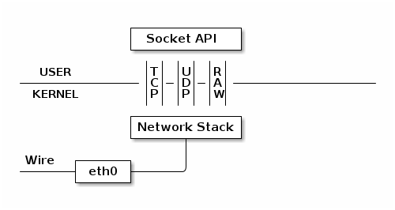
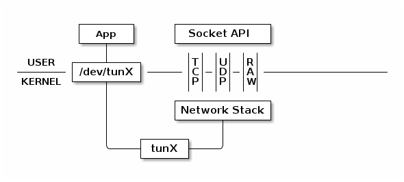
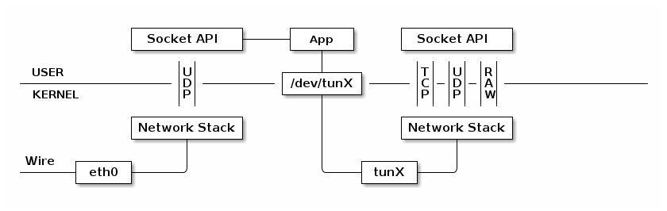
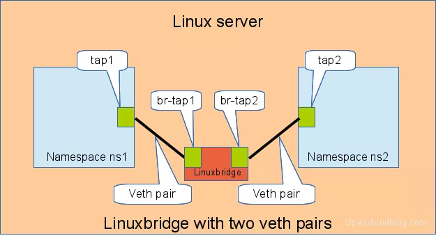

# Network namespace

## Linux 虚拟网络设备


### TUN/TAP

TUN 设备是一种虚拟网络设备，通过此设备，程序可以方便得模拟网络行为。对于物理设备，其协议栈从物理网卡中读写数据：



而TUN 设备的协议栈从文件中读写数据：



所有对这个文件的写操作会通过 TUN 设备转换成一个数据包送给内核；当内核发送一个包给 TUN 设备时，通过读这个文件可以拿到包的内容。

TAP 设备与 TUN 设备工作方式完全相同，区别在于：

* TUN 设备从 /dev/tunX 文件收发 IP 层数据包；
  * 只能工作在 IP 层，无MAC地址因而也无法桥接物理网卡。
* TAP 设备从 /dev/tapX 文件收发 MAC 层数据包。
  * 工作与MAC层，拥有 MAC 层功能，可以桥接，支持 MAC 层广播

TUN/TAP设备的特性经常被用在虚拟机和VPN等应用中。例如使用 TUN 设备搭建一个基于 UDP VPN：



App读写/dev/tunX，可以对其流量进行各种转发或加密等操作。

### veth-pair-一根虚拟网线和两个虚拟网卡

veth设备总是成对出现，显然，仅有veth-pair设备，容器是无法访问网络的。因为容器发出的数据包，实质上直接进入了veth1设备的协议栈里。如果容器需要访问网络，需要使用bridge等技术，将veth1接收到的数据包通过某种方式转发出去。

创建veth-pair，一端为虚拟网卡veth0，另一端为虚拟网卡veth1：

```sh
ip link add name veth0 type veth0 peer name veth1
```

### Bridge-虚拟交换机



```sh
ip link add br0 type bridge # 创建Bridge br0
ip link set br0 up # 启动网桥

ip link add veth0 type veth peer name br-veth0 # 创建veth和两个虚拟网卡，veth0——br-veth0
ip link add veth1 type veth peer name br-veth1 # 创建veth和两个虚拟网卡，veth1——br-veth1

# 假定有两个Network namespace ns1和ns2

ip link set veth0 netns ns1 # 虚拟网卡veth0分配给ns1
ip link set br-veth0 master br0 # 虚拟网卡br-veth0接上网桥
ip link set br-veth0 up # 启动虚拟网卡br-veth0

ip link set veth1 netns ns2 # 虚拟网卡veth1分配给ns2
ip link set br-veth1 master br0 # 虚拟网卡br-veth1接上网桥
ip link set br-veth1 up # 启动虚拟网卡br-veth1

ip netns exec ns1 ip addr add 10.1.1.2/24 dev veth0 # 给ns1中的虚拟网卡veth0分配IP
ip netns exec ns1 ip link set veth0 up # 启动虚拟网卡veth0

ip netns exec ns2 ip addr add 10.1.1.3/24 dev veth1 # 给ns1中的虚拟网卡veth1分配IP
ip netns exec ns2 ip link set veth1 up # 启动虚拟网卡veth1
```

## Network namespace

Network namespace主要提供了关于网络资源的隔离，包括网络设备、IPv4和IPv6协议栈、IP路由表、防火墙、/proc/net目录、/sys/class/net目录、端口（socket）等等。**一个物理的网络设备最多存在在一个network namespace中**，可以通过创建并连接虚拟网络设备在不同的network namespace间创建通道，以此达到通信的目的。

network namespace的使用其实就是在创建的时候添加CLONE_NEWNET标识位。也可以通过命令行工具ip创建network namespace：

```sh
ip netns add test_ns # 创建名为test_ns的network namespace
```

如上节所示，通过`ip netns exec [network namespace名称] [任意指令]`命令可以在新创建的network namespace下运行网络管理命令；通过`ip link set [虚拟网卡] netns [network namespace名称]`命令将一个虚拟网卡分配给一个network namespace。

## Docker如何使用Network namespace

* Host模式：如果启动容器的时候使用host模式，那么这个容器将不会获得一个独立的Network Namespace，而是**和宿主机共用一个Network Namespace**；
* Container模式：与Host模式类似，Container模式的容器**与一个已存在的容器共用一个Network Namespace**；
* Bridge模式：**容器使用独立network Namespace，并连接到docker0网桥**，通过docker0网桥以及Iptables NAT表配置与宿主机通信；
* None模式：该模式将容器**放置在它自己的Network Namespace中，但是并不进行任何配置**；
* 自定义网络：使用自定义的网桥可以控制哪些容器可以相互通信，还可以自动DNS解析容器名称到IP地址，容器编排工具（k8s、docker-compose等）中的容器网络就是基于自定义网络所创建的。
  * bridge：与Bridge模式相同，只是不与docker0网桥而是自行创建网桥进行连接；
  * Macvlan：macvlan是linux kernel提供的一种network driver类型，是一种网卡虚拟化方案，一张物理网卡设置多个mac地址从而给多个容器使用。

##### 注：端口映射

```sh
docker run -p 80:80 ...
```

Docker如何将容器的80端口映射到主机的80端口？答案是DNAT，在IPtable中：

```
-A DOCKER ! -i docker0 -p tcp -m tcp --dport 80 -j DNAT --to-destination 172.17.0.2:80
```

