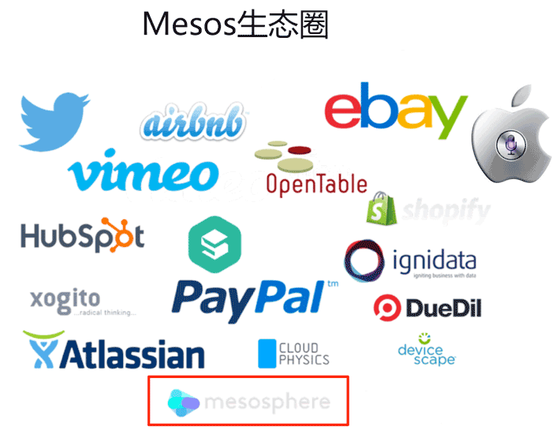
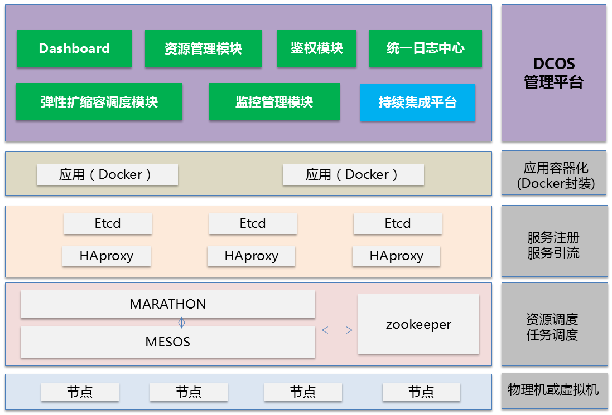

# Mesos和DCOS(Data Center Operating System, 数据中心操作系统)

早在十多年前，Google就开始使用第一代集群管理Borg技术管理数据中心。随后Twitter从Google的Borg系统中得到启发，开发了一个类似的资源管理系统帮助他们摆脱可怕的“失败之鲸”。2009年加州大学伯克利分校AMPLab首先开发出Apache Mesos，这是一款开源集群管理软件，其核心研发成员Benjamin Hindman随后将其引入Twitter，于是Twitter、Facebook、苹果等大型IT企业开始陆续打造各自特色的基于Mesos的数据中心管理方案。

2012年，围绕Mesos开展商业活动的初创公司Mesosphere诞生，而Benjamin Hindman也以Mesosphere首席架构师的身份投身其中。正是该公司提出了基于Mesos的DCOS（数据中心操作系统），希望企业**能像使用一台计算机一样使用整个数据中心。**

## Mesos是什么

**Apache Mesos是为构建和运行其他分布式系统提供服务的分布式系统**。它将CPU 、内存、存储介质以及其它计算机资源从物理机或者虚拟机中抽象出来，构建支持容错和弹性的分布式系统，并提供高效的运行能力。Mesos使用与Linux 内核相同的系统构建原则，只是它们处在不同的抽象层次上。Mesos内核运行在每台机器上，通过应用程序Framework ，提供跨整个数据中心和云环境进行资源管理和调度的API。

## DCOS和Mesos的关系

基于Mesos的DCOS其实是Mesos衍生的生态系统的统称。除了Mesosphere公司的DCOS之外，各大互联网公司基本都有自己的基于Mesos的DCOS系统。

值得一提的是，像Twitter、Airbnb、苹果这样的大公司几乎都是自己搭建基于Mesos的基础设施。但开源的Mesos是一项非常尖端的技术，**通过开源工具手工装配，并将Mesos用于生产环境是非常高难度的**。这也是Mesosphere DCOS的价值所在。Mesosphere推出的DCOS，具备和Twitter、苹果公司同等的能力和自动化效果。

## Mesos在数据中心系统层次中的位置

* PaaS系统运行于Mesos之上
* Mesos运行于IaaS系统之上

如下图所示：

目前已有不少分布式系统直接构建于Mesos之上，包括Apache Spark，Apache Aurora，Airbnb的Chronos以及Mesosphere的Marathon等。此外还有多个流行系统与Mesos相连并运行于其上，如Apache Hadoop，Apache Storm，Google的Kubernetes等。

## Mesos核心技术：两级调度机制

### 结构

* 第一级调度：资源调度
  * 集群由物理服务器或虚拟服务器组成，用于运行应用程序的任务，比如图中的Hadoop和MPI作业
  * Master主机上的守护进程负责管理资源
  * Slave主机上的守护进程负责向Master主机上报资源信息
* 第二级调度：任务调度
  * 每种Framework由相应的应用集群管理，比如上图中的Hadoop和MPI两种Framework
  * Framework有一个集中式的调度器（Scheduler）负责任务调度
  * 每个Slave主机上都有一个或多个执行器（Executor）负责任务的执行
  * 每个Slave主机上都有一个Manager负责接收执行的指令启动执行器执行任务

### 过程

1. （第一级调度）Slave 1向Master汇报其空闲资源：4个CPU、4GB内存
2. （第一级调度）Master向Framework 1发送资源邀约：Slave 1上的可用资源有4个CPU、4GB内存
3. （第二级调度）Framework 1的调度器（Scheduler）响应Master：需要在Slave上运行两个任务，第一个任务分配<2 CPUs, 1 GB RAM>资源，第二个任务分配<1 CPUs, 2 GB RAM>资源。
4. （第二级调度）Master向Slave下发任务，分配适当的资源给Framework的任务执行器（Executor），接下来由执行器启动这两个任务
5. （第一级调度）此时，还有1个CPU和1GB的RAM尚未分配，回到第2步，向Framework 2发送资源邀约：Slave 1上的可用资源：1个CPU、1GB内存

在实际系统中，显然Mesos无法知道用户的任务什么时候来，因此在没有任务到来的时候，步骤1和步骤3是一直在定期运行的：

* （第一级调度，步骤1）集群中的所有slave节点会和master定期进行通信，将自己的资源信息同步到master，master由此获知到整个集群的资源状况
* （第二级调度，步骤3）mater会和已注册、受信任的Framework进行交互，定期将最新的资源情况发送给Framework

当用户提交了计算任务，Framework就能直接依据资源信息向slave发起任务启动命令，开始调度工作。

## DCOS案例

### Mesosphere DCOS

### 浙江移动与天玑联合研发的DCOS

>2016年，浙江移动凭借一条“DCOS发力双11”的新闻成功火了一把，主要是讲他们自己搭建了一套基于开源Mesos + Doker技术的DCOS（数据中心操作系统），而且很魄力地将一个服务于上千万用户的重要生产系统迁移其上，同时后端搭配天玑数据PBData数据库云平台的强劲支撑，最终完美度过了今年 “双11”秒杀的高峰压力。一时间“DCOS”这个词迅速引发业内围观。

浙江移动的DCOS系统稍有特殊。此DCOS融合了Mesos和Docker，在Mesos的基础上实现了一个类似Kubernetes的结构。Mesos与Docker的结合极大简化业务运维复杂度，实现自动化部署与应用程序升级，Mesos还可为资源管理提供高容错性，自动辨别服务器、机架或网络出现的故障等。

### 苹果公司基于Mesos重建的Siri后端服务DCOS

在MesosCon 2015上，苹果公司分享了在生产环境中使用Mesos的经验。原来苹果用了近一年时间从原有的基于VM的环境迁移到基于Mesos的环境。他们使用Apache Mesos重建了个人助理软件Siri的后端服务，并创建了一个名为J.A.R.V.I.S.而且类似PaaS的专有调度Framework，由此，开发者可以部署可伸缩和高可用的Siri服务。据说其Mesos集群规模保守估计有10,000个节点，支持Siri应用程序的后台系统包括约100种不同类型的服务，应用程序的数据则存储在Hadoop分布式文件系统（HDFS）中。从基础设施的角度来看，使用Mesos 有助于使Siri具备可伸缩性和可用性，并且还改善了iOS 应用程序自身的延迟。

## 总结

随着云计算的快速普及，Docker为代表的容器技术如火如荼，企业用户越来越关注基于云计算的下一代IT架构变革，而软件定义数据中心（SDDC）的理念也逐渐被接收。Mesos技术正是在这样的大环境下应运而生，有了基于Mesos的数据中心操作系统，企业可以方便地对数据中心资源进行统一管理，这无疑是IT架构质的飞跃。相信不远的未来，以Mesos为代表的一系列SDDC技术将成为业内的新热点。