# 为什么Kubernetes天然适合微服务？

## 微服务设计要点

## 负载均衡+API网关

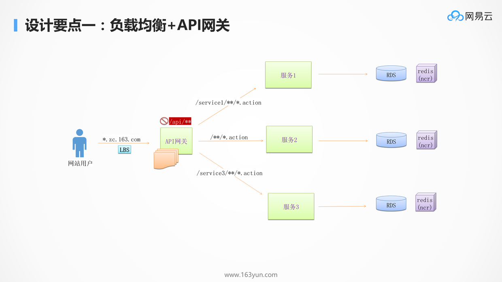

* 当一个服务拆分成多个微服务后，往往需要一个统一的入口，将不同的请求路由到不同的服务，无论后端如何拆分，对客户端来说都是透明的
* 有了API网关以后，简单的数据聚合可以在网关层完成，不用客户端发多个请求再进行聚合
* 有了统一的API网关，还可以进行统一的认证和鉴权，API网关往往只暴露必须的对外接口，并且对接口进行统一的认证和鉴权，内部服务不再需要鉴权功能
* A/B测试，蓝绿发布，预发环境导流等等
* API网关往往是无状态的，可以横向扩展，从而不会成为性能瓶颈

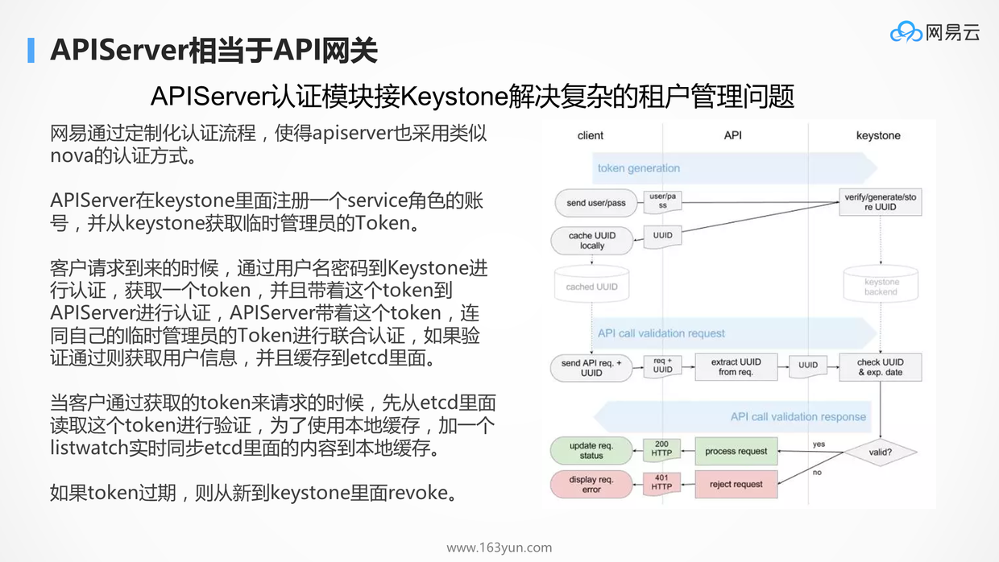

Kubernetes的API Server更像网关，提供统一的鉴权和访问接口。

众所周知，Kubernetes的租户管理相对比较弱，尤其是对于公有云场景，复杂的租户关系的管理，我们只要定制化API Server，对接Keystone，就可以管理复杂的租户关系，而不用管其他的组件。

## 无状态化，区分有状态的和无状态的应用

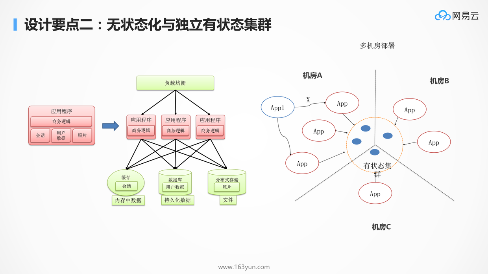

影响应用迁移和横向扩展的重要因素就是应用的状态，无状态服务，是要把这个状态往外移，将Session数据，文件数据，结构化数据收敛在一个非常集中的集群里面，从而应用仅仅包含商务逻辑。

* 整个业务就分两部分，一个是无状态的部分，一个是有状态的部分
* 无状态的部分能实现两点，一是跨机房随意地部署，也即迁移性，一是弹性伸缩，很容易的进行扩容
* 有状态的部分通常有自己的高可用机制，要利用到他们自己的高可用的机制来实现这个状态的集群

虽说无状态化，但是当前处理的数据，还是会在内存里面的，当前的进程挂掉数据，肯定也是有一部分丢失的，为了实现这一点，服务要有重试的机制，接口要有幂等的机制，通过服务发现机制，重新调用一次后端的服务的另一个实例就可以了。

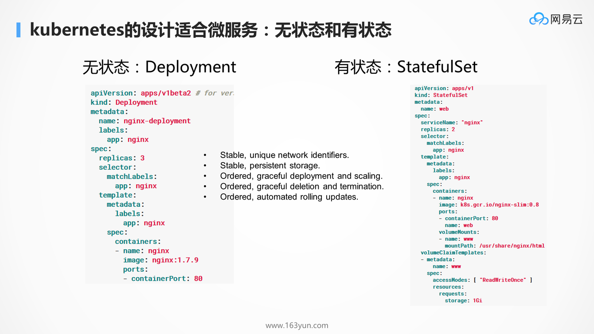

在K8S中，无状态对应deployment，有状态对应StatefulSet。

deployment主要通过副本数，解决横向扩展的问题。

而StatefulSet通过一致的网络ID，一致的存储，顺序的升级，扩展，回滚等机制，可以保证有状态应用，很好地利用自己的高可用机制。

## 服务拆分和服务发现

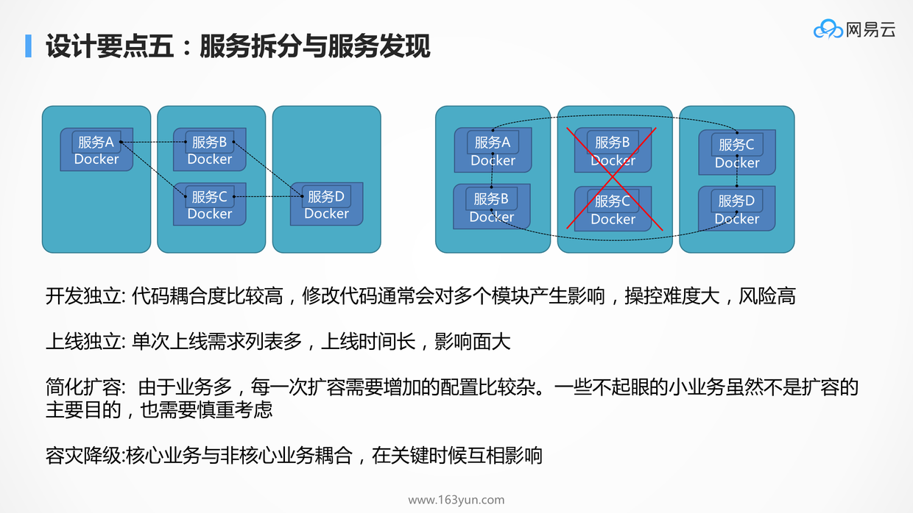

当系统扛不住，应用变化快的时候，往往要考虑将比较大的服务拆分为一系列小的服务，以应付这些情况：

* 开发独立：一个小团队只管自己负责的微服务代码，与其他团队只要沟通好接口即可，团队之间的开发互相独立互不影响
* 上线独立：新添加服务不需要其他的服务跟着一起重启
* 高并发时段扩容：不同的时刻不同微服务的负载不尽相同，很多时候只要扩容一部分服务就能顶住更大的压力
* 容灾降级：双十一大促级的压力下，可能需要牺牲一些边边角角的功能以维持主要功能不崩

进而，拆分完的应用之间的关系就更加复杂了，因而需要服务发现的机制，来管理应用相互的关系，实现自动的修复，自动的关联，自动的负载均衡，自动的容错切换。

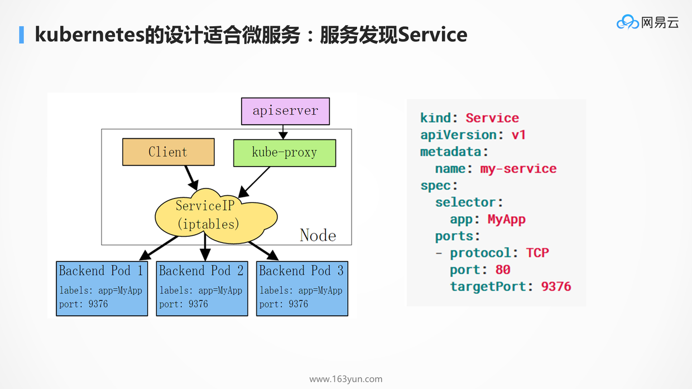

服务发现在K8S里面当然是用Service了，可以实现负载均衡，自修复，自动关联。

## 服务编排与弹性伸缩

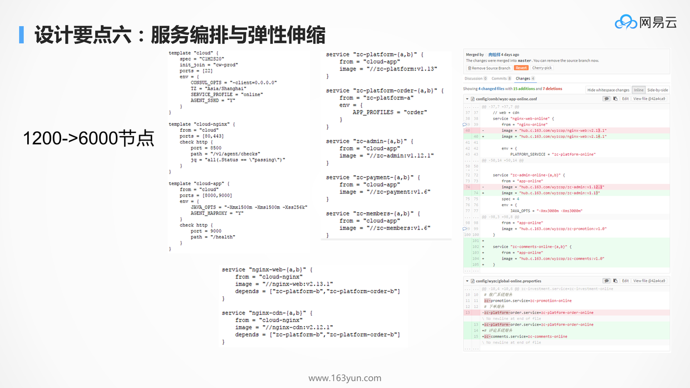

当服务拆分了，进程就会非常的多，因而需要服务编排，来管理服务之间的依赖关系，以及将服务的部署代码化。这样对于服务的发布，更新，回滚，扩容，缩容，都可以通过修改编排文件来实现，从而增加了可追溯性，易管理性，和自动化的能力。

好处显而易见：如果没有部署代码化，每次修改服务都要人工记录，不好追溯还浪费人力，增加工作量；有了部署代码化，所有的修改都能在Git仓库里看得见。

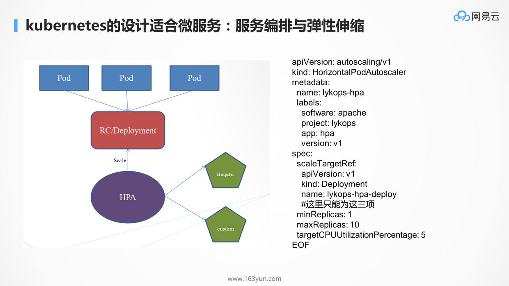

本来K8S就是编排的标准，将yml文件放到代码仓库中进行管理，而通过deployment的副本数，可以实现弹性伸缩

## 统一配置中心

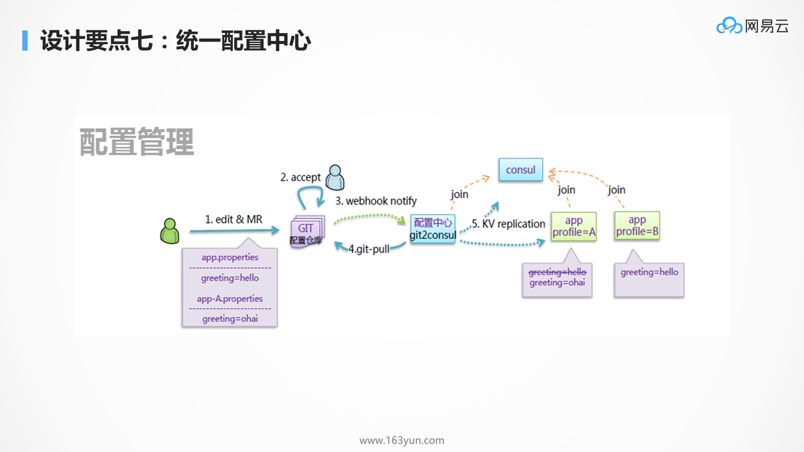

显然不是所有配置都放在微服务里面：
* 几乎不变的配置可以直接打在容器镜像里面
* 启动时就会确定的配置往往通过环境变量，在容器启动的时候传进去
* 统一的配置需要通过配置中心进行下发
  * 例如在大促的情况下，有些功能需要降级，哪些功能可以降级，哪些功能不能降级，都可以在配置文件中统一的配置

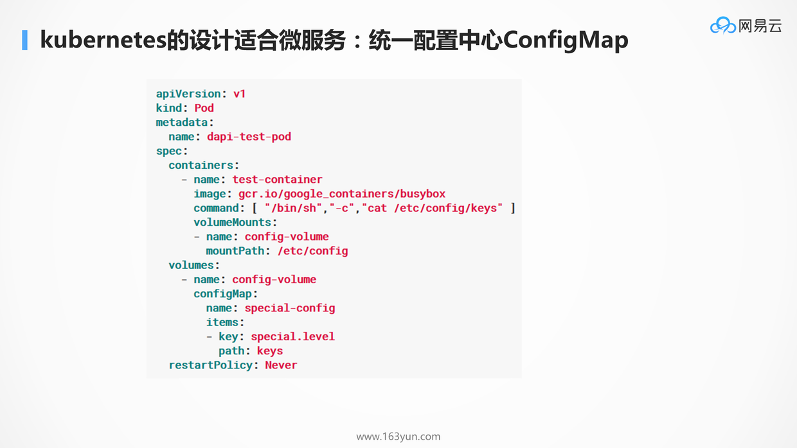

对于配置中心，K8S提供了configMap，可以在容器启动的时候，将配置注入到环境变量；如果要动态地配置，还可以将配置注入到Volume。

## 统一的日志中心

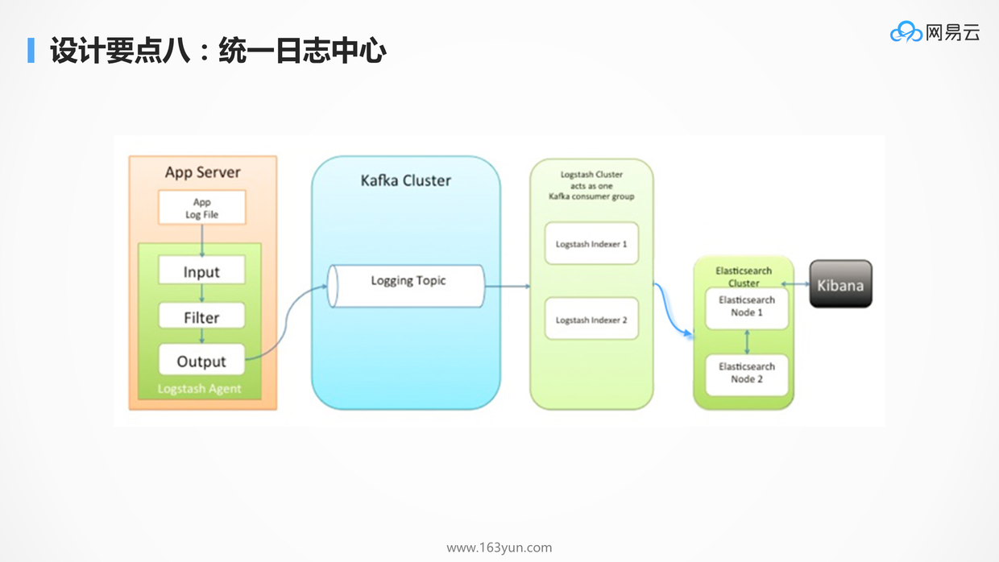

同样是进程数目非常多的时候，很难对成千上百个容器，一个一个登录进去查看日志，所以需要统一的日志中心来收集日志。

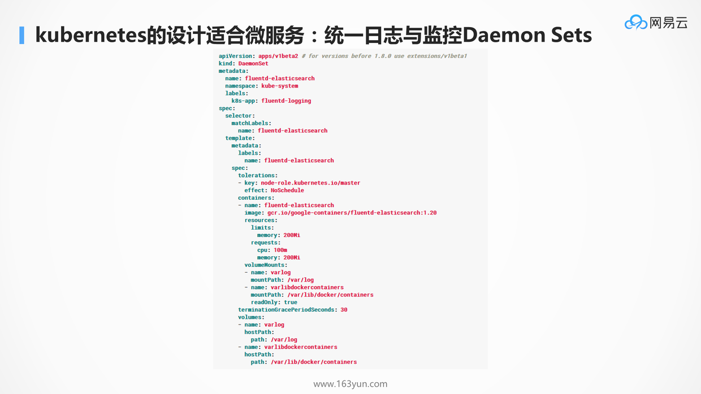

用DaemonSet在每个Node上搞一个收集日志的容器就行了。

## 熔断，限流，降级

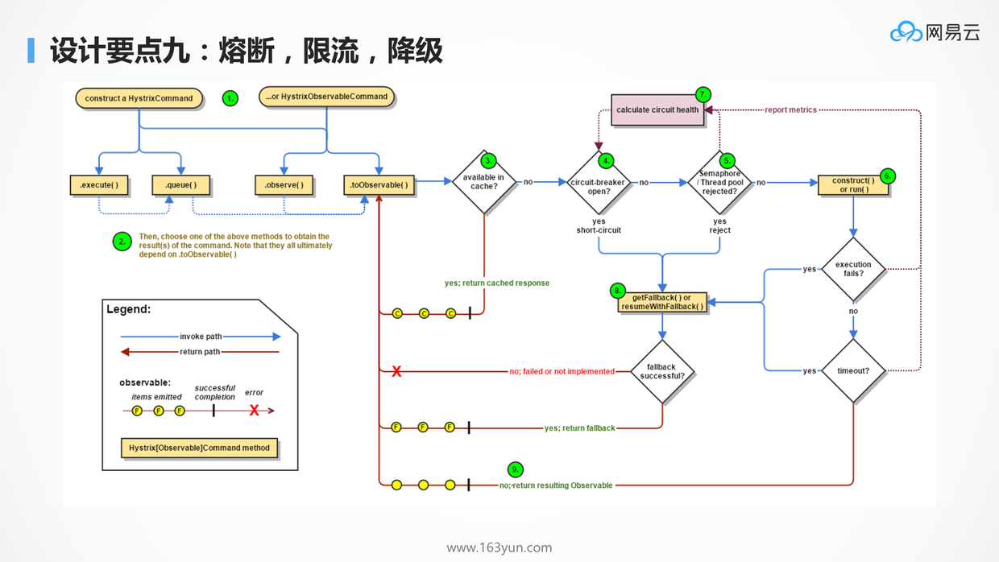

* 熔断：当一个服务发现被调用的服务，因为过于繁忙，线程池满，连接池满，或者总是出错，则应该及时熔断，防止因为下一个服务的错误或繁忙，导致本服务的不正常，从而逐渐往前传导，导致整个应用的雪崩
* 降级：当发现整个系统的确负载过高的时候，可以选择降级某些功能或某些调用，保证最重要的交易流程的通过，以及最重要的资源全部用于保证最核心的流程
* 限流：通过全链路的压力测试，应该能够知道整个系统的支撑能力，因而就需要制定限流策略，保证系统在测试过的支撑能力范围内进行服务，超出支撑能力范围的，可拒绝服务

当然目前最最火的Service Mesh，可以实现更加精细化的服务治理，进行熔断，路由，降级等策略。Service Mesh的实现往往通过sidecar的方式，拦截服务的流量，进行治理。这也得力于Pod的理念，一个Pod可以有多个容器，如果当初的设计没有Pod，直接启动的就是容器，会非常的不方便。

## 全方位的监控

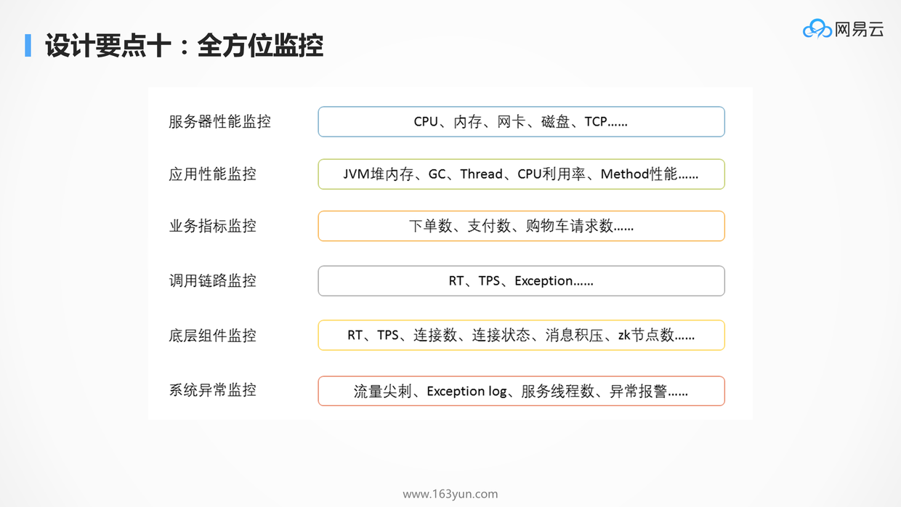

* 监控健康状况：当系统出现异常的时候，监控系统可以配合告警系统，及时的发现，通知，干预，从而保障系统的顺利运行
* 监控性能瓶颈：当压力测试的时候，往往会遭遇瓶颈，也需要有全方位的监控来找出瓶颈点，同时能够保留现场，从而可以追溯和分析，进行全方位的优化

### K8S自己也是一个微服务系统

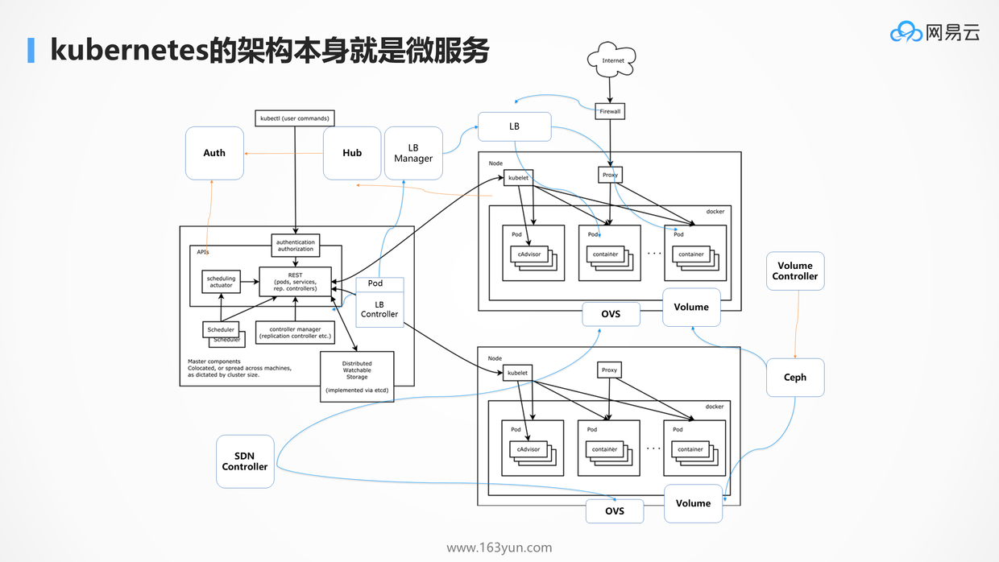

在Kubernetes中几乎所有的组件都是无状态化的，状态都保存在统一的etcd里面，这使得扩展性非常好，组件之间异步完成自己的任务，将结果放在etcd里面，互相不耦合。

例如图中pod的创建过程，客户端的创建仅仅是在etcd中生成一个记录，而其他的组件监听到这个事件后，也相应异步的做自己的事情，并将处理的结果同样放在etcd中，同样并不是哪一个组件远程调用kubelet，命令他进行容器的创建，而是发现etcd中，pod被绑定到了自己这里，方才拉起。

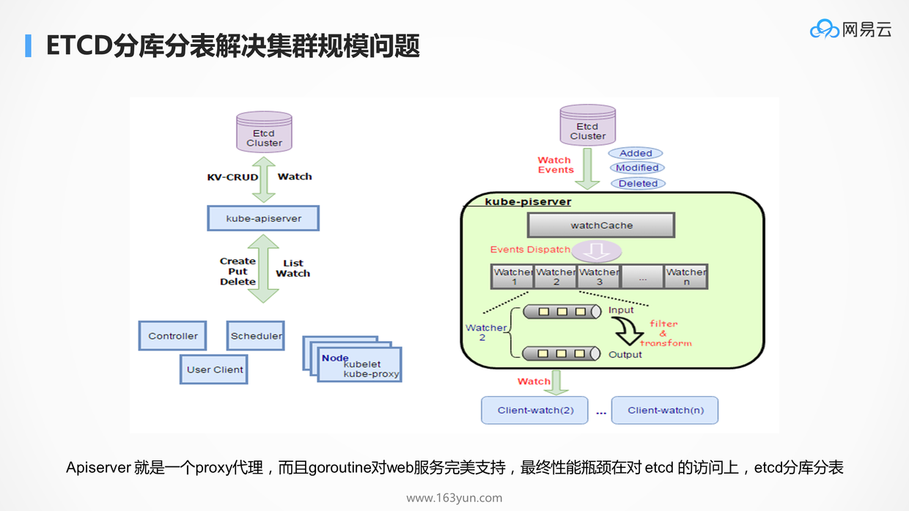

API-Server作为接入层，是有自己的缓存机制的，防止所有的请求的压力直接到后端的数据库上。但是当仍然无法承载高并发请求的时候，瓶颈依然在后端的etcd存储上，这和电商应用一摸一样。当然能够想到的方式也是对etcd进行分库分表，不同的租户保存在不同的etcd集群中。

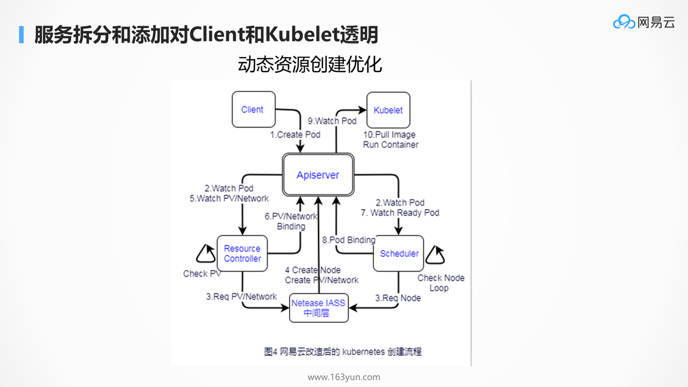

有了API Server做API网关，后端的服务进行定制化，对于client和kubelet是透明的。

如图是定制化的容器创建流程，由于大促和非大促期间，节点的数目相差比较大，因而不能采用事先全部创建好节点的方式，这样会造成资源的浪费，因而中间添加了网易云自己的模块Controller和IaaS的管理层，使得当创建容器资源不足的时候，动态调用IaaS的接口，动态的创建资源。这一切对于客户端和kubelet无感知。

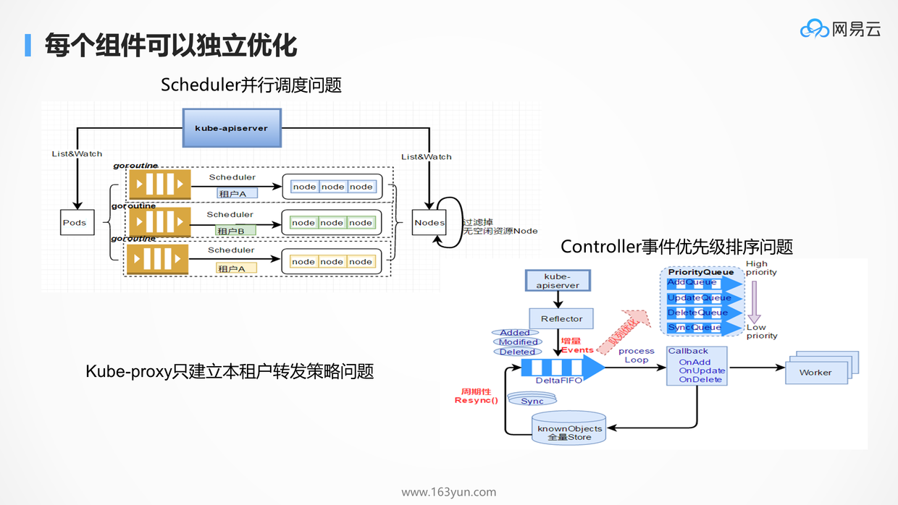

每个子模块仅仅完成自己的功能，Scheduler只管调度，Proxy只管转发，而非耦合在一起，因而每个组件都可以进行独立的优化，这符合微服务中的独立功能，独立优化，互不影响。而且Kubernetes的所有组件的都是Go开发的，更加容易一些。所以Kubernetes上手慢，但是一旦需要定制化，会发现更加容易。

## 总结

K8S的各种设计，看起来非常的冗余和复杂，入门门槛比较高，但是一旦想实现真正的微服务，K8S是可以给你各种可能的组合方式的。实践过微服务的人，往往会对这一点深有体会。
