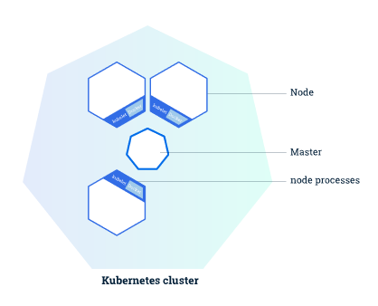
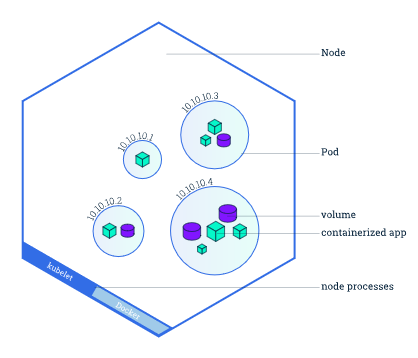
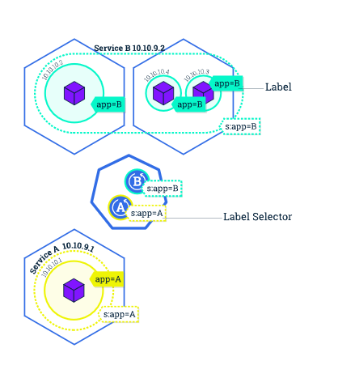

# Kubernetes(k8s)介绍

## Kubernetes是什么

Kubernetes简称k8s，是一种容器编排工具，可以看作是docker-compose的强化版。

>通过现代的 Web 服务，用户希望应用程序能够 24/7 全天候使用，开发人员希望每天可以多次发布部署新版本的应用程序。 容器化可以帮助软件包达成这些目标，使应用程序能够以简单快速的方式发布和更新，而无需停机。Kubernetes 帮助您确保这些容器化的应用程序在您想要的时间和地点运行，并帮助应用程序找到它们需要的资源和工具。

## 本文结构

1. 按照k8s的系统层次：Cluster > Node > Pod介绍k8s的系统架构层次
2. 按照k8s管理层次Service > < Deployments介绍k8s的容器管理方法

## k8s系统架构层次

### 集群 Cluster

**Kubernetes用于协调高度可用的计算机集群，这些计算机集群被连接作为单个单元工作。** Kubernetes 的抽象性允许您将容器化的应用程序部署到集群，而不必专门将其绑定到单个计算机。Kubernetes 负责在一个集群上自动分发和调度容器应用程序。一个典型的集群结构如下图：

其中：

* “Master”：负责管理集群。协调集群中的所有活动，例如调度应用程序、维护应用程序的所需状态、扩展应用程序和滚动更新；
* “Node”：集群中的工作机器，见下节介绍。

### 节点 Node

集群中的工作机器，可以是**物理机或虚拟机**，是应用程序容器的**运行载体**。每个Node上都可以运行多个容器，Node上的容器划分为一个个“Pods”（见下节介绍）。比如下图是一个典型的包含了多个Pod的Node的内部结构：

每个Node至少运行以下组件：

* Kubelet：负责Node与Master之间的通信，并管理机器上运行的Pod。
* 容器运行时(例如 Docker、rkt)：受Kubelet控制，负责从镜像仓库中拉取容器镜像，解包容器并运行应用程序。

### 应用程序实例 Pod

Pod模型可以理解为应用程序特定的“**逻辑主机**”，并且可以包含**相对紧密耦合的不同应用程序容器**。例如，Pod 可能包含带有 Node.js 应用程序的容器以及另一个要吸收 Node.js Web 服务器提供的数据的不同容器。Pod 中的容器共享 IP 地址和端口空间，始终位于同一位置并且统一调度，并在相同的节点上运行，共享上下文环境。如图所示是一些大小不同的Pod：

Pod是Kubernetes平台上原子级别的单元，每个Pod在Kubernetes中都有一个唯一的 IP 地址，且能从Pod外部进行访问的容器端口由用户明确指定。当我们在Kubernetes上创建一个部署(Deployment)时，该部署将在其中创建包含容器的 Pod（而不是直接创建容器）。

（其实就相当于一个docker-compose，用户指定expose端口）

## k8s容器管理方法

### 部署 Deployment

Deployment负责创建和更新Node中的应用程序实例。创建Deployment后， Master会将Deployment创建的应用程序实例调度到集群中的各个Node。

创建应用程序实例后，Kubernetes 部署控制器会持续监视这些实例。如果托管它的节点不可用或删除，则部署控制器将替换实例。 这提供了一种解决机器故障或维护的自愈机制。

>在“编排”诞生前的世界中，通常会使用安装脚本启动应用程序，但是它们并不能从机器故障中恢复。通过创建应用程序实例并使其运行在跨节点的机器之间，Kubernetes部署提供了截然不同的应用管理方法。

### 服务 Service

在逻辑上，Deployment是以Service为单位进行的。如图所示：

每个Service和每个Deployment一一对应，而一个Service可能包含多个Node中的多个Pods。

Kubernetes中的Service是一个**抽象对象**，它**定义了一组逻辑的Pods和一个访问它们的策略**，是允许Pod在Kubernetes中死亡和复制而不影响应用程序的抽象层。Service处理Pod之间的发现和路由(如应用程序中的前端和后端组件)，让**互相依赖的Pod之间的耦合松动**。

服务像所有Kubernetes对象一样，由YAML(首选)或JSON定义。针对服务的一组Pod在配置文件中通常由LabelSelector确定。虽然每个Pod都有一个唯一的IP地址，但是这些IP不会在没有服务的情况下公开在Cluster之外。服务允许您的应用程序接收流量。可以通过在配置文件中指定ServiceSpec类型以不同方式显示服务：

* ClusterIP(默认)：在集群中的内部IP上公开服务。此类型使服务只能从集群中访问
* NodePort：使用NAT在群集中每个选定的节点的同一端口上显示该服务。使用`:`可以从群集外部访问服务。建立ClusterIP的超集
* LoadBalancer：在当前云中创建外部负载平衡器(如果支持)，并为服务分配固定的外部IP。建立NodePort的超集
* ExternalName：使用任意名称显示该服务(由规范中的externalName指定)，本过程通过使用该名称返回CNAME记录达成。无须使用代理。这种类型需要v1.7或更高版本的kube-dns

### 服务和标签

服务使用 标签和选择器，匹配一组 Pod，成为分组原语，此原语允许在 Kubernetes 中的对象进行逻辑运算。 标签是一对附加到对象的键/值对，可以以多种方式使用，方式如下:

* 指定用于开发、测试和生产的对象
* 嵌入版本标签
* 使用标签分类对象

## k8s教程中出现的几个软件的简介

### Kubernetes

一系列管理工具、API以及协议的集合

### Minikube

k8s的一种实现，可以看作是一种集群管理的服务端

### Kubectl

使用 Kubernetes API 与集群进行交互，可以看作是集群管理的客户端

下一篇：[Kubernetes(k8s)的安装和基本使用](./Kubernetes使用.md)
