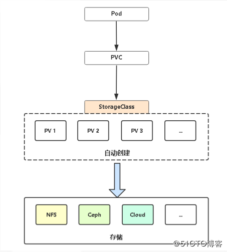

# PersistentVolume和PersistentVolumeClaim - K8S持久卷的定义和使用

Kubernetes的pod本身是无状态的（stateless）,生命周期通常比较短，只要出现了异常，Kubernetes就会自动创建一个新的Pod来代替它。而容器产生的数据，会随着Pod消亡而自动消失。

为了实现Pod内数据的存储管理，Kubernetes引入了两个API资源：Persistent Volume（持久卷，以下简称PV）和Persistent Volume Claim（持久卷申请，以下简称PVC）。

**PV是Kubernetes集群中的一种网络存储实现**，跟Node一样，也是属于集群的资源。

PV跟Docker里的Volume(卷)类似，不过会有独立于Pod的生命周期；而**PVC是用户的一个存储请求**，跟Pod类似。Pod消费Node的资源，PVC消费PV的资源。

Pod|PVC
-|-
Pod消费Node的资源|PVC消费PV的资源
Pod 能够申请特定的资源（CPU和内存）|PVC能够申请特定的尺寸和访问模式（只读、只写、可读写等），而无须感知这些实例背后具体的存储实现。



## PersistentVolume和PersistentVolumeClaim的正确使用方法

PersistentVolume应由集群管理员创建，而集群用户通过PersistentVolumeClaim使用管理员创建的PersistentVolume。用户不关心PersistentVolume的具体位置和具体实现，只管使用。

1. 集群管理员创建由物理存储支持的 PersistentVolume。管理员不将卷与任何 Pod 关联。
2. 群集用户创建一个 PersistentVolumeClaim，它将自动绑定到合适的 PersistentVolume。
3. 用户创建使用 PersistentVolumeClaim 作为存储的 Pod。

## PersistentVolume

不管三七二十一先放个示例：

```yml
apiVersion: v1
kind: PersistentVolume
metadata:
  name: the-pv
spec:
  hostPath: #这是个位于本地某个文件夹的PV
    path: "/mnt/data" #文件夹的路径
  capacity: #存储容量
    storage: 5Gi #存储容量为5G
  volumeMode: Filesystem
  accessModes: #访问模式
    - ReadWriteOnce #访问模式为只能由一个Pod以读写模式挂载
  persistentVolumeReclaimPolicy: Recycle
  storageClassName: slow
```

下面来一个个介绍这里面的字段。

### PV的类型

上面这个PV `spec` 字段中的第一个`hostPath`表示这个PV是个位于本地某个文件夹中。除`hostPath`外，PV还支持以下类型：

* GCEPersistentDisk
* AWSElasticBlockStore
* AzureFile
* AzureDisk
* CSI
* FC (Fibre Channel)
* FlexVolume
* Flocker
* NFS
* iSCSI
* RBD (Ceph Block Device)
* CephFS
* Cinder (OpenStack block storage)
* Glusterfs
* VsphereVolume
* Quobyte Volumes
* HostPath (Single node testing only -- local storage is not supported in any way and WILL NOT WORK in a multi-node cluster)
* Portworx Volumes
* ScaleIO Volumes
* StorageOS

这些类型的在PV中的定义和在Pod的Volumes里的定义都是一回事，具体介绍和各自的字段名可见[《Volume - 挂载数据盘》](./Volume.md)。

### `capacity`

顾名思义，这是指这个PV的容量限制。它的单位有:`T`,`P`,`G`,`M`,`K`或 `Ti`,`Pi`,`Gi`,`Mi`,`Ki`，其中加i的是以1024为换算单位的。

>For example, the following represent roughly the same value: 128974848, "129e6", "129M" , "123Mi".

### `volumeMode`

`volumeMode`用于指定这个PV上要不要有文件系统。`volumeMode`有两种值：

* `Block`：PV上没有文件系统。这意味着PV挂载到容器中时是一个块设备，容器中的程序必须有处理块设备的能力才能正常使用这种PV
* `Filesystem`：PV上有文件系统。PV挂载到容器中时是一个正常的挂载点，此为默认值。

### `accessModes`

`accessModes`指定了这个PV可以提供的访问模式。它有以下三种值：

* `ReadWriteOnce` -- 只能被单个节点以读写模式挂载
* `ReadOnlyMany` -- 只能由多个节点以只读模式挂载
* `ReadWriteMany` -- 能由多个节点以读写模式挂载

但是并不是所有的网络文件系统都支持上面这些挂载方式，因此不同类型的PV也有所不同。各种PV各自支持的`accessModes`如表：

|         | ReadWriteOnce          | ReadOnlyMany          | ReadWriteMany|
| :---                 | :---:                  | :---:                 | :---:        |
| AWSElasticBlockStore | &#x2713;               | -                     | -            |
| AzureFile            | &#x2713;               | &#x2713;              | &#x2713;     |
| AzureDisk            | &#x2713;               | -                     | -            |
| CephFS               | &#x2713;               | &#x2713;              | &#x2713;     |
| Cinder               | &#x2713;               | -                     | -            |
| CSI                  | depends on the driver  | depends on the driver | depends on the driver |
| FC                   | &#x2713;               | &#x2713;              | -            |
| FlexVolume           | &#x2713;               | &#x2713;              | depends on the driver |
| Flocker              | &#x2713;               | -                     | -            |
| GCEPersistentDisk    | &#x2713;               | &#x2713;              | -            |
| Glusterfs            | &#x2713;               | &#x2713;              | &#x2713;     |
| HostPath             | &#x2713;               | -                     | -            |
| iSCSI                | &#x2713;               | &#x2713;              | -            |
| Quobyte              | &#x2713;               | &#x2713;              | &#x2713;     |
| NFS                  | &#x2713;               | &#x2713;              | &#x2713;     |
| RBD                  | &#x2713;               | &#x2713;              | -            |
| VsphereVolume        | &#x2713;               | -                     | - (works when Pods are collocated)  |
| PortworxVolume       | &#x2713;               | -                     | &#x2713;     |
| ScaleIO              | &#x2713;               | &#x2713;              | -            |
| StorageOS            | &#x2713;               | -                     | -            |

### `persistentVolumeReclaimPolicy`

若Pod绑定了一个PVC，PVC绑定了一个PV，后来Pod删除了，那么PV中的数据要怎么处理？

* `Retain` -- 默认回收策略，即这些数据保留着，以便Pod再次创建时还能使用
* `Recycle` -- 清空里面的数据，允许其他Pod绑定使用
* `Delete` -- 不仅清空里面的数据，还把PV直接一起删了

### `storageClassName`

>StorageClass 为管理员提供了描述存储 "类" 的方法。 不同的类型可能会映射到不同的服务质量等级或备份策略，或是由集群管理员制定的任意策略。 Kubernetes 本身并不清楚各种类代表的什么。这个类的概念在其他存储系统中有时被称为 "配置文件"。

对 StorageClass 的具体介绍可见[《存储类》](https://github.com/kubernetes/website/blob/release-1.17/content/zh/docs/concepts/storage/storage-classes.md)

>A PV with no storageClassName has no class and can only be bound to PVCs that request no particular class.

### `mountOptions`

`mountOptions`是针对不同类型PV的额外配置。目前有额外配置的类型有：

* AWSElasticBlockStore
* AzureDisk
* AzureFile
* CephFS
* Cinder (OpenStack block storage)
* GCEPersistentDisk
* Glusterfs
* NFS
* Quobyte Volumes
* RBD (Ceph Block Device)
* StorageOS
* VsphereVolume
* iSCSI

### Node Affinity

>>Note: For most volume types, you do not need to set this field. It is automatically populated for AWS EBS, GCE PD and Azure Disk volume block types. You need to explicitly set this for local volumes.
>
>A PV can specify node affinity to define constraints that limit what nodes this volume can be accessed from. Pods that use a PV will only be scheduled to nodes that are selected by the node affinity.

## PersistentVolumeClaim

不管三七二十一先放个示例：

```yml
apiVersion: v1
kind: PersistentVolumeClaim
metadata:
  name: myclaim
spec:
  accessModes:
    - ReadWriteOnce
  volumeMode: Filesystem
  resources:
    requests:
      storage: 8Gi
  storageClassName: slow
  selector:
    matchLabels:
      release: stable
    matchExpressions:
      - key: environment
        operator: In
        values: 
          - dev
```

>创建 PersistentVolumeClaim 之后，Kubernetes 控制平面将查找满足申领要求的 PersistentVolume。 如果控制平面找到具有相同 StorageClass 的适当的 PersistentVolume，则将 PersistentVolumeClaim 绑定到该 PersistentVolume 上。

和上面的PV定义对比一下就可以发现，定义PVC的字段和定义PV的字段基本相同。不同的是，PV中的`accessModes`、`volumeMode`、`storageClassName`是定义了PV的性质，而PVC中的这些字段是用来查找合适的PV进行绑定。

除了`accessModes`、`volumeMode`、`storageClassName`外，还有一个用于查询PV标签的`selector`和资源请求的`resources`。

### `selector`

`selector`字段用于指定要绑定的PV的标签，只有标签全部匹配到的PV才能绑定。

其中的`matchLabels`和`matchExpressions`都是标签的匹配规则。

一看就懂，不说了。不懂的对比一下[《Pod的亲和性调度》](./Pod亲和性调度.md)里面的标签匹配规则也就差不多了。

### `resources`

`resources`字段用于指定PVC需要的资源量，比如上面那个`.spec.resources.requests.storage`表示这个PVC绑定的PV至少要有7G。