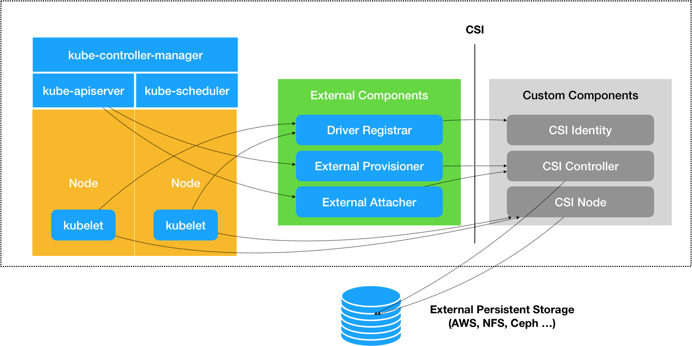

# Volume - 挂载数据盘

>容器中的文件在磁盘上是临时存放的，这给容器中运行的特殊应用程序带来一些问题。首先，当容器崩溃时，kubelet 将重新启动容器，容器中的文件将会丢失——因为容器会以干净的状态重建。其次，当在一个 `Pod` 中同时运行多个容器时，常常需要在这些容器之间共享文件。Kubernetes 抽象出 `Volume` 对象来解决这两个问题。

>虽然 Docker 现在也能提供 Volume 驱动程序，但是目前功能还非常有限（例如，截至 Docker 1.7，每个容器只允许有一个 Volume 驱动程序，并且无法将参数传递给卷）。

>**Kubernetes 卷具有明确的生命周期**——与包裹它的 Pod 相同。因此，卷比 Pod 中运行的任何容器的存活期都长，在容器重新启动时数据也会得到保留。当然，**当一个 Pod 不再存在时，卷也将不再存在**。也许更重要的是，Kubernetes 可以支持许多类型的卷，Pod 也能同时使用任意数量的卷。

## Volume 的定义

>卷的核心是包含一些数据的目录，Pod 中的容器可以访问该目录。特定的卷类型可以决定这个目录如何形成的，并能决定它支持何种介质，以及目录中存放什么内容。
>
>使用卷时, Pod 声明中需要提供卷的类型 (`.spec.volumes` 字段)和卷挂载的位置 (`.spec.containers[*].volumeMounts` 字段)。

例如，一个Pod`the-pod`有两个容器`the-container-one`和`the-container-two`，要将一个空目录挂载到两个容器中：

```yml
apiVersion: v1
kind: Pod
metadata:
  name: the-pod
spec:
  volumes: #这个字段定义Pod中的所有volume
  - name: the-volume #一个名叫the-volume的volume
    emptyDir: {} #是一个空目录
  containers:
  - image: the-image-one
    name: the-container-one
    volumeMounts:
    - name: the-volume #把the-volume
      mountPath: /a-mount-path #挂载到容器内的/a-mount-path中
  - image: the-image-two
    name: the-container-two
    volumeMounts:
    - name: the-volume #把the-volume
      mountPath: /another-mount-path #挂载到容器内的/another-mount-path中
```

## Volume 的类型

### `emptyDir`

顾名思义，这种Volume将创建一个空目录，只要 Pod 在该节点上运行，卷就一直存在，Pod内的容器也都可以读写其中的内容。

当 Pod 因为某些原因被从节点上删除时，`emptyDir` 卷中的数据也会永久删除。

一些正确使用方法：

* 开一个`emptyDir`用作硬盘上的缓存空间，例如基于磁盘的归并排序
* 用`emptyDir`为耗时较长的计算任务提供检查点，以便任务能方便地从崩溃前（容器意外退出）状态恢复执行
* 在 Web 服务器容器服务数据时，用`emptyDir`保存内容管理器容器获取的文件

范例见上面“Volume 的定义”。

### `hostPath`

>`hostPath`卷能将主机节点文件系统上的文件或目录挂载到您的 Pod 中。 虽然这不是大多数 Pod 需要的，但是它为一些应用程序提供了强大的逃生舱。

一些正确使用方法：

* 运行一个需要访问 Docker 引擎内部机制的容器；请使用 `hostPath` 挂载 `/var/lib/docker` 路径。
* 在容器中运行 cAdvisor 时，以 `hostPath` 方式挂载 `/sys`。
* 允许 Pod 指定给定的 `hostPath` 在运行 Pod 之前是否应该存在，是否应该创建以及应该以什么方式存在。

>除了必需的 `path` 属性之外，用户可以选择性地为 `hostPath` 卷指定 `type`。
>
>支持的 `type` 值如下：
>| 取值 | 行为 |
>|:------|:---------|
>| | 空字符串（默认）用于向后兼容，这意味着在安装 hostPath 卷之前不会执行任何检查。 |
>| `DirectoryOrCreate` | 如果在给定路径上什么都不存在，那么将根据需要创建空目录，权限设置为 0755，具有与 Kubelet 相同的组和所有权。 |
>| `Directory` | 在给定路径上必须存在的目录。|
>| `FileOrCreate` | 如果在给定路径上什么都不存在，那么将在那里根据需要创建空文件，权限设置为 0644，具有与 Kubelet 相同的组和所有权。|
>| `File` | 在给定路径上必须存在的文件。|
>| `Socket` | 在给定路径上必须存在的 UNIX 套接字。|
>| `CharDevice` | 在给定路径上必须存在的字符设备。|
>| `BlockDevice` | 在给定路径上必须存在的块设备。|

>当使用这种类型的卷时要小心，因为：
>
>* 具有相同配置（例如从 podTemplate 创建）的多个 Pod 会**由于节点上文件的不同而在不同节点上有不同的行为**。
>* 当 Kubernetes 按照计划添加资源感知的调度时，这类调度机制将无法考虑由 `hostPath` 使用的资源。
>* **基础主机上创建的文件或目录只能由 root 用户写入**。您需要在[特权容器](/zh/docs/tasks/configure-pod-container/security-context/)中以 root 身份运行进程，或者修改主机上的文件权限以便容器能够写入 `hostPath` 卷。

示例：

```yml
apiVersion: v1
kind: Pod
metadata:
  name: the-pod
spec:
  volumes: #这个字段定义Pod中的所有volume
  - name: the-volume #一个名叫the-volume的volume
    hostPath: #这是一个hostPath卷
      path: /the/path/you/want/to/mount #要挂载的主机文件路径
      type: DirectoryOrCreate # 确保文件所在目录成功创建
  containers:
  - image: the-image-one
    name: the-container-one
    volumeMounts:
    - name: the-volume #把the-volume
      mountPath: /a-mount-path #挂载到容器内的/a-mount-path中
  - image: the-image-two
    name: the-container-two
    volumeMounts:
    - name: the-volume #把the-volume
      mountPath: /another-mount-path #挂载到容器内的/another-mount-path中
```

### `configMap`

用`configMap`填充数据卷，具体见[《ConfigMap - 按照配置文件在容器中生成环境变量》](./ConfigMap.md)。

### `secret`

在 Pod 中使用 Secret 文件，具体见[《Secret - 保存敏感信息》](./Secret.md)。

### `downwardAPI`

在 Pod 中使用 downwardAPI，具体见[《downwardAPI - 让容器了解自己的情况》](./downwardAPI.md)。

### `projected`

>`projected` 卷类型能将若干现有的卷来源映射到同一目录上。
>
>目前，可以映射的卷来源类型如下：
>
>- `secret`
>- `downwardAPI`
>- `configMap`
>- `serviceAccountToken`

比如，把一个secret、downwardAPI 和 configmap映射到一起：

```yml
apiVersion: v1
kind: Pod
metadata:
  name: volume-test
spec:
  containers:
  - name: container-test
    image: busybox
    volumeMounts:
    - name: all-in-one
      mountPath: "/projected-volume"
      readOnly: true
  volumes:
  - name: all-in-one
    projected:
      sources:
      - secret: #一个secret
          name: mysecret
          items:
            - key: username
              path: my-group/my-username #放到my-group/my-username
      - downwardAPI: #两个downwardAPI
          items:
            - path: "my-group/labels" #metadata.labels Pod标签列表放到my-group/labels
              fieldRef:
                fieldPath: metadata.labels
            - path: "my-group/cpu_limit" #limits.cpu资源情况放到my-group/labels
              resourceFieldRef:
                containerName: container-test
                resource: limits.cpu
      - configMap:  #一个configMap
          name: myconfigmap
          items:
            - key: config
              path: my-group/my-config #放到my-group/my-config
```

### `persistentVolumeClaim`

在Pod中使用K8S持久卷，具体见[《PersistentVolume和PersistentVolumeClaim - K8S持久卷的定义和使用》](./PersistentVolume.md)

### `local`

>`local` 卷指的是所挂载的某个本地存储设备，例如磁盘、分区或者目录。
>
>`local` 卷只能用作静态创建的持久卷。尚不支持动态配置。
>
>相比 `hostPath` 卷，`local` 卷可以以持久和可移植的方式使用，而无需手动将 Pod 调度到节点，因为系统通过查看 PersistentVolume 所属节点的亲和性配置，就能了解卷的节点约束。

### 其他 Volume 类型

#### 前置知识：CSI和FlexVolume

CSI是Container Storage Interface的缩写。CSI是由来自Kubernetes、Mesos、 Docker等社区的member联合制定的一个行业标准接口规范，旨在将任意存储系统暴露给容器化应用程序。CSI规范定义了存储提供商（SP）实现CSI兼容插件的最小操作集和部署建议。CSI规范的主要焦点是声明插件必须实现的接口。



所有符合CSI标准的存储系统都可以通过`csi`类型的 Volume 挂载到K8S，此处不再展开介绍。

FlexVolume 是一个自 1.2 版本（在 CSI 之前）以来在 Kubernetes 中一直存在的 out-of-tree 插件接口。 它使用基于 exec 的模型来与驱动程序对接。 用户必须在每个节点（在某些情况下是主节点）上的预定义卷插件路径中安装 FlexVolume 驱动程序可执行文件。

所有实现了FlexVolume接口的存储系统都可以通过`flexVolume`类型的 Volume 挂载到K8S，此处不再展开介绍。

注：目前阿里云的存储服务就是用FlexVolume接入K8S。

#### 基于云存储的卷

类型字段|相关云服务
-|-
`awsElasticBlockStore`|AWS EBS服务[介绍](https://aws.amazon.com/cn/ebs/)
`azureDisk`|Microsoft Azure 数据盘（Data Disk）[介绍](https://azure.microsoft.com/en-us/documentation/articles/virtual-machines-linux-about-disks-vhds/)
`azureFile`|Microsoft Azure 文件卷（File Volume） (SMB 2.1 和 3.0)
`gcePersistentDisk`|谷歌计算引擎(GCE)持久盘(PD)[介绍](http://cloud.google.com/compute/docs/disks)
`gitRepo`|(已弃用)挂载一个空目录，并将一个 Git 仓库克隆到这个目录中

#### 基于分布式存储或网络文件系统软件的卷

类型字段|挂载的卷类型
-|-
`cephfs`|分布式文件系统CephFS
`rbd`|RADOS (Reliable, Autonomic Distributed Object Store) 是Ceph的核心之一，可以单独作为一种分布式数据存储系统
`cinder`|OpenStack Cinder块存储服务
`flocker`|开源的、集群化的容器数据卷管理器[Flocker](https://github.com/ClusterHQ/flocker)
`glusterfs`|开源网络文件系统[Glusterfs](https://www.gluster.org/)
`nfs`|NFS(Network File System，网络文件系统)是由SUN公司研制的一种UNIX表示层协议(presentation layer protocol)
`quobyte`|软件定义分布式文件系统[Quobyte](https://www.quobyte.com/)
`scaleIO`|软件定义分布式文件系统[ScaleIO](https://www.baidu.com/link?url=KxB7U18CXfvLNAcz6tulds7D4F9wj-4awKA2qM1IexDjkCNj0XWNzFI-izjsWsXk&wd=&eqid=e2275f9900028770000000045f2d0cae)
`portworxVolume`|基于容器的分布式存储Portworx
`storageos`|基于容器的分布式存储[StorageOS](https://www.storageos.com/)
`vsphereVolume`|VMware 的 vSphere VMDK卷

#### 基于光纤存储技术的卷

类型字段|挂载的卷类型
-|-
`fc`|光纤通道卷 [光纤通道介绍](../云计算/存储技术概念.md)
`iscsi`|iSCSI卷 [iSCSI介绍](../云计算/存储技术概念.md)
