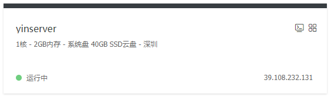
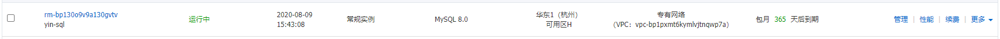
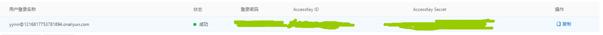

# 记录一下用Aliyun和K8S部署[yindaheng98.top](http://yindaheng98.top:8888)的过程

## 基础

### 要部署的应用

应用|语言/架构|容器数量|MySQL|Redis
-|-|-|-|-
[TheCalendars](https://github.com/yindaheng98/TheCalendars)|PHP|1|&#x2713;|&#x2713;
[FarmstayInfoSys](https://github.com/yindaheng98/FarmstayInfoSys)|PHP|1|&#x2713;|-
[iQRGenuine](https://github.com/yindaheng98/iQRGenuine)|Java/Jetty|1|&#x2713;|&#x2713;
[Three-effect-reaction-Simulator](https://github.com/yindaheng98/Three-effect-reaction-Simulator)|Java/Jetty|1|-|-
[WebSiteAnalysisKit](https://github.com/yindaheng98/WebSiteAnalysisKit)|Java/Jetty|1|&#x2713;|-
[VideoErrors](https://github.com/yindaheng98/VideoErrors)|Node/Express|1|-|-
[ExpertField](https://github.com/yindaheng98/ExpertField)|Node/Express, Java/Spring, Java/Jetty|4|&#x2713;|-
[ParkingMoney](https://github.com/yindaheng98/ParkingMoney)|Node/Express, Python|3|&#x2713;|&#x2713;

### 轻量应用服务器

一折学生机，一年才两百块，还带个SSD云盘。



这是应用的主要位置，在这个上面安一个单节点的k8s：

```shell
echo '{"exec-opts": ["native.cgroupdriver=systemd"]}' > /etc/docker/daemon.json #K8S建议的设置
kubeadm init --ignore-preflight-errors=NumCPU #因为CPU只有一个木得办法只能出此下策
```

关闭系统的Swap方法如下:

```shell
swapoff -a
```

修改 /etc/fstab 文件，注释掉 SWAP 的自动挂载，使用free -m确认swap已经关闭。

完事了按照提示：

```shell
mkdir -p $HOME/.kube
cp -i /etc/kubernetes/admin.conf $HOME/.kube/config
chown $(id -u):$(id -g) $HOME/.kube/config
```

### 安装K8S的骚操作

装好Docker开始`kubeadm init`之前：

在本地有一个V2RayN开着HTTP代理，用一个frp把代理端口映射到`yindaheng98.site:25565`，然后：

```shell
export http_proxy=http://yindaheng98.site:25565
export https_proxy=http://yindaheng98.site:25565
export no_proxy=127.0.0.1,172.16.252.150,10.96.0.0/12
mkdir -p /etc/systemd/system/docker.service.d
cat >/etc/systemd/system/docker.service.d/http-proxy.conf<<EOF
[Service]
Environment="HTTP_PROXY=http://yindaheng98.site:25565" "HTTPS_PROXY=http://yindaheng98.site:25565" "NO_PROXY="
EOF
systemctl daemon-reload
systemctl restart docker
```

完美解决k8s.gcr.io被墙的问题：

.png)

完事了直接：

```shell
rm -rf /etc/systemd/system/docker.service.d
systemctl daemon-reload
systemctl restart docker
```

### 云数据库RDS版

依旧是一折学生机，一年才五十块，选的MySQL版。



### 对象存储OSS

便宜的网盘，200G一年99块，用PV挂载到K8S里面存文件用。


按照阿里云的建议，专门开了一个子账户用来访问OSS：


记下这里的AccessKey ID和AccessKey Secret：




给子账号授权OSS读写权限：


在K8S集群上装[flexvolume插件](https://help.aliyun.com/document_detail/86785.html?spm=a2c4g.11186623.6.754.4ac95b22CLP37X)。

## 创建存储

### 原定方案：阿里云OSS（此方案报连接超时错误，原因未知）

#### 安装插件

```shell
kubectl apply -f https://raw.githubusercontent.com/kubernetes-sigs/alibaba-cloud-csi-driver/release-v1.0.7/deploy/ack/csi-plugin.yaml
kubectl apply -f https://raw.githubusercontent.com/kubernetes-sigs/alibaba-cloud-csi-driver/release-v1.0.7/deploy/ack/csi-provisioner.yaml
kubectl apply -f https://raw.githubusercontent.com/kubernetes-sigs/alibaba-cloud-csi-driver/release-v1.0.7/deploy/oss/oss-plugin.yaml
```

#### 创建OSS访问密钥

```yaml
apiVersion: v1
kind: Secret
metadata:
  name: oss-secret
stringData:
  akId: "上面子账号界面的AccessKey ID"
  akSecret: "上面子账号界面的AccessKey Secret"
```

#### 创建给数据库用的20G OSS PV

```yaml
apiVersion: v1
kind: PersistentVolume
metadata:
  name: pv-my-sql
  labels:
    alicloud-pvname: pv-my-sql
spec:
  capacity:
    storage: 20Gi
  accessModes:
    - ReadWriteMany
  storageClassName: oss
  csi:
    driver: ossplugin.csi.alibabacloud.com
    volumeHandle: pv-my-sql
    nodePublishSecretRef:
      name: oss-secret
      namespace: default
    volumeAttributes:
      bucket: "my-sql"
      url: "oss-cn-shenzhen.aliyuncs.com"
      otherOpts: "-o max_stat_cache_size=0 -o allow_other"
```

#### 创建100G通用OSS PV

```yaml
apiVersion: v1
kind: PersistentVolume
metadata:
  name: pv-oss
  labels:
    alicloud-pvname: pv-oss
spec:
  capacity:
    storage: 100Gi
  accessModes:
    - ReadWriteMany
  storageClassName: oss
  csi:
    driver: ossplugin.csi.alibabacloud.com
    volumeHandle: pv-oss
    nodePublishSecretRef:
      name: oss-secret
      namespace: default
    volumeAttributes:
      bucket: "yindaheng98-top"
      url: "oss-cn-shenzhen.aliyuncs.com"
      otherOpts: "-o max_stat_cache_size=0 -o allow_other"
```

### 当前方案：本地存储

#### 创建StorageClass

```yaml
apiVersion: storage.k8s.io/v1
kind: StorageClass
metadata:
  name: ssd
provisioner: kubernetes.io/no-provisioner
volumeBindingMode: WaitForFirstConsumer
```

#### 创建给数据库用的20G本地存储PV

```yaml
apiVersion: v1
kind: PersistentVolume
metadata:
  name: pv-my-sql
  labels:
    alicloud-pvname: pv-my-sql
spec:
  capacity:
    storage: 20Gi
  accessModes:
    - ReadWriteMany
  storageClassName: ssd
  hostPath:
    path: /home/mysql
```

#### 创建20G通用本地存储PV

```yaml
apiVersion: v1
kind: PersistentVolume
metadata:
  name: pv-ssd
spec:
  capacity:
    storage: 20Gi
  accessModes:
    - ReadWriteMany
  storageClassName: ssd
  hostPath:
    path: /home/admin/ssd
```

### 部署MySQL

#### 方案A：在K8S中部署MySQL数据库

##### 方案A数据库本体

```yaml
apiVersion: apps/v1
kind: StatefulSet
metadata:
  name: mysql-deploy
spec:
  serviceName: mysql
  replicas: 1
  selector:
    matchLabels:
      app: mysql
  template:
    metadata:
      name: mysql-pod
      labels:
        app: mysql
    spec:
      containers:
      - name: mysql-container
        image: yindaheng98/my-database-init
        env:
        - name: "MYSQL_ROOT_PASSWORD"
          value: "409987654321"
        ports:
        - containerPort: 3306
        volumeMounts:
        - name: mysql-data
          mountPath: /var/lib/mysql
  volumeClaimTemplates:
  - metadata:
      name: mysql-data
    spec:
      accessModes: 
      - ReadWriteMany
      storageClassName: ssd #这里换成“oss”就是用oss存储的方案
      resources:
        requests:
          storage: 20Gi
      selector:
        matchLabels:
          alicloud-pvname: pv-my-sql
```

##### 方案A数据库Service

```yaml
apiVersion: v1
kind: Service
metadata:
  name: mysql
spec:
  selector:
    app: mysql
  ports:
  - protocol: TCP
    port: 3306
    targetPort: 3306
```

#### 方案B：使用阿里云云数据库RDS版

##### 方案B数据库EndPoint

TODO

##### 方案B数据库Service

TODO

### 测试一下Service

```shell
kubectl run client --image=busybox --replicas=1 -it --restart=Never
kubectl delete pod client
```

### 部署Redis

#### Redis本体

```yaml
apiVersion: apps/v1
kind: Deployment
metadata:
  name: redis-deploy
spec:
  replicas: 1
  selector:
    matchLabels:
      app: redis
  template:
    metadata:
      name: redis-pod
      labels:
        app: redis
    spec:
      containers:
      - name: redis-container
        image: redis
        ports:
        - containerPort: 6379
```

#### Redis的Service

```yaml
apiVersion: v1
kind: Service
metadata:
  name: redis
spec:
  selector:
    app: redis
  ports:
  - protocol: TCP
    port: 6379
    targetPort: 6379
```

### 部署Jetty

