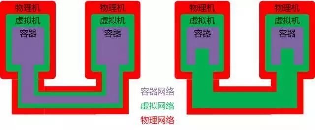
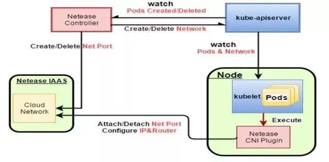
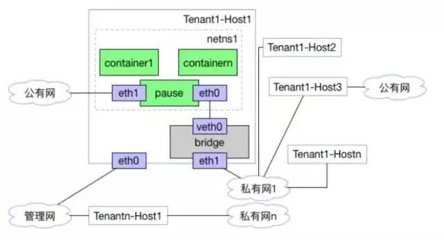
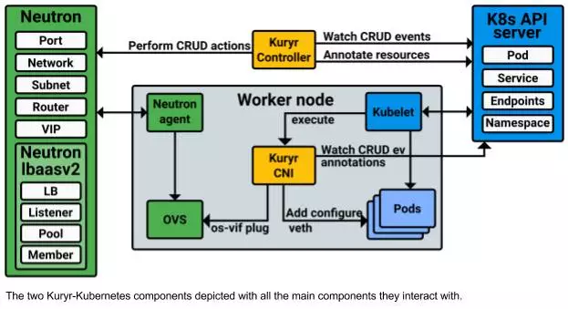

# 网易云对虚拟机/容器混用场景的网络配置方案

## 场景描述

对于很多大公司但是非互联网公司，使用容器还是需要小心对待的，因而需要逐步容器化，所以存在有IaaS平台，并且虚拟机和容器混合使用的状态，这种状态可能会持续相当长的时间。

在这种情况下，建议容器套在虚拟机里面使用。

使用Flannel和Calico都仅仅适用于裸机容器，而且仅仅用于容器之间的互通。

## 存在的问题

一旦有IaaS层，就会存在网络二次虚拟化的问题。

**虚拟机之间的互联是需要通过一个虚拟网络的**，例如VXLAN的实现，而使用Flannel或者Calico相当于在虚拟机网络虚拟化的上面再做一次虚拟化，使得网络性能大幅度降低。

而且如果使用Flannel或者Calico，那容器内的应用和虚拟机上的应用相互通信时，则需要出容器平台，多使用node port，通过NAT的方式访问，或者通过外部负载均衡器的方式进行访问。在现实应用中，不可能一下子将所有的应用全部容器化，只是部分应用容器化，部分应用部署在虚拟机里面是常有的现象。**然而通过NAT或者外部负载均衡器的方式，对应用的相互调用有侵入，使得应用不能像原来一样相互调用**。尤其是当应用之间使用Dubbo或者SpringCloud这种服务发现机制时，尤其如此。

注：NAT还使网络不满足K8S规定的网络模型，无法直接部署K8S。

## 解决方案

网易云开发了自己的NeteaseController，**在监听到有新的Pod创建时，调用IaaS的API创建IaaS层的虚拟网卡，然后在虚拟机内部，通过调用Netease CNI插件将虚拟网卡添加到容器里面。**

通过这个图我们可以看出，容器的网卡是直接连接到虚拟私有网络的OVS上的，和虚拟机是一个平的二层网络，在OVS来看，容器和虚拟机是在同一个网络里面的。

这样一方面没有了二次虚拟化，只有OVS一层虚拟化。另外容器和虚拟机网络打平的好处是，当部分应用部署容器、虚拟机时，对应用没有侵入，应用原来如何相互访问，现在还是如何访问，有利于应用逐步容器化。

OpenStack里面有一个项目Kuryr可以很好地去做这件事情，完全使用开源的OpenStack和Kubernetes可以尝试集成一下。