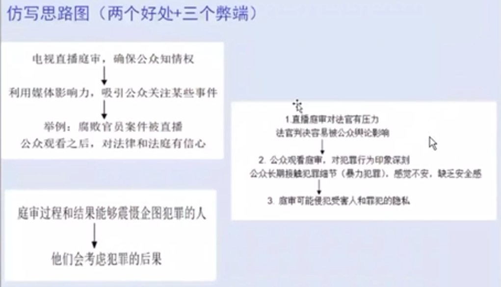
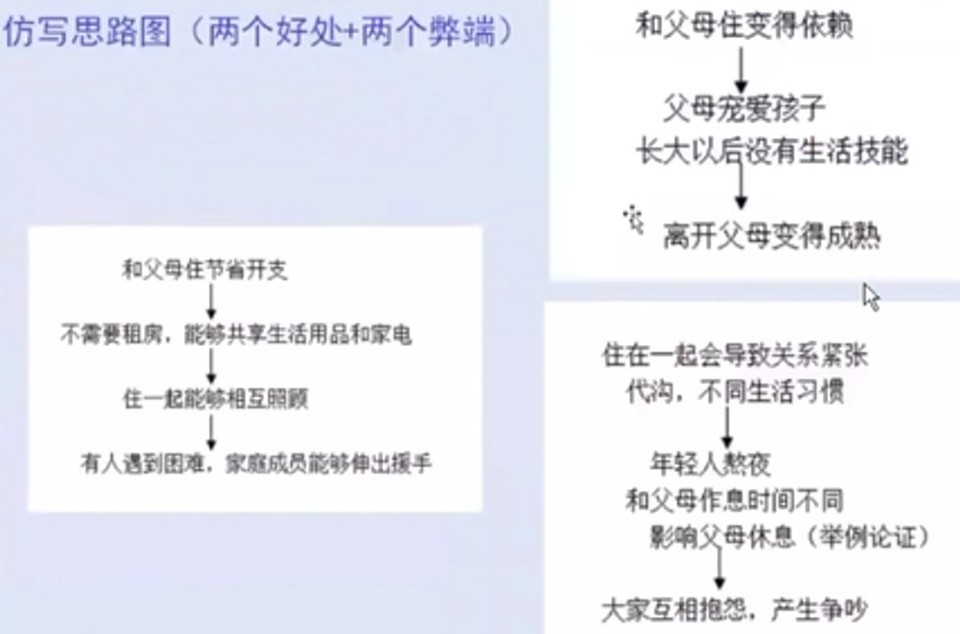

# 徐卫雅思写作笔记 第一课

决定分数的因素：能力7、预测2、运气1

分数算法：大作文2/3、小作文1/3

大作文学好了就是英语学好了，小作文自然就会好

小作文就等于看图说话

考官给分，取平均值：
* TR: Task Response ：任务完成情况
* CC: Coherence and Cohesion ：衔接与连贯
* LR: Lexical Resource ：词汇资源
* GRA: Grammatical Range and Accuracy ：语法多样性和准确性

前两项是思路问题，后两项是英语表达的问题

审题思路不难，难的是词汇语法，心里的想法用英语写不好，有错

造句不好很大程度上是因为造句凭感觉，什么词汇拿过来凭感觉随便造句

学完之后造句要变得精确，自己要能判断句子是对是错

备考安排
* 一阶段：写作词汇、造句练习、语法练习
* 二阶段：中英文素材练习+仿写
* 三阶段：不限时写作练习
* 四阶段：模考

题型
1. Discuss advantages and disadvantages. Do you think the benefits outweigh drawbacks? Is it a positive or negative development?
2. To what extent do you agree or disagree?
3. Discuss both views and give your own opinion.
4. What are reasons, effects and solutions?
5. What? How?

前三种占75%以上

分段：4段 vs 5段

* 4段双边论证：开头、好处、弊端、结论
  * 好处的素材多比较好写时用两端写好处，就是5段
* 4段单边论证：开头、好处、好处、结论

不担心考到没复习的话题，沉下心写十几个话题，后面自然就会写了，写来写去就会用自己最熟悉的，是一个融会贯通的过程。
写教育话题会用很多社会话题的词汇，写科技话题会用很多生活话题的词汇。
各种话题都复习一下就全部会写了。

写作步骤
1. 审题，标记题目关键词，分清楚题型，最多5分钟
2. 头脑风暴想观点(类似的观点可以合并同类项)
3. 确定总论点和个人倾向
4. 写文章
5. 写完检查一下，修改明显的错误

## 开头怎么写

题1: People these days can buy various goods on the internet Do you think the benefits of online shopping outweigh its drawbacks? 2017-11-11

**开头写两句话，一句写背景一句写观点**

### 头脑风暴想观点

* 好处：不用出门，节约时间，方便买到其他地方的产品，选择多，便宜，省钱，货比三家
* 弊端：假货，实物不得没法试穿，过度消费，剁手，冲动购物

### 开头第一句，背景

换词，切换主语，句子扩展和延长

#### 换词

* People 换 Citizen:
* these days 换 in this day and age
* buy 换 perchase

#### 换主语：People能做主语还有谁可以做主语？主语换了句子自然就变了，不需要刻意背句型

* Various goods： Various goods are available for purchase on the web
* The internet： The internet makes it possible for people to
* Online shopping： Online shopping has become increasingly popular
* It is common： It is common for people to
* 还想变长？并一下：Online shopping has become increasingly popular and Various goods are available for purchase on the web

#### 原因，结果，目的，对比，举例

* 上面的并列句Online shopping has become increasingly popular and Various goods are available for purchase on the web 这两个就有因果关系
* 往前扩展：**由于**网络的出现，现在网购越来越受欢迎：
  * **As a result of** the popularization of online shopping, a large variety of goods are available for purchase on the web.
* 往后扩展：现在网购越来越受欢迎，**于是**刺激消费：
  * 刺激消费不会写？写结果：销量飙升
  * Online shopping is becoming increasingly popular among consumers of various age groups, **with** total sales soaring every year.
  * 介词帮你延长句子：among、of、with
  * 换个容易的介词： Online shopping is becoming increasingly popular among consumers of various age groups, and total sales soar every year.
  * soar也不会？： Online shopping is becoming increasingly popular among consumers of various age groups, and total sales increase every year.
* 写容易的，少犯错也能6.5
  * It is common for people to buy goods on the web due to the development of the internet.
* 举例式：
  * Consumers can buy a large variety of goods **such as** foods, clothes and home appliances on the web to meet their daily demand
* 对比式
  * 之前去商店，后来上网
  * Traditionally, consumers need to go to stores to buy goods, but today this has changed, with more and more people choosing to shop on the internet.

不同题目不同写法好写，随便选一个合适的

#### 从句，并列，介词短语，动词不定式

#### 练习

题2： In some countries, more and more adults choose to continue living with their parents after they graduate and find jobs. Do you think the benefits outweigh its drawbacks(2015-4-30)

* 头脑风暴想观点
  * 好处:减少生活压力，省钱，省房租，年轻人可支配收入增加;照顾父母，联系紧密
  * 弊端:依赖，不独立，没有隐私，代沟，生活习惯不同，矛盾
* 写开头，背景+观点
  * 换主语
    * It is common for young people in many countries to live with their parents after they leave school and find jobs.
  * 原因
    * To 为了减轻生活压力，reduce pressure：
    * Due to 房价太高： Due to the high price of housing, many young people choose to live with their parents, even after they have found jobs.
  * 对比
    * Traditionally, young people would leave their home after graduating from school, but now many of them choose to live with their parents.

换句式可以避免换词的尴尬，比如 parents 换 father and mother 就尬的很

考官着急下班，只要讲的东西合情合理就可以了，没人会和你抬杠的，不会抠逻辑漏洞

### 开头第二句，观点

#### 套句（易）

观点都是套句，背下来上考场直接抄

* I think the benefits of this trend outweigh its drawbacks.
* I think this trend has both positive and negative outcomes.
* This phenomenon has some benefits, but its drawbacks should not be ignored.
* Although this phenomenon has some benefits, I am also concerned about its drawbacks.
* This trend has some benefits, though there are some problems that should not be ignored.
* This pattern has some benefits, although it may lead to some problems.

**写背景是原创，写观点是套句**

分数和开头没太大关系，主要决定于正文

#### 概括好处（难）

* This makes the process of shopping more convenient and enjoyable, although it may lead to some problems.
* This can make the process of shopping more convenient, but it causes a series of problems that should not be ignored.

## 总结

* 开头段的写作(背景+个人观点)
  * 背景句的写作技巧
    1. 针对题目的关键词引出话题
    2. 运用词汇替换和语法技巧(切换主语)
    3. 增补一些句子成分
       * 原因、结果、目的、对比、举例
       * 从句、并列、介词短语、动词不定式
* 观点句的写作技巧:
  1. 可以使用套
  2. 也可以把好处或者弊端具体化

开头审题5分钟，第7分钟就要写完

概括好处太费时间，容易写不完

考虑时间成本强烈建议用套句

## 怎么过渡

**不建议用长句，就用简单句**，容易给考官感觉凡是水话套话就写得好，和文章有关的都写得不好，被扣分，所以还是朴素一点好

### 开头之后怎么过渡到主体段

* 难的：写个过渡句
  * The reasons for this trend may involve the recognition that .I(剑5-2)
  * The obvious argument in its favor is that ... ( 9-1)不写过渡句(剑10-3)
* 容易的：不写过渡句
  * The first benefit is ......
  * To begin with, ......
  * First of all, ......
  * It is widely agreed ......
  * There is no doubt that ......
  * There is no denying that ......

不要写太难，写点朴素的，不然太高大上和后面不协调

### 从好处段到弊端段的过渡

* There are, however, some disadvantages. (剑9-1)
* However, there are certainly dangers in taking time off at that important age. (剑 5-2)
* Although ...... has quite a number of advantages, there exist some problems.
* Despite all these benefits, people should not ignore the fact that ...... also causes many problems.
* However, ...... has its drawbacks when it brings us all these benefits.

### 从主体段过渡到结尾段

* Overall
* In conclusion
* To sum up
* My view is that
* Based on the points outlined above, I believe that ......
* From what has been discussed above, we can come to the conclusion that

## 中间段怎么扩展

继续题1: People these days can buy various goods on the internet Do you think the benefits of online shopping outweigh its drawbacks? 2017-11-11

### 因果论证：为什么，怎么样，结果怎样

* 好处一：方便，省时间
  * 哪个做中心？方便做中心句
  * 为什么方便：做头脑风暴的时候想到的一些官点合并同类项
    * 网上下单，place orders，click on the button
    * 送货上门，door-to-door delivery，delivery to the house
    * 足不出户，leave the home，stay at home

第一句：
**The first benefit is that consumers can buy various goods conveniently without leaving their homes, saving them a great deal of time.**

不要把脑子当百度翻译，用介词，不定式，分词把句子延长

第二句可以解释节约时间的原因

第二句版本一：
**After the goods are ordered on the web, they will be delivered to the house.**
再延长
at a certain time
as required by the buyer

第二句版本二：
**They can enjoy door-to-door delivery service by clicking on the button and placing the order on the web.**

第二句容易的版本：
**They can enjoy door-to-door delivery service and then the goods will be sent to their houses.**

第三句可以解释节约时间的结果：满足现在人的需求，做自己喜欢做的事情

**This mode can meet the demands for people in the modern society**
延长
because people are always too busy with their work.

### 对比论证：把话反着说

讲别人不好

By contrast, before the advent (arrival, appearance) of online shops, people have to walk to the store and market and carry the goods back to home in person.

### 继续

* 第二个好处：省钱，买到便宜货
  * 网店没有房租
  * 价格便宜
  * 货比三家

第三句版本一
In addition, buying things on the web enables people to compare the price of all goods and choose the relatively cheaper ones.

没思路了？来**举例**，把商品和人物具体化，不要举自己

第三句版本一继续
For example, a young man can buy a new mobile phone at a low price after he reviews the list of all brands and makes the comparison carefully.

把句子里面的各种东西具体化然后把前面的话再说一遍

第三句版本二
In addition, buying things on the web is a good way to save money. Without renting for the stores, sellers can provide the goods for consumers at lower prices.

## 总结

主体段三大方法
* 因果论证：为什么，怎么样，结果怎样
* 对比论证：把思路反着写
* 举例论证：把思路用具体的例子来写

### 老师的例句

第一个好处：
The first benefit of online shopping is **that** consumers can buy whatever they want conveniently. **After** the goods are *ordered* on the web, they will be *delivered* to the house at a *designated* time, **saving** consumers a great deal of time and energy. This mode can better *meet the demands* for people in modern society, **who** have *desire* for *good quality* life but may be *occupied* by *heavy workload* and *household chores*.

第二个好处：
In addition, buying things on the web *enables* buyers to compare the price of the goods and *find bargains*, **without** going from one store to another, **as** they used to do previously. Consumers become better *informed* and can *make the best choice*. For example, a mother can select the diaper for her new-born child at the lowest price **by** reviewing the list of all brands on the computer.

好处写两段坏处写一段，弊端也是两个：
However, online shopping may *expose* consumers to risks. Consumers are likely to buy *fake* goods **and** their personal information may be *disclosed* on the *virtual space*. Another problem is *irrational consumption*. Shopping can be do neat any time of the day or night, **with** various kinds of goods from all over the world *available* on the web. Consumers may *get addicted to* online shopping and *end up* in buying more things than they really need.

### 版本二：坏处写两段

第一个坏处（扩写上述坏处段）
However, online shopping may *expose* consumers to risks. Consumers are likely to buy *fake* goods as people cannot see the real goods and supervision is not in place.
举个例子
Some ladies may buy poor-quality cosmetics on the internet
继续延长
that are detrimental to their skin
或者简单点
which leads to skin problems.
扩展最后一句
Consumers' personal information may also be disclosed on the *virtual space*.
扩展
As a result, they may be harassed in their daily lives and receive many junk emails or phone calls.

### 总结：主体段的写作

1. 确定分论点的个数，每个分论点的篇幅可长可短，是否扩展取决于实际情况
2. 每个分论点有明确的中心意思，可以写出中心句
3. 扩展方法: 因果论证(为什么，怎么样，结果怎样)举例论证、对比论证

## 结尾怎么写

版本一（易）：结尾也先写个套句，和开头的套句一样

In conclusion, online shopping has many benefits, although there are some problems that need to be tackled.

结尾段的写法:
* 一句话或者两句话都可以
* 直接说好处多或者坏处多
* 有好有坏也是一种个人观点
* 可以委婉地表达好处《这个现象会继续下去，很多人会做这个事情)
* 可以委婉地表达坏处《有很多问题需要克服)

版本二（难）：这个现象会继续下去，有很多问题需要克服

To sum up, online shopping is expected to grow raplidly and continuously, as it *represents* the selling-buying trend in the future. Although there are some weaknesses, they can be *addressed* with some measures *adopted*.

### 结尾段万能写法《强调坏处更多)

* To sum up, although many people embrace online shopping, I am very concerned about the problems of this mode.
* In conclusion, although this phenomenon has some benefits. I am concerned it has detrimental effects in the long term.
* can .....in somekases(带来一点好处).However, this.....trend should not be encouraged, considering the problems it causes to individuals and society.
* Based on the points outlined above, I think this trend has more drawbacks than benefits.

## 作业题

In some countries, the criminal trials are shown on TV and the general public can watch them. Do the advantages outweigh the disadvantages?

In some countries, more and more adults choose to continue living with their parents after they graduate and find jobs. Do the advantages of this trend outweigh its disadvantages?

