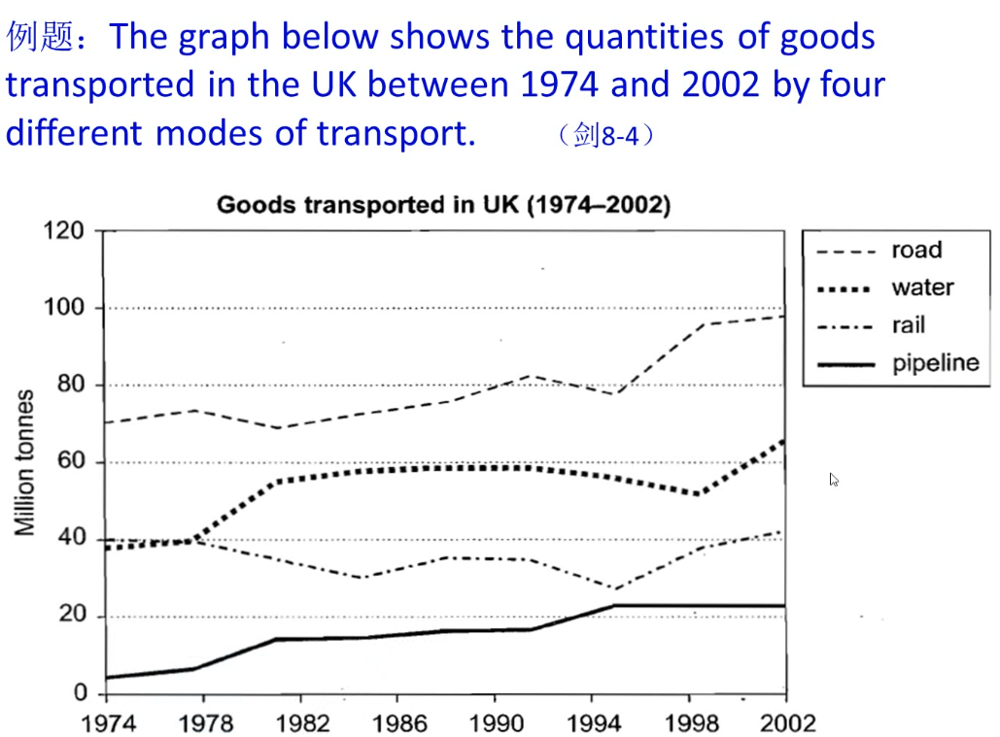
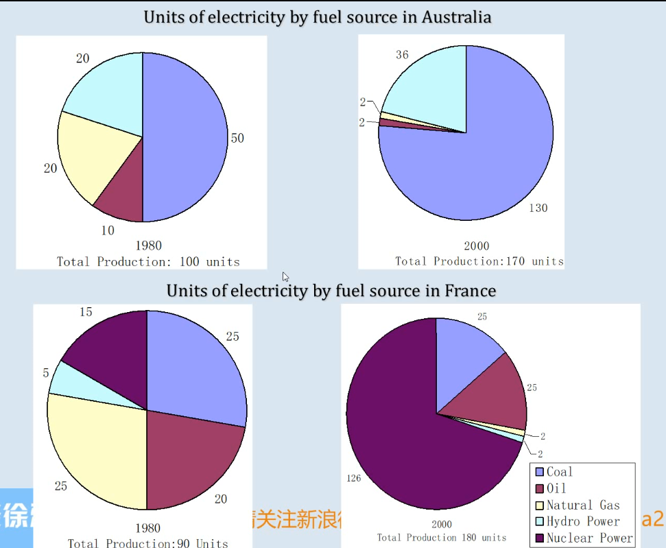

# 徐卫雅思小作文写作笔记

小作文思路条理性最重要

# 动态图表

## 开头：题目改词

## 主题段：按照项目一个个写

### 一般

Water and rail transported the same amount of goods in the first 4 years at 40 million tonnes. The quality of water transport showed significant growth and rose to almost 60 million tonnes. It stayed stable for the following decade and fell sightly in 1998, and then increase to 62 million tonnes in 2002.

The quality of goods transported by road was highest during the 28 years and it rose from 70 to 98 million tonnes. In comparison, the quality of goods transported by pipeline was the lowest. It grew from 5 to 22 million from 1974 to 1955 and it remained unchanged till 2002.

### 升级

and太多比较单调，增加句型丰富性

Water and rail transported the same amount of goods in the first 4 years at 40 million tonnes. The quality of water transport showed significant growth, *rising* to almost 60 million tonnes. It stayed stable for the following decade and *after a slight fall in 1998, it* then increase to 62 million tonnes in 2002.

It stayed stable for the following decade and after a slight fall in 1998, *before increasing* to 62 million tonnes in 2002.

## 结尾

Over this span of 28 years, the quantities of goods transported by road, water and pipeline all increased, while the quantity transported by rail did not change. 

## 时间饼图写法

The percentage (proportion) of teachers' salaries was 50%.

Teachers' salaries accounted for (made up, constituted) 50% of total spending of the school.

50% of money was spent on teachers' salaries.

In conclusion, the percentage of teachers' salaries was the highest in the three years.The cost on equipment and insurance showed an increase, while there was a decline in the spending on books and other workers' salaries

## 作业

先写总数据，再写最大的

## 时间点比较少（两个）的动态图

可行思路：按项目顺序写

补充思路：按时间点写

The charts compare the sources of electricity in Australia and France in the years 1980 and 2000.

The charts show how sources of electricity in Australia and France changed in the year 1980 and 2000.

The percentage (proportion) of electricity produced by coal was 5%.

Coal accounted for (made up, constituted) 50% of fuel sources for electricity production.

Coal produced (generated, contributed) 50% of electricity.

# 静态图表

* 比最大值，其次值，相等值，合并，倍数，省略

Turkish people spent the highest percentage on food, drinks and tobaccp (almost one third), closely followed by Irish people (nearly 30%). The figure in Sweden, Italy and Spain were much smaller and they were all less than 20%.

The expenditure on leisure and education in Turkey was 4.35%, which was nearly twice as much as the percentage in Ireland (2.21%). By contrast, Spanish people spent the lowest proportion on this item (1.98%). Swedish and Italian people spent almost the same percentage.

43%的人因为家人朋友留在英国

小作文万能换句法：换主语
* 43% of people stay in the UK because of family and friends.
* The percentage of people who stay in the UK because of family and friends is 43%.
* "Family and friends" is the most important reason why people stay in the UK and 43% of people choose it.
* "Family and friends" is the most important reason why people stay in the UK (43%).

Overall, the reason that prompt people to stay in and leave the UK are quite different.

技校生当中，男生远远多于女生
* The percentage of males was much higher than that of females at level of skilled vocational diploma.
* Much more men than women held skilled vocational diploma.
* Men clearly outnumbered women at the level of skilled vocational diploma.
* The gender difference was the largest for people who held skilled vocational diploma.

The chart compares the percentage of men and women who held various qualifications in Australia in 1999.

结尾写最主要特征