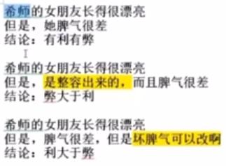

# 徐卫雅思写作笔记 第二课

* 只是多写还不够，容易不断重复错误
* 写完对范文，把好词好表达转化为自己的东西，才能有提升

## 驳论

**全写好处比较难，写点坏处素材多一点比较好写**

### 剑9-1：Some experts believe that it is better for children to begin learning a foreign language at primary school rather than secondary school. Do the advantages of this outweigh the disadvantages?

* 好处：两个分论点
  * 学得快，接受能力强，记忆力好，用于开口
  * 时间充足，课程不多，压力小
* 弊端：
  * 混淆母语和外语
  * 小学老师不够专业，全科老师（考官写的）

#### 考官范文开头

考官用的对比思路：

Traditionally, children have begun studying foreign languages at secondary school, but introducing them earlier is recommended by some educationalists. This policy has been adopted by some educational authorities or individual schools, with both positive and negative outcomes.

考官写的高端表达 "with both positive and negative outcomes" = 套句 It has both positive and negative outcomes.

#### 考官正文

* 好处
  * 年纪小，更容易学会
  * 教学安排灵活
* 弊端（考官用的驳论**先写弊端然后反驳**）
  * 小学老师不够专业，课程难以标准化
  * 但是如果采取措施，弊端可以克服
* 结尾段
  * 小学学外语有好处，鼓励

“但是如果采取措施，弊端可以克服”： However, these issues can be addressed strategically within the policy adopted.

### 剑5-2: In some countries young people are encouraged to work or travel for a year between finishing high school and starting university studies. Discuss the advantages and disadvantages for young people who decide to do this

* 好处
  * 放松，开阔视野，丰富阅历， have a better understanding, independence, earn tuition, get a clear perspective, adapt to social
    * 反驳：但是,假期也可以打工和旅游,没有必要 gap year
* 弊端
  * 心玩野了，收不了心，不想去学习了。
    * 考官反驳：**但是，这个问题不需要担心，因为现在学历很重要，所以他们还是会回到校园去拿大学学历的。**
  * 危险，被骗

考官范文段：分论点，一个论点的扩展

However, there are certainly dangers in taking time off at that important age. 解释的时候不需要衔接词 Young adults may end up never returning to their studies or finding it difficult to readapt to an academic environment. 并列不需要衔接词 They may think that it is better to continue in a particular job, to do something completely different from a university course. But overall, I think this is less likely today, when academic qualifications are essential for getting a reasonable career.

递进的时候才需要衔接词

## 单边论证题：Agree or disagree

题1: Some people believe that unpaid community service should be a compulsory part of high school programs (for example working for a charity, improving the neighborhood or teaching sports to younger children). To what extent do you agree or disagree? (9-2)
* 同意：培养责任心，同情心，增加社会经验技能，丰富简历
* 不同意：耽误学习，影响成绩，导致父母不开心，自己会抱怨
* 结论：鼓励义工，但是需要合理引导，不能强迫

题2: Nuclear energy is better than other sources of energy to meet the increasing need. To what extent do you agree or disagree? (2013-9-7)
* 同意：清洁无污染无排放效率高能量大不短缺
* 不同意：事故破坏环境核泄漏危险辐射破坏环境
* 不同意结论：核能确实有好处，但不是最好的，还应该继续开发更安全的能源

题3: Living in big cities is bad for people's health. To what extent do you agree or disagree? (2014-3-1)
* 同意：空气污染雾霾，加班熬夜压力大，毁身体
* 不同意：大城市医疗条件好
* 结论：虽然大城市有更好的基础设施，但是总体来说，有害健康

### 题1: Some people believe that unpaid community service should be a compulsory part of high school programs (for example working for a charity, improving the neighborhood or teaching sports to younger children). To what extent do you agree or disagree? (9-2)

* 第一段：开头段：
  * 用背景作开头：Doing unpaid work is common among high school students in some countries, which has become a compulsory part of high school programs. In my opinion, this can provide them with many valuable skills, although it may affect their study sometimes.
  * 用观点作开头：It is suggested that all high school students should be involved in unpaid community services. In my opinion, this can provide them with many valuable skills, although it may affect their study sometimes.
* 第二段：同意的理由1：培养责任心
  * In many high schools, students are required to do unpaid work after class as a compulsory part of high school programs. While this may occupy their time to some extent, it is beneficial for students' growth in various aspects.
* 第三段：同意的理由2：学会实用技能
* 第四段：不同意：影响学习，但是，如果合理安排时间，问题是可以被克服的
* 第五段：结尾段：

**全写好处比较难，写点坏处把素材利用率最大化**

如何避免一直重复名词或短语？用代词或套句进行指代
* 代词
  * This trend, this phenomenon, this policy
  * This opinion, this viewpoint, this mode
  * This practice, this issue, this problem

8分范文：

**It has been suggested that** high school students should *be involved in* unpaid community services as a compulsory part of high school programs. Most of the colleges are already providing opportunities to *gain work experience*, **however** these are not compulsory. In my opinion, sending students to **work in community services** is a good idea **as** it can provide them with many lots of valuable skills.

分析，句子流畅，单词地道，句式灵活

### 题2: Nuclear energy is better than other sources of energy to meet the increasing need. To what extent do you agree or disagree? (2013-9-7)

开头段可选主题
* 背景+我的观点：To tackle the energy crisis throughout the world, nuclear energy is now widely used in many countries. Compared with fossil fuels, it has various advantages, but there are also some risks that we should pay attention to.
* 题目观点+我的观点：Some people think nuclear is the best source of energy 扩展 and should be further promoted to tackle the energy crisis. This viewpoint sounds reasonable, but using nuclear power has some risks that should not be ignored.
* 背景+题目观点+我的观点：To tackle the energy crisis throughout the world, nuclear energy is now widely used in many countries. While some people think that it is the best source of energy, I disagree with this opinion.

核能好处范文思路：

自己仿写了对照范文积累表达，看看有啥表达是单词都会但是想不到的

光看范文没什么用，光抄写也不会产生语感

口语背书也不会有语感

仿写的好处也不会产生语感

核能的弊端思路：
* 事故、核辐射、技术受限、核泄漏
* 污染环境、毁灭性的、危害人类和动物

培养的语感之后脑子里有关键词就能写文

However, using nuclear power has potential risks. Accidents may happen as a result of technical failure, wrong operation or natural disasters.

扩展
However, using nuclear power has potential risks. This kind of energy is hard to control and accidents may happen as a result of *technical failure*, *wrong operation* or *natural disasters*. *Leakage* of nuclear waste and *radiation* would *cause catastrophic consequences* to the environment and *pose a threat to* people's and animals' health and safety.

还想写？举例，把上面写过的再来一次
There were many accidents that occurred in human history and as a result, the local ecological environment was completely destroyed and not restored yet. Numerous people suffered from cancer or other fatal diseases.

再扩展
There were many accidents that occurred in human history and as a result, the local ecological environment was completely destroyed and not restored yet. Numerous people exposed to radioactivity later suffered from cancer or other fatal diseases.

## 总结

第二次课总结:
1. 驳论结构 (把刚刚写过的理由进行否定)
2. 观点类题目的结构 (确定总论点) (审题，找同意和不同意的理由，某些题目类似于利弊分析)
3. 开头段的写作技巧 (背景、题目观点、我的观点)
4. 中间段的思路方法 (为什么、怎么样、结果怎样+**连词成句**有词就能造句)
5. 结尾段的写法 (总结性+建设性)
6. 范文中的红色标记词汇、造句技巧课程录屏复盘，仔细体会“审题”、“论点”和“思路课后作业可以用来练笔