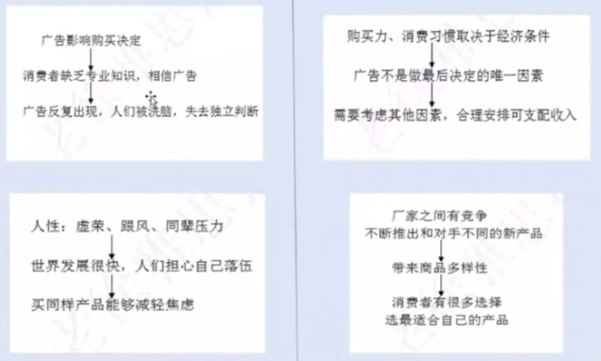

# 徐卫雅思写作笔记 第三课

## 了解写作的灵活性

主体段的写作:
1. 确定分论点的个数，每个分论点的篇幅可长可短，是否扩展取决于实际情况
2. 每个分论点有明确的中心意思，可以写出中心句
3. 扩展方法: 因果论证(为什么，怎么样，结果怎样)举例论证、对比论证

灵活扩展神器：
* 为什么（核心）
* 怎么样（是什么，举例）
* 结果怎样

### 例题：很多留学生在留学的时候打工，好处和弊端

#### 举例论证

第一个好处：留学打工能挣钱
* 结果怎样：减轻家庭负担，支付生活费，交学费
* 为什么：家庭条件不好，物价高，经济压力大
* 举例：去餐厅打工一周能挣200美元

开写：
留学打工能挣钱。这一点很重要，因为某些学生家庭条件不好，物价高，经济压力大。举例，去餐厅打工一周能挣200美元。挣的钱可以减轻家庭负担，支付生活费，交学费。

简略：
**留学打工能挣钱。** 去餐厅打工一周能挣200美元。挣的钱可以减轻家庭负担，支付生活费，交学费。

先写结果：
**留学打工能挣钱。** 挣的钱可以减轻家庭负担，支付生活费，交学费。举例，去餐厅打工一周能挣200美元。挣钱对于某些学生很重要，因为他们家庭条件不好，物价高，经济压力大。

先举例：
**留学打工能挣钱。** 举例，去餐厅打工一周能挣200美元。挣钱对于某些学生很重要，因为他们家庭条件不好，物价高，经济压力大。挣的钱可以减轻家庭负担，支付生活费，交学费。

中心句放中间：
有些留学生家庭条件不好，物价高，经济压力大。所以 **他们会去打工挣钱。** 挣的钱可以减轻家庭负担，支付生活费，交学费。举例，去餐厅打工一周能挣200美元。

#### 对比论证（反向因果论证）

如果不去打工，就没有钱交学费，没有钱支付生活费，家庭负担重。

想要既写为什么又写对比论证？容易词汇重复。解决：反着说
正|反
-|-
没有钱交学费|可能会失学
没有钱支付生活费|没有钱买生活必需品
家庭负担很重|家里父母承受很大压力

## Agree or Disagree题1(单边更好写): Some people believe that spending money in developing the technology for space exploration is unjustifiable and there are more beneficial ways to spend this money. To what extent do you agree or disagree? (2018-12-1)

双边论证，素材最大化，同意不同意都写

同意：
* 政府资金有限，其他方面确实需要花钱，而且和人们的生活更加密切
不同意：
* 但是，太空探索不是浪费钱，促进科技进步，寻找更多资源，地球被污染，人口太多，需要寻找新的空间

### 开头

编一个背景开头（简单）
* In the past decades, many space programs were carried out in some countries, with great progress made in space exploration.

对比开头（难）
* To explore the space has long been the dream of mankind for thousands of years and this has become reality in the past decades.

题目观点+我的观点开头
* 简易版 Some people believe space exploration is a waste of money and this money should be spent on other aspects, but I disagree with this opinion.
* 高分版 Some people doubt the justifiability of the money poured into space exploration, but I believe this endeavor is by no means a waste of money.

词汇不是低分的根本原因，语感和造句才是

### 正文：写让步段

* 因为政府的预算有限，其他方面和人们的生活更加密切

There is no denying that in many cases the government's budget is rather limited and people hope this money can be spent on public services that are more closely relevant to their welfare instead of some projects that seem to be far from reality.

简化
There is no denying that in many cases the government's budget is rather limited and people hope this money can be spent on public services that are more closely relevant to their welfare. By contrast, the project of exploring the space seems to be far from reality.

扩展1对比论证（难）：太空研究投入的钱短期内没有回报。对于某些有财务困难的政府来说，投资太空探索会导致负担。
It seems that the fund allocated to space exploration is less likely to be rewarded in the short term and for some governments with financial difficulties, this investment may impose a burden on taxpayers.

扩展2举例论证（易）：如果政府的钱投资地铁，人们出行会更加方便。如果政府的钱投资医疗，人们就会享有更好的医疗服务。（状语从句太单调，用介词写）
For instance, if the government could invest more in building subways, city dwellers would have more conveniences in traveling, **with** much less traffic congestion. Likewise, **by** establishing more hospitals, the government can provide better medical services for its citizens.

### 正文：开始让步

开始让步：但是探索太空也需要花钱（为什么，怎么样，结果怎样）
* 促进科技发展，GPS，weather forecast，space breeding，trans-genetic food
* 人类面临很多问题，需要探索太空，人口太多，资源短缺，需要寻找新的空间，发现新的资源

However, those who oppose space research do not see that human being's effort in this regard has generated substantial(great) benefits, some of which may be invisible at present. Many technological advances resulting from space exploration have been applied in a variety of fields or will benefit mankind in the long term, including satellite navigation systems, some basic theoretical studies and soon. Moreover, considering the problems that have been prevalent on the planet such as the population explosion. resources depletion and environmental pollution, it is quite reasonable for scientists to explore the universe and look for more alternatives and larger space for human beings.

简化
* invisible: Some of which cannot be seen at present.
* Many technological advances have been used in many fields and will benefit mankind in the long term, including GPS, weather forecasts, etc.
* Moreover, people are faced with many problems such as ... It is quite reasonable for scientists to explore the universe and look for more resources for human beings.

### 结尾

To conclude, although some other aspects need money, it is justified for some governments to allocate the budget to outer space projects, as long as their financial conditions allow them to do so.

## Agree or Disagree题2(单边更好写): When a new town is planned,it is more important to develop public parks and sports facilities than shopping centers for people to spend their free time in To what extent do agree or disagree?(2019-1-12)

同意：
* 公园很重要，绿化，美化环境，新鲜空气，搞活动
* 体育设施很重要，锻炼身体，现代人健康下降

路径1，完全同意题目观点：商业中心不重要，因为网购很发达，公园和体育设施更健康
路径2，不同意题目观点：商业中心也重要，生活方便，丰富娱乐生活

### 仿写练习

关于公园的重要性，同样可以结合健康生活方式来写，有些人，尤其是老年人喜欢去公园慢跑jogging、跳舞dancing，他们不定愿意去体育中心搞竞技体育not interested in competitivesports。公园的还有一个好处就是有植物和树木plants andtrees，能够提供一个非常舒适的环境provide a comfortableenvironment，人们在公园里面能够呼吸新鲜空气breathefresh air，可以放松身心refresh themselves，可以接触大自然have close contact with nature，这些都是健康积极的休闲活动。

关于修建体育设施的重要性，improve people's health，减少政府的医疗费开支reduce the government's budget formedical expenses，改变人们久坐不动的生活习惯live asedentary lifestyle，现在的人经常选择在家看电视和打游戏修建了体育设施之后have easy access to sports facilities他们会更加愿意搞体育活动participate in sports activitiesadopt active lifestyles。

Version1(完全同意题目观点): 关于修建购物中心的问题，因为现在网络购物比较流行prevalent，所以商场的购物功能似乎没有之前那么重要了。虽然商场里面也可以有娱乐设施，但是比起体育活动和户外活动,似乎修建公园和体育设施还是更加重要一些，因为能够鼓励更加健康的生活和娱乐方式。

Version1(我觉得两个都重要): 关于修建购物中心的问题，购物中心也很重要。除了购物功能，购物中心里面还可以修建娱乐设施，比如饭店、影院，这些都是生活的必需，能够提高人们的生活品质，而且在商场里面也可以修健身房，所以购物中心和公园、运动中心同等重要Equally important

## Agree or Disagree题3: Some people believe that teenagers who commit crimes should be punished in the same way as adults. To what extent do you agree or disagree?(2017-5-6)

相同主体不同题：Many teenagers commit crimes and the rate of juvenile delinquency is increasing. What are the reasons and what solutions do you suggest?

* 同意:警示deter，公平fair，预防prevent
* 不同意:
  * 理由1: 因为青少年不懂事，不成熟，冲动，缺乏自控，长大以后就好了，所以社会的危害性比较小，需要给青少年改正的机会。
  * 理由2: 父母学校缺乏教育，媒体误导，所以青少年犯罪的主要责任不在他们，如果同样惩罚有些不公平。

加让步段更好写：Punishing teenager criminals in the same way as adults seems to be reasonable from the perspective of victims and their relatives. This policy can better prevent youth crimes, considering the deterrent effect on teenagers with evil intentions.However, equal punishment regardless of age is not consistent with the customary practice in most countries and violate the principle of justice.

### 仿写练习

写青少年犯罪都是教育词汇

理由 1: 青少年犯罪和年龄阶段有关，青春期 in he adolescence 的孩子不成熟immature，比较叛逆 rebellious，缺乏自控能力 self-control 和分辨是非的能力the ability to judge right from wrong,等他们长大成人以后grow up to adults，很多人都意识到了当年的行为很傻realize how silly they were，长大以后自己也就纠正了 correct their mistakes，所以对社会的危害 the damage to society 不能和成年人犯罪相比 not comparable to adults' crimes，惩罚自然也需要减轻 mitigate the punishment。

理由 2: 青少年犯罪并不完全是青少年的责任，它和家庭、学校以及社会环境有关 be responsiblefor juvenile delinquency (如果不会写这个词，可以用youth crime 代替)。父母没有时间监督孩子的行为 supervise children'sbehavior，有的家庭溺爱孩子 spoil children，有的家庭纵容孩子 permissive导致他们的错误行为。电视和网络充斥着各种暴力内容 be inundated withmedia violence 青少年很容易模仿这些暴力行为。考虑到这个原因，如果对青少年犯罪进行严厉惩罚，和成年罪犯同样地对待，那样似乎是不公平的 seems tobe unjustified

### 仿写练习连词成句

首先，青少年犯罪和年龄阶段有关，青春期 in the adolescence 的孩子不成熟immature,比较叛逆rebellious,缺乏自控能力self-control和分辨是非的能力the ability to judge right from wrong，等他们长大成人以后 grow up to adults,很多人都意识到了当年的行为很傻realize how silly they were，长大以后自己也就纠正了 correct their mistakes，所以对社会的危害 the damage to society 不能和成年人犯罪相比 not comparable to adults' crimes，惩罚自然也需要减轻 mitigate the punishment

* In their adolescence, people tend to be immature and rebellious and they do not have self-control and the ability to judge right from wrong.
* In their adolescence, people tend to be immature and rebellious, without self-control and the ability to judge right from wrong.
* Adolescence is a special period, in which people tend to be immature and rebellious, without self-control and the ability to judge right from wrong.

## Agree or Disagree题4: The high sales of popular consumer goods reflect the power of the advertising but not the real need of the whole society in which they sell. To what extent do you agree or disagree with this statement? (剑6-1)

* 同意: **广告确实提高销量**，名人代言，广告诱惑人们购物，搞活动，跟风
* 不同意: **但是不是所有人都听广告的**，还有其他因素导致销量增加。生活水平提高，大家有钱了；科技发展，产品更新
* 结论: 两个因素共同起作用

开头：Consumer goods from clothes to home appliances are sold very well in today's commercial society. I think advertising plays an important role in boosting the sales, but this phenomenon also indicates the demand of the society is increasing.

结尾（把开头表达的总论点换词换句型写出）： In conclusion, it is true that advertising tempts people to buy more than they need in some cases. However, it is difficult to say that everyone is influenced by advertisements in making their buying decisions. People's increasing demand and income also contribute to the high sales.

## 作业题: Some people think that advertisements make people buy the same products and discourage them from being different individuals. To what extent do you agree or disagree?
(2015年7月11号考题)

文章结构
1. 开头段
2. 同意: 广告确实使一些人购买同样产品，失去个性(被广告洗脑、跟风心理、虚荣)
3. 不同意: 并非所有人都变得一样 (人们收入不同、消费习惯不同，厂家会有竞争，不断推出新产品)
4. 结尾段: 确实很多人会因为广告买相同的产品，但是不是所有人都会失去个性

## 总结

1. 写作思路扩展的灵活性
2. 备考计划
3. 观点类题目和利弊类题目有区别 (双边论证vs.单边论证)(找同意和不同意的理由、确定总论点、倾向性、让步段)
4. 开头段的写作技巧 (背景、题目观点、我的观点)5.中间段的思路方法 (连词成句+行文逻辑)
6. 结尾段的写法 (概括总结vs.建设性，和文章主体段相关)
