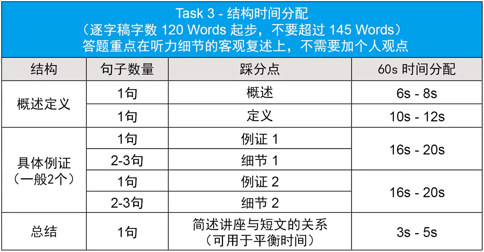

# 托福口语

## Part 1

逻辑三段式：
1. 结论
2. 细节/例证
3. 结论

逻辑要求没有非常高，主要是能说

### 话题分类准备

**1找词2拼句**

#### 教育

* 问：Your university is organizing a series of guest lectures. Some people think that speakers with controversial opinions should not be invited to speak at the university. Others believe that the university should feature a variety of speakers, regardless of their opinions. Which point of view do you agree with? Explain why, using details and examples in your response.
* 纲：
  * 总：表明观点
  * 分：促进批判性思维
    * places for open debate
    * receive opinions from different directions
    * develop critical thinking
  * 分：维护学术自由
    * promote free speech
    * academic freedom
    * becoming echo chambers
    * express opinions
    * scientific progress
  * 总：不能限制演讲内容
* 答：
  * 总：I think speakers with controversial opinions should not be prevented from speaking at university. 
  * 分：Universities are **places for open debate**. Students should receive opinions from different directions, which can help them develop **critical thinking** skills in the debates. 
  * 分：Also, universities have a responsibility to **promote free speech** and **academic freedom**. If not, they risk **becoming echo chambers**, and only certain opinions are allowed to be expressed, which is not good for scientific progress. 
  * 总：So universities should not limit the speakers to expressing their opinions.

* 问：Some professors allow students who have not done well on graded assignments during a course to do additional assignments in order to improve their overall course grade. Do you think this is a good idea?
* 纲：
  * 总：表明观点
  * 分：促进学生学习
    * filter the students
    * stimulate their understanding of the knowledge
    * comprehend the course content
    * encourage them to gain a better understanding
  * 分：成绩不好不代表学的不好
    * doesn't necessarily imply
    * lacks comprehension of the course material
    * demonstrate their understanding
* 答：
  * 总：I think this is a good idea. 
  * 分：The aim of assignments should not be to **filter the students** but to **stimulate their understanding of the knowledge**. Students who receive low grades may not fully **comprehend the course content**. Therefore, providing additional assignments can be a way to **encourage them to gain a better understanding** of the material. 
  * 分：Besides, a **low grade doesn't necessarily imply that the student lacks comprehension** of the course material. They may only not feel well during the exam or have other issues. Additional assignments can **demonstrate their understanding** of the course material.

* 问：Some people think that schools should assign projects and other work for students to complete over vacation before the beginning of the school year. Others think that schoolwork should only be assigned during the actual academic year. Which opinion do you agree with?
* 纲：
  * 总：表明观点
  * 分：提前熟悉内容
    * comprehend the course content
    * learn more effectively
  * 分：保持学习状态
    * stay engaged with academic work
    * keep minds active
  * 总：可以使学生准备好新学期
    * well-prepared for the incoming term
* 答：
  * 总：I think assigning projects for students to complete over vacation is a good idea. 
  * 分：First, assigned projects during the vacation would encourage students to **comprehend the course content** before the new term begins, which would help them **learn more effectively** in the incoming term. 
  * 分：Second, when students are given tasks to complete during their vacation time, they are more likely to stay engaged with their academic work and keep their minds active. 
  * 总：Therefore, assigning projects on vacation would make students **well-prepared for the incoming term**, so it is a good idea.

* 问：When you have problems with schoolwork, would you ask for help or favor from your friends who have the relevant information/knowledge or professional tutors?
* 纲：
  * 总：表明观点
  * 分：教授不容易见到，同学容易见到
    * make an appointment
    * meet at his or her office time
  * 分：自己解决问题才叫学习，大部分问题都能解决
    * way to comprehend the course content
    * discussion promoted my understanding of the knowledge
* 答：
  * 总：I will first discuss this with my friends.
  * 分：Most importantly, it is much easier to meet my friends than meet our professor. I can meet my friends every day, but for the professor, I should make an appointment and can only meet at his or her office time. You know, professors are busy and difficult to meet.
  * 分：Another reason is that I believe solving the problem by ourselves in schoolwork is the way to comprehend the course content. Our professor should know that and take time to design the schoolwork. In my case, most of the problems can be solved by discussing with classmates, and this discussion promoted my understanding of the knowledge.

* 问：It is necessary to have a good teacher for students to learn new knowledge and skills.
* 纲：
  * 总：表明观点——好老师
  * 分：好老师对知识的理解更加深入，从而帮助学生学得更快
    * deeper insight into the knowledge
    * help students learn more effectively
  * 分：好老师有更好的经验，有书本上学不到的知识，用工科举例，用反面填充细节
    * learning by themselves in practice

#### 人际
#### 工作

* 问：Do you prefer to accept a job that pays well or a job that offers higher personal satisfaction but doesn't pay well?
* 找词：
  * 总：表明观点——要钱
  * 分：找工作不能只考虑自己的兴趣，更重要的是给家人更好的生活
    * interest should not be the only factor
    * earn money
    * provide a better life for my family
  * 分：兴趣会变化，有钱可以支持其他兴趣
    * job that offers higher personal satisfaction cannot always offers personal satisfaction
    * interest may change
    * earn more money can support other interest
* 拼句：

#### 娱乐
#### 生活

## Part 3

一篇阅读+听力里两个例子

初学起步120词，最多不能超过150词

### 记笔记

记逻辑，逻辑只有两种重要：对比/因果

重点听因果和逻辑

避免3秒以上停顿

### 模板

### 逐字稿联系记录

#### Official 43 Speaking 4

##### 初版

The lecture is about the factors that affect the population of species. The professor gave two examples to indicate how biotic and abiotic factors affect the population.

The first is about mase and awes. Mase is eaten by the awes, so when the population of awes increases, the population of Mase will drop.

The second is about the rabbit and winter. Since rabbits will reproduce in the spring, if the winter is short, rabbits will begin reproduction earlier, so the population will increase.

##### 改进

The lecture is about the factors that affect the population of species. The professor gave two examples to indicate how biotic and abiotic factors affect the population.

The first is about mise and owls. Mise is eaten by the owls, so the number of mice depends upon the number of owls. When the population of owls increases, the population of mise will drop.

The second is about the rabbit and winter. Rabbits have their young at the end of the winter and keep reproducing until the next winter. So if there is a year that winter is short, the rabbits will start reproducing earlier and reproduce more rabbits.

#### Task2 

According to the announcement / proposal / letter ...

The student (does not) think this is a great idea for two reasons.

First, he/she mentions that ... Because ... Therefore, ...

Besides, he/she also mentions that ... Because ... As a result, ...

#### Task3

The reading talks about the term of ..., which refers to ...

First, he/she mentions that ... For example

Second, he/she also mentions that

#### Task4

In the lecture, the professor talks about xxx, which is ...

First, the professor discusses...

Second, he/she further discusses ...
