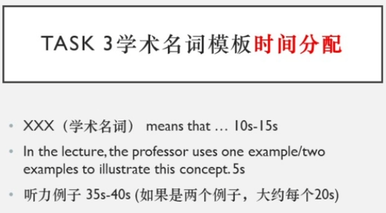

# 托福口语

## 考试感觉记录

考试次数|分数|考试感觉
-|-|-
1|18|首考
2|22|初步练习，流畅了一些，但结尾剩余时间较多，靠后的采分点说的少
3|19|进一步练习，更加流畅，细节更多，但靠后的采分点说的少，有个答案甚至被截断

**只讲重点！只讲重点！只讲重点！不重点的细节别TM讲，浪费时间**

Part 2 **开头概述文章内容只讲核心！别讲细节！浪费时间**
Part 2 **主要讲听力内容！**

## Part 1

逻辑三段式：
1. 结论
2. 细节/例证
3. 结论

逻辑要求没有非常高，主要是能说

### 话题分类准备

**1找词2拼句**

#### 教育

* 问：Your university is organizing a series of guest lectures. Some people think that speakers with controversial opinions should not be invited to speak at the university. Others believe that the university should feature a variety of speakers, regardless of their opinions. Which point of view do you agree with? Explain why, using details and examples in your response.
* 纲：
  * 总：表明观点
  * 分：促进批判性思维
    * places for open debate
    * receive opinions from different directions
    * develop critical thinking
  * 分：维护学术自由
    * promote free speech
    * academic freedom
    * becoming echo chambers
    * express opinions
    * scientific progress
  * 总：不能限制演讲内容
* 答：
  * 总：I think speakers with controversial opinions should not be prevented from speaking at university. 
  * 分：Universities are **places for open debate**. Students should receive opinions from different directions, which can help them develop **critical thinking** skills in the debates. 
  * 分：Also, universities have a responsibility to **promote free speech** and **academic freedom**. If not, they risk **becoming echo chambers**, and only certain opinions are allowed to be expressed, which is not good for scientific progress. 
  * 总：So universities should not limit the speakers to expressing their opinions.

* 问：Some professors allow students who have not done well on graded assignments during a course to do additional assignments in order to improve their overall course grade. Do you think this is a good idea?
* 纲：
  * 总：表明观点
  * 分：促进学生学习
    * filter the students
    * stimulate their understanding of the knowledge
    * comprehend the course content
    * encourage them to gain a better understanding
  * 分：成绩不好不代表学的不好
    * doesn't necessarily imply
    * lacks comprehension of the course material
    * demonstrate their understanding
* 答：
  * 总：I think this is a good idea. 
  * 分：The aim of assignments should not be to **filter the students** but to **stimulate their understanding of the knowledge**. Students who receive low grades may not fully **comprehend the course content**. Therefore, providing additional assignments can be a way to **encourage them to gain a better understanding** of the material. 
  * 分：Besides, a **low grade doesn't necessarily imply that the student lacks comprehension** of the course material. They may only not feel well during the exam or have other issues. Additional assignments can **demonstrate their understanding** of the course material.

* 问：Some people think that schools should assign projects and other work for students to complete over vacation before the beginning of the school year. Others think that schoolwork should only be assigned during the actual academic year. Which opinion do you agree with?
* 纲：
  * 总：表明观点
  * 分：提前熟悉内容
    * comprehend the course content
    * learn more effectively
  * 分：保持学习状态
    * stay engaged with academic work
    * keep minds active
  * 总：可以使学生准备好新学期
    * well-prepared for the incoming term
* 答：
  * 总：I think assigning projects for students to complete over vacation is a good idea. 
  * 分：First, assigned projects during the vacation would encourage students to **comprehend the course content** before the new term begins, which would help them **learn more effectively** in the incoming term. 
  * 分：Second, when students are given tasks to complete during their vacation time, they are more likely to stay engaged with their academic work and keep their minds active. 
  * 总：Therefore, assigning projects on vacation would make students **well-prepared for the incoming term**, so it is a good idea.

* 问：When you have problems with schoolwork, would you ask for help or favor from your friends who have the relevant information/knowledge or professional tutors?
* 纲：
  * 总：表明观点
  * 分：教授不容易见到，同学容易见到
    * make an appointment
    * meet at his or her office time
  * 分：自己解决问题才叫学习，大部分问题都能解决
    * way to comprehend the course content
    * discussion promoted my understanding of the knowledge
* 答：
  * 总：I will first discuss this with my friends.
  * 分：Most importantly, it is much easier to meet my friends than meet our professor. I can meet my friends every day, but for the professor, I should make an appointment and can only meet at his or her office time. You know, professors are busy and difficult to meet.
  * 分：Another reason is that I believe solving the problem by ourselves in schoolwork is the way to comprehend the course content. Our professor should know that and take time to design the schoolwork. In my case, most of the problems can be solved by discussing with classmates, and this discussion promoted my understanding of the knowledge.

* 问：It is necessary to have a good teacher for students to learn new knowledge and skills.
* 纲：
  * 总：表明观点——好老师
  * 分：好老师对知识的理解更加深入，从而帮助学生学得更快
    * deeper insight into the knowledge
    * help students learn more effectively
  * 分：好老师有更好的经验，有书本上学不到的知识，用工科举例，用反面填充细节
    * learning by themselves in practice

* 问：You need to take a history class as part of your graduation requirements, and you have two choices that fit into your schedule. In both classes, only the professor gives a grade to the research papers. However, in one of the classes, the students also read and provide feedback for other students’ papers. Which class would you prefer to take?
* 纲：
  * 总：表明观点——from other students’ papers
  * 分：获取更加丰富的知识
    * filter the students
    * stimulate their understanding of the knowledge
    * learn from other students paper
    * enhance the comprehension of course content
  * 分：增加交流
    * interaction among students
    * students may find interesting papers and discuss with other students
    * lead to meaningful class discussions

* 问：Some high schools require students to pass a physical fitness exam, in which they are tested on their ability to perform certain physical activities, such as running and swimming, in order to graduate. Do you think this is a good idea?
* 纲：
  * 总：is a good idea
    * 分：保持身体健康，预防疾病
      * add physical fitness exam can stimulate their exercise
      * exercise become their habit
      * prevent them from common diseases, especially obesity
    * 分：运动让人心情舒畅，更有利于学习，养成习惯更有利于日后工作
      * research shows exercise can help students learn more efficiently
      * add physical fitness exam will help them with their study works

#### 人际
#### 工作

* 问：Do you prefer to accept a job that pays well or a job that offers higher personal satisfaction but doesn't pay well?
* 找词：
  * 总：表明观点——要钱
  * 分：找工作不能只考虑自己的兴趣，更重要的是给家人更好的生活
    * interest should not be the only factor
    * earn money
    * provide a better life for my family
  * 分：兴趣会变化，有钱可以支持其他兴趣
    * job that offers higher personal satisfaction cannot always offers personal satisfaction
    * interest may change
    * earn more money can support other interest

* 问：Do you think employees should finish multiple tasks simultaneously or concentrate on one task and complete it as perfectly as possible?
* 找词：
  * 总：表明观点——专注
  * 分：人的精力是有限的，同时做多个事效率低下，容易累
    * human attention is limited
    * working on multiple tasks simultaneously will decrease efficiency
    * easily become tired
  * 分：把事情做好更有利于公司发展，服务质量对公司更重要
    * In the contract
    * concentrate on one task let people do better
    * it is good for the company
    * give better services to the customers, therefore customers are more likely to choose at next time
  * 总：Therefore, concentrate on one task is not only beneficial for ourselves, but also beneficial for our company

* 问：Some people prefer to finish a task as quickly as possible while others like to take their time to do the task. Which do you prefer?
* 纲：
  * 总：prefer finish a task as quickly as possible
  * 分：做更重要的事，陪伴家人
    * task is not all of our life
    * cannot help us 
  * 分：增加工作效率
    * we are thinking about how to improve working efficiency
    * we will propose some methods to improve working efficiency
    * help other people improve
    * help our company
总：Therefore, finishing a task as quickly as possible is not only beneficial for ourselves, but also beneficial for our company

#### 娱乐
#### 生活

## Part 2 

According to the announcement / proposal / letter ...

The student (does not) think this is a great idea for two reasons.

First, he/she mentions that ... Because ... Therefore, ...

Besides, he/she also mentions that ... Because ... As a result, ...

### 逐字稿练习记录

#### Official 50 Speaking 3

The men agree with the opinion since

At first, he thinks this is a waste of money. He thinks the money should be used for more valuable projects. He mentioned a library project that stuck for a long time, which disappointed him and his friends.

Second, he thinks this is not good for the sky environment. It will bother the telescope that sees the star in the sky. This is related to an astronomy project, without this they can only see the stars in the textbook.

#### Official 66 Speaking 2

##### 范例

In the reading, the student proposes that the university should prohibit students from playing sports on the dining hall lawn because this will make the grass look nicer and instead, students can use the field next to the gym as a substitute. In the listening, the woman totally disagrees with this proposal because she thinks that the students who play sports aren’t the ones who are responsible. In fact, everybody crosses the lawn every day since it is centrally located. And they don't even bother walking on the sidewalks because usually people are in a hurry to get to class. On top of that, the substitute is not very good since in order to use that, students need to walk for a long distance. But actually, sometimes they just want to have a little fun in between classes. So they will not bother going that far.

##### 踩分点

* Reading
  * the university should ban sports on the grass in front of the hall
    * make the grass look nicer
  * use the field next to the gym for sport
* Listening
  * ban sports does not make sense
    * import way in university
    * lots of people go through there every day
    * ban sports cannot make things better
  * gym is inconvient
    * far away
    * people just want little fun between class

#### Official 63 Speaking 2

##### 范例

In the reading, the University announces that students who are going to graduate will be able to use a new degree Navigator website to keep track of their requirements because this will make it easier for them to check the progress online and at the same time reduce the workload for academic advisers. In the listening, the man totally agrees with the announcement, because he says that students need to deal with a lot of classes for degree programs and it's easy for them to make a mess. Sometimes they even miss particular courses just like his friend whose graduation was delayed just because he didn't realize that he hadn't finished his history degree. Also, he thinks that the advisers who are mostly professors are really busy working, so this website will free them from redundant tasks and have more time to focus on serious things, like switching a major or doing internships.

##### 踩分点

* Reading
  * new website
    * keep track of their course
  * easier for them to check the progress
  * reduce the workload for academic advisers
* Listening
  * miss course
    * lots of courses
    * difficult to organize
    * example: friend miss a course and graduation was delayed
  * advisers who are mostly professors
    * busy working
    * free them from redundant tasks
    * more time to focus on serious things
      * switching a major
      * doing internships

## Part 3

一篇阅读+听力里两个例子

初学起步120词，最多不能超过150词

The reading talks about the term of ..., which refers to ...

First, he/she mentions that ... For example

Second, he/she also mentions that

### 记笔记

记逻辑，逻辑只有两种重要：对比/因果

重点听因果和逻辑

避免3秒以上停顿

### 逐字稿练习记录

#### Official 43 Speaking 4

##### 初版

The lecture is about the factors that affect the population of species. The professor gave two examples to indicate how biotic and abiotic factors affect the population.

The first is about mase and awes. Mase is eaten by the awes, so when the population of awes increases, the population of Mase will drop.

The second is about the rabbit and winter. Since rabbits will reproduce in the spring, if the winter is short, rabbits will begin reproduction earlier, so the population will increase.

##### 改进

The lecture is about the factors that affect the population of species. The professor gave two examples to indicate how biotic and abiotic factors affect the population.

The first is about mise and owls. Mise is eaten by the owls, so the number of mice depends upon the number of owls. When the population of owls increases, the population of mise will drop.

The second is about the rabbit and winter. Rabbits have their young at the end of the winter and keep reproducing until the next winter. So if there is a year that winter is short, the rabbits will start reproducing earlier and reproduce more rabbits.

##### 纲

* 总
  * 影响物种数量的两个因素
  * professor给了biotic和abiotic两个例子
* 分
  * mise and owls
  * 被吃，所以种群数量依赖
  * 🦅多吃得多mise少
* 分
  * rabbit and winter
  * rabbit在winter末期生育
  * winter短rabbit生的多

#### Official 44 Speaking 4

The agonistic behavior is that when animals have conflict on food, they will participate in a competition and show their strength, without harming each other.

The professor takes rattlesnakes as example. When two rattlesnakes found the same hole, and both of them want to own it, they will make their body seen as tall as possible and push each other, but they will not bite each other. When one pushes the other rattlesnake to the ground, it will just release the other.

## Part 4

In the lecture, the professor talks about xxx, which is ...

First, the professor discusses...

Second, he/she further discusses ...

### 逐字稿练习记录

#### Official 53 Speaking 6

##### 初版

The professor introduced two ways to prevent food from spoil. 

The first is about temperature. Foods get spoiled mainly because of bacteria. When the temperature is low, bacteria will grow slower. The professor takes fish as the example. When fish is frozen, it will last long, because bacteria grow slowly in low temperature. 

The second is about moisture. Moisture is important to the growth of bacteria, bacteria cannot grow without it. The professor takes milk as example. Power milk last longer than liquid milk. Since the moisture is removed, bacteria cannot grow.

#### Official 44 Speaking 6

The professor introduced two ways that animals can benefit from forest fires.

First is that forest fires help predators to find food