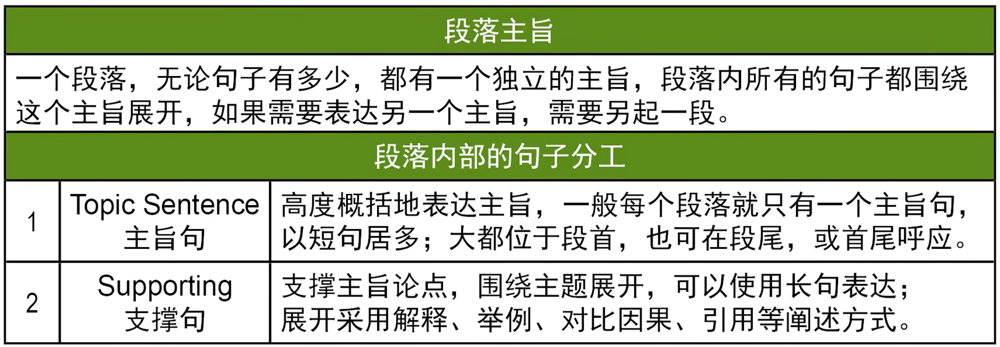
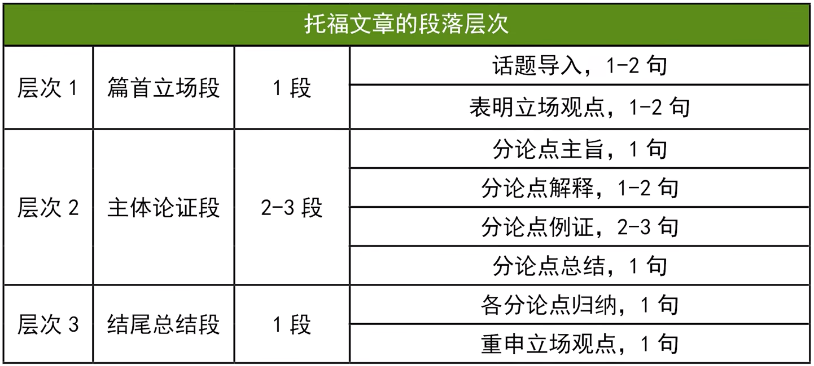
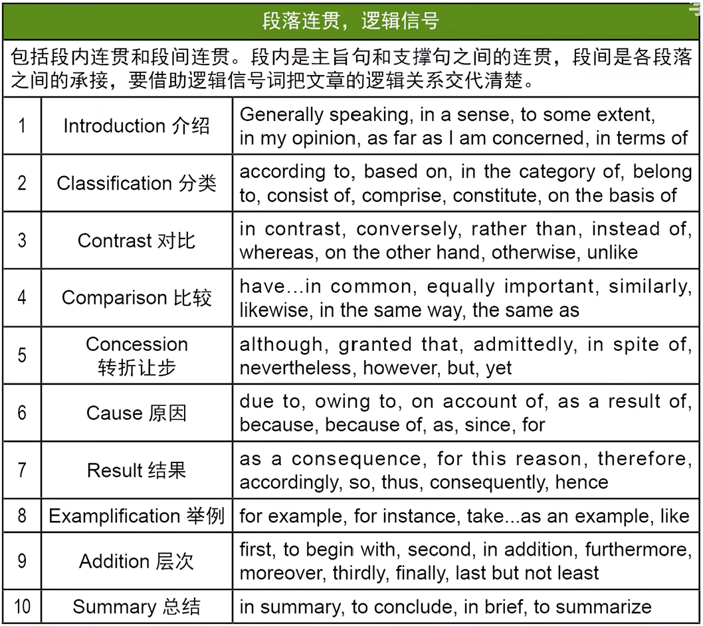

# 托福写作

## 考试感觉记录

考试次数|分数|综合写作感觉|独立写作感觉
-|-|-|-
1|22|首考没啥感觉|People in the past are more friendly than people today.
2|18|没怎么练习，不知为何成绩会降低，可能是听力听的不够懂|通过哪种方式is better to provide children with exciting new experiences that stimulate their minds
3|24|尽量听全写全了所有细节，每段最后都有总结句|卡点交卷，没时间检查；逻辑有点绕，论据对论点支持不太好，但每段最后都有总结句，最后忘记点题
4|21|尽量听全写全了所有细节，但仍有要点遗漏，仅部分段最后都有总结句|卡点交卷，没时间检查；逻辑有点绕，论点不太好，仅部分段最后都有总结句，最后点题比较好

**每段最后都加个总结句！**

When we browse education reports from major media, especially around graduation season, employment ranking may raise, which is referred to as a talent competition. Career planning among the topics of modern education, has always been a subject of hot debate. Taking into account the need for employment, some people propose that schools should only teach subjects that will be crucial for students seeking jobs. However, I reject this notion and instead believe that schools should cultivate students' talents through a wide range of subjects.

## 练习记录

### 2023.4.15 下午场

Some people prefer to go shopping in a big supermarket because they think it is more convenient. Some people prefer to go shopping in small stores owned by local merchants to support the local community because most of the items are local products. Which do you prefer? Explain why.

#### 纲

* local community is relatively small, cannot produce 
* quality is unstable, should spend a lot of time to search and find stores with good quality
* big supermarket have more product, stable quality, save time

#### 文

Market is always playing a significant role in our daily life. Some people prefer small stores owned by local merchants while other people are more likely to go shopping in big supermarket. From my perspective, big supermarket is a better choice for shopping.

The most important reason is that local merchants cannot guarantee the quality. Most goods in big supermarket come from big factory, where huge machines manufacture thousands of productions with stable quality. However, 
differ from

Purchasing goods from local merchants do give support local community, however, 