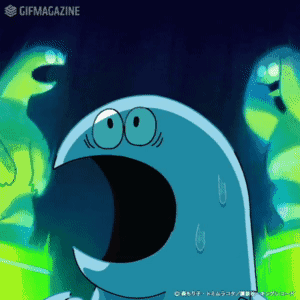

# 【转载】核战保命概述

1. 现在大型超市商场和小区的地下停车场都有人防功能，有人防功能的会专门在门口路边立一个竖牌。平时尽量观察自己家小区和周边有没有人防指示牌。人防在全封闭状态下是可以隔绝核危害的。
2. 以现在大城市的建筑规模，一颗核弹造成的杀伤范围其实并不大。美国洲际导弹上的三类核弹头，爆炸当量为10万吨、34万吨和47.5万吨，可以看出破坏面都在十公里以内，有高楼大厦的情况下直接杀伤范围还会进一步减小。然后即便是大城市也会主要朝重要的战略要地投放，何况我们的CTMD还能拦一部分。所以是有机会逃命的，不要不珍惜。
3. 建议率先打开手机地图，快速扫一眼你周围的重要公共设施，包括大型工厂化工厂、发电站、水坝、大桥、三甲医院等。这些地方很可能是第一轮率先受到打击的位置。美国战略核弹头的偏心率都不到五百米，还算比较准的。如果你是三线城市且没有重要军工矿业，可能只有机会在市中心收到一发核弹，住在县城就更幸运了，甚至都没你啥事。我虽然住在四线城市但这里还有特种汽车厂……估计会多挨几发了。
4. 带上手机、充电器去人防工程，有手电筒和一瓶矿泉水甚至压缩饼干就更完美了。戴手机干啥？一是可以看时间，可以拍照、留下文字和语音记录，二是如果后续没有太空战的话，只要军区运来一个人工基站，你的手机信号就又能恢复啦。人防设施很可能不会关门，尽量去离入口最远的角落或者柱子后面。千万不要看入口。靠墙蹲下，双手捂耳，用嘴呼吸，等待冲击波。
5. 只要核弹爆炸点没在你一公里范围内，你就有机会活命。三公里开外，甚至可能不会受伤。这时候你的耳膜可能已经破了，不要紧，这是小伤，内脏潜在的破裂风险才是最危险的，可惜现在没有给你拍CT的条件。
6. 哦对了，我是不是忘记让你带消炎药了……这一定要带上。因为此时电网被破坏，人防设施里一片黑，别惊慌，让眼睛适应黑暗。找门卫大爷关掉人防的大门，避免核辐射尘进入。
7. 这时候你还没死的话，那么恭喜你，你至少能多活一周。可以先等待一下，看一小时内是否还有核弹到来。来的核弹越少，说明核战规模越低，对城市的破坏也越有限。如果你不是求生专家，我不建议走出人防。如果有救援队到来，那么你就能多活三个月，甚至又获得新生，视核战争的后续发展决定。请配合当地的党员们，积极参与城市重建吧。​