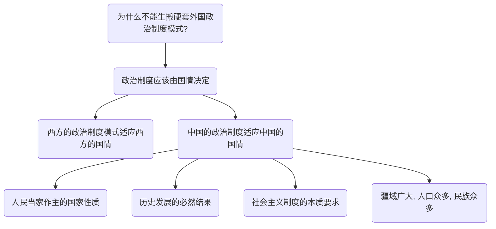
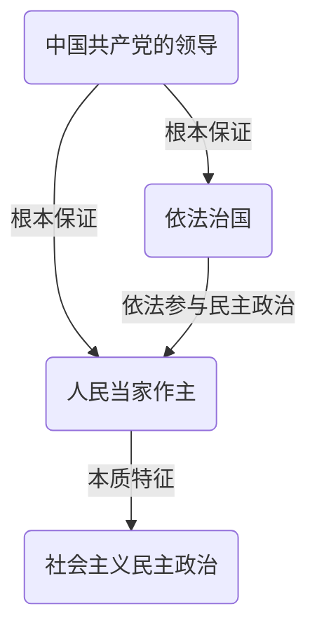

# 中国特色社会主义理论与实践研究复习

## 导论

### 1. 如何理解中国特色社会主义是改革开放以来党的全部理论和实践的主题？

* **中国特色社会主义是马克思理论中国化的宝贵成果**：中国特色社会主义，是根植于中国大地、反映中国人民意愿、适应中国和时代发展进步要求的科学社会主义，是党和人民历经千辛万苦取得的宝贵成果，是改革开放以来党的全部理论和实践的主题，是当代中国发展进步的根本方向。
* **中国特色社会主义具有深厚的历史渊源和广泛的现实基础**：中国特色社会主义是中国共产党人把马克思主义基本原理与当代中国实际和时代特征相结合的产物，是科学社会主义理论逻辑和中国社会发展历史逻辑的辩证统一，具有深厚的历史渊源和广泛的现实基础。
* **中国特色社会主义贯穿了改革开放以来全部的理论和实践**：中国特色社会主义是在改革开放新时期开创的，贯穿于改革开放以来党的全部理论和实践之中。从党的十二大以来历次党代会报告的题目及其内容可以看出，改革开放以来党的全部理论和实践都是在发展进程中对中国特色社会主义这一主题的深化和拓展。
* **中国特色社会主义道路已经越走越宽**：围绕中国特色社会主义，中国共产党不断推动理论创新和实践创新，中国特色社会主义道路越走越宽广，中国特色社会主义理论体系更加丰富，中国特色社会主义制度不断健全，中国特色社会主义文化繁荣发展。只有在中国特色社会主义伟大旗帜下，才能最大限度地团结和凝聚全国各族人民，为实现中华民族伟大复兴而共同奋斗。

### 2. 如何把握习近平新时代中国特色社会主义思想的丰富内涵？

* 四个全面
  * 全面建成小康社会
  * 全面深化改革
  * 全面依法治国
  * 全面从严治党
* 主要矛盾：人民日益增长的美好生活需要和不平衡不充分的发展之间的矛盾
* 总体布局——五位一体、战略布局——四个全面
  * 道路自信、理论自信、制度自信、文化自信
* 大国外交：
  * 推动构建新型国际关系
  * 推动构建人类命运共同体

#### 八个明确

* 第一，明确坚持和发展中国特色社会主义，总任务是实现社会主义现代化和中华民族伟大复兴，在**全面建成小康社会**的基础上，分两步走在本世纪中叶建成**富强民主文明和谐美丽的社会主义现代化强国**；
* 第二，明确新时代我国社会主要矛盾是**人民日益增长的美好生活需要和不平衡不充分的发展之间的矛盾**，必须坚持以人民为中心的发展思想，不断促进人的全面发展、全体人民共同富裕；
* 第三，明确中国特色社会主义事业**总体布局是“五位一体”**、**战略布局是“四个全面”**，强调坚定道路自信、理论自信、制度自信、文化自信；
* 第四，明确**全面深化改革**总目标是完善和发展中国特色社会主义制度、推进国家治理体系和治理能力现代化。
* 第五，明确**全面推进依法治国**总目标是建设中国特色社会主义法治体系、建设社会主义法治国家；
* 第六，明确党在新时代的强军目标是建设一支**听党指挥、能打胜仗、作风优良**的人民军队，把人民军队建设成为世界一流军队；
* 第七，明确中国特色大国外交要推动**构建新型国际关系**，推动**构建人类命运共同体**；
* 第八，明确中国特色社会主义最本质的特征是**中国共产党领导**，中国特色社会主义制度的最大优势是中国共产党领导，党是最高政治领导力量，提出新时代党的建设总要求，突出政治建设在党的建设中的重要地位。

#### 十四个坚持

* 坚持党对一切工作的领导。
* 坚持以人民为中心。
* 坚持全面深化改革。
* 坚持新发展理念。
* 坚持人民当家作主。
* 坚持全面依法治国。
* 坚持社会主义核心价值体系。
* 坚持在发展中保障和改善民生。
* 坚持人与自然和谐共生。
* 坚持总体国家安全观。
* 坚持党对人民军队的绝对领导。
* 坚持“一国两制”和推进祖国统一。
* 坚持推动构建人类命运共同体。
* 坚持全面从严治党。

## 第一章 中国特色社会主义进入新时代

### 1. 中国特色社会主义新时代的主要内涵和重大意义为何？

* **开辟了马克思主义中国化的新境界**：从马克思主义发展史的向度来说，习近平新时代中国特色社会主义思想开辟了马克思主义中国化的新境界。以一系列战略性的重大思想丰富和发展了马克思主义，是当代马克思主义，21世纪马克思主义（页20）。是对马克思列宁主义、毛泽东思想、邓小平理论、“三个代表”重要思想、科学发展观的继承和发展，是马克思主义中国化的最新成果，是中国特色社会主义理论体系的重要组成部分。
* **是党和人民实践经验和集体智慧的结晶**：从人类文明进步史的向度来看，习近平新时代中国特色社会主义思想是党和人民实践经验和集体智慧的结晶，为解决人类面临的共同难题贡献了中国智慧，提供了中国方案。
* **为实现中华民族伟大复兴而奋斗的行动指南**：从中华民族复兴史的向度来说，习近平新时代中国特色社会主义思想是全党全国人民为实现中华民族伟大复兴而奋斗的行动指南。在这一思想指引下，中国人民实现了精神上的主动，比以往任何时候更有信心和能力完成新时代党的历史使命，实现国家富强、民族振兴、人民幸福的中国梦。

### 2. 如何理解我国社会主要矛盾的转化及其影响？

党的十九大作出了我国社会主要矛盾已经转化为**人民日益增长的美好生活需要与不平衡不充分的发展之间的矛盾**这一论断。

#### 影响

* **发展任务的变化**：社会主要矛盾的变化，意味着解决发展的不平衡、不充分的问题，满足人民日益增长的美好生活需要，将成为中国特色社会主义新时代的主要任务。
* 对党和国家工作带来新要求：主要矛盾的变化及其表现出的全局性特点，对党和国家工作提出了许多新要求
  * 更好地贯彻以人民为中心的发展思想；
  * 进一步从全局的高度思考和谋划党和国家的工作；
  * 把当前任务和长远目标结合起来。

## 第二章 新时代中国共产党的历史使命

### 1. 如何理解中国共产党人的初心和使命？

中国共产党的初心和使命，就是**为中国人民谋幸福，为中华民族谋复兴**。

**中华民族伟大复兴是近代以来中华民族最伟大的梦想$\rightarrow$中国共产党自成立之初就以中华民族伟大复兴为己任$\rightarrow$中国共产党抱着这一梦想实现了许多奇迹$\rightarrow$中国共产党是民族复兴使命的合格担当者**

* 实现中华民族伟大复兴，是近代以来中华民族最伟大的梦想。中国共产党一经成立，就把实现共产主义，最为党的最高理想和最终目标，就把为人民谋幸福、为中华民族谋复兴确立为自己的初心，义无反顾地肩负起实现中华民族伟大复兴的历史使命，团结带领人民进行了艰苦卓绝的斗争，谱写了气吞山河的壮丽史诗。中国共产党的初心和使命，是由其性质和宗旨决定的。历史已经证明，中国共产党是民族复兴使命的合格担当者。

### 2. 如何认识新时代战略安排的重大意义？

新时代的战略安排，是党中央围绕未来30多年中国特色社会主义发展目标作出的重大战略部署，描绘了决胜全面建成小康社会、进而全面建成社会主义现代化国家的宏伟蓝图。

* **指明了前进方向**：第一，进一步丰富和发展了我国现代化建设的战略思想，完整科学地勾画了全面建成社会主义现代化强国的时间表和路线图，为新时代坚持和发展中国特色社会主义指明了前进方向。
* **激励中国人民建设社会主义现代化强国的热情和力量**：第二，新时代战略安排将人民对美好生活的向往落实在具体战略和实际工作中，必将激励中国人民焕发出建设社会主义现代化强国的热情和力量。
* **彰显了制度优势和党治国理政的能力**：第三，充分彰显了中国特色社会主义的制度优势和中国共产党治国理政的能力，对于其他发展中国家实现现代化具有重要借鉴意义。

## 第三章 中国特色社会主义经济建设

### 1. 为什么要把发展经济的着力点放在实体经济上？

实体经济是国家强盛的支柱，对经济发展、就业和人民实际生活水平有着重要影响$\rightarrow$推进供给侧结构性改革必须

* **实体经济是国之根基**：实体经济是一国经济中提供商品和服务、用以满足人们生活和生产需要的经济组成部分，是一国经济的立身之本，是财富创造的根本源泉，是国家强盛的重要支柱。实体经济对于经济发展、就业和人民实际生活水平有着重要影响。
* **推进供给侧结构性改革需要实体经济**：推进供给侧结构性改革，必须把提高供给体系质量作为主攻方向，把发展经济的着力点放在实体经济上。
* **抓住时代机遇需要实体经济**：这是党中央立足全局、面向未来的重大战略决策，对于我国抓住新一轮科技革命和产业变革机遇、打造国际竞争新优势，具有十分重大的意义。

### 2. 如何理解“一带一路”建设对推动形成全面开放格局的意义？

* “一带一路”建设是我国扩大对外开放的重大举措和经济外交的**顶层设计**；
* “一带一路”建设是为**破解人类发展难题**提供的中国智慧和中国方案；
* “一带一路”建设是**探索全球经济治理新模式**、**构建人类命运共同体**的新平台；
* “一带一路”建设是新时代中国特色社会主义的伟大**开放实践**。

## 第四章 中国特色社会主义政治建设

### 1. 为什么不能生搬硬套外国政治制度模式？

各个国家实行什么样的政治制度，是由各个国家的国家性质和国情决定的，是各个国家在其本国历史传统、文化传统、经济社会发展的基础上长期发展、渐进改进、内生性演化的结果，是各个国家在一定社会发展阶段和特定历史条件下解决特定政治问题的产物，有其自身形成发展的独特规律。

* 西方政治制度模式是西方国家在其长期的历史发展过程中形成的。
* 当代中国的政治制度与我国人民当家作主的国家性质相适应。
* 发展和完善我国社会主义政治制度，需要借鉴国外政治文明的有益成果，但绝不能放弃中国政治制度的根本。
* 中国现行的政治制度是近代以来中国历史发展的必然结果，体现了社会主义制度的本质要求，同中国经济、政治、文化、社会状况相适合，也同中国疆域广大、人口众多、民族众多等实际状况相适应，符合中国国情。

### 2. 如何认识党的领导、人民当家作主和依法治国的统一性？

* **这种统一性是中国特色社会主义政治发展的必然要求**：坚持党的领导、人民当家作主和依法治国的有机统一是中国特色社会主义政治发展的必然要求。坚持走中国特色社会主义政治发展道路，关键是要坚定不移地坚持中国共产党的领导、人民当家作主和依法治国的有机统一。这既体现了社会主义国家政权的性质和社会主义民主的性质，也是被实践证明了符合中国实际的正确的政治发展道路。
* **中国共产党的领导是人民当家作主和依法治国的根本保证**。
* **人民当家作主是社会主义民主政治的本质特征**。
* 三者关系：依法治国，就是广大人民群众**在中国共产党的领导下**，**依照宪法和法律规定**，通过各种途径和形式**管理国家事务、管理经济文化事业、管理社会事务**，保证国家各项工作都依法进行，加快建设社会主义法治国家。

党的领导、人民当家作主和依法治国是一个相辅相成的有机整体，三者**统一于我国社会主义民主政治伟大实践**。

## 第五章 中国特色社会主义文化建设
### 1. 怎样认识培育和践行社会主义核心价值观的重要意义？

* **社会主义核心价值观是中华民族赖以维系的精神纽带**：社会主义核心价值观，以富强、民主、文明、和谐，自由、平等、公正、法治，爱国、敬业、诚信、友善为主要内容。是中国特色社会主义的价值表达，是我国社会共同的思想道德基础。是当代中国精神的集中体现，是中华民族赖以维系的精神纽带。
* 培育和践行社会主义核心价值观，是**新时代坚持和发展中国特色社会主义的重大任务**。
* **是新时代发展的重要组成部分**：培育和践行社会主义核心价值观，是进行伟大斗争、建设伟大工程、推进伟大事业、实现伟大梦想的铸魂工程。
* **是民族精神的战略支撑**：培育和践行社会主义核心价值观，是在世界文化激荡中保持民族精神独立、挺起民族精神脊梁的战略支撑。

### 2. 怎样理解讲好中国故事，提高国家文化软实力？

* 讲什么：
  * **中国特色社会主义的故事**：讲好中国故事，是要讲好中国特色社会主义的故事，更加鲜明地展现中国理论、中国道路的独特内涵和世界意义，特别是要讲清楚习近平新时代中国特色社会主义思想这一原创性、时代性的21世纪马克思主义，讲清楚中国特色社会走义进入新时代在世界社会主义发展史和人类社会发展史上的意义。
  * **中国梦的故事**：讲好中国故事，是要讲好中国梦的故事，讲清楚中国梦意味着中国人民和中华民族的价值体现和价值追求，意味着全面建成小康社会、实现中华民族伟大复兴，意味着每一个人都能在为中国梦的奋斗中实现自己的梦想，意味着中华族为人类和平与发展以及解决世界难题作出更大贡献的真诚意愿。
  * **中华优秀传统文化故事**：讲好中国故事，是要讲好中华优秀传统文化故事，特别是讲清楚有着5000多年历史的中华文明对“和”文化的崇尚，讲清楚“以和为贵”“和而不同”“天下大同”等中华文化理念，讲清楚对和平、和陸、和谐的追求深深植根于中华民族的精神世界和文化基因之中。
  * **中国和平发展的故事**：讲好中国故事，还要讲好中国和平发展的故事，讲清楚中国将始终做世界和平的建设者、全球发展的贡献者、国际秩序的维护者，要充分展示中国历史底蕴深厚、各民族多元一体、文化多样和谐的文明大国形象，充分展示中国为人类作出贡献的负责任的社会主义大国形象。
* 怎么做：
  * **创新形式**：讲好中国故事，要不断创新传播形式，创新对外话语表达方式。
  * **政府主导，多种方式**：坚持政府主导、企业主体、市场运作、社会参与，完善人文交流机制，创新人文交流方式，综合运用大众传播、群体传播、人际传播等多种方式，扩大对外文化交流，推动中华文化走向世界。
  * **建设国际传播能力**：着力推进国际传播能力建设，创新对外宣传方式，发挥好新兴媒体作用。
  * **与国际接轨**：精心构建对外话语体系增强对外话语的创造力、感召力、公信力，要研究国外不同受众的习惯和特点，采用融通中外的概念、范畴、表述，把我们想讲的和国外受众想听的结合起来，把“陈情”和“说理”结合起来，把自己讲和别人讲结合起来，使中国故事更多为国际社会和海外受众所认同。

## 第六章 中国特色社会主义社会建设

### 1. 保障和改善民生的主要内容有哪些？

* 优先发展**教育**事业。
* 提高就业质量和人民**收入**水平。
* 加强社会**保障**体系建设。
* 坚决打赢**脱贫**攻坚战。
* 实施**健康**中国战略。

### 2. 如何理解总体国家安全观的丰富内涵？国家安全工作包括哪些重点领域？

* 国家安全观**内涵**：
  * 坚持统筹**发展和安全**两件大事。
  * 坚持人民安全、政治安全、国家利益至上**有机统一**。
  * 坚持**维护和塑造**国家安全。
* 国家安全**工作领域**：
  * **政治**安全
  * **国土**安全
  * **经济**安全
  * **社会**安全
  * **网络**安全
  * **外部**安全

## 第七章 中国特色社会主义生态文明建设

### 1. 如何认识绿水青山就是金山银山？

改革开放成效显著但资源代价巨大$\rightarrow$要为人民创造良好生产生活环境$\rightarrow$生态优势转化为发展优势$\rightarrow$绿水青山非金山银山可以替代

改革开放以来，我国经济社会发展成效显著，但也付出了巨大的资源环境代价。面对资源环境瓶颈制约的日益突出，建设美丽中国，为人民创造良好生产生活环境，为全球生态安全作出贡献，必须树立和践行绿水青山就是金山银山的理念，将生态优势转化为发展优势。绿水青山就是金山银山体现着人与自然和谐共生的理念。金山银山固然重要，但绿水青山是人民幸福生活的重要内容，是金钱不能代替的。
* 绿水青山与金山银山**相辅相成、不可分割**。
* 绿水青山就是**生产力**。
* 绿水青山不仅是**经济问题**，也是**政治问题**。

### 2. 在现代化进程中为什么会出现先污染、后治理的现象？怎样建设人与自然和谐共生的现代化。

* 为什么会出现先污染、后治理的现象
  * **对环境和经济的认识在变化**：人们认识上的滞后性。在不同发展阶段，对生态环境和经济发展关系的认识不尽相同。
  * **发展模式**：传统现代化的发展模式为了短期的经济利益很少考虑环境的承载能力，过度索取资源。 
  * **监管力度不足**：地方政府和国家的监管力度不足。
* 怎样建设
  * 绿色工业：以绿色理念引领新型工业化。
  * 绿色农业：让绿色化贯穿农业现代化发展始终。
  * 绿色城市：让城市融入大自然。

## 第八章 坚持和平发展道路与构建人类命运共同体

### 1. 如何理解中国坚持走和平发展道路的意义？

* **避免武力扩张的老路**：中国和平发展打破了“国强必霸”的大国崛起传统模式，避免了那种建立殖民体系、争夺势力范围、对外武力扩张的资本主义发展的老路。
* **造福各国人民**：中国走和平发展道路，带给世界的是更多机遇。中国坚持把本国人民利益同各国人民共同利益结合起来，以更加积极的姿态参与国际事务，发挥负责任大国作用，共同应对全球性挑战。中国发展壮大，不仅造福中国人民，而且造福各国人民。
* **引导国际变革**：中国走和平发展道路，将推动国际力量对比朝着相对均衡的方向发展，引导国际格局演变和国际体系变革。

### 2. 如何理解构建人类命运共同体思想的内涵与意义？

#### 内涵

习近平“人类命运共同体”思想作为一个全新的发展理念，有着自身独特的内涵，其核心就是党的十九大报告所指出的，“建设持久和平、普遍安全、共同繁荣、开放包容、清洁美丽的世界”。这充分说明，我们要着重从**政治**、**安全**、**经济**、**文化**、**生态**等五个方面推动构建人类命运共同体。
* **政治**：对话协商，建设持久和平的世界；
* **安全**：共建共赢，建设普遍安全的世界；
* **经济**：合作共赢，建设共同繁荣的世界；
* **文化**：交流互鉴，建设开放包容的世界；
* **生态**：绿色低碳，建设清洁美丽的世界。

#### 意义

构建人类命运共同体思想顺应了历史潮流，紧扣和平与发展的时代主题，是凝聚各国共识、为人类社会实现共同发展、持续繁荣、长治久安所绘制的宏伟蓝图，是当代中国对世界的重要思想和理论贡献，已经成为中国引领时代潮流和人类文明进步方向的鲜明旗帜。
* 构建人类命运共同体思想是对新中国不同时期重大**外交思想和主张的继承和发展**；
* 构建人类命运共同体思想反映了中外优秀文化和全人类共同**价值追求**；
* 构建人类命运共同体思想适应了新时代**中国与世界关系的历史性变化**；
* 构建人类命运共同体思想指明了世界发展和人类未来的**前进方向**。

## 第九章 坚持党对一切工作的领导与全面从严治党

### 1. 如何正确认识新时代党的建设总要求？

#### 依据

* 坚持党对一切工作的领导，是对党的优良传统的继承和发展。
* 坚持党对一切工作的领导，是对党的十八大以来党和国家事业取得历史性成就成功经验的深刻总结。

#### 制度安排

* **组织体系**：党对一切工作的领导，是通过党的**组织体系来贯彻落实**的。
  * （党的组织体系包括中央组织、地方组织、基层组织、设在中央和地方的各级国家机关及其他非党组织中的党组。）
* **制度**：党对一切工作的领导，是通过党的**制度来保证实施**的。
  * （党的民主集中制、党的代表大会制度、党的委员会制度、请示报告制度等，是党的领导制度和组织制度的重要内容。）
* **领导和工作机制**：坚持党对一切工作的领导，还需要一整套**完善的领导体制和工作机制**。
  * （主要包括：领导和支持国家政权机关、人民政协、人民团体依法行使职权等。）
* **思想政治工作制度**：中国共产党还建立了完善的**思想政治工作制度**，不断加强和改进思想政治工作。

### 2. 如何推进全面从严治党向纵深发展？

* 把党的政治建设摆在首位。
* 思想建党和制度治党同向发力。
* 加强干部队伍建设和基层组织建设。
* 正风肃纪和反腐败斗争。
