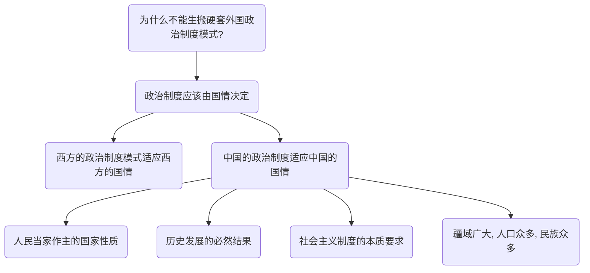
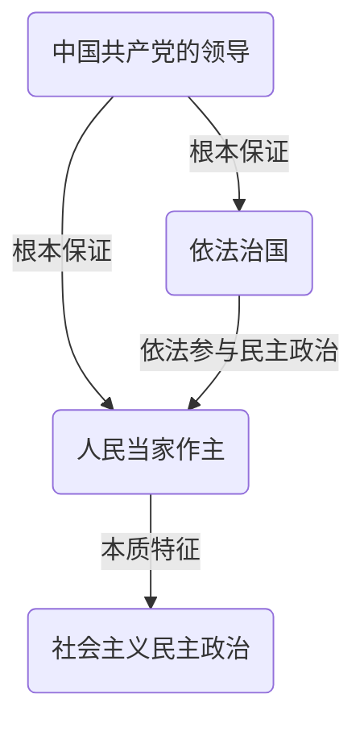

# 中国特色社会主义理论与实践研究复习

必然选择：
* 国情
* 传统文化
* 世界发展潮流
* 社会主义原则

意义：
* 中华民族伟大复兴
* 全球发展
* 经济建设
* 人民生活

## 导论

### 1. 如何理解中国特色社会主义是改革开放以来党的全部理论和实践的主题？

* **中国特色社会主义是马克思理论中国化的宝贵成果**：中国特色社会主义，是根植于中国大地、反映中国人民意愿、适应中国和时代发展进步要求的科学社会主义，是党和人民历经千辛万苦取得的宝贵成果，是改革开放以来党的全部理论和实践的主题，是当代中国发展进步的根本方向。
* **中国特色社会主义具有深厚的历史渊源和广泛的现实基础**：中国特色社会主义是中国共产党人把马克思主义基本原理与当代中国实际和时代特征相结合的产物，是科学社会主义理论逻辑和中国社会发展历史逻辑的辩证统一，具有深厚的历史渊源和广泛的现实基础。
* **中国特色社会主义贯穿了改革开放以来全部的理论和实践**：中国特色社会主义是在改革开放新时期开创的，贯穿于改革开放以来党的全部理论和实践之中。从党的十二大以来历次党代会报告的题目及其内容可以看出，改革开放以来党的全部理论和实践都是在发展进程中对中国特色社会主义这一主题的深化和拓展。
* **中国特色社会主义道路已经越走越宽**：围绕中国特色社会主义，中国共产党不断推动理论创新和实践创新，中国特色社会主义道路越走越宽广，中国特色社会主义理论体系更加丰富，中国特色社会主义制度不断健全，中国特色社会主义文化繁荣发展。只有在中国特色社会主义伟大旗帜下，才能最大限度地团结和凝聚全国各族人民，为实现中华民族伟大复兴而共同奋斗。

### 2. 如何把握习近平新时代中国特色社会主义思想的丰富内涵？

* 四个全面
  * 全面建成小康社会
  * 全面深化改革
  * 全面依法治国
  * 全面从严治党
* 主要矛盾：人民日益增长的美好生活需要和不平衡不充分的发展之间的矛盾
* 总体布局——五位一体、战略布局——四个全面
  * 道路自信、理论自信、制度自信、文化自信
* 大国外交：
  * 推动构建新型国际关系
  * 推动构建人类命运共同体

#### 八个明确

* 第一，明确坚持和发展中国特色社会主义，总任务是实现社会主义现代化和中华民族伟大复兴，在**全面建成小康社会**的基础上，分两步走在本世纪中叶建成**富强民主文明和谐美丽的社会主义现代化强国**；
* 第二，明确新时代我国社会主要矛盾是**人民日益增长的美好生活需要和不平衡不充分的发展之间的矛盾**，必须坚持以人民为中心的发展思想，不断促进人的全面发展、全体人民共同富裕；
* 第三，明确中国特色社会主义事业**总体布局是“五位一体”**、**战略布局是“四个全面”**，强调坚定道路自信、理论自信、制度自信、文化自信；
* 第四，明确**全面深化改革**总目标是完善和发展中国特色社会主义制度、推进国家治理体系和治理能力现代化。
* 第五，明确**全面推进依法治国**总目标是建设中国特色社会主义法治体系、建设社会主义法治国家；
* 第六，明确党在新时代的强军目标是建设一支**听党指挥、能打胜仗、作风优良**的人民军队，把人民军队建设成为世界一流军队；
* 第七，明确中国特色大国外交要推动**构建新型国际关系**，推动**构建人类命运共同体**；
* 第八，明确中国特色社会主义最本质的特征是**中国共产党领导**，中国特色社会主义制度的最大优势是中国共产党领导，党是最高政治领导力量，提出新时代党的建设总要求，突出政治建设在党的建设中的重要地位。

#### 十四个坚持

* 坚持党对一切工作的领导。
* 坚持以人民为中心。
* 坚持全面深化改革。
* 坚持新发展理念。
* 坚持人民当家作主。
* 坚持全面依法治国。
* 坚持社会主义核心价值体系。
* 坚持在发展中保障和改善民生。
* 坚持人与自然和谐共生。
* 坚持总体国家安全观。
* 坚持党对人民军队的绝对领导。
* 坚持“一国两制”和推进祖国统一。
* 坚持推动构建人类命运共同体。
* 坚持全面从严治党。

#### 意义

1. **是科学理论体系**：习近平新时代中国特色社会主义思想是一个系统完整、逻辑严密的科学理论体系，思想内涵十分丰富
2. **包括各种基本问题**：包括新时代坚持和发展中国特色社会主义的总目标、总任务、总体布局、战略布局和发展方向、发展方式、发展动力、战略步骤、外部条件、政治保证等各方面的基本问题，也包括对经济、政治、法治、科技、文化、教育、民生、民族、宗教、社会、生态文明、国家安全、国防和军队、“一国两制”和祖国统一、统一战线、外交、党的建设等各领域作出的理论分析和政策指导。
3. **回答了坚持什么样的发展路线**：习特色主要从理论和实践结合上系统回答了新时代坚持和发展什么样的中国特色社会主义、怎样坚持和发展中国特色社会主义这一重大时代课题。
4. **8+14**：其精神实质和丰富内涵，集中体现在党的十九大报告精辟概括的“八个明确”基本内涵和新时代中国特色社会主义“十四个坚持”基本方略之中。
5. **“八个明确”是理论层面的概括**：“八个明确”基本内涵偏重于新时代条件下理论层面的概括和凝练，集中反映了我们党对科学社会主义在当今时代的理论思考和理论贡献，主要从理论上回答“新时代坚持和发展什么样的中国特色社会主义”，是支撑整个思想体系的四梁八柱；
6. **“十四个坚持”是对方针政策的概括**：“十四个坚持”的基本方略涵盖对党的治国理政重大方针、原则的最新概括，是行动纲领层面的展开，主要从实践上回答“怎样坚持和发展中国特色社会主义”，是坚持和发展中国特色社会主义、实现中华民族伟大复兴的“路线图”和“方法论”。
7. “八个明确”基本内涵和“十四个坚持”基本方略相互融合、有机统一，共同组成习近平新时代中国特色社会主义思想体系，凝结着我们党对坚持和发展中国特色社会主义的**经验总结**，是对共产党执政规律、社会主义建设规律、人类社会发展规律**认识的深化、拓展和升华**。

## 第一章 中国特色社会主义进入新时代

### 1. 中国特色社会主义新时代的主要内涵和重大意义为何？

#### 主要内涵：承前启后、继往开来、全面建成小康社会、为人类作出更大贡献

#### 重大意义：中国的前景光明、社会主义充满生机活力、走向现代化的途径

### 2. 如何理解我国社会主要矛盾的转化及其影响？

党的十九大作出了我国社会主要矛盾已经转化为**人民日益增长的美好生活需要与不平衡不充分的发展之间的矛盾**这一论断。

#### 影响：发展任务的变化、工作要求的变化

* **发展任务的变化**：社会主要矛盾的变化，意味着解决发展的不平衡、不充分的问题，满足人民日益增长的美好生活需要，将成为中国特色社会主义新时代的主要任务。
* **工作要求的变化**：对党和国家工作带来新要求：主要矛盾的变化及其表现出的全局性特点，对党和国家工作提出了许多新要求
  * 更好地贯彻以**人民为中心**的发展思想；
  * 进一步从**全局的高度**思考和谋划党和国家的工作；
  * 把**当前任务和长远目标**结合起来。

## 第二章 新时代中国共产党的历史使命

### 1. 如何理解中国共产党人的初心和使命？

中国共产党的初心和使命，就是**为中国人民谋幸福，为中华民族谋复兴**。

**中华民族伟大复兴是近代以来中华民族最伟大的梦想$\rightarrow$中国共产党自成立之初就以中华民族伟大复兴为己任$\rightarrow$中国共产党抱着这一梦想实现了许多奇迹$\rightarrow$中国共产党是民族复兴使命的合格担当者**

### 2. 如何认识新时代战略安排的重大意义？

新时代的战略安排，是党中央围绕未来30多年中国特色社会主义发展目标作出的重大战略部署，描绘了决胜全面建成小康社会、进而全面建成社会主义现代化国家的宏伟蓝图。

* **指明了前进方向、激励中国人民建设社会主义现代化强国的热情和力量、彰显了制度优势和党治国理政的能力**

## 第三章 中国特色社会主义经济建设

### 1. 为什么要把发展经济的着力点放在实体经济上？

* **实体经济是国之根基**：实体经济是一国经济中提供商品和服务、用以满足人们生活和生产需要的经济组成部分，是一国经济的立身之本，是财富创造的根本源泉，是国家强盛的重要支柱。实体经济对于经济发展、就业和人民实际生活水平有着重要影响。
* **推进供给侧结构性改革需要实体经济**：推进供给侧结构性改革，必须把提高供给体系质量作为主攻方向，把发展经济的着力点放在实体经济上。
* **抓住时代机遇需要实体经济**：这是党中央立足全局、面向未来的重大战略决策，对于我国抓住新一轮科技革命和产业变革机遇、打造国际竞争新优势，具有十分重大的意义。

### 2. 如何理解“一带一路”建设对推动形成全面开放格局的意义？

* “一带一路”建设是我国扩大对外开放的重大举措和经济外交的**顶层设计**；
* “一带一路”建设是为**破解人类发展难题**提供的中国智慧和中国方案；
* “一带一路”建设是**探索全球经济治理新模式**、**构建人类命运共同体**的新平台；
* “一带一路”建设是新时代中国特色社会主义的伟大**开放实践**。

## 第四章 中国特色社会主义政治建设

### 1. 为什么不能生搬硬套外国政治制度模式？

各个国家实行什么样的政治制度，是由各个国家的国家性质和国情决定的，是各个国家在其本国历史传统、文化传统、经济社会发展的基础上长期发展、渐进改进、内生性演化的结果，是各个国家在一定社会发展阶段和特定历史条件下解决特定政治问题的产物，有其自身形成发展的独特规律。

* **西方制度如何形成**：西方政治制度模式是西方国家在其长期的历史发展过程中形成的。
* **中国制度如何形成**：当代中国的政治制度与我国人民当家作主的国家性质相适应。
* **可以借鉴**：发展和完善我国社会主义政治制度，需要借鉴国外政治文明的有益成果，但绝不能放弃中国政治制度的根本。
* **必然结果**：中国现行的政治制度是近代以来中国历史发展的必然结果，体现了社会主义制度的本质要求，同中国经济、政治、文化、社会状况相适合，也同中国疆域广大、人口众多、民族众多等实际状况相适应，符合中国国情。

### 2. 如何认识党的领导、人民当家作主和依法治国的统一性？

**这种统一性是中国特色社会主义政治发展的必然要求**：坚持党的领导、人民当家作主和依法治国的有机统一是中国特色社会主义政治发展的必然要求。坚持走中国特色社会主义政治发展道路，关键是要坚定不移地坚持中国共产党的领导、人民当家作主和依法治国的有机统一。这既体现了社会主义国家政权的性质和社会主义民主的性质，也是被实践证明了符合中国实际的正确的政治发展道路。
* **中国共产党的领导是人民当家作主和依法治国的根本保证**。
* **人民当家作主是社会主义民主政治的本质特征**。
* 三者关系：依法治国，就是广大人民群众**在中国共产党的领导下**，**依照宪法和法律规定**，通过各种途径和形式**管理国家事务、管理经济文化事业、管理社会事务**，保证国家各项工作都依法进行，加快建设社会主义法治国家。

党的领导、人民当家作主和依法治国是一个相辅相成的有机整体，三者**统一于我国社会主义民主政治伟大实践**。

## 第五章 中国特色社会主义文化建设
### 1. 怎样认识培育和践行社会主义核心价值观的重要意义？

**中华民族的精神纽带、中国特色社会主义的重大任务、新时代发展的铸魂工程、民族精神的战略支撑**

### 2. 怎样理解讲好中国故事，提高国家文化软实力？

#### 讲什么：中国特色社会主义的故事、中国梦的故事、中华优秀传统文化故事、中国和平发展的故事

#### 怎么做：创新形式、政府主导，多种方式、建设国际传播能力、构建对外话语体系

## 第六章 中国特色社会主义社会建设

### 1. 保障和改善民生的主要内容有哪些？

**教育工作保障，收入脱贫健康**

* 优先发展**教育**事业。
* 实施扩大就业的发展战略，提高**就业**质量。
* 深化**收入**分配制度改革，增加城乡居民收入
* 加强社会**保障**体系建设。
* 坚决打赢**脱贫**攻坚战。
* 实施**健康**中国战略。

### 2. 如何理解总体国家安全观的丰富内涵？国家安全工作包括哪些重点领域？

**安全发展，三安统一，维护安全**

* 国家安全观**内涵**：
  * 坚持统筹**发展和安全**两件大事。
  * 坚持人民安全、政治安全、国家利益至上**有机统一**。
  * 坚持**维护和塑造**国家安全。
* 国家安全**工作领域**：
  * **政治**安全
  * **国土**安全
  * **经济**安全
  * **社会**安全
  * **网络**安全
  * **外部**安全

## 第七章 中国特色社会主义生态文明建设

### 1. 如何认识绿水青山就是金山银山？

**改革开放成效显著但资源代价巨大$\rightarrow$要为人民创造良好生产生活环境$\rightarrow$生态优势转化为发展优势$\rightarrow$绿水青山非金山银山可以替代**

* 绿水青山与金山银山**相辅相成、不可分割**。
* 绿水青山就是**生产力**。
* 绿水青山不仅是**经济问题**，也是**政治问题**。

### 2. 在现代化进程中为什么会出现先污染、后治理的现象？怎样建设人与自然和谐共生的现代化。

#### 为什么会出现先污染、后治理的现象：环保意识不够、盲目追求GDP、环境执法成本高、对生态文明建设重视不够

#### 怎样建设：绿色工业、绿色农业、绿色城市

## 第八章 坚持和平发展道路与构建人类命运共同体

### 1. 如何理解中国坚持走和平发展道路的意义？

**国情、传统文化、世界潮流、社会主义基本原则**

### 2. 如何理解构建人类命运共同体思想的内涵与意义？

#### 内涵：政治、安全、经济、文化、生态

#### 意义：中国外交思想、人类价值追求、中国与世界关系的变化、世界前进方向

## 第九章 坚持党对一切工作的领导与全面从严治党

### 1. 如何正确认识新时代党的建设总要求？

**党的全面领导、从严治党、能力建设、政治建设、走在时代前列**

### 2. 如何推进全面从严治党向纵深发展？

**政治、思想、干部队伍、基层组织、反腐败**
