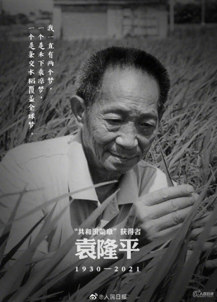

# 良田万顷今犹在，不见当年稻中人

## 《新史记·袁隆平传》

袁隆平者，江西人，国士也。少时嗜玩，天生随性，孜孜于荒野，寄志于田园，不求闻达，不求富甲，世人笑曰：如非隆平，实为农民。及至四九建国，袁公乃入太学府，毅然投身农学，以耕耘为本。后国逢三年天灾，万民贫荒，所见即饿殍遍野，所闻则草木惊心。然则，所学无以致用，所专无以救人。袁老始知，上农学，不如下学农，乃深入乡野，遍访耕农，躬身泥淖，苦尝百稻。隆平甘愿为一农民也，择一事，终一生，全万力，为亿民。此后数十载，院老离湘西，入云贵，访海南，履迹九州，只求秧苗安家，以身暖种，但期苞芽生发。工厂污田，袁公除镉于种，新米初熟，院士自践无毒。巨鲸落，万物生，杂交之术，至此大成。百十年间，天下无一处再为贫荒扰，无一人在为饥寒忧，无一年再为天灾苦。水稻一株，救命亿万，功在当代，利在千秋。其以凡人之力，比肩天上神明，亦以不世之功，誉满其身，得万民敬仰。然袁老心音不改，始终为一少年。少时其手持稻，得共和勋章手亦持稻，其曾与人曰：常有一梦，梦试田之谷，枝比高粱高，穗有扫帚长，籽似花生大，其与弟子憩其下，谓禾下乘凉梦。而今袁工追梦故去，苍生泣血，泪眼横行，山河震动，天下老幼妇孺，知与不知，皆为尽哀。良田万顷今犹在，不见当年稻中人。此一去也，天上神农归位，人间草木皆悲。白驹苍狗，逝水难留，唯国士永垂不朽。未谋其面，却蒙其恩，一日三餐，米香弥漫，饱食者当常忆袁公。

## 《袁公列传》

袁公隆平者，九江柴桑人也，庚午（1930）年生北平。当隆平之生也，国家扰攘，四海不宁，其明年，日寇拔奉天，旋陷三省， 旭日东升，兵锋直指燕蓟。

隆平因从父母南渡，过黄淮，穿长江，憩于江夏，稍稍气舒。是时，隆平既六岁，方启蒙，父乃计于亲戚曰：“自动乱以来，家中资书毁伤殆尽，故无以读书。今犬子有奇志，又宜外傅，请为延师以授之。”遂就近入塾。

少强记，甚长读书，师之所布，同窗三日始罢，而隆平往往半日而成，左右皆异之。会庠序无课，辄往闾里阡陌之上，俯首观菽麦所以长者，疑而问田叟曰：“吾闻人之生也，必食蔬肉，而禾之为稻，将奈饮食何？”

叟抚其首，笑曰：“天之降甘霖，禾之所饮，日之散暖气，禾所不寒，地之覆沃土，禾之有宅，故禾养于造化，成于自然。”

及隆平成立，慨然有大丈夫之气，又经自然人祸之灾，饱历黎民饿亡之苦，立志解万民于倒悬，遂躬行营粮，亲戚有许之者见其常躬身田间，劝曰：“竖子不若从戎，荷枪实弹，以备戎狄。”隆平不以为然，曰：“中国所阙，粮饷耳，至于良将千军，何寡之有，况日出东方而万物生长？请为深远计，不如饱黎民。”

于是治稼穑数十年不废，葵倾营粮之术，所得造诣，常人难比，所获精髓，欧美诸邦响力亦远不及也。而最为世所崇者，杂交稻也。

袁公既老，常居潇湘，贾有慕袁公之名而求利者，因秘书往见，曰：“足下虽老，而余利犹在，且公之子女甚众，愿为思身后之事。若与我共创有司，以得国之专饷，必厚遗公之子女，而公能获长者之名，岂不快哉？

袁公正色而辞曰：“我以身寄国家，死而后已，安能为宵小所动哉？且我素以仁义忠心立身，岂能自毁晚节乎？”贾知其不可移，遂犬走。

辛丑四月十一，袁公卒，享年九十一

古有宋应星贵五谷而贱金玉器，今有袁公心怀禾下乘凉梦，太史公曾言“人固有一死，或重于泰山，或轻于鸿毛。”然袁公者，以渺渺之躯，抗天之重，解万众黎民于倒悬，此等业力与神比肩。

人立志，兴大业，纸上得来终觉浅，绝知此事要躬行，而袁公者，知行合一实吾道