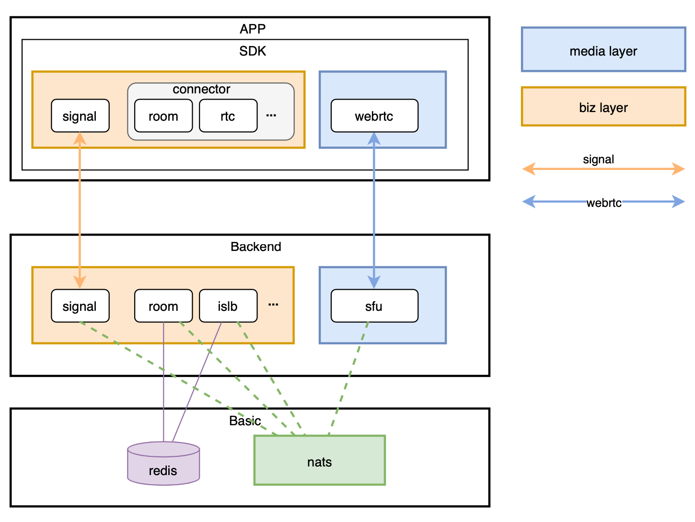

# ION的基本架构

服务名称|功能
-|-
ISLB|节点发现与负载均衡
Signal|传递信令
Room|主要业务逻辑，包括聊天室、用户验证等
SFU|WebRTC SFU，用于视频流的转发

用到的独立软件|功能
-|-
Redis|缓存数据库。给ISLB存储节点列表等数据；给Room存储业务逻辑数据
nats|分布式消息队列。用于各服务间的消息传递

>Software applications and services need to exchange data. NATS is an infrastructure that allows such data exchange, segmented in the form of messages. We call this a "message oriented middleware".



## 启动

### SFU

在官网教程中，单独启动SFU的指令如下：

```sh
docker pull nats
docker run -p 4222:4222 -p 6222:6222 -p 8222:8222 nats
docker run -p 5000:5000/udp --network host -v $PWD/configs/sfu.toml:/configs/sfu.toml pionwebrtc/ion:latest-sfu
```

可以看出，SFU需要有nats的存在才可运行。

`$PWD/configs/sfu.toml`似乎是配置文件。找到[`pion/ion-sfu`中配置文件的位置](https://github.com/pion/ion-sfu/blob/68545cc25230220435ee028d5a0af6e768a0a79a/config.toml)，可以看到这文件长这样：
```toml
[sfu]
# Ballast size in MiB, will allocate memory to reduce the GC trigger upto 2x the
# size of ballast. Be aware that the ballast should be less than the half of memory
# available.
ballast = 0
# enable prometheus sfu statistics
withstats = false

[router]
# Limit the remb bandwidth in kbps
# zero means no limits
maxbandwidth = 1500
# max number of video tracks packets the SFU will keep track
maxpackettrack = 500
# Sets the audio level volume threshold.
# Values from [0-127] where 0 is the loudest.
# Audio levels are read from rtp extension header according to:
# https://tools.ietf.org/html/rfc6464
audiolevelthreshold = 40
# Sets the interval in which the SFU will check the audio level
# in [ms]. If the active speaker has changed, the sfu will
# emit an event to clients.
audiolevelinterval=1000
# Sets minimum percentage of events required to fire an audio level
# according to the expected events from the audiolevelinterval,
# calculated as audiolevelinterval/packetization time (20ms for 8kHz)
# Values from [0-100]
audiolevelfilter = 20

[router.simulcast]
# Prefer best quality initially
bestqualityfirst = true
# EXPERIMENTAL enable temporal layer change is currently an experimental feature,
# enable only for testing.
enabletemporallayer = false

[webrtc]
# Single port, portrange will not work if you enable this
# singleport = 5000

# Range of ports that ion accepts WebRTC traffic on
# Format: [min, max]   and max - min >= 100
portrange = [5000, 5200]
# if sfu behind nat, set iceserver
# [[webrtc.iceserver]]
# urls = ["stun:stun.stunprotocol.org:3478"]
# [[webrtc.iceserver]]
# urls = ["turn:turn.awsome.org:3478"]
# username = "awsome"
# credential = "awsome"

# sdp semantics:
# "unified-plan"
# "plan-b"
# "unified-plan-with-fallback"
sdpsemantics = "unified-plan"
# toggle multicast dns support: https://tools.ietf.org/html/draft-mdns-ice-candidates-00
mdns = true

[webrtc.candidates]
# In case you're deploying ion-sfu on a server which is configured with
# a 1:1 NAT (e.g., Amazon EC2), you might want to also specify the public
# address of the machine using the setting below. This will result in
# all host candidates (which normally have a private IP address) to
# be rewritten with the public address provided in the settings. As
# such, use the option with caution and only if you know what you're doing.
# Multiple public IP addresses can be specified as a comma separated list
# if the sfu is deployed in a DMZ between two 1-1 NAT for internal and
# external users.
# nat1to1 = ["1.2.3.4"]
# icelite = true

[webrtc.timeouts]
# The duration in [sec] without network activity before a ICE Agent is considered disconnected
disconnected = 5
# The duration in [sec] without network activity before a ICE Agent is considered failed after disconnected
failed = 25
# How often in [sec] the ICE Agent sends extra traffic if there is no activity, if media is flowing no traffic will be sent
keepalive = 2

[turn]
# Enables embeded turn server
enabled = false
# Sets the realm for turn server
realm = "ion"
# The address the TURN server will listen on.
address = "0.0.0.0:3478"
# Certs path to config tls/dtls
# cert="path/to/cert.pem"
# key="path/to/key.pem"
# Port range that turn relays to SFU
# WARNING: It shouldn't overlap webrtc.portrange
# Format: [min, max]
# portrange = [5201, 5400]
[turn.auth]
# Use an auth secret to generate long-term credentials defined in RFC5389-10.2
# NOTE: This takes precedence over `credentials` if defined.
# secret = "secret"
# Sets the credentials pairs
credentials = "pion=ion,pion2=ion2"

[log]
# 0 - INFO 1 - DEBUG 2 - TRACE
v = 1
```

可以看到设置还是比较丰富的，比如有`maxbandwidth`这种带宽设置、WebRTC监听端口范围设置`portrange`、给内网端口映射环境部署时用的`nat1to1`、内置turn服务器设置`[turn]`等。

但是并没看到有nats相关的配置？这个SFU是怎么知道如何连接nats的？在仔细找找，发现这个`pion/ion-sfu`并不是直接放进容器里，而是在[`github.com/pion/ion/pkg/node/sfu`](https://github.com/pion/ion/tree/65dbd12eaad0f0e0a019b4d8ee80742930bcdc28/pkg/node/sfu)里面做了一层封装，然后在[`cmd/sfu/main.go`](https://github.com/pion/ion/blob/65dbd12eaad0f0e0a019b4d8ee80742930bcdc28/cmd/sfu/main.go)里面调用成为一个可执行文件的。

进一步，进到[pkg/node/sfu/sfu.go](https://github.com/pion/ion/blob/65dbd12eaad0f0e0a019b4d8ee80742930bcdc28/pkg/node/sfu/sfu.go)中，找到最主要的配置项：

```go
// Config for sfu node
type Config struct {
	Global global   `mapstructure:"global"`
	Log    logConf  `mapstructure:"log"`
	Nats   natsConf `mapstructure:"nats"`
	isfu.Config
}
```
可以看到，SFU中的配置项实际上是几个配置项拼起来的，其中就包含`pion/ion-sfu`中配置项`isfu.Config`。

再找到从这个配置项生成的[`pion/ion`中关于SFU的配置文件](https://github.com/pion/ion/blob/65dbd12eaad0f0e0a019b4d8ee80742930bcdc28/configs/sfu.toml)：
```toml
[global]
# data center id
dc = "dc1"

[nats]
url = "nats://127.0.0.1:4222"


[sfu]
# ......以下配置和上面那个配置文件差不多，省略
```

可以看到这就是[`pion/ion-sfu`中配置文件](https://github.com/pion/ion-sfu/blob/68545cc25230220435ee028d5a0af6e768a0a79a/config.toml)加了几个配置项而已。其中就有nats的配置项，比如地址和数据库名称啥的。