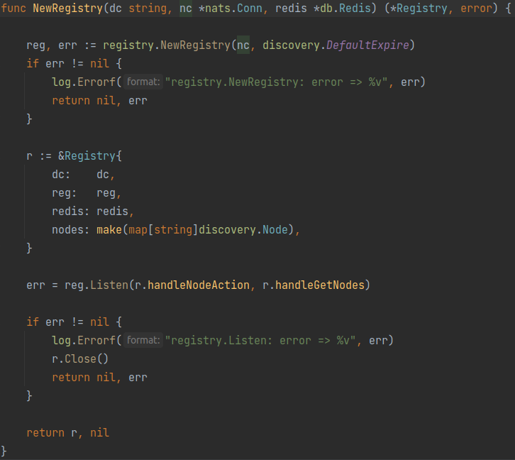
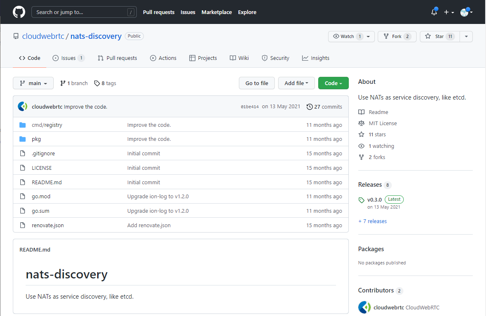
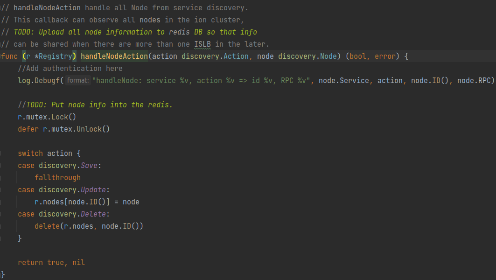
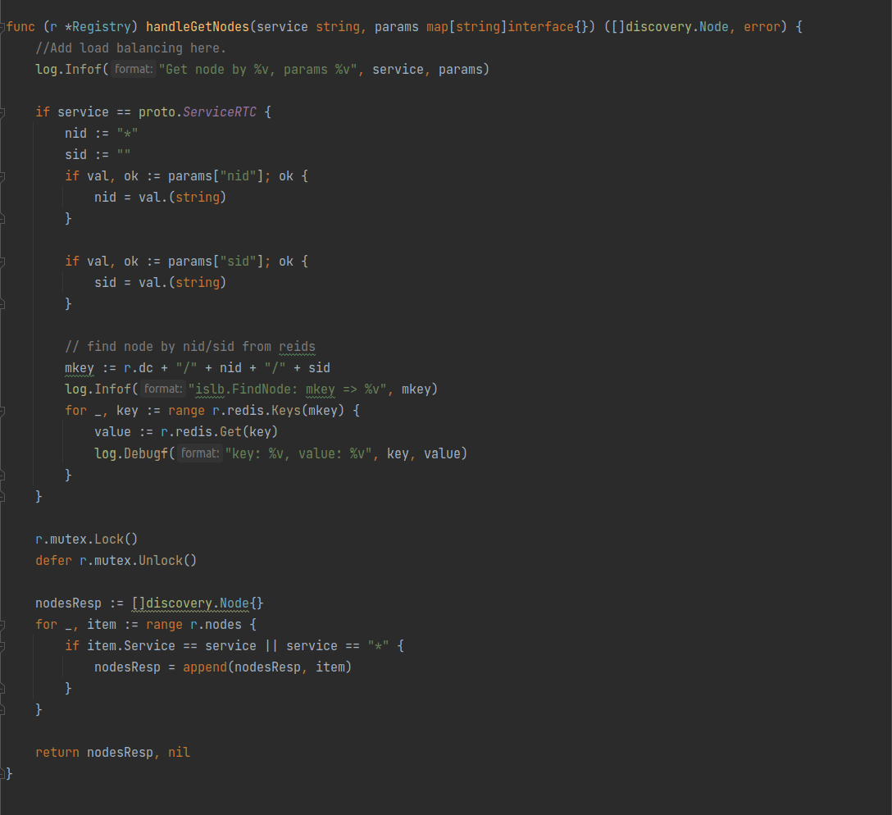
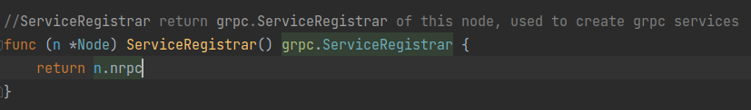
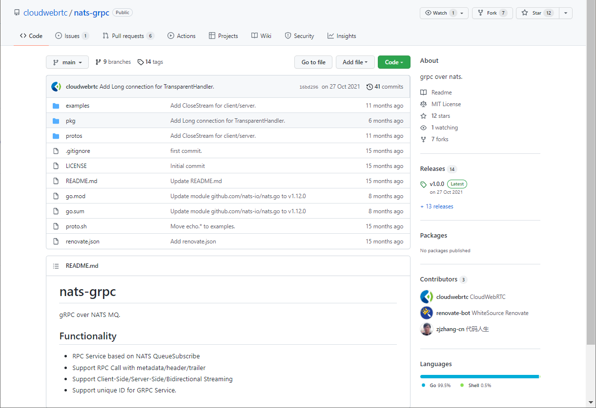
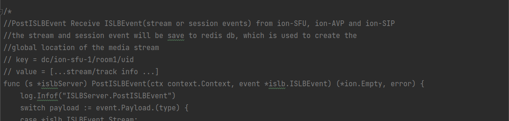

# ION的基本架构

服务名称|功能
-|-
ISLB|节点发现与负载均衡
Signal|传递信令
Room|主要业务逻辑，包括聊天室、用户验证等
SFU|WebRTC SFU，用于视频流的转发

用到的独立软件|功能
-|-
Redis|缓存数据库。给ISLB存储节点列表等数据；给Room存储业务逻辑数据
nats|分布式消息队列。用于各服务间的消息传递

>Software applications and services need to exchange data. NATS is an infrastructure that allows such data exchange, segmented in the form of messages. We call this a "message oriented middleware".


在连接建立过程中，各组件之间的关系如下：
```
SDK<---grpc--->signal<---nats--->Room/ISLB<---nats--->signal<---grpc--->SDK
                                    ||
                                  [Redis]
```

在视频流传输中，各组件之间的关系如下：
```
SDK<----webrtc---->SFU<----webrtc---->SDK
```

## 启动

### SFU

在官网教程中，单独启动SFU的指令如下：

```sh
docker pull nats
docker run -p 4222:4222 -p 6222:6222 -p 8222:8222 nats
docker run -p 5000:5000/udp --network host -v $PWD/configs/sfu.toml:/configs/sfu.toml pionwebrtc/ion:latest-sfu
```

可以看出，SFU需要有nats的存在才可运行。

`$PWD/configs/sfu.toml`似乎是配置文件。找到[`pion/ion-sfu`中配置文件的位置](https://github.com/pion/ion-sfu/blob/68545cc25230220435ee028d5a0af6e768a0a79a/config.toml)，可以看到这文件长这样：
```toml
[sfu]
# Ballast size in MiB, will allocate memory to reduce the GC trigger upto 2x the
# size of ballast. Be aware that the ballast should be less than the half of memory
# available.
ballast = 0
# enable prometheus sfu statistics
withstats = false

[router]
# Limit the remb bandwidth in kbps
# zero means no limits
maxbandwidth = 1500
# max number of video tracks packets the SFU will keep track
maxpackettrack = 500
# Sets the audio level volume threshold.
# Values from [0-127] where 0 is the loudest.
# Audio levels are read from rtp extension header according to:
# https://tools.ietf.org/html/rfc6464
audiolevelthreshold = 40
# Sets the interval in which the SFU will check the audio level
# in [ms]. If the active speaker has changed, the sfu will
# emit an event to clients.
audiolevelinterval=1000
# Sets minimum percentage of events required to fire an audio level
# according to the expected events from the audiolevelinterval,
# calculated as audiolevelinterval/packetization time (20ms for 8kHz)
# Values from [0-100]
audiolevelfilter = 20

[router.simulcast]
# Prefer best quality initially
bestqualityfirst = true
# EXPERIMENTAL enable temporal layer change is currently an experimental feature,
# enable only for testing.
enabletemporallayer = false

[webrtc]
# Single port, portrange will not work if you enable this
# singleport = 5000

# Range of ports that ion accepts WebRTC traffic on
# Format: [min, max]   and max - min >= 100
portrange = [5000, 5200]
# if sfu behind nat, set iceserver
# [[webrtc.iceserver]]
# urls = ["stun:stun.stunprotocol.org:3478"]
# [[webrtc.iceserver]]
# urls = ["turn:turn.awsome.org:3478"]
# username = "awsome"
# credential = "awsome"

# sdp semantics:
# "unified-plan"
# "plan-b"
# "unified-plan-with-fallback"
sdpsemantics = "unified-plan"
# toggle multicast dns support: https://tools.ietf.org/html/draft-mdns-ice-candidates-00
mdns = true

[webrtc.candidates]
# In case you're deploying ion-sfu on a server which is configured with
# a 1:1 NAT (e.g., Amazon EC2), you might want to also specify the public
# address of the machine using the setting below. This will result in
# all host candidates (which normally have a private IP address) to
# be rewritten with the public address provided in the settings. As
# such, use the option with caution and only if you know what you're doing.
# Multiple public IP addresses can be specified as a comma separated list
# if the sfu is deployed in a DMZ between two 1-1 NAT for internal and
# external users.
# nat1to1 = ["1.2.3.4"]
# icelite = true

[webrtc.timeouts]
# The duration in [sec] without network activity before a ICE Agent is considered disconnected
disconnected = 5
# The duration in [sec] without network activity before a ICE Agent is considered failed after disconnected
failed = 25
# How often in [sec] the ICE Agent sends extra traffic if there is no activity, if media is flowing no traffic will be sent
keepalive = 2

[turn]
# Enables embeded turn server
enabled = false
# Sets the realm for turn server
realm = "ion"
# The address the TURN server will listen on.
address = "0.0.0.0:3478"
# Certs path to config tls/dtls
# cert="path/to/cert.pem"
# key="path/to/key.pem"
# Port range that turn relays to SFU
# WARNING: It shouldn't overlap webrtc.portrange
# Format: [min, max]
# portrange = [5201, 5400]
[turn.auth]
# Use an auth secret to generate long-term credentials defined in RFC5389-10.2
# NOTE: This takes precedence over `credentials` if defined.
# secret = "secret"
# Sets the credentials pairs
credentials = "pion=ion,pion2=ion2"

[log]
# 0 - INFO 1 - DEBUG 2 - TRACE
v = 1
```

可以看到设置还是比较丰富的，比如有`maxbandwidth`这种带宽设置、WebRTC监听端口范围设置`portrange`、给内网端口映射环境部署时用的`nat1to1`、内置turn服务器设置`[turn]`等。

但是并没看到有nats相关的配置？这个SFU是怎么知道如何连接nats的？在仔细找找，发现这个`pion/ion-sfu`并不是直接放进容器里，而是在[`github.com/pion/ion/pkg/node/sfu`](https://github.com/pion/ion/tree/65dbd12eaad0f0e0a019b4d8ee80742930bcdc28/pkg/node/sfu)里面做了一层封装，然后在[`cmd/sfu/main.go`](https://github.com/pion/ion/blob/65dbd12eaad0f0e0a019b4d8ee80742930bcdc28/cmd/sfu/main.go)里面调用成为一个可执行文件的。

进一步，进到[pkg/node/sfu/sfu.go](https://github.com/pion/ion/blob/65dbd12eaad0f0e0a019b4d8ee80742930bcdc28/pkg/node/sfu/sfu.go)中，找到最主要的配置项：

```go
// Config for sfu node
type Config struct {
	Global global   `mapstructure:"global"`
	Log    logConf  `mapstructure:"log"`
	Nats   natsConf `mapstructure:"nats"`
	isfu.Config
}
```
可以看到，SFU中的配置项实际上是几个配置项拼起来的，其中就包含`pion/ion-sfu`中配置项`isfu.Config`。

再找到从这个配置项生成的[`pion/ion`中关于SFU的配置文件](https://github.com/pion/ion/blob/65dbd12eaad0f0e0a019b4d8ee80742930bcdc28/configs/sfu.toml)：
```toml
[global]
# data center id
dc = "dc1"

[nats]
url = "nats://127.0.0.1:4222"


[sfu]
# ......以下配置和上面那个配置文件差不多，省略
```

可以看到这就是[`pion/ion-sfu`中配置文件](https://github.com/pion/ion-sfu/blob/68545cc25230220435ee028d5a0af6e768a0a79a/config.toml)加了几个配置项而已。其中就有nats的配置项，比如地址和数据库名称啥的。

### islb

在官网教程中，单独启动islb的指令如下：

```sh
docker pull nats
docker run -p 4222:4222 -p 6222:6222 -p 8222:8222 nats
docker pull redis
docker run -p 6379:6379 redis
docker run --network host -v $PWD/configs/islb.toml:/configs/islb.toml pionwebrtc/ion:latest-islb
```

可以看出，islb不仅需要有nats，还需要有Redis的存在才可运行。毕竟是负载均衡，肯定要存一下有哪些个节点可供负载均衡。

`$PWD/configs/islb.toml`应该就是配置文件。和上面一样，直接找到对应的[配置文件](https://github.com/pion/ion/blob/65dbd12eaad0f0e0a019b4d8ee80742930bcdc28/configs/islb.toml)：
```toml
[global]
# data center id
dc = "dc1"

[log]
level = "info"

[nats]
url = "nats://127.0.0.1:4222"


[redis]
addrs = [":6379"]
password = ""
db = 0
```
未免也过于简单了，完全就只有连数据库的配置，没有一点自己的运行逻辑方面配置？

从代码结构上看，在pion项目中，这个islb没有单独的包，主要的逻辑都在[`github.com/pion/ion/pkg/node/islb`](https://github.com/pion/ion/tree/65dbd12eaad0f0e0a019b4d8ee80742930bcdc28/pkg/node/islb)这个包里面，然后在[cmd/islb/main.go](https://github.com/pion/ion/blob/65dbd12eaad0f0e0a019b4d8ee80742930bcdc28/cmd/islb/main.go)里面做成可执行文件。找代码里的配置项也很好找得到：
```go
// Config for islb node
type Config struct {
	Global  global    `mapstructure:"global"`
	Log     logConf   `mapstructure:"log"`
	Nats    natsConf  `mapstructure:"nats"`
	Redis   db.Config `mapstructure:"redis"`
	CfgFile string
}
```

这里面确实没有islb相关的配置项。这就怪了，这islb是什么运行逻辑，怎么都没配置的？好歹还是个“负载均衡”来着。

打开[`pkg/node/islb/islb.go`](https://github.com/pion/ion/blob/65dbd12eaad0f0e0a019b4d8ee80742930bcdc28/pkg/node/islb/islb.go)来看一眼，发现只有一个`Start`和`Stop`函数，核心代码应该是`Start`里的这一段。

首先是连Redis：
```go
	i.redis = db.NewRedis(conf.Redis)
	if i.redis == nil {
		return errors.New("new redis error")
	}
```

然后又创建了一个全局的服务注册中心：
```go
	//registry for node discovery.
	i.registry, err = NewRegistry(conf.Global.Dc, i.Node.NatsConn(), i.redis)
	if err != nil {
		log.Errorf("%v", err)
		return err
	}
```

这个`NewRegistry`是一个这样的东西：


看起来像是调用了一个`registry`包的什么东西创建了注册中心，然后用`Listen`指定了两个消息处理的函数。看看这个`registry`包是什么：


原来如此，是一个基于nats消息队列做的服务注册器啊。

那这个`handleNodeAction`和`handleGetNodes`肯定就是服务注册的主要逻辑了。看看：


就是个简单的按照指令增减节点的操作。


这就是个返回存储的节点信息的操作。在`if service == proto.ServiceRTC`的里面应该是查询SFU节点的操作，根据一个叫`nid`的变量和一个叫`sid`的变量进行的操作，这个`nid`还有可能是`*`？那这很有可能是一个根据聊天室Session从数据库里查找对应的视频流在哪个SFU上的操作。但是这查找的结果又没给返回回去，最后也有只是根据服务名称返回了所有符合要求的节点，看这样子所谓负载均衡好像都没完全实现，或者可能是准备删了。


回到`pkg/node/islb/islb.go`的代码里，可以看到有一个`ServiceRegistrar`被注册到了grpc和一个`reflection`包里面：
```go
	i.s = newISLBServer(conf, i, i.redis)
	pb.RegisterISLBServer(i.Node.ServiceRegistrar(), i.s)

	// Register reflection service on nats-rpc server.
	reflection.Register(i.Node.ServiceRegistrar().(*nrpc.Server))
```
看这个`ServiceRegistrar`长这样：

所以这明显是一个构造grpc服务器的惯用操作。

再看这个`reflection`包是哪来的：

原来是一个基于nats实现的grpc！ion真就把所有通信操作都放进nats里面啊

再找到这个`pb.RegisterISLBServer`的位置看看proto文件：
```proto
syntax = "proto3";

import "proto/ion/ion.proto";

option go_package = "github.com/pion/ion/proto/islb";

package islb;

service ISLB {
}

message FindNodeRequest {
    string sid = 1;
    string nid = 2;
    string service = 3;
}

message FindNodeReply {
    repeated ion.Node nodes = 1;
}
```
😂太简单了8

没有一点复杂的协议在里面，就只有FindNode相关的两个操作

在`newISLBServer`这里面有一大段被注释的代码：

从这个注释看是接收流信息的函数，负责接收视频流的建立和断开过程，并且把现在所有的流信息写进数据库里。这地方和前面的`handleGetNodes`对应起来了，在islb里查SFU节点的流信息可能是一个将要被删除的功能。这功能应该移到别的地方去了吧。

回到`pkg/node/islb/islb.go`的代码里，可以看到上面那些东西都打包进了这个`Node`里面：
```go
	node := discovery.Node{
		DC:      conf.Global.Dc,
		Service: proto.ServiceISLB,
		NID:     i.Node.NID,
		RPC: discovery.RPC{
			Protocol: discovery.NGRPC,
			Addr:     conf.Nats.URL,
			//Params:   map[string]string{"username": "foo", "password": "bar"},
		},
	}
```
没啥好说的

然后启动轮询上报自身状态和监测节点操作请求：
```go
	go func() {
		err := i.Node.KeepAlive(node)
		if err != nil {
			log.Errorf("islb.Node.KeepAlive: error => %v", err)
		}
	}()

	//Watch ALL nodes.
	go func() {
		err := i.Node.Watch(proto.ServiceALL)
		if err != nil {
			log.Errorf("Node.Watch(proto.ServiceALL) error %v", err)
		}
	}()
```
也没啥好说的

所以综上所述，islb实际上就是一个节点注册中心，并没有所谓的负载均衡功能，存储和查询流信息的功能不知道被移到哪去了。推测这个模块后面应该会改个名字，比如改成“Registry”啥的，更符合它现在的功能。