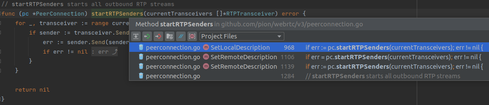
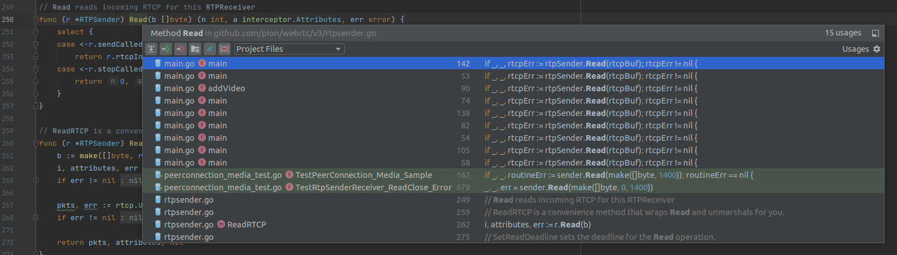
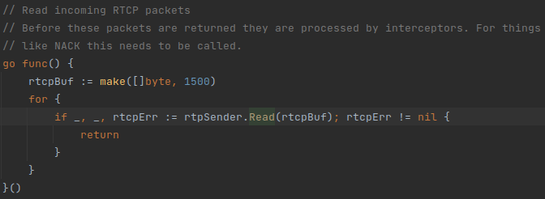

# interceptor寻踪：从`TrackLocal`开始深入挖掘`pion/interceptor`的用法

上接[《interceptor寻踪：`pion/interceptor`在`pion/webrtc`里的用法解析》](./interceptor在pc里.md)，来深入挖掘一下interceptor在`TrackLocal`里的用法

[《pion中的`TrackLocal`》](./TrackLocal.md)里面已经解析过，`TrackLocal`是用于发送媒体流的类，所以这里面的intrceptor也应该主要是为发送服务的。

## 在`TrackLocal`里

从[《pion中的`TrackLocal`》](./TrackLocal.md)里可以看到`TrackLocal`只是一个接口，interceptor应该是隐藏在`Bind`函数所输入的`TrackLocalContext`的`writeStream`里的：
```go
// TrackLocalWriter is the Writer for outbound RTP Packets
type TrackLocalWriter interface {
	// WriteRTP encrypts a RTP packet and writes to the connection
	WriteRTP(header *rtp.Header, payload []byte) (int, error)

	// Write encrypts and writes a full RTP packet
	Write(b []byte) (int, error)
}

// TrackLocalContext is the Context passed when a TrackLocal has been Binded/Unbinded from a PeerConnection, and used
// in Interceptors.
type TrackLocalContext struct {
	id          string
	params      RTPParameters
	ssrc        SSRC
	writeStream TrackLocalWriter
}

......

// WriteStream returns the WriteStream for this TrackLocal. The implementer writes the outbound
// media packets to it
func (t *TrackLocalContext) WriteStream() TrackLocalWriter {
	return t.writeStream
}

......

// TrackLocal is an interface that controls how the user can send media
// The user can provide their own TrackLocal implementations, or use
// the implementations in pkg/media
type TrackLocal interface {
	// Bind should implement the way how the media data flows from the Track to the PeerConnection
	// This will be called internally after signaling is complete and the list of available
	// codecs has been determined
	Bind(TrackLocalContext) (RTPCodecParameters, error)
	
	......
}
```
从[《pion中的`TrackLocal`》](./TrackLocal.md)里最后面介绍的`TrackLocalStaticRTP`案例可以看到，`TrackLocalContext`只有四个变量，前面三个一看就是静态的数据变量，显然`TrackLocal`发送数据用的东西应该就是这个`TrackLocalWriter`。从注释上看，这个`TrackLocalWriter`是由框架构造好了再传进去的，所以与interceptor相关的操作都是在外面定义好了封装为`TrackLocalWriter`再传进来的，`TrackLocal`里面本身不涉及interceptor相关的操作。

## 进一步深入

那么顺藤摸瓜，只要顺着`TrackLocalWriter`的实现这条路，也就能找到interceptor是怎么传进来的了。`pion/webrtc`里的`TrackLocalWriter`实现只有一个非导出类：
```go
type interceptorToTrackLocalWriter struct{ interceptor atomic.Value } // interceptor.RTPWriter }

func (i *interceptorToTrackLocalWriter) WriteRTP(header *rtp.Header, payload []byte) (int, error) {
	if writer, ok := i.interceptor.Load().(interceptor.RTPWriter); ok && writer != nil {
		return writer.Write(header, payload, interceptor.Attributes{})
	}

	return 0, nil
}

func (i *interceptorToTrackLocalWriter) Write(b []byte) (int, error) {
	packet := &rtp.Packet{}
	if err := packet.Unmarshal(b); err != nil {
		return 0, err
	}

	return i.WriteRTP(&packet.Header, packet.Payload)
}
```
很明显，这个类就是在调用`interceptor.RTPWriter`，因为是个非导出类，所以肯定只会在框架里实例化。再顺藤摸瓜，可以找到这个类只在`RTPSender`实例化了一次：
```go
// Send Attempts to set the parameters controlling the sending of media.
func (r *RTPSender) Send(parameters RTPSendParameters) error {
	r.mu.Lock()
	defer r.mu.Unlock()

	if r.hasSent() {
		return errRTPSenderSendAlreadyCalled
	}

	writeStream := &interceptorToTrackLocalWriter{} // 实例化interceptorToTrackLocalWriter
	r.context = TrackLocalContext{
		id:          r.id,
		params:      r.api.mediaEngine.getRTPParametersByKind(r.track.Kind(), []RTPTransceiverDirection{RTPTransceiverDirectionSendonly}),
		ssrc:        parameters.Encodings[0].SSRC,
		writeStream: writeStream,
	} // 用interceptorToTrackLocalWriter构造TrackLocalContext

	codec, err := r.track.Bind(r.context) // 把TrackLocalContext绑给RTPSender里的TrackLocal（这个r.track是个TrackLocal）
	if err != nil {
		return err
	}
	r.context.params.Codecs = []RTPCodecParameters{codec}

	r.streamInfo = createStreamInfo(r.id, parameters.Encodings[0].SSRC, codec.PayloadType, codec.RTPCodecCapability, parameters.HeaderExtensions)
	rtpInterceptor := r.api.interceptor.BindLocalStream(&r.streamInfo, interceptor.RTPWriterFunc(func(header *rtp.Header, payload []byte, attributes interceptor.Attributes) (int, error) {
		return r.srtpStream.WriteRTP(header, payload)
	})) // 给RTPSender所用的interceptor绑一个发送RTP包的操作
	writeStream.interceptor.Store(rtpInterceptor) // 将返回的RTPWriter放进interceptorToTrackLocalWriter里

	close(r.sendCalled)
	return nil
}
```
明显得不能再明显了，直接从无到有构造了一个`TrackLocalContext`给一个`RTPSender`中的`TrackLocal`（即`r.track`）去绑定，还给`API`里的interceptor输出流绑定了`RTPWriter`，然后把返回的`RTPWriter`赋值给了`TrackLocalContext`里的`writeStream.interceptor`。这样，当用户在其定义的`TrackLocal`里调用绑定的`TrackLocalContext`的`WriteStream()`就会得到一个包含发送操作的`TrackLocalWriter`（内部实际上是这个非导出的`interceptorToTrackLocalWriter`），调用其`WriteRTP`或是`Write`能执行发送操作。

PS：如果顾名思义，`Send`函数里应该包含实际发送包的操作，然而并没有。这里面的各种东西构造好了之后直接就被存起来了，都没有返回给外面，没有什么发送的操作。所以这个函数的作用应该是“绑定”而不是“生成”，主要是要把各种东西绑到传入的`TrackLocal`里，实际收发RTP包的过程由用户在自己定义的`TrackLocal`里完成，就像[《pion学习总结：等待传出track的一般流程》](./传出总结.md)里介绍的那样。

再看看这个`Send`函数是哪里调用的，发现唯一的调用在`PeerConnection`的一个私有方法里：

```go
// startRTPSenders starts all outbound RTP streams
func (pc *PeerConnection) startRTPSenders(currentTransceivers []*RTPTransceiver) error {
	for _, transceiver := range currentTransceivers {
		if sender := transceiver.Sender(); sender != nil && sender.isNegotiated() && !sender.hasSent() {
			err := sender.Send(sender.GetParameters())
			if err != nil {
				return err
			}
		}
	}

	return nil
}
```
从函数名就可以看出来，这里只是一个启动RTP发送器的操作。这也更加印证了上面的想法：`Send`函数的作用是“绑定”。私以为，这个`Send`函数本应有个更好的名称，比如`Start`之类，这样就不会像现在这样令人迷惑了。

PS：这里还有个操作比较迷惑。对每个`currentTransceivers`执行`sender := transceiver.Sender()`好理解，就是从RTP收发器里把发送器取出来；后面的这个`sender.Send(sender.GetParameters())`把自己的参数取出来又放回自己的函数里就不太好理解了，既然都是自己的参数，为什么不直接把取参数的操作放在`Send`里？可能是什么历史遗留问题吧。

然后再看看`startRTPSenders`又是在哪调用的：


哦！居然是在webrtc标准接口方法`SetLocalDescription`和`SetRemoteDescription`里，结合这个标准接口的功能，这就好理解了：
* P2P连接开始时通信双方需要先交换自己的连接信息，让对方能通过这些信息找到要往哪个端口发视频。连接信息生成前，连接必须得先准备好，这个`Send`函数就是连接准备过程的一部分。

## 中场休息

截至目前，我们已经找到了传输数据的操作，我们看到：
* `BindRTCPWriter`在`NewPeerConnection`里被调用，返回的`RTCPWriter.Write`在`PeerConnection`的`WriteRTCP`里调用，供用户发送一些自定义的RTCP包
* `BindLocalStream`在`RTPSender.Send`里被调用，并且在最顶层上都是在`SetLocalDescription`和`SetRemoteDescription`里调用的，实际的包发送操作由用户在自己实现的`TrackLocal`里调用
* 负责处理传入链接的两个操作`BindRemoteStream`和`BindRTCPReader`还没找到

## 在`RTPSender`里

现在，`Send`函数将我们引导到了这个`RTPSender`，从名字就能看出这应该是个发送RTP包的类，但从上面`Send`函数里的调用关系看到，`Send`函数只执行了一些绑定操作，实际的RTP和RTCP包的发送过程是用户在`TrackLocal`里调用的。

### `NewRTPSender`

定义`RTPSender`的文件开头就是这个`NewRTPSender`函数，但是它并不是`RTPSender`的类方法，而是`API`的：
```go
func (api *API) NewRTPSender(track TrackLocal, transport *DTLSTransport) (*RTPSender, error) {
	......

	r := &RTPSender{
		track:      track,
		transport:  transport,
		api:        api,
		sendCalled: make(chan struct{}),
		stopCalled: make(chan struct{}),
		ssrc:       SSRC(randutil.NewMathRandomGenerator().Uint32()),
		id:         id,
		srtpStream: &srtpWriterFuture{},
	}

	r.srtpStream.rtpSender = r

	r.rtcpInterceptor = r.api.interceptor.BindRTCPReader(interceptor.RTPReaderFunc(func(in []byte, a interceptor.Attributes) (n int, attributes interceptor.Attributes, err error) {
		n, err = r.srtpStream.Read(in)
		return n, a, err
	}))
```
一看就能懂，这个函数里面构造了一个`RTPSender`，然后给它绑了一个和SRTP相关的RTCP包读取操作，获取到`RTCPReader`赋值给`r.rtcpInterceptor`。

#### `RTPSender`在系统中的地位

查找一下`NewRTPSender`的调用位置，发现它就是在`AddTrack`里调用的：
```go
// AddTrack adds a Track to the PeerConnection
func (pc *PeerConnection) AddTrack(track TrackLocal) (*RTPSender, error) {
	if pc.isClosed.get() {
		return nil, &rtcerr.InvalidStateError{Err: ErrConnectionClosed}
	}

	pc.mu.Lock()
	defer pc.mu.Unlock()
	for _, t := range pc.rtpTransceivers {
		if !t.stopped && t.kind == track.Kind() && t.Sender() == nil {
			sender, err := pc.api.NewRTPSender(track, pc.dtlsTransport)
			if err == nil {
				err = t.SetSender(sender, track)
				if err != nil {
					_ = sender.Stop()
					t.setSender(nil)
				}
			}
			if err != nil {
				return nil, err
			}
			pc.onNegotiationNeeded()
			return sender, nil
		}
	}

	transceiver, err := pc.newTransceiverFromTrack(RTPTransceiverDirectionSendrecv, track)
	if err != nil {
		return nil, err
	}
	pc.addRTPTransceiver(transceiver)
	return transceiver.Sender(), nil
}
```
并且可以看到，这个`AddTrack`的核心功能其实就是：
* 用输入的track构造`RTPSender`
* 将`RTPSender`绑定到所有收发器（因为需要向每个传出流发RTP包）
* 返回`RTPSender`

所以很明显了，PeerConnection的`AddTrack`本质上就是在用`TrackLocal`构造`RTPSender`，然后把构造出来的`RTPSender`设置给各种Transceiver

### `Read`

再看看`r.rtcpInterceptor`是在哪调用的，发现了两个简单的函数：

```go
// Read reads incoming RTCP for this RTPReceiver
func (r *RTPSender) Read(b []byte) (n int, a interceptor.Attributes, err error) {
	select {
	case <-r.sendCalled:
		return r.rtcpInterceptor.Read(b, a)
	case <-r.stopCalled:
		return 0, nil, io.ErrClosedPipe
	}
}

// ReadRTCP is a convenience method that wraps Read and unmarshals for you.
func (r *RTPSender) ReadRTCP() ([]rtcp.Packet, interceptor.Attributes, error) {
	b := make([]byte, r.api.settingEngine.getReceiveMTU())
	i, attributes, err := r.Read(b)
	if err != nil {
		return nil, nil, err
	}

	pkts, err := rtcp.Unmarshal(b[:i])
	if err != nil {
		return nil, nil, err
	}

	return pkts, attributes, nil
}
```
就是两个接收RTCP包的函数，`r.rtcpInterceptor`应该是阻塞式的，所以这里大概也是阻塞式的，不用太多解释。再找这两个函数的调用位置，发现都是在用户代码里：


点进去一看发现都是这种东西：


很熟悉啊！从[《用实例学习pion - `rtp-to-webrtc`》](./rtp-to-webrtc.md)开始就一直没搞懂的奇怪操作，学了这么多到现在就能搞懂了：因为RTCP包的处理操作都在`RTCPReader.Read`里，所以必须主动调用它才能够让RTCP的各种功能有效。比如在NACK功能里面，读取NACK包并识别哪些包要重发的操作就是在`RTCPReader.Read`里，必须调用它才能让interceptor知道哪些包要重发。

## 结束

目前为止，我们看到：
* `BindRTCPWriter`在`NewPeerConnection`里被调用，返回的`RTCPWriter.Write`在`PeerConnection`的`WriteRTCP`里调用，供用户发送一些自定义的RTCP包
* `BindRTCPReader`在`NewRTPSender`里被调用，返回的`RTCPReader.Read`在`RTPSender`的`Read`里调用，供用户从`RTPSender`里读取自定义的RTCP包
* `BindLocalStream`在`RTPSender.Send`里被调用，并且在最顶层上都是在`SetLocalDescription`和`SetRemoteDescription`里初始化时调用的。在`RTPSender.Send`里，`RTPSender`构造为`TrackLocalWriter`封装进`TrackLocalContext`然后绑定给用户定义的`TrackLocal`里，实际发送RTP包需要用户在自己实现的`TrackLocal`里调用`TrackLocalWriter.Write`
* 没有`BindRemoteStream`，毕竟`TrackLocal`是发送数据流的，没有接收RTP包的相关操作，很合理

本篇主要解析了发送方的interceptor调用链，接下来解析接收方的interceptor调用链：[《interceptor寻踪：从`TrackRemote`开始深入挖掘`pion/interceptor`的用法》](./interceptor在trackremote里.md)