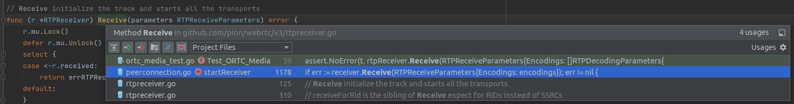
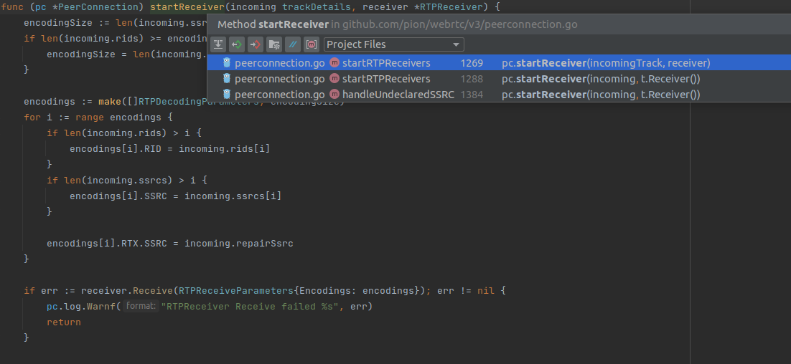
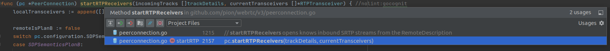
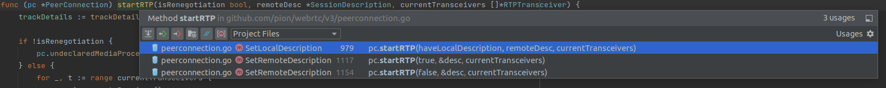

# interceptor寻踪：从`TrackRemote`开始深入挖掘`pion/interceptor`的用法

上接[《interceptor寻踪：`pion/interceptor`在`pion/webrtc`里的用法解析》](./interceptor在pc里.md)，来深入挖掘一下interceptor在`TrackRemote`里的用法

## 在`TrackRemote`里

从[《pion中的`TrackRemote`》](./TrackRemote.md)里的调用链可以看到，最核心的函数就只有一个`Read`：
```go
// Read reads data from the track.
func (t *TrackRemote) Read(b []byte) (n int, attributes interceptor.Attributes, err error) {
	t.mu.RLock()
	r := t.receiver
	peeked := t.peeked != nil
	t.mu.RUnlock()

	......

	n, attributes, err = r.readRTP(b, t)
	if err != nil {
		return
	}

	err = t.checkAndUpdateTrack(b)
	return
}
```
以及一个调用`Read`的`ReadRTP`：
```go
// ReadRTP is a convenience method that wraps Read and unmarshals for you.
func (t *TrackRemote) ReadRTP() (*rtp.Packet, interceptor.Attributes, error) {
	b := make([]byte, t.receiver.api.settingEngine.getReceiveMTU())
	i, attributes, err := t.Read(b)
	if err != nil {
		return nil, nil, err
	}

	r := &rtp.Packet{}
	if err := r.Unmarshal(b[:i]); err != nil {
		return nil, nil, err
	}
	return r, attributes, nil
}
```

`Read`里最核心的明显就是这句`r.readRTP(b, t)`，而这个`r`就是来自于上面那句`r := t.receiver`。再去看看`TrackRemote`的定义，可以发现这个`t.receiver`是个`RTPReceiver`：
```go
type TrackRemote struct {
	......

	receiver         *RTPReceiver

	......
}
```
所以这个`TrackRemote`里的interceptor相关操作是在外面定义好了封进`RTPReceiver`传进来的，`TrackRemote`是在调用它。

那看看这个`RTPReceiver`何许人也？这个`RTPReceiver`和`TrackRemote`一样，也早在[《pion学习总结：等待传入track的一般流程》](./传入总结.md)就了解过了，[《pion学习总结：等待传入track的一般流程》](./传入总结.md)里可以看到它们是`OnTrack`里面输入Track处理函数的输入值。而从示例[《用实例学习pion - `gocv-receive`》](./gocv-receive.md)和[《用实例学习pion - `rtp-forwarder`》](./rtp-forwarder.md)中可以看到，处理传入流的操作就是调用`TrackRemote`的`ReadRTP`读取传进来的数据进行自己想要的处理。但pion的几个官方案例里面只示范了调用`TrackRemote`的过程，这个传入的`RTPReceiver`怎么用还没找到有案例。

## `RTPReceiver`

言归正传，现在来看看`RTPReceiver`的具体情况。首先从那句`r.readRTP(b, t)`入手看看。这个`readRTP`是个非导出函数：
```go
// readRTP should only be called by a track, this only exists so we can keep state in one place
func (r *RTPReceiver) readRTP(b []byte, reader *TrackRemote) (n int, a interceptor.Attributes, err error) {
	<-r.received
	if t := r.streamsForTrack(reader); t != nil {
		return t.rtpInterceptor.Read(b, a)
	}

	return 0, nil, fmt.Errorf("%w: %d", errRTPReceiverWithSSRCTrackStreamNotFound, reader.SSRC())
}
```
这个开头注释说这个函数是给`TrackRemote`专用的，难怪是个非导出。想想也是，用户只要调用`TrackRemote.ReadRTP`就能读取RTP了，也不需要`RTPReceiver`里再搞个功能一样的函数，给做成非导出防止出Bug。

很明显，就是用一个`r.streamsForTrack`读出一个包含了`RTPReader`的变量然后调用`Read`。这个`streamsForTrack`就是个查找函数：
```go
func (r *RTPReceiver) streamsForTrack(t *TrackRemote) *trackStreams {
	for i := range r.tracks {
		if r.tracks[i].track == t {
			return &r.tracks[i]
		}
	}
	return nil
}
```
这个函数从`RTPReceiver`的`trackStreams`列表里面一个个对比`TrackRemote`，找出对应的`trackStreams`。居然用的是顺序查找，哈哈哈。再看看这个`trackStreams`又是什么：
```go
// trackStreams maintains a mapping of RTP/RTCP streams to a specific track
// a RTPReceiver may contain multiple streams if we are dealing with Simulcast
type trackStreams struct {
	track *TrackRemote

	streamInfo, repairStreamInfo *interceptor.StreamInfo

	rtpReadStream  *srtp.ReadStreamSRTP
	rtpInterceptor interceptor.RTPReader

	rtcpReadStream  *srtp.ReadStreamSRTCP
	rtcpInterceptor interceptor.RTCPReader

	repairReadStream  *srtp.ReadStreamSRTP
	repairInterceptor interceptor.RTPReader

	repairRtcpReadStream  *srtp.ReadStreamSRTCP
	repairRtcpInterceptor interceptor.RTCPReader
}
```
哦！`RTPReader`和`RTCPReader`都在这里，再看看它们都是从哪来的：


哇居然都在一起生成的，在`Receive`函数里面，一股子[《interceptor寻踪：从`TrackLocal`开始深入挖掘`pion/interceptor`的用法》](./interceptor在tracklocal里.md)取名为动词`Send`的初始化函数的既视感来了，这应该也是个取名为`Receive`实际上只是接收过程前的初始化函数吧。去看看，果然如此：
```go
// Receive initialize the track and starts all the transports
func (r *RTPReceiver) Receive(parameters RTPReceiveParameters) error {
	r.mu.Lock()
	defer r.mu.Unlock()
	select {
	case <-r.received:
		return errRTPReceiverReceiveAlreadyCalled
	default:
	}
	defer close(r.received)

	globalParams := r.getParameters()
	codec := RTPCodecCapability{}
	if len(globalParams.Codecs) != 0 {
		codec = globalParams.Codecs[0].RTPCodecCapability
	}

	for i := range parameters.Encodings { // 对每种编码方式都进行初始化
		t := trackStreams{ // 创建trackStreams
			track: newTrackRemote( // 这就是系统内生成TrackRemote的地方
				r.kind,
				parameters.Encodings[i].SSRC,
				parameters.Encodings[i].RID,
				r,
			),
		}

		if parameters.Encodings[i].SSRC != 0 {
			t.streamInfo = createStreamInfo("", parameters.Encodings[i].SSRC, 0, codec, globalParams.HeaderExtensions) // 生成trackStreams.streamInfo
			var err error
			if t.rtpReadStream, t.rtpInterceptor, t.rtcpReadStream, t.rtcpInterceptor, err = r.transport.streamsForSSRC(parameters.Encodings[i].SSRC, *t.streamInfo); err != nil {
				return err
			} // 创建RTPReader和RTCPReader
		}

		r.tracks = append(r.tracks, t)

		if rtxSsrc := parameters.Encodings[i].RTX.SSRC; rtxSsrc != 0 {
			streamInfo := createStreamInfo("", rtxSsrc, 0, codec, globalParams.HeaderExtensions) // 生成trackStreams.streamInfo
			rtpReadStream, rtpInterceptor, rtcpReadStream, rtcpInterceptor, err := r.transport.streamsForSSRC(rtxSsrc, *streamInfo)
			if err != nil {
				return err
			} // 创建RTPReader和RTCPReader

			if err = r.receiveForRtx(rtxSsrc, "", streamInfo, rtpReadStream, rtpInterceptor, rtcpReadStream, rtcpInterceptor); err != nil {
				return err
			} // 这个操作和repair stream以及传输层拥塞控制TWCC有关，暂时还不了解
		}
	}

	return nil
}
```
可以看到，主要是对传入的`RTPReceiveParameters`构造`trackStreams`并填入里面的各种东西，很好理解。

但这里仍然不是最根本的，我们看到interceptor还是在`r.transport.streamsForSSRC`里生成的。进一步找这个`r.transport.streamsForSSRC`，发现在一个`DTLSTransport`的类里：
```go
// DTLSTransport allows an application access to information about the DTLS
// transport over which RTP and RTCP packets are sent and received by
// RTPSender and RTPReceiver, as well other data such as SCTP packets sent
// and received by data channels.
type DTLSTransport struct {
	......
}

......

func (t *DTLSTransport) streamsForSSRC(ssrc SSRC, streamInfo interceptor.StreamInfo) (*srtp.ReadStreamSRTP, interceptor.RTPReader, *srtp.ReadStreamSRTCP, interceptor.RTCPReader, error) {
	srtpSession, err := t.getSRTPSession()
	if err != nil {
		return nil, nil, nil, nil, err
	}

	rtpReadStream, err := srtpSession.OpenReadStream(uint32(ssrc))
	if err != nil {
		return nil, nil, nil, nil, err
	}

	rtpInterceptor := t.api.interceptor.BindRemoteStream(&streamInfo, interceptor.RTPReaderFunc(func(in []byte, a interceptor.Attributes) (n int, attributes interceptor.Attributes, err error) {
		n, err = rtpReadStream.Read(in)
		return n, a, err
	}))

	srtcpSession, err := t.getSRTCPSession()
	if err != nil {
		return nil, nil, nil, nil, err
	}

	rtcpReadStream, err := srtcpSession.OpenReadStream(uint32(ssrc))
	if err != nil {
		return nil, nil, nil, nil, err
	}

	rtcpInterceptor := t.api.interceptor.BindRTCPReader(interceptor.RTPReaderFunc(func(in []byte, a interceptor.Attributes) (n int, attributes interceptor.Attributes, err error) {
		n, err = rtcpReadStream.Read(in)
		return n, a, err
	}))

	return rtpReadStream, rtpInterceptor, rtcpReadStream, rtcpInterceptor, nil
}

......
```

从注释里可以看到，这是一个和SRTP以及SRTCP有关的类。所以这个类的存在也好理解，就是为了透明地实现SRTP和SRTCP的功能。在[《interceptor寻踪：从`TrackLocal`开始深入挖掘`pion/interceptor`的用法》](./interceptor在tracklocal里.md)里我们也见到过发送端实现的SRTP和SRTCP功能，就是在`NewRTPSender`里给RTPSender所用的interceptor绑一个SRTCP发送RTCP包的操作，以及在`Send`里给RTPSender所用的interceptor绑一个SRTP发送RTP包的操作，和这里绑SRTP以及SRTCP接收操作的思想如出一辙。在用户那边看来好像是SRTP和STCP是透明的一样。

## 最后一点

截至目前，我们以及找到了interceptor初始化的位置和初始化的方式，但还不知道初始化是在哪里进行的。于是顺着`Receive`开始往上找：





啊哈！果不其然，和[《interceptor寻踪：从`TrackLocal`开始深入挖掘`pion/interceptor`的用法》](./interceptor在tracklocal里.md)里一样，这些初始化过程在最上层也是在`SetLocalDescription`和`SetRemoteDescription`里调用的。

也好理解，`SetLocalDescription`和`SetRemoteDescription`里进行的就是根据SDP创建连接的过程，在这之后就能直接开始传输了，这些创建interceptor的初始化过程放在这个里面很合理。

## 总结

总结一下，`TrackRemote`接收流的相关操作其实还挺简单的：
* 读取RTP包：`OnTrack`里用户获取到`TrackRemote`，调用`TrackRemote`里的`Read`，`Read`调用`RTPReceiver`里的非导出类执行发RTP包的操作
* 读取RTCP包：`OnTrack`里用户获取到`RTPReceiver`，调用`RTPReceiver`里的`Read`就是实际读取RTCP包的操作
* 初始化：在`SetLocalDescription`和`SetRemoteDescription`里，interceptor相关类被初始化（`BindRemoteStream`和`BindRTCPReader`）后放入`TrackRemote`和`RTPReceiver`里，在`OnTrack`里里用户获取到的就是这些初始化好的类
* 接收方不负责发送，没有`BindLocalStream`和`BindRTCPWriter`，很合理
