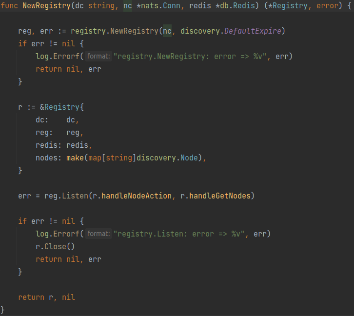
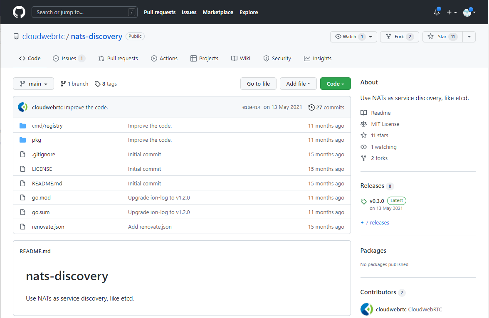
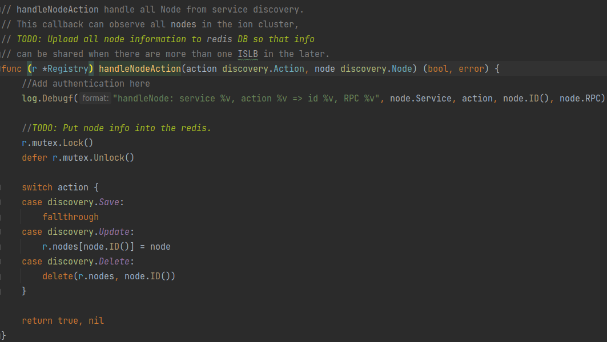
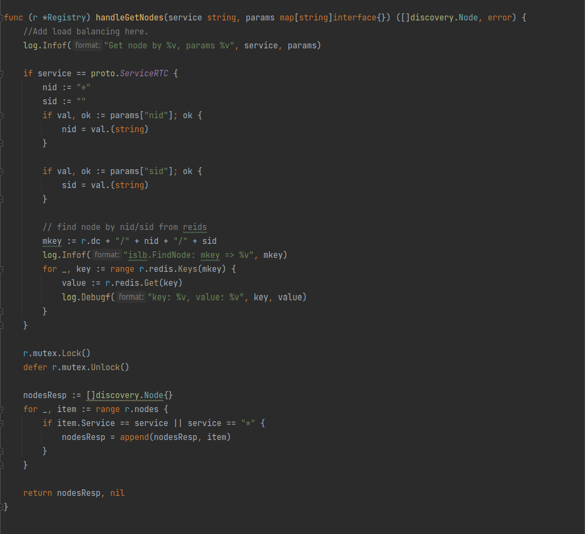
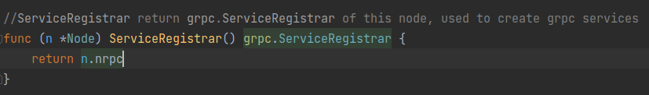

# ION中的islb服务

打开[`pkg/node/islb/islb.go`](https://github.com/pion/ion/blob/65dbd12eaad0f0e0a019b4d8ee80742930bcdc28/pkg/node/islb/islb.go)来看一眼，发现只有一个`Start`和`Stop`函数，核心代码应该是`Start`里的这一段。

首先是连Redis：
```go
	i.redis = db.NewRedis(conf.Redis)
	if i.redis == nil {
		return errors.New("new redis error")
	}
```

然后又创建了一个全局的服务注册中心：
```go
	//registry for node discovery.
	i.registry, err = NewRegistry(conf.Global.Dc, i.Node.NatsConn(), i.redis)
	if err != nil {
		log.Errorf("%v", err)
		return err
	}
```

这个`NewRegistry`是一个这样的东西：


看起来像是调用了一个`registry`包的什么东西创建了注册中心，然后用`Listen`指定了两个消息处理的函数。看看这个`registry`包是什么：


原来如此，是一个基于nats消息队列做的服务注册器啊。

那这个`handleNodeAction`和`handleGetNodes`肯定就是服务注册的主要逻辑了。看看：


就是个简单的按照指令增减节点的操作。


这就是个返回存储的节点信息的操作。在`if service == proto.ServiceRTC`的里面应该是查询SFU节点的操作，根据一个叫`nid`的变量和一个叫`sid`的变量进行的操作，这个`nid`还有可能是`*`？那这很有可能是一个根据聊天室Session从数据库里查找对应的视频流在哪个SFU上的操作。但是这查找的结果又没给返回回去，最后也有只是根据服务名称返回了所有符合要求的节点，看这样子所谓负载均衡好像都没完全实现，或者可能是准备删了。


回到`pkg/node/islb/islb.go`的代码里，可以看到有一个`ServiceRegistrar`被注册到了grpc和一个`reflection`包里面：
```go
	i.s = newISLBServer(conf, i, i.redis)
	pb.RegisterISLBServer(i.Node.ServiceRegistrar(), i.s)

	// Register reflection service on nats-rpc server.
	reflection.Register(i.Node.ServiceRegistrar().(*nrpc.Server))
```
看这个`ServiceRegistrar`长这样：

所以这明显是一个构造grpc服务器的惯用操作。

再看这个`reflection`包是哪来的：

原来是一个基于nats实现的grpc！ion真就把所有通信操作都放进nats里面啊

再找到这个`pb.RegisterISLBServer`的位置看看proto文件：
```proto
syntax = "proto3";

import "proto/ion/ion.proto";

option go_package = "github.com/pion/ion/proto/islb";

package islb;

service ISLB {
}

message FindNodeRequest {
    string sid = 1;
    string nid = 2;
    string service = 3;
}

message FindNodeReply {
    repeated ion.Node nodes = 1;
}
```
😂太简单了8

没有一点复杂的协议在里面，就只有FindNode相关的两个操作

在`newISLBServer`这里面有一大段被注释的代码：

从这个注释看是接收流信息的函数，负责接收视频流的建立和断开过程，并且把现在所有的流信息写进数据库里。这地方和前面的`handleGetNodes`对应起来了，在islb里查SFU节点的流信息可能是一个将要被删除的功能。这功能应该移到别的地方去了吧。

回到`pkg/node/islb/islb.go`的代码里，可以看到上面那些东西都打包进了这个`Node`里面：
```go
	node := discovery.Node{
		DC:      conf.Global.Dc,
		Service: proto.ServiceISLB,
		NID:     i.Node.NID,
		RPC: discovery.RPC{
			Protocol: discovery.NGRPC,
			Addr:     conf.Nats.URL,
			//Params:   map[string]string{"username": "foo", "password": "bar"},
		},
	}
```
没啥好说的

然后启动轮询上报自身状态和监测节点操作请求：
```go
	go func() {
		err := i.Node.KeepAlive(node)
		if err != nil {
			log.Errorf("islb.Node.KeepAlive: error => %v", err)
		}
	}()

	//Watch ALL nodes.
	go func() {
		err := i.Node.Watch(proto.ServiceALL)
		if err != nil {
			log.Errorf("Node.Watch(proto.ServiceALL) error %v", err)
		}
	}()
```
也没啥好说的

所以综上所述，islb实际上就是一个节点注册中心，并没有所谓的负载均衡功能，存储和查询流信息的功能不知道被移到哪去了。推测这个模块后面应该会改个名字，比如改成“Registry”啥的，更符合它现在的功能。
