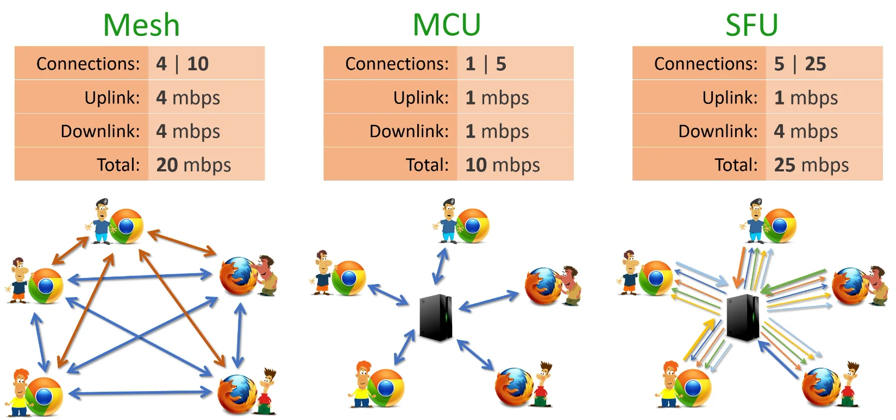
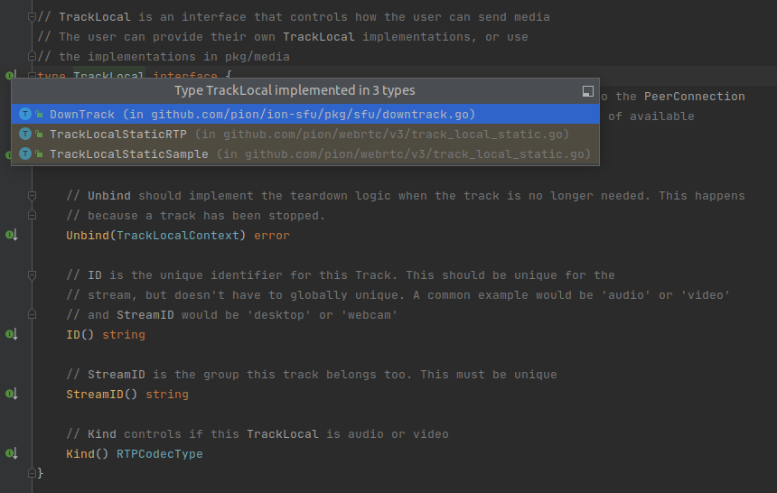

# pion/ion-sfu简要学习

## SFU核心思想



一个聊天室：
* 所有的用户都将视频流上传到SFU
* 不同的用户选择观看不同的视频流
* 于是，SFU将用户的视频流（RTP包）进行有选择地(Selective)合并和转发(Forward)

## pion/ion-sfu如何将RTP包转发出去

pion/ion-sfu转发RTP包的核心就是这个函数：
```go
func (w *WebRTCReceiver) AddUpTrack(track *webrtc.TrackRemote, buff *buffer.Buffer, bestQualityFirst bool) {
	if w.closed.get() {
		return
	}

	var layer int
	switch track.RID() {
	case fullResolution:
		layer = 2
	case halfResolution:
		layer = 1
	default:
		layer = 0
	}

	w.Lock()
	w.upTracks[layer] = track
	w.buffers[layer] = buff
	w.available[layer].set(true)
	w.downTracks[layer].Store(make([]*DownTrack, 0, 10))
	w.pendingTracks[layer] = make([]*DownTrack, 0, 10)
	w.Unlock()

	subBestQuality := func(targetLayer int) {
		for l := 0; l < targetLayer; l++ {
			dts := w.downTracks[l].Load()
			if dts == nil {
				continue
			}
			for _, dt := range dts.([]*DownTrack) {
				_ = dt.SwitchSpatialLayer(int32(targetLayer), false)
			}
		}
	}

	subLowestQuality := func(targetLayer int) {
		for l := 2; l != targetLayer; l-- {
			dts := w.downTracks[l].Load()
			if dts == nil {
				continue
			}
			for _, dt := range dts.([]*DownTrack) {
				_ = dt.SwitchSpatialLayer(int32(targetLayer), false)
			}
		}
	}

	if w.isSimulcast {
		if bestQualityFirst && (!w.available[2].get() || layer == 2) {
			subBestQuality(layer)
		} else if !bestQualityFirst && (!w.available[0].get() || layer == 0) {
			subLowestQuality(layer)
		}
	}
	go w.writeRTP(layer)
}
```
顾名思义，这函数应该是用于添加传入SFU的流（AddUpTrack，添加上行Track）。

最最核心的地方就是最后这个：
```go
    go w.writeRTP(layer)
```
它是开启一个协程进行写RTP的操作，这应该是把传入的RTP包转发给接收方的核心函数。这个`w.writeRTP`长这样：
```go
func (w *WebRTCReceiver) writeRTP(layer int) {
	defer func() {
		w.closeOnce.Do(func() {
			w.closed.set(true)
			w.closeTracks()
		})
	}()

	pli := []rtcp.Packet{
		&rtcp.PictureLossIndication{SenderSSRC: rand.Uint32(), MediaSSRC: w.SSRC(layer)},
	}

	for { // 一个死循环
		pkt, err := w.buffers[layer].ReadExtended() // 从buffer里读出RTP包
		if err == io.EOF {
			return
		}

		if w.isSimulcast {
			if w.pending[layer].get() {
				if pkt.KeyFrame {
					w.Lock()
					for idx, dt := range w.pendingTracks[layer] {
						w.deleteDownTrack(dt.CurrentSpatialLayer(), dt.peerID)
						w.storeDownTrack(layer, dt)
						dt.SwitchSpatialLayerDone(int32(layer))
						w.pendingTracks[layer][idx] = nil
					}
					w.pendingTracks[layer] = w.pendingTracks[layer][:0]
					w.pending[layer].set(false)
					w.Unlock()
				} else {
					w.SendRTCP(pli) // 发送关键帧
				}
			}
		}

		for _, dt := range w.downTracks[layer].Load().([]*DownTrack) {
			if err = dt.WriteRTP(pkt, layer); err != nil { // RTP包调用DownTrack.WriteRTP，一看就是发送用的
				if err == io.EOF && err == io.ErrClosedPipe {
					w.Lock()
					w.deleteDownTrack(layer, dt.id)
					w.Unlock()
				}
				log.Error().Err(err).Str("id", dt.id).Msg("Error writing to down track")
			}
		}
	}

}
```
很简单，就是一个死循环不断从buffer里读出包然后写进一个`DownTrack.WriteRTP`。这个`DownTrack`名字一看就是用来往客户端发流的（DownTrack，即下行，也即向客户端发）。而点开这个`DownTrack`一看：

发现它惊人继承自我们的老朋友`TrackLocal`（[《pion中的`TrackLocal`》](./TrackLocal.md)）！这个`DownTrack.WriteRTP`是发包用操作实锤了。

除了这个`DownTrack.WriteRTP`，我们还可以看到在发RTP包之前还有一个判断当前帧是否是关键帧然后发送PLI(Picture Loss Indication，关键帧请求)的操作，不用多讲。

## pion/ion-sfu如何接收RTP包

回到`AddUpTrack`这边：
```go
func (w *WebRTCReceiver) AddUpTrack(track *webrtc.TrackRemote, buff *buffer.Buffer, bestQualityFirst bool) {
    
    ......

	w.Lock()
	w.upTracks[layer] = track
	w.buffers[layer] = buff
	w.available[layer].set(true)
	w.downTracks[layer].Store(make([]*DownTrack, 0, 10))
	w.pendingTracks[layer] = make([]*DownTrack, 0, 10)
	w.Unlock()

    ......

	go w.writeRTP(layer)
}
```
从函数的内容上看，这里面与`buff *buffer.Buffer`有关的操作只有上面这个赋值的操作，并没有写RTP包是如何进到`buff`里的。从函数的参数看，将RTP包放进这个buff应该是在函数外面完成的，应该是把相关操作（写操作协程）先初始化好再把buff传进来的。

所以，直接找这个函数在哪调用的，发现在这：
```go
func (r *router) AddReceiver(receiver *webrtc.RTPReceiver, track *webrtc.TrackRemote, trackID, streamID string) (Receiver, bool) {
	r.Lock()
	defer r.Unlock()

	publish := false

	buff, rtcpReader := r.bufferFactory.GetBufferPair(uint32(track.SSRC()))

	buff.OnFeedback(func(fb []rtcp.Packet) {
		r.rtcpCh <- fb
	})

	if track.Kind() == webrtc.RTPCodecTypeAudio { // 设置音频Track的相关操作
		buff.OnAudioLevel(func(level uint8) {
			r.session.AudioObserver().observe(streamID, level)
		})
		r.session.AudioObserver().addStream(streamID)

	} else if track.Kind() == webrtc.RTPCodecTypeVideo { // 设置视频Track和传输层拥塞控制的相关操作
		if r.twcc == nil {
			r.twcc = twcc.NewTransportWideCCResponder(uint32(track.SSRC()))
			r.twcc.OnFeedback(func(p rtcp.RawPacket) {
				r.rtcpCh <- []rtcp.Packet{&p}
			})
		}
		buff.OnTransportWideCC(func(sn uint16, timeNS int64, marker bool) {
			r.twcc.Push(sn, timeNS, marker)
		})
	}

	if r.config.WithStats {
		r.stats[uint32(track.SSRC())] = stats.NewStream(buff)
	}

	rtcpReader.OnPacket(func(bytes []byte) {
		pkts, err := rtcp.Unmarshal(bytes)

		...... // 收到RTCP包的一些操作，比如SenderReport
	})

	recv, ok := r.receivers[trackID] // 找出这个track要发给谁
	if !ok {
		...... // 如果找不到track，进行一些错误处理
	}

	recv.AddUpTrack(track, buff, r.config.Simulcast.BestQualityFirst) // AddUpTrack在此调用

	buff.Bind(receiver.GetParameters(), buffer.Options{
		MaxBitRate: r.config.MaxBandwidth,
	})

	if r.config.WithStats {
		if track.Kind() == webrtc.RTPCodecTypeVideo {
			stats.VideoTracks.Inc()
		} else {
			stats.AudioTracks.Inc()
		}
	}

	return recv, publish
}
```

这里面也只有一些配置操作，还不是buff真正执行写操作的最底层。所以启动写操作的最底层应该在这些配置操作里。

TODO: 找到了buff的写操作函数`Buffer.Write`，但是没找到是谁调用的这个
