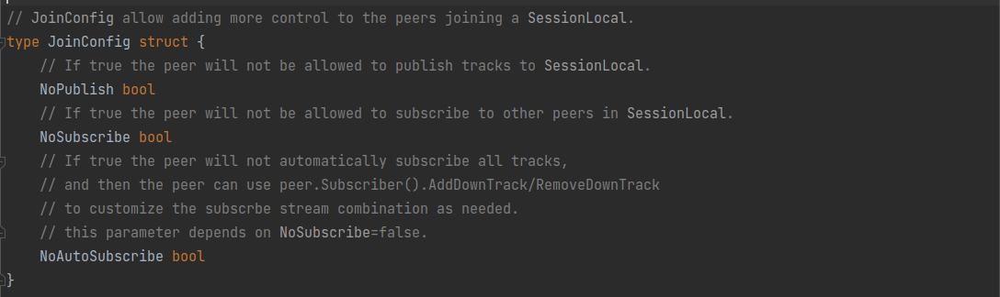
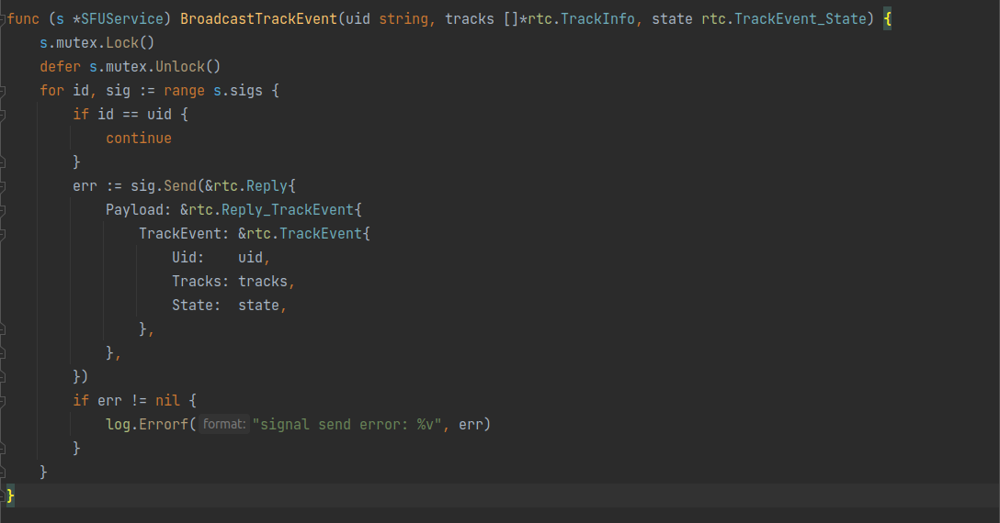
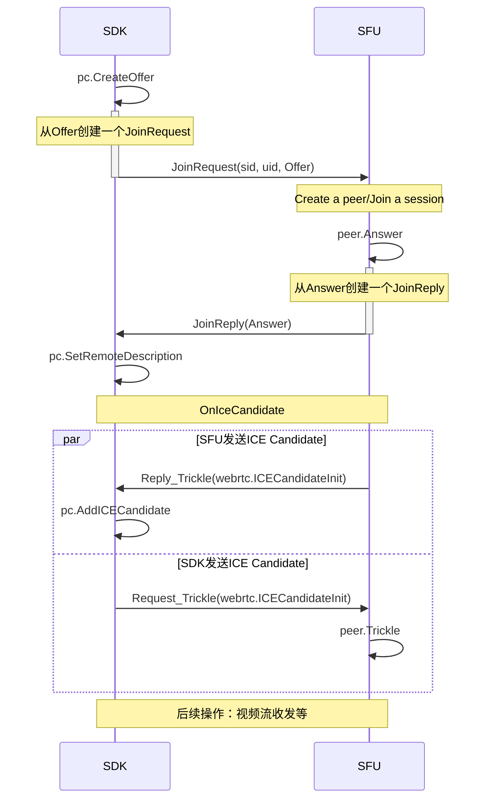
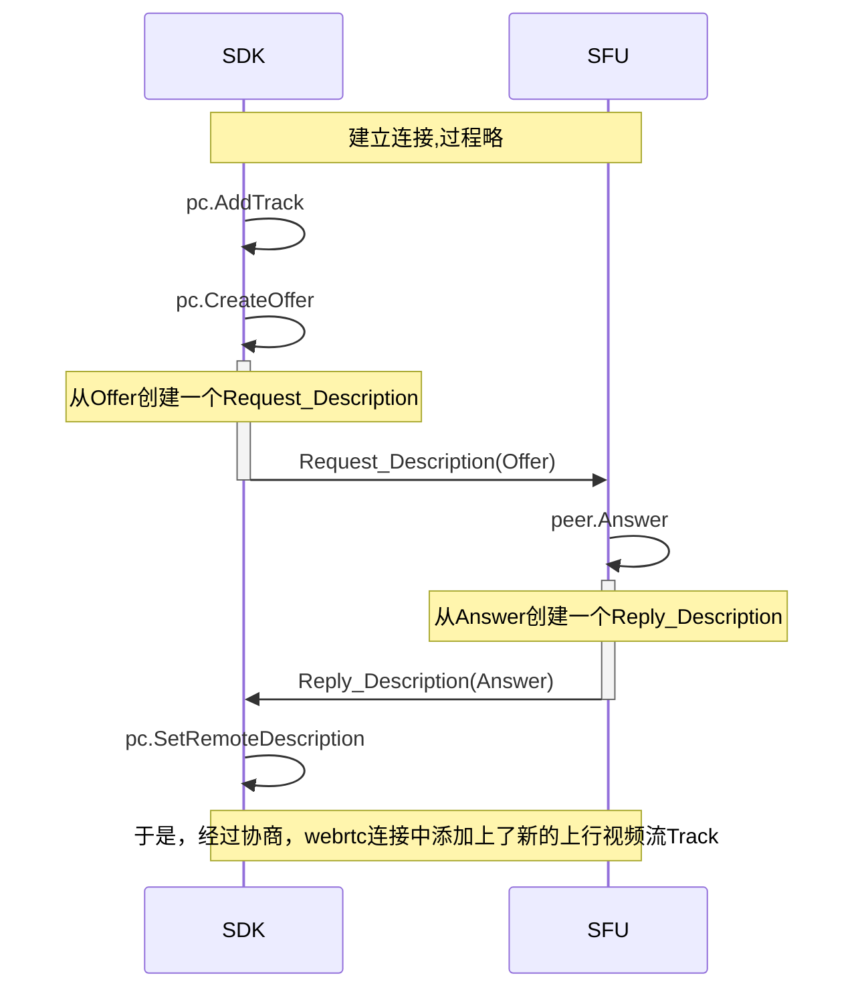
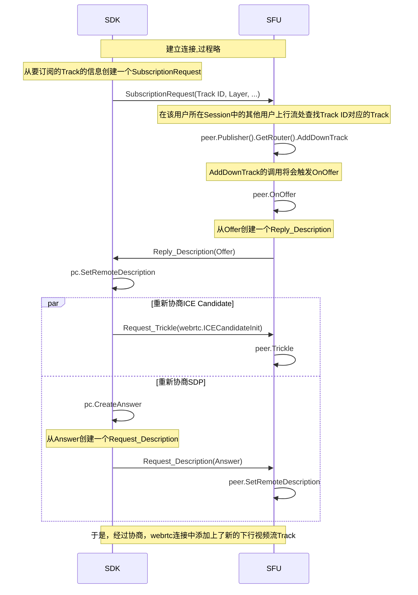
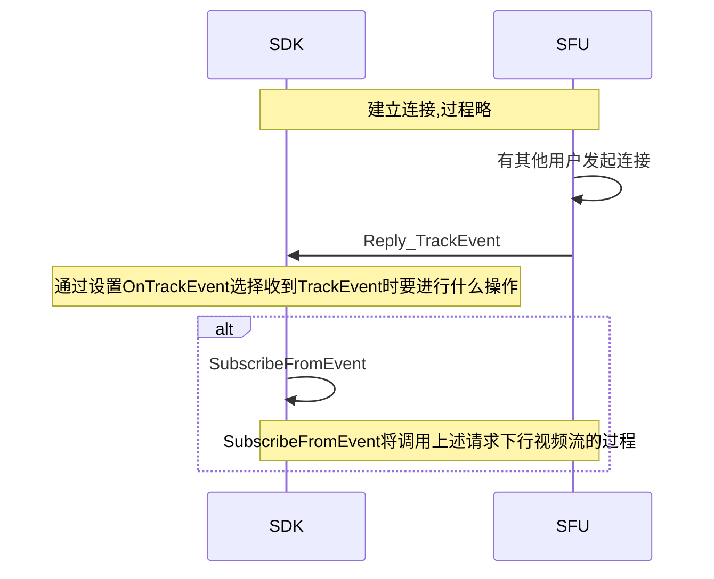

# ION中的SFU服务

总的来说，ION中的SFU服务是以[`pion/ion-sfu`](ion-sfu.md)作为底层服务，上面添加了一堆服务注册和与ION其他服务相互调用的GRPC操作组成的。

打开[pkg/node/sfu/sfu.go](https://github.com/pion/ion/blob/65dbd12eaad0f0e0a019b4d8ee80742930bcdc28/pkg/node/sfu/sfu.go)，可以看到最重要的函数就是这个`Start`：

```go
// Start sfu node
func (s *SFU) Start(conf Config) error {
	err := s.Node.Start(conf.Nats.URL)
	if err != nil {
		s.Close()
		return err
	}

	s.s = NewSFUService(conf.Config)
	//grpc service
	pb.RegisterRTCServer(s.Node.ServiceRegistrar(), s.s)

	// Register reflection service on nats-rpc server.
	reflection.Register(s.Node.ServiceRegistrar().(*nrpc.Server))

	node := discovery.Node{
		DC:      conf.Global.Dc,
		Service: proto.ServiceRTC,
		NID:     s.Node.NID,
		RPC: discovery.RPC{
			Protocol: discovery.NGRPC,
			Addr:     conf.Nats.URL,
			//Params:   map[string]string{"username": "foo", "password": "bar"},
		},
	}

	go func() {
		err := s.Node.KeepAlive(node)
		if err != nil {
			log.Errorf("sfu.Node.KeepAlive(%v) error %v", s.Node.NID, err)
		}
	}()

	//Watch ALL nodes.
	go func() {
		err := s.Node.Watch(proto.ServiceALL)
		if err != nil {
			log.Errorf("Node.Watch(proto.ServiceALL) error %v", err)
		}
	}()

	return nil
}
```
其实也挺简单的，最核心的地方就是`NewSFUService`启动了SFU服务，然后用`pb.RegisterRTCServer`和`reflection.Register`将`NewSFUService`启动的SFU服务注册为了GRPC服务；其他的操作都和[《ION中的islb服务》](ion-islb.md)中介绍的大差不差。

## GRPC

那先看看SFU的GRPC服务的proto吧。打开[proto/rtc/rtc.proto](https://github.com/pion/ion/blob/65dbd12eaad0f0e0a019b4d8ee80742930bcdc28/proto/rtc/rtc.proto)：

```proto
syntax = "proto3";

option go_package = "github.com/pion/ion/proto/rtc";

package rtc;

service RTC {
  rpc Signal(stream Request) returns (stream Reply) {}
}
```
首先映入眼帘的赫然是一个大大的`Signal`！那么很显然，这个SFU在`pion/ion-sfu`基础上加的东西就是信令。那接下来的proto就必定是一些和WebRTC连接建立有关的东西了：

```proto
message JoinRequest {
  string sid = 1;
  string uid = 2;
  map<string, string> config = 3;
  SessionDescription description = 4;
}

message JoinReply {
  bool success = 1;
  Error error = 2;
  SessionDescription description = 3;
}
```
好，第一个就是“加入”信令及其响应的格式，传了`sid`和`uid`正好是和[《ION中的islb服务》](ion-islb.md)中让人疑惑的`sid`和`uid`对应的；然后这个在请求和响应里都有的`SessionDescription`当然就是ICE过程中互传的[SDP](STUN和ICE和SDP.md)了。

下面就是这个`SessionDescription`的格式：
```proto
enum Target {
  PUBLISHER = 0;
  SUBSCRIBER = 1;
}

enum MediaType {
  MediaUnknown = 0;
  UserMedia = 1;
  ScreenCapture = 2;
  Cavans = 3;
  Streaming = 4;
  VoIP = 5;
}

message TrackInfo {
  // basic info
  string id = 1;
  string kind = 2;
  bool muted = 3;
  MediaType type = 4;
  string streamId = 5;
  string label = 6;

  // extra info
  string layer = 7;  // simulcast or svc layer
  uint32 width = 8;
  uint32 height = 9;
  uint32 frameRate = 10;
}

message SessionDescription {
  Target target = 1;
  // 'offer' | 'answer'
  string type = 2;
  // sdp contents
  string sdp = 3;
  // sdp metdata
  repeated TrackInfo trackInfos = 4;
}
```
没啥好说的，就是ICE连接建立所需的[各种内容](STUN和ICE和SDP.md)。


```proto
message Trickle {
  Target target = 1;
  string init = 2;
}

message Error {
  int32 code = 1;
  string reason = 2;
}
```
也没啥好说的。


```proto
message TrackEvent {
  enum State {
    ADD = 0;
    UPDATE = 1;
    REMOVE = 2;
  }
  State state = 1;
  string uid = 2;
  repeated TrackInfo tracks = 3;
}
```
这显然是用来传视频流的增减和更新事件的，又和[《ION中的islb服务》](ion-islb.md)中让人疑惑的`PostISLBEvent`对应起来了。


```proto
message Subscription{
  string trackId = 2;
  bool mute = 3; // mute track or not
  bool subscribe = 4; // sub track or not
  string layer = 5;  // simulcast or svc layer
}

message SubscriptionRequest {
  repeated Subscription subscriptions = 1;
}

message SubscriptionReply {
  bool success = 1;
  Error error = 2;
}
```
看着名字应该是订阅某个流的


```proto
message UpdateTrackReply {
  bool success = 1;
  Error error = 2;
}

message ActiveSpeaker {
  repeated AudioLevelSpeaker speakers = 1;
}

message AudioLevelSpeaker {
  string sid = 1;
  // audio level
  float level = 2;
  // speaker active or not
  bool active = 3;
}
```
这个？？？


```proto
message Request {
  oneof payload {
    // Basic API Request
    JoinRequest join = 1;
    SessionDescription description = 2;
    Trickle trickle = 3;

    // Command
    SubscriptionRequest subscription = 4;
  }
}

message Reply {
  oneof payload {
    // Basic API Reply
    JoinReply join = 1;
    SessionDescription description = 2;
    Trickle trickle = 3;

    // Event
    TrackEvent trackEvent = 4;

    // Command Reply
    SubscriptionReply subscription = 5;

    // Error
    Error error = 7;
  }
}
```
最后就指定了请求和响应分别是上面那些结构的其中一个。

## SFU

看完了proto，再来看看`NewSFUService`启动的哪个注册为了GRPC的SFU服务是什么样子。打开[pkg/node/sfu/service.go](https://github.com/pion/ion/blob/65dbd12eaad0f0e0a019b4d8ee80742930bcdc28/pkg/node/sfu/service.go)，被注册为GRPC的显然就是这个超长的`Signal`函数。

开头就是一些简单的初始化函数和一些其他的处理函数：
```go
func (s *SFUService) Signal(sig rtc.RTC_SignalServer) error {
	//val := sigStream.Context().Value("claims")
	//log.Infof("context val %v", val)
	peer := ion_sfu.NewPeer(s.sfu)
	var tracksMutex sync.RWMutex
	var tracksInfo []*rtc.TrackInfo

	defer func() {
        ......
	}()
```
首先创建对于到来的这个信令创建了一个新的（显然是SFU用来收发的）`Peer`，注意到这个`Peer`的初始化把`s.sfu`作为了输入参数，显然应该是由于`Peer`要绑定在SFU上。

然后就是一个大大的死循环接收发来的信令：
```go
	for {
		in, err := sig.Recv()
```

出错就退出：
```go
		if err != nil {
            ......
			return err
		}
```

根据不同的信令执行不同的操作：
```go
		switch payload := in.Payload.(type) {
```

### 处理`JoinRequest`信令

读取`sid`和`uid`：
```go
		case *rtc.Request_Join:
			sid := payload.Join.Sid
			uid := payload.Join.Uid
			log.Infof("[C=>S] join: sid => %v, uid => %v", sid, uid)

			//TODO: check auth info.
```

设置在本地[IceCandidate信息](STUN和ICE和SDP.md)（内网穿透地址等信息）收集完成时执行的函数，就是将自己构建完成的candidate作为GRPC响应返回给请求方：
```go
			// Notify user of new ice candidate
			peer.OnIceCandidate = func(candidate *webrtc.ICECandidateInit, target int) {
				log.Debugf("[S=>C] peer.OnIceCandidate: target = %v, candidate = %v", target, candidate.Candidate)
				bytes, err := json.Marshal(candidate)
				if err != nil {
					log.Errorf("OnIceCandidate error: %v", err)
				}
				err = sig.Send(&rtc.Reply{
					Payload: &rtc.Reply_Trickle{
						Trickle: &rtc.Trickle{
							Init:   string(bytes),
							Target: rtc.Target(target),
						},
					},
				})
				if err != nil {
					log.Errorf("OnIceCandidate send error: %v", err)
				}
			}
```
这个响应怎么封装成`Trickle`在发？

然后设置本地[Offer信息](STUN和ICE和SDP.md)（视频流格式等信息）构建完成时执行的函数，就是把构建完成的SDP格式Offer发过去：
```go
			// Notify user of new offer
			peer.OnOffer = func(o *webrtc.SessionDescription) {
				log.Debugf("[S=>C] peer.OnOffer: %v", o.SDP)
				err = sig.Send(&rtc.Reply{
					Payload: &rtc.Reply_Description{
						Description: &rtc.SessionDescription{
							Target: rtc.Target(rtc.Target_SUBSCRIBER),
							Sdp:    o.SDP,
							Type:   o.Type.String(),
						},
					},
				})
				if err != nil {
					log.Errorf("negotiation error: %v", err)
				}
			}
```

读取客户端请求的配置：
```go
			nopub := false
			if val, found := payload.Join.Config["NoPublish"]; found {
				nopub = val == "true"
			}

			nosub := false
			if val, found := payload.Join.Config["NoSubscribe"]; found {
				nosub = val == "true"
			}

			noautosub := false
			if val, found := payload.Join.Config["NoAutoSubscribe"]; found {
				noautosub = val == "true"
			}

			cfg := ion_sfu.JoinConfig{
				NoPublish:       nopub,
				NoSubscribe:     nosub,
				NoAutoSubscribe: noautosub,
			}
```
这个配置长这样：

从注释上看，这几个配置分别表示：
* `NoPublish`：客户端不想推流
* `NoSubscribe`：客户端不想拉流
* `NoAutoSubscribe`：？？？啥意思

然后就把这个`Peer`加进`sid`和`uid`所指定的流里面：
```go
			err = peer.Join(sid, uid, cfg)
```

出错的话就把错误信息发回去：
```go
			if err != nil {
				switch err {
				case ion_sfu.ErrTransportExists:
					fallthrough
				case ion_sfu.ErrOfferIgnored:
					err = sig.Send(&rtc.Reply{
						Payload: &rtc.Reply_Join{
							Join: &rtc.JoinReply{
								Success: false,
								Error: &rtc.Error{
									Code:   int32(error_code.InternalError),
									Reason: fmt.Sprintf("join error: %v", err),
								},
							},
						},
					})
					if err != nil {
						log.Errorf("grpc send error: %v", err)
						return status.Errorf(codes.Internal, err.Error())
					}
				default:
					return status.Errorf(codes.Unknown, err.Error())
				}
			}
```

接下来就是信令处理过程真正的开始

取出对面GRPC发来的SDP
```go
			desc := webrtc.SessionDescription{
				SDP:  payload.Join.Description.Sdp,
				Type: webrtc.NewSDPType(payload.Join.Description.Type),
			}
```

创建[Answer](STUN和ICE和SDP.md)：
```go
			log.Debugf("[C=>S] join.description: offer %v", desc.SDP)
			answer, err := peer.Answer(desc)
			if err != nil {
				return status.Errorf(codes.Internal, fmt.Sprintf("answer error: %v", err))
			}

			// send answer
			log.Debugf("[S=>C] join.description: answer %v", answer.SDP)
```

把创建好的[Answer](STUN和ICE和SDP.md)发回去：
```go
			err = sig.Send(&rtc.Reply{
				Payload: &rtc.Reply_Join{
					Join: &rtc.JoinReply{
						Success: true,
						Error:   nil,
						Description: &rtc.SessionDescription{
							Target: rtc.Target(rtc.Target_PUBLISHER),
							Sdp:    answer.SDP,
							Type:   answer.Type.String(),
						},
					},
				},
			})
			if err != nil {
				log.Errorf("signal send error: %v", err)
			}
```

然后开始`Publisher`的相关操作，这个`Publisher`从名字上看应该是对面发过来的流：
```go
			publisher := peer.Publisher()

			if publisher != nil {
				var once sync.Once
```

设置在对面增加推流的时候执行的操作：
```go
				publisher.OnPublisherTrack(func(pt ion_sfu.PublisherTrack) {
					log.Debugf("[S=>C] OnPublisherTrack: \nKind %v, \nUid: %v,  \nMsid: %v,\nTrackID: %v", pt.Track.Kind(), uid, pt.Track.Msid(), pt.Track.ID())
```

加个`debounced`防止函数执行太快（居然软件里也有防抖，哈哈）：
```go
					once.Do(func() {
						debounced := debounce.New(800 * time.Millisecond)
						debounced(func() {
```

总之就是把对面增加的推流全部存进数组里：
```go
							var peerTracks []*rtc.TrackInfo
							pubTracks := publisher.PublisherTracks()
							if len(pubTracks) == 0 {
								return
							}

							for _, pubTrack := range publisher.PublisherTracks() {
								peerTracks = append(peerTracks, &rtc.TrackInfo{
									Id:       pubTrack.Track.ID(),
									Kind:     pubTrack.Track.Kind().String(),
									StreamId: pubTrack.Track.StreamID(),
									Muted:    false,
									Layer:    pubTrack.Track.RID(),
								})
							}

							// broadcast the existing tracks in the session
							tracksInfo = append(tracksInfo, peerTracks...)
							log.Infof("[S=>C] BroadcastTrackEvent existing track %v, state = ADD", peerTracks)
```

然后告诉所有其他的对端有新推流了：
```go
							s.BroadcastTrackEvent(uid, peerTracks, rtc.TrackEvent_ADD)
							if err != nil {
								log.Errorf("signal send error: %v", err)
							}
						})
					})
				})
			}
```
这个`BoardcastTrackEvent`长这样：

就是给所有的其他对端用GRPC发`TrackEvent`（居然没有直接给所有对端发？都不验证一下Session？）

然后开始设置把本地的流发到对面：
```go
			for _, p := range peer.Session().Peers() {
				var peerTracks []*rtc.TrackInfo
				if peer.ID() != p.ID() {
					pubTracks := p.Publisher().PublisherTracks()
					if len(pubTracks) == 0 {
						continue
					}

					for _, pubTrack := range p.Publisher().PublisherTracks() {
						peerTracks = append(peerTracks, &rtc.TrackInfo{
							Id:       pubTrack.Track.ID(),
							Kind:     pubTrack.Track.Kind().String(),
							StreamId: pubTrack.Track.StreamID(),
							Muted:    false,
							Layer:    pubTrack.Track.RID(),
						})
					}

					event := &rtc.TrackEvent{
						Uid:    p.ID(),
						State:  rtc.TrackEvent_ADD,
						Tracks: peerTracks,
					}

					// Send the existing tracks in the session to the new joined peer
					log.Infof("[S=>C] send existing track %v, state = ADD", peerTracks)
					err = sig.Send(&rtc.Reply{
						Payload: &rtc.Reply_TrackEvent{
							TrackEvent: event,
						},
					})
					if err != nil {
						log.Errorf("signal send error: %v", err)
					}
				}
			}
```
很显然，和`BoardcastTrackEvent`原理一样，也就是把本地的Track信息组成`TrackEvent`发给对面。

保存，结束：
```go
			//TODO: Return error when the room is full, or locked, or permission denied

			s.mutex.Lock()
			s.sigs[peer.ID()] = sig
			s.mutex.Unlock()
```

### 处理`SessionDescription`信令
```go
		case *rtc.Request_Description:
			desc := webrtc.SessionDescription{
				SDP:  payload.Description.Sdp,
				Type: webrtc.NewSDPType(payload.Description.Type),
			}
			var err error = nil
			switch desc.Type {
```

如果是对面发来的Offer就Answer它
```go
			case webrtc.SDPTypeOffer:
				log.Debugf("[C=>S] description: offer %v", desc.SDP)

				answer, err := peer.Answer(desc)
				if err != nil {
					return status.Errorf(codes.Internal, fmt.Sprintf("answer error: %v", err))
				}

				// send answer
				log.Debugf("[S=>C] description: answer %v", answer.SDP)

				err = sig.Send(&rtc.Reply{
					Payload: &rtc.Reply_Description{
						Description: &rtc.SessionDescription{
							Target: rtc.Target(rtc.Target_PUBLISHER),
							Sdp:    answer.SDP,
							Type:   answer.Type.String(),
						},
					},
				})

				if err != nil {
					log.Errorf("grpc send error: %v", err)
					return status.Errorf(codes.Internal, err.Error())
				}
```

如果是对面发来的Answer就建立连接
```go
			case webrtc.SDPTypeAnswer:
				log.Debugf("[C=>S] description: answer %v", desc.SDP)
				err = peer.SetRemoteDescription(desc)
			}
```

错误处理，没啥好说的
```go
			if err != nil {
				......
			}
```

### 处理`Trickle`信令

```go
		case *rtc.Request_Trickle:
```

看样子这个`Trickle`代表的应该是SDP传完之后传的ICECandidate：
```go
			var candidate webrtc.ICECandidateInit
			err := json.Unmarshal([]byte(payload.Trickle.Init), &candidate)
			if err != nil {
				......
				continue
			}
```
这里发现出错了也没事，直接`continue`了

然后接下来就是处理这个candidate了：
```go
			log.Debugf("[C=>S] trickle: target %v, candidate %v", int(payload.Trickle.Target), candidate.Candidate)
			err = peer.Trickle(candidate, int(payload.Trickle.Target))
			if err != nil {
				......
			}
```

### 处理`SubscriptionRequest`信令

这个顾名思义应该是要请求订阅别人的某个流。不过从proto文件里看应该是更新订阅列表，选择订阅谁和不订阅谁。
```go
		case *rtc.Request_Subscription:
			log.Debugf("[C=>S] subscription: %v", payload.Subscription)
			subscription := payload.Subscription
			needNegotiate := false
```

遍历Request里的所有的Track配置：
```go
			for _, trackInfo := range subscription.Subscriptions {
```

如果是要订阅这个Track：
```go
				if trackInfo.Subscribe {
```

就在当前Session下的所有Peer（排除自身）的Publisher中找到这个Track：
```go
					// Add down tracks
					for _, p := range peer.Session().Peers() {
						if p.ID() != peer.ID() {
							for _, track := range p.Publisher().PublisherTracks() {
								if track.Receiver.TrackID() == trackInfo.TrackId && track.Track.RID() == trackInfo.Layer {
```
（`BoardcastTrackEvent`里为何可以没有验证Session的原因就在这，就算用户知道了别人Session里的Track也没法订阅）（不过这也还是感觉不太好，能看到别人Session里的Track也算一种漏洞吧）

然后把这个Track加进这个发请求的peer里：
```go
									log.Infof("Add RemoteTrack: %v to peer %v %v %v", trackInfo.TrackId, peer.ID(), track.Track.Kind(), track.Track.RID())
									dt, err := peer.Publisher().GetRouter().AddDownTrack(peer.Subscriber(), track.Receiver)
									if err != nil {
										log.Errorf("AddDownTrack error: %v", err)
									}
```

当然还要调一下SVC相关的配置：
```go
									// switchlayer
									switch trackInfo.Layer {
									case "f":
										dt.Mute(false)
										_ = dt.SwitchSpatialLayer(2, true)
										log.Infof("%v SwitchSpatialLayer:  2", trackInfo.TrackId)
									case "h":
										dt.Mute(false)
										_ = dt.SwitchSpatialLayer(1, true)
										log.Infof("%v SwitchSpatialLayer:  1", trackInfo.TrackId)
									case "q":
										dt.Mute(false)
										_ = dt.SwitchSpatialLayer(0, true)
										log.Infof("%v SwitchSpatialLayer:  0", trackInfo.TrackId)
									}
									needNegotiate = true
								}
							}
						}
					}
```

如果是要取消这个Track的订阅：
```go
				} else {
```

就按照ID找到这个Track：
```go
					// Remove down tracks
					for _, downTrack := range peer.Subscriber().DownTracks() {
						streamID := downTrack.StreamID()
						if downTrack != nil && downTrack.ID() == trackInfo.TrackId {
```

然后取消它：
```go
							peer.Subscriber().RemoveDownTrack(streamID, downTrack)
							_ = downTrack.Stop()
							needNegotiate = true
						}
					}
				}
			}
```

有Track的变动就重新协商一下：
```go
			if needNegotiate {
				peer.Subscriber().Negotiate()
			}
```

最后返回成功与否：
```go
			_ = sig.Send(&rtc.Reply{
				Payload: &rtc.Reply_Subscription{
					Subscription: &rtc.SubscriptionReply{
						Success: true,
						Error:   nil,
					},
				},
			})
		}
	}
}
```

## 信令流总结

### 建立连接



### 发送上行视频流



### 请求下行视频流



### 何时请求下行视频流？

