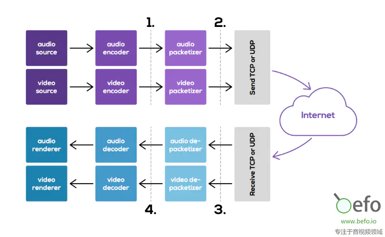

# WebRTC 视频通信中的错误恢复机制

在开始讨论视频压缩和错误恢复机制前，我们先快速回顾一下视频和音频是如何从发送者的摄像头和麦克风传送到接收者的屏幕和音频输出的。

原始码流在发送端捕获，使用选择好的编码方式对帧进行编码后，以包的形式通过网络发送。数据包在接收端被拼装成帧。然后解码器将这些帧解码为原始码流，并进行播放。

如果部分数据包在传输过程中丢失，接收端的解码器会请求发送端重传，同时等待这些包的到来。这对于低延迟的网络很有效，接收端的去抖动缓冲小，足以保持交互性。当延迟较大时，重传的包可能需要比较久的时间才能到达，这时就需要依赖更加复杂的错误恢复机制。

IETF已经定义了可用于帮助解决丢失媒体数据的错误恢复机制：否定确认（NACK）、全内要求（FIR）、照片丢失提示（PLI）、切片丢失提示（SLI）。

前置知识：[《视频编码之I帧 、P帧、B帧》](../图像处理/视频帧.md)

## 否定确认（NACK）

NACK在一多媒体数据流的分组丢失（这是一个通用的机制可以适用于音频和视频流）时由接收端产生。发送者以重发所请求的（如果仍然在其发送缓存中的）包的方式响应NACK ，并基于观察到的往返时间确认该数据包能在解码时及时到达接收端。

## 全内请求（FIR）

视频在WebRTC的会话中总是以一个I帧开始，然后发送P帧。但是，当有新的参与者中途加入会议会话时，很有可能接收到一系列P帧，但因缺少相应的I帧，它并不能解码。这种情况下，该接收端会发送一个FIR以请求一个I帧。

因此，在大的会议平台中，例如与会方达到100人时，在很短的时间间隔内加入或重新加入会议，每个参与者都会请求I帧以开始解码，取决于重新加入的频率，可能会导致发送方创建大量的I帧。

## 图片丢失提示（PLI）

图片丢失提示消息表明突发性的丢包影响到了一个或多个帧中的多个包。发送方可以通过重传这些包或者生成一个新的I帧以作出回应。但一般来说，PLI同时表现得像一个NACK和一个FIR，因此，通过使用PLI，接收端为发送端如何对该请求作出响应提供了更大的灵活度。

## 切片丢失提示（SLI）

切片丢失提示消息表明该包丢失影响到单个帧的部分（即，多个macroblock）。因此，当发送端接收到SLI消息时，它可以通过重新编码的方式纠正切片，停止部分帧解码错误的传播。
