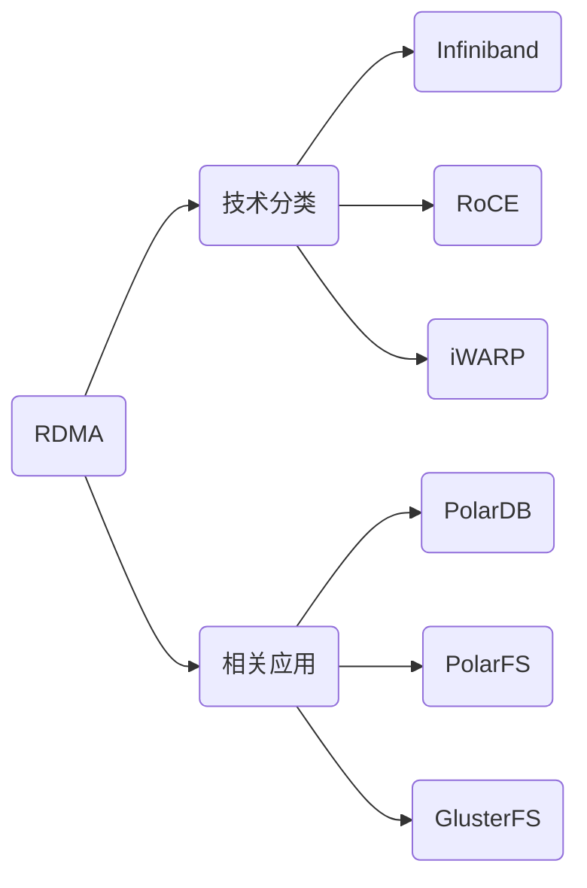

# (未完成)RDMA介绍

RDMA（Remote Direct Memory Access）技术是一种**直接在内存和内存之间进行资料互传**的技术，在数据传输的过程中，**不需要和操作系统Kernel做沟通**，完全实现了Kernel Bypass。

在TCP/IP中，从应用层生成TCP的packet、对packet添加crc、运行TCP协议传输数据到接收端，如果是可靠连接网络，还有流量的控制、查询内存地址、检验crc、还原TCP packet到应用，这些操作都是在CPU内完成的，而在RDMA中，这些操作都在网卡中完成，CPU不参与，这就是为什么RDMA能带来低延时、高带宽和低CPU利用率的原因。

相关资料：

* [在各互联网公司中，有将 RDMA 技术用于生产环境的实例吗？](https://www.zhihu.com/question/59122163)
* [如何评价阿里云新一代关系型数据库 PolarDB？](https://www.zhihu.com/question/63987114)

## 知识图谱

## 技术分类

主要技术公司：以色列Mellanox公司（IBM控股）

### InfiniBand

* RDMA之正统协议，RDMA未来的绝对主流
* RDMA的最佳实践方案
* 与TCP/IP硬件完全不兼容，不支持以太网交换机，必须要有专有硬件，因此成本很高

### RoCE(RDMA over Converged Ethernet)

* 因为IB过于昂贵所以出了个性能不太好的低价版RDMA方案
* 把IB的包放到通用Ethernet上面发出去，支持以太网交换机，只需要支持RoCE协议的网卡即可使用
* 市场上常见的RDMA大都是这个方案

### iWARP

在TCP/IP的基础上实现的RDMA，基本上算是TCP/IP向RoCE的过渡版本，因为性能太差所以正在逐渐淘汰。

### 技术本质

其实不管是iWARP还是RoCE，实际上并不是自己重新发明了RDMA，而是**利用了IB的上层接口修改了下层的实现**，所以RoCE这个名字并不是很准确，比较准确的说法应该是IB over Converged Ethernet。此外，三种实现方式使用的user space api是一样的，都是libibverbs，这个库原本也就是给IB用的，相当于IB的socket。

## 应用领域

### 高性能计算

关于市场，实际上RDMA的市场一直都不算太小，传统的IB主要面向的是HPC（High Performance Compute，高性能计算），比如分布式的人工智能和大数据分析等，HP和IBM一直在使用，但是毕竟HPC只是企业级里面一块很小的业务，也不是什么企业都需要或者用得起HPC的。现在比较值得注意的一点是Intel实际上提出来了一种概念叫做“新型RDMA应用”，即传统的RDMA应用对延迟(lat)和带宽(bw)都非常敏感，而新型RDMA应用则在lat上可以相对宽松，但是却要求在短时间内爆发式的单播或者广播(因为RDMA在协议栈层就支持可靠广播)大量的数据包。比较典型的一个应用是现在很火的大数据，IBM做了一个东西叫做[Spark over RDMA](https://www.youtube.com/watch?v=t_4Ao2fNAfU)。

### 高速存储网络

除了大数据之外，存储市场是将来RDMA发展的一个主要方向，事实上RDMA已经成为了下一代存储网络的事实标准。在10G网络上，如果用iscsi架构，iodepth=32，block-size=4k， random-read-write，TCP能实现的iops约为160～170k，这个数字对于一般的HDD阵列来讲已经足够，因为HDD阵列本身速度较慢。但是对于SSD单盘180k以上的iops，显然TCP性能是不足的，更遑论NVMe SSD单盘550k的ipos。因此，在SSD时代的存储网络中，RDMA几乎是一个必选项。

## InifiniBand

InfiniBand架构是一种支持多并发链接的“转换线缆”技术，它是新一代服务器硬件平台的I/O标准。由于它具有高带宽、低延时、 高可扩展性的特点，它非常适用于服务器与服务器（比如复制，分布式工作等），服务器和存储设备（比如SAN和直接存储附件）以及服务器和网络之间（比如LAN， WANs和the Internet）的通信。

* Infiniband大量用于FC/IP SAN、NAS和服务器之间的连接,作为iSCSI RDMA的存储协议iSER已被IETF标准化。目前EMC全系产品已经切换到Infiniband组网，IBM/TMS的FlashSystem系列，IBM的存储系统XIV Gen3，DDN的SFA系列都采用Infiniband网络。
* 相比FC的优势主要体现在性能是FC的3.5倍，Infiniband交换机的延迟是FC交换机的1/10，支持SAN和NAS。
* 存储系统已不能满足于传统的FC SAN所提供的服务器与裸存储的网络连接架构。HP SFS和IBM GPFS 是在Infiniband fabric连接起来的服务器和iSER Infiniband存储构建的并行文件系统，完全突破系统的性能瓶颈。
* Infiniband采用PCI串行高速带宽链接，从SDR、DDR、QDR、FDR到EDR HCA连接，可以做到1微妙、甚至纳米级别极低的时延，基于链路层的流控机制实现先进的拥塞控制。
* InfiniBand采用虚通道(VL即Virtual Lanes)方式来实现QoS，虚通道是一些共享一条物理链接的相互分立的逻辑通信链路，每条物理链接可支持多达15条的标准虚通道和一条管理通道(VL15)。
