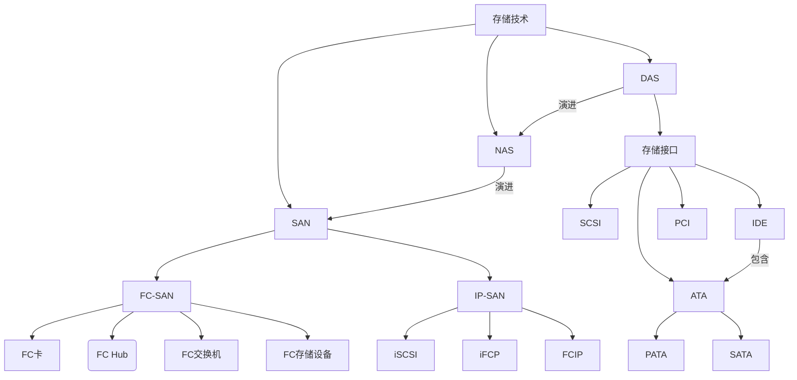
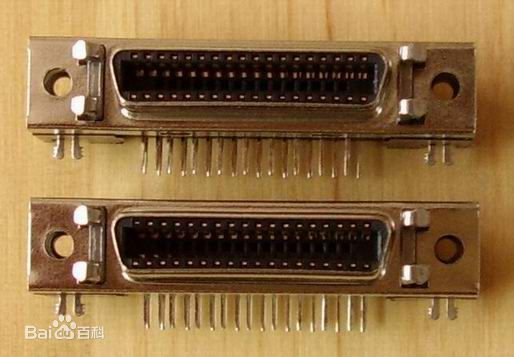
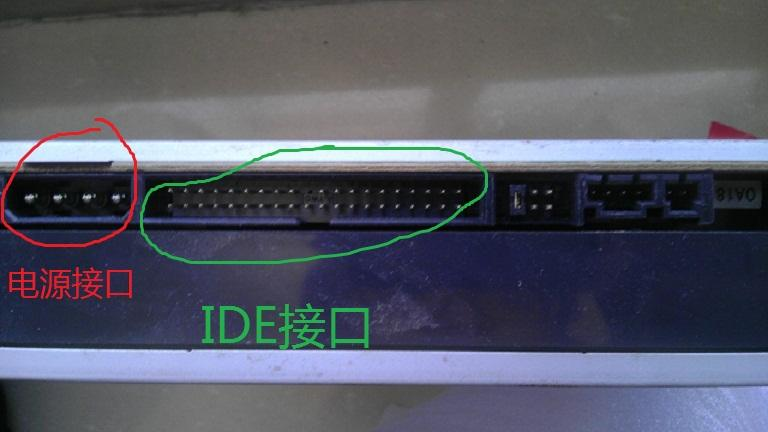
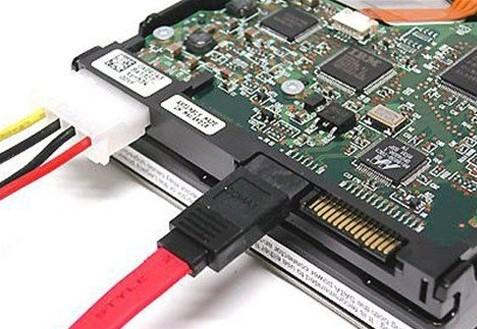
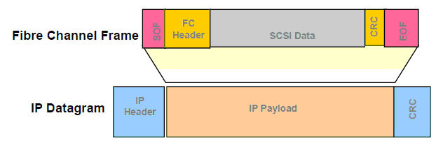
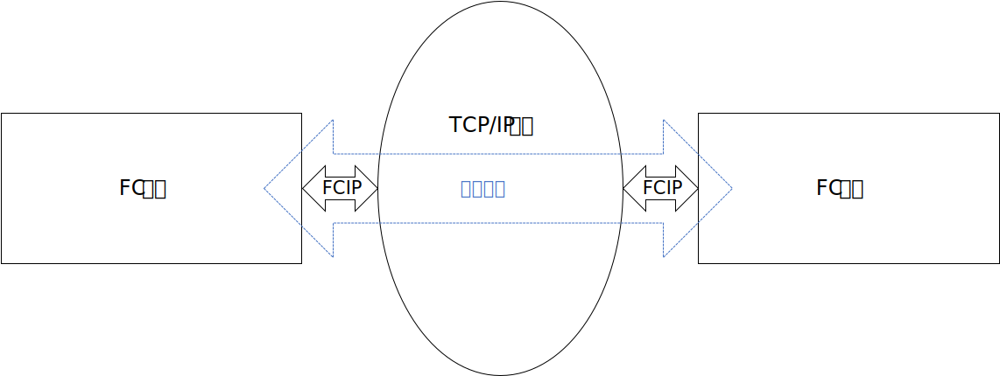
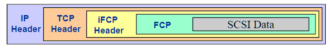
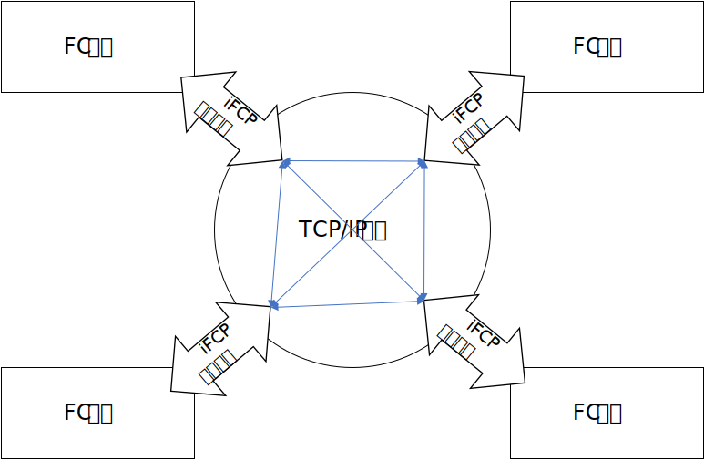

# 存储技术中的一些重要概念

[几种存储技术的比较（FC SAN、IP SAN、DAS、NAS）](https://blog.csdn.net/zhongbeida_xue/article/details/78111086)

## DAS

DAS（Direct Attached Storage）直接附加存储，直接附加存储是指将存储设备通过总线（SCSI、PCI、IDE等）接口直接连接到一台服务器上使用。这是最常见的存设备连接方式。它有几个问题：

* 服务器本身容易成为系统瓶颈
* 服务器发生故障时，数据不可访问
* 对于存在多个服务器的系统来说，设备分散，不便管理。同时多台服务器使用DAS时，存储空间不能在服务器之间动态分配，可能造成相当的资源浪费
* 数据备份操作复杂

### SCSI（Small Computer System Interface，小型计算机系统接口）

* SCSI是一种历史悠久的外设接口，可以用来连接硬盘、软驱、光驱、打印机、扫描仪等外设
* SCSI是个多任务接口，设有母线仲裁功能
* 挂在一个SCSI母线上的多个外设可以同时工作。SCSI上的设备平等占有总线
* 可以同步或异步传输数据，同步传输速率可以达到10MB/s，异步传输速率可以达到1.5MB/s
* 连接电缆可以长达6m

1986年SCSI-1、1994年SCSI-2、1995年SCSI-3、1997年Ultra 2 SCSI、1999年Ultra 3 SCSI、2002年Ultra 320 SCSI、2003年Ultra 640 SCSI

目前SCSI性能稳定，数据流量大，CPU占用低，但成本较高，主要用于中高端服务器与工作站上。

### IDE（Integrated Drive Electronics，集成设备电路、电子集成驱动器）

它的本意是指把“硬盘控制器”与“盘体”集成在一起的硬盘驱动器。IDE是一种磁盘驱动器接口类型，硬盘和光驱通过IDE接口与主板连接。控制器电路就驻留在驱动器中，不再需要单独的适配器卡。

IDE背后的基本思想是应该将硬盘驱动器和控制器组合在一起。控制器是载有芯片的小型电路板，这些芯片对硬盘驱动器如何正确存储和访问数据进行控制。大多数控制器还带有一些内存，它充当缓冲器以增强硬盘驱动器性能。

相比于SCSI，这种接口价格低廉但支持的设备较少，更多用于一般的家用设备中。尤其是在十年前的家用PC机硬盘中非常常见。后文所讲的ATA接口也是从IDE接口演化而来。

### ATA（Advanced Technology Attachment）

一般说来，ATA是一个控制器技术，而IDE是一个匹配它的磁盘驱动器技术，但是两个术语经常可以互用。ATA是一个花费低而性能适中的接口，主要是针对台式机而设计的，销售的大多数ATA控制器和IDE磁盘都是更高版本的，称为ATA - 2和ATA - 3，与之匹配的磁盘驱动器称为增强的IDE。

#### PATA（Parallel ATA）

并行ATA硬盘接口规范，基本停产，现在已经不常见。PATA硬盘接口规模已经具有相当的辉煌的历史了，而且从ATA33/66一直发展到ATA100/133一直到目前最高的ATA150。

#### SATA（Serial ATA）

目前最常见的硬盘接口，在家用机领域已经完全取代前面说的那几个，是硬盘接口的绝对主流。

### PCI（Peripheral Component Interconnect，外设部件互连标准）

目前个人电脑中使用最为广泛的接口，几乎所有的主板产品上都带有这种插槽。PCI插槽也是主板带有最多数量的插槽类型，在目前流行的台式机主板上，ATX结构的主板一般带有5～6个PCI插槽，而小一点的MATX主板也都带有2～3个PCI插槽，可见其应用的广泛性。

计算机组成重要知识点，不多说。

## NAS（Network Attached Storage，网络附加存储）

从这里开始，存储设备进入网络时代。在NAS存储结构中，存储系统不再通过I/O总线附属于某个服务器或客户机，而直接通过网络接口与网络直接相连，由用户通过网络访问。

NAS实际上是一个带有瘦服务器的存储设备，其作用类似于一个专用的文件服务器。这种专用存储服务器去掉了通用服务器原有的不适用的大多数计算功能，而仅仅提供文件系统功能。与传统以服务器为中心的存储系统相比，数据不再通过服务器内存转发，直接在客户机和存储设备间传送，服务器仅起控制管理的作用。

NAS在企业应用中可以说只是DAS到SAN的过渡阶段，而在家用领域，因为家用物联网的推广而备受推崇，家用领域的NAS常用于离线下载、视频照片存储分享等功能中。

## SAN

SAN（Storage Area Network）存储区域网络，是一种专门用于存储的网络，通常独立于计算机局域网（LAN）。SAN将主机和存储设备连接在一起，能够**为其上的任意一台主机和任意一台存储设备提供专用的通信通道**。SAN将存储设备从服务器中独立出来，实现了服务器层次上的存储资源共享。

### FC-SAN

通常SAN由磁盘阵列（RAID）连接光纤通道（Fibre Channel）组成，为了区别于IP SAN，通常SAN也称为FC-SAN。

#### 组成

* FC卡：主要用于主机与FC设备之间的连接
* FC Hub：内部运行仲裁环拓扑，连接到HUB的节点共享100MB/S以上带宽
* FC交换机：内部运行Fabric拓扑，每端口独占100MB/S以上带宽
* FC存储设备：采用FC连接方式，光纤接口可以有一到多个。FC存储设备通常采用光纤硬盘，也有Fibre to SCSI（Fibre to ATA）的解决方案，使用SCSI（或ATA）的硬盘，在整个配置上较便宜
* 存储网络管理软件：存储管理软件主要的功能是自动发现网络拓扑及映射，当在存储网络中增加或减少时自动发现及组态。

**高性能的光纤通道交换机和光纤通道网络协议是FC-SAN的关键**。把以光纤通道交换机为骨干的网络拓扑结构称为“SAN Fabric”。而光纤通道协议是FC-SAN的另一个本质特征。FC-SAN正是利用**在光纤通道协议上加载SCSI协议**来达到可靠的块级数据传输。

#### 应用场景

由于FC-SAN是为在服务器和存储设备之间传输大块数据而进行优化的，因此对于以下应用来说是理想的选择：

* **关键任务数据库**应用，其中可预计的响应时间、可用性和可扩展性是基本要素
* **集中的存储备份**，其中性能、数据一致性和可靠性可以确保企业关键数据的安全
* **高可用性和故障切换环境**可以确保更低的成本、更高的应用水平
* **可扩展的存储虚拟化**，可使存储与直接主机连接相分离，并确保动态存储分区
* **改进的灾难容错特性**，在主机服务器及其连接设备之间提供光纤通道高性能和可扩展的距离

#### 优势

* FC-SAN设备之间采用光纤连接，大块数据传输速度比较快，适合数据密集型应用
* FC-SAN不必宕机和中断与服务器的连接即可增加存储
* FC-SAN可以集中管理数据，从而降低了总体拥有成本
* FC-SAN克服了传统上与SCSI相连的线缆限制，极大地拓展了服务器和存储之间的距离，从而增加了更多连接的可能性

### IP-SAN

IP-SAN是指架设在IP通道而不是光纤通道上的网络协议。除了标准已获通过的iSCSI，还有FCIP、iFCP等正在制定的标准。而iSCSI发展最快，已经成了IP存储一个有力的代表。

像光纤通道一样，IP存储是可交换的，但是与光纤通道不一样的是，IP网络是成熟的，不存在互操作性问题，而光纤通道SAN最令人头痛的就是这个问题。IP已经被IT业界广泛认可，有非常多的网络管理软件和服务产品可供使用。

#### 几个IP-SAN标准

##### iSCSI（internet Small Computer System Interface，互联网小型计算机系统接口）：用TCP/IP网络模拟SCSI

是一种在internet协议网络上，特别是以太网上进行数据块传输的标准。简单地说，iSCSI可以实现**在IP网络上运行SCSI协议**，使其能够在诸如高速千兆以太网上进行路由选择，实现了SCSI和TCP/IP协议的连接。

##### FCIP（Fiber Channel over IP）：用TCP/IP网络模拟两个FC-SAN设备间的互连

FCIP描述了一种机制，能够通过 IP 网络将各个孤立的光纤信道存储区域网络（又称“孤岛”）连接起来，从而形成一个统一的存储区域网络。它实际上**只是一种简单的隧道协议**。

其原理是，在同一个SAN范围内，TCP/IP数据包封装FC命令和数据，从而**在IP网络上传输FC命令和数据**。每个SAN采用标准FC寻址，在FCIP的端点之间建立IP**隧道**（或网关)，一旦隧道建立，扩展的FC设备将被视为标准的FC设备，并予以FC寻址。

* FCIP只能在FCIP设备之间建立点到点连接，即FCIP设备一端(IP端)和另外一个FCIP设备的IP端进行连接，FCIP设备的另外一端(FC端)和FC光纤通道交换机进行连接，FCIP设备无法在两个独立存储设备之间提供本地IP连接
* 由于FCIP是一种不透明的传输协议，即一个SAN向另一个SAN发送的信息在FC层没有错误检测，容易将一个SAN上的错误蔓延到各个SAN

##### iFCP（Internet Fibre Channel Protocol）：用TCP/IP网络模拟全部的FC-SAN功能

此协议和FCIP协议的功能原理相似，都是用TCP/IP网络模拟FC-SAN，不同点在于，FCIP只能模拟两个FC设备间互联，而iFCP完全透明地模拟了FC协议。

iFCP将 Fibre Channel 数据以 IP 包形式封装，并将 IP 地址映射到分离 Fibre Channel 设备。 由于在 IP 网中每类 Fibre Channel 设备都有其独特标识，因而能够与位于 IP网其它节点的设备单独进行存储数据收发

