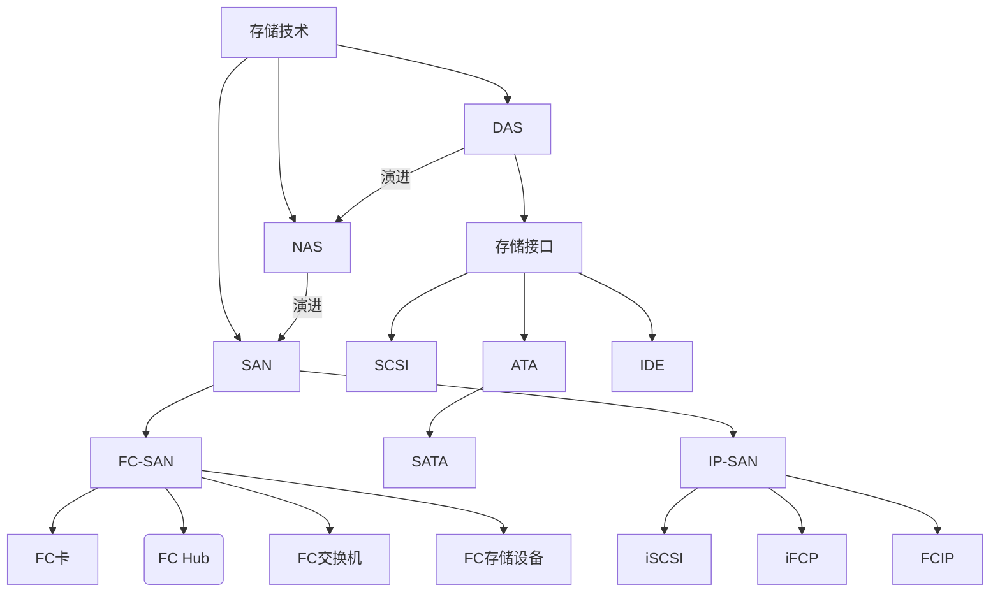

# 存储技术中的一些重要概念

[几种存储技术的比较（FC SAN、IP SAN、DAS、NAS）](https://blog.csdn.net/zhongbeida_xue/article/details/78111086)

## DAS

## NAS

## SAN

SAN（Storage Area Network）存储区域网络，是一种专门用于存储的网络，通常独立于计算机局域网（LAN）。SAN将主机和存储设备连接在一起，能够**为其上的任意一台主机和任意一台存储设备提供专用的通信通道**。SAN将存储设备从服务器中独立出来，实现了服务器层次上的存储资源共享。

### FC-SAN

通常SAN由磁盘阵列（RAID）连接光纤通道（Fibre Channel）组成，为了区别于IP SAN，通常SAN也称为FC-SAN。

#### 组成

* FC卡：主要用于主机与FC设备之间的连接
* FC Hub：内部运行仲裁环拓扑，连接到HUB的节点共享100MB/S以上带宽
* FC交换机：内部运行Fabric拓扑，每端口独占100MB/S以上带宽
* FC存储设备：采用FC连接方式，光纤接口可以有一到多个。FC存储设备通常采用光纤硬盘，也有Fibre to SCSI（Fibre to ATA）的解决方案，使用SCSI（或ATA）的硬盘，在整个配置上较便宜
* 存储网络管理软件：存储管理软件主要的功能是自动发现网络拓扑及映射，当在存储网络中增加或减少时自动发现及组态。

**高性能的光纤通道交换机和光纤通道网络协议是FC-SAN的关键**。把以光纤通道交换机为骨干的网络拓扑结构称为“SAN Fabric”。而光纤通道协议是FC-SAN的另一个本质特征。FC-SAN正是利用光纤通道协议上加载SCSI协议来达到可靠的块级数据传输。

#### 应用场景

由于FC-SAN是为在服务器和存储设备之间传输大块数据而进行优化的，因此对于以下应用来说是理想的选择：

* **关键任务数据库**应用，其中可预计的响应时间、可用性和可扩展性是基本要素
* **集中的存储备份**，其中性能、数据一致性和可靠性可以确保企业关键数据的安全
* **高可用性和故障切换环境**可以确保更低的成本、更高的应用水平
* **可扩展的存储虚拟化**，可使存储与直接主机连接相分离，并确保动态存储分区
* **改进的灾难容错特性**，在主机服务器及其连接设备之间提供光纤通道高性能和可扩展的距离

#### 优势

* FC-SAN设备之间采用光纤连接，大块数据传输速度比较快，适合数据密集型应用
* FC-SAN不必宕机和中断与服务器的连接即可增加存储
* FC-SAN可以集中管理数据，从而降低了总体拥有成本
* FC-SAN克服了传统上与SCSI相连的线缆限制，极大地拓展了服务器和存储之间的距离，从而增加了更多连接的可能性

### IP-SAN

IP-SAN是指架设在IP通道而不是光纤通道上的网络协议。除了标准已获通过的iSCSI，还有FCIP、iFCP等正在制定的标准。而iSCSI发展最快，已经成了IP存储一个有力的代表。

像光纤通道一样，IP存储是可交换的，但是与光纤通道不一样的是，IP网络是成熟的，不存在互操作性问题，而光纤通道SAN最令人头痛的就是这个问题。IP已经被IT业界广泛认可，有非常多的网络管理软件和服务产品可供使用。

#### 几个IP-SAN标准

##### iSCSI（internet Small Computer System Interface，互联网小型计算机系统接口）

是一种在internet协议网络上，特别是以太网上进行数据块传输的标准。简单地说，iSCSI可以实现在IP网络上运行SCSI协议，使其能够在诸如高速千兆以太网上进行路由选择，实现了SCSI和TCP/IP协议的连接。