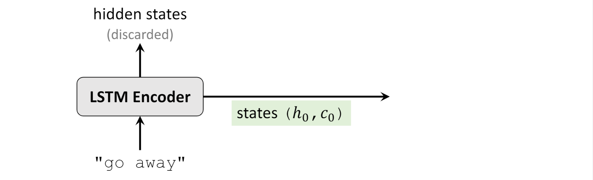
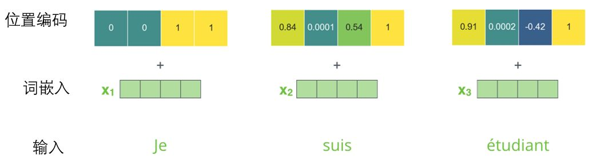
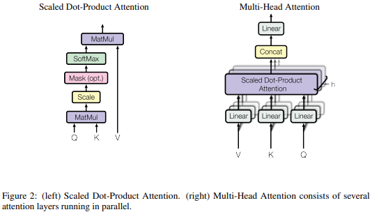

# 机器学习中的Attention机制

前置知识：[RNN和LSTM](LSTM.md)

## 没有注意力机制的Encoder-Decoder模式——以LSTM为例

回顾一下[LSTM的单元结构]((LSTM.md))：

总的来说，LSTM输入一串$x_t$，输出一串$h_t$，在计算过程中每一轮都会有cell state$C_t$和$h_t$一起进入下一轮计算

而Encoder-Decoder模式，一言以蔽之，就是使用一个RNN在一个序列上运行的最终状态输入到另一个RNN中生成另一个序列：

* Encoder使用一个RNN网络读入一个长为$m$的串$\{x_t|1\leq t\leq m\}$，并输出最终的状态$C$作为为“语义编码”
  * 如果RNN是LSTM，那么$C=(h_m,C_m)$
* Decode使用一个RNN网络以语义编码$C$为初始状态生成长$n$的序列$\{y_t|1\leq t\leq n\}$
  * 生成序列中的下一个值时将上一个生成的值作为输入

Encoder相当于将句子读一遍，告诉Decoder这个句子的意思，Decoder根据句子的意思再自己组织语言输出新句子。

Encoder-Decoder模式特别适合于“输入序列A，输出序列B”这种模式的应用，比如Seq2Seq就是输入一个句子（原文），输出另一个句子（译文）；类似的应用还有语音识别（输入一段语音，输出一个句子）、语音合成（输入一个句子，输出一段语音）等。

### Encoder-Decoder结构

输入序列(Source)：
$$\langle x_1,x_2,\dots x_m\rangle$$

输入序列逐个输入到Encoder中，Encoder的最终的cell state作为语义编码：
$$C=\mathcal{F}(x_1,x_2,\dots x_m)$$

Decoder以语义编码作为初始状态，第$i$轮输入$y_{i-1}$输出$y_i$，进而逐个生成输出序列：
$$y_i=\mathcal{G}(C,y_1,y_2,\dots y_{i-1})$$

输出序列(Target)：
$$\langle y_1,y_2,\dots y_n\rangle$$

可以看出，Encoder-Decoder结构并非只能在RNN中使用：
* 只要是输入序列输出固定长度编码的结构都能作为Encoder
* 只要是输入固定长度编码输出序列的结构都能作为Decoder

### 典型用例：Seq2Seq

Seq2Seq是一种基于LSTM实现的机器翻译神经网络，其结构是Encoder-Decoder模式的典型代表。

* Encoder输入序列可以以字母为单位或以单词为单位（词向量）
* Decoder输入序列的第一个字符是起始符`\t`

## 为何需要Attention机制？

回忆一下无Attention机制的Encoder-Decoder生成输出序列的过程：
$$C=\mathcal{F}(x_1,x_2,\dots x_m)$$
$$y_i=\mathcal{G}(C,y_1,y_2,\dots y_{i-1})$$

展开之后具体看看：
$$
\begin{aligned}
y_1&=\mathcal{G}(C)\\
y_2&=\mathcal{G}(C,y_1)\\
y_3&=\mathcal{G}(C,y_1,y_2)\\
&\dots\\
y_i&=\mathcal{G}(C,y_1,y_2,\dots y_{i-1})
\end{aligned}
$$

从这里可以看出，在生成目标句子的单词时，不论生成哪个单词，它们使用的语义编码$C$都是一样的，没有任何区别。这意味着不论是生成哪个单词，**源句子中的每个单词对生成目标句子的单词的影响力都是相同的**，这是为何说这个模型没有体现出注意力的缘由。这类似于人类看到眼前的画面，但是眼中却没有注意焦点一样。

如果拿机器翻译来解释这个分心模型的Encoder-Decoder框架更好理解，比如输入的是英文句子：Tom chase Jerry，Encoder-Decoder框架逐步生成中文单词：“汤姆”，“追逐”，“杰瑞”。

在翻译“杰瑞”这个中文单词的时候，分心模型里面的每个英文单词对于翻译目标单词“杰瑞”贡献是相同的，很明显这里不太合理，显然“Jerry”对于翻译成“杰瑞”更重要，但是分心模型是无法体现这一点的，这就是为何说它没有引入注意力的原因。

没有引入注意力的模型在输入句子比较短的时候问题不大，但是如果输入句子比较长，此时**所有语义完全通过一个中间语义向量来表示，单词自身的信息已经消失**，可想而知会丢失很多细节信息，这也是为何要引入注意力模型的重要原因。

## Attention机制

上面的例子中，如果引入Attention模型的话，应该在翻译“杰瑞”的时候，体现出英文单词对于翻译当前中文单词不同的影响程度，比如给出类似下面一个概率分布值：

(Tom,0.)）(Chase,0.2) (Jerry,0.5)

每个英文单词的概率代表了翻译当前单词“杰瑞”时，注意力分配模型分配给不同英文单词的注意力大小。这对于正确翻译目标语单词肯定是有帮助的，因为引入了新的信息。

这意味着，对于Decoder中输出每个字符，处理使用语义编码$C$之外，还要使用一个与注意力有关的项：

$$
\begin{aligned}
y_1&=\mathcal{G}(C,S_1)\\
y_2&=\mathcal{G}(C,S_2,y_1)\\
y_3&=\mathcal{G}(C,S_3,y_1,y_2)\\
&\dots\\
y_i&=\mathcal{G}(C,S_i,y_1,y_2,\dots y_{i-1})
\end{aligned}
$$

从而包含输出单词对每个输入单词的“注意力”。具体地，相比于Encoder-Decoder模式中的直接抛弃中间数据的方法，**注意力机制将Encoder的RNN中间输出用了起来**：
$$S_i=\alpha_{i,1}s_1+\alpha_{i,2}s_2+\dots\alpha_{i,m}s_m$$
$$\alpha_{i,j}=\mathcal{H}(H_{i-1},s_j)$$

其中，$\alpha_{i,j}$就是生成输出语句中第$i$个单词时对源语句中的第$j$个单词分配的注意力，其**由一个函数$\mathcal{H}$计算而来，这个函数在不同的论文中有不同的实现**，其输入为：
* $s_j$：输入句子第$j$个单词在Encoder的隐层输出
  * 在LSTM中，$s_j=(h_j,C_j)_{Encoder}$
* $H_{i-1}$：输出句子生成第$i-1$个单词时Decoder的隐层输出
  * 在LSTM中，$H_i=(h_i,C_i)_{Decoder}$

## 加入Attention机制后的Encoder-Decoder

输入序列(Source)：
$$\langle x_1,x_2,\dots x_m\rangle$$

输入序列逐个输入到Encoder中，Encoder保存所有的中间状态：
$$s_i=\mathcal{F}(x_1,x_2,\dots x_i)\quad i\in[1,m]$$

Encoder最终状态作为语义编码：
$$C=s_m$$

Decoder以语义编码作为初始状态，在第$i$轮中输入$y_{i-1}$和注意力项输出$y_i$，进而逐个生成输出序列：
$$\alpha_{i,j}=\mathcal{H}(H_{i-1},s_j)$$
$$S_i=\alpha_{i,1}s_1+\alpha_{i,2}s_2+\dots\alpha_{i,m}s_m$$
$$y_i=\mathcal{G}(C,S_i,y_1,y_2,\dots y_{i-1})$$

输出序列(Target)：
$$\langle y_1,y_2,\dots y_n\rangle$$

### 案例

第一篇Attention论文中使用的$\mathcal{H}(H_{i-1},s_j)$函数是将$s_j$向量和$H_{i-1}$向量拼成一个长向量与一个矩阵$W$相乘，经过tanh之后再与一个向量$v$相乘成为标量：

$$\mathcal{H}(H_{i-1},s_j)=v^T\cdot tanh(W\cdot (s_j,H_{i-1})^T)$$

在训练时，除了训练神经网络的参数，还要训练$W$和$v$。

### 效果

## 流行的$K$、$Q$、$V$表示法和上面这些公式的关系

网上流行的$K$、$Q$、$V$表示法比上面Attention RNN的这些公式更接近Attention机制的本质。上面这些公式可以说只是$K$、$Q$、$V$表示法的一种特殊情况。

网上流行的$K$、$Q$、$V$表示法可以表示为：

$$
Attention(Query, Source)=\sum_{i=1}^{|Source|}Similarity(Query, Key_i)Value_i
$$

照着前文中的公式对应一下是这样：
$$
S_i=Attention(\bm\alpha_{i}, \bm s)=\sum_{j=1}^{m}\mathcal{H}(H_{i-1}, s_j)s_j
$$

所以你看上面Attention RNN的这些公式其实就是$K$、$Q$、$V$表示法在$K=V$时的特殊情况。真正的注意力机制可以这么描述：

>把输入看成是一堆$(Key, Value)$对，给定输出中的某个元素$Query$，通过**计算$Query$和各个$Key$的相似性或者相关性**，得到**每个$Key$对应$Value$的权重系数**，然后**对Value进行加权求和**，即得到了最终的Attention数值。所以本质上Attention机制是对$Source$中元素的$Value$值进行加权求和，而$Query$和$Key$用来计算对应Value的权重系数。
>
>从概念上理解，把Attention仍然理解为从大量信息中有选择地筛选出少量重要信息并聚焦到这些重要信息上，忽略大多不重要的信息，这种思路仍然成立。聚焦的过程体现在权重系数的计算上，权重越大越聚焦于其对应的$Value$值上，即权重代表了信息的重要性，而$Value$是其对应的信息。

——引自[《深度学习中的注意力机制》](https://cloud.tencent.com/developer/article/1143127)

## 自注意力机制

有了“输入看成是一堆$(Key, Value)$对”的概念并且以“$K$、$Q$、$V$表示法”理解了注意力机制之后，就可以开始学习自注意力机制了(Self Attention)了。

自注意力是Transformer中使用的注意力机制，随着Transformer的大火一起为人所知。本节就参考Transformer原论文[《Attention Is All You Need》](https://arxiv.org/pdf/1706.03762.pdf)介绍自注意力机制。

上面介绍Attention RNN和自注意力网络最大的区别在于$K$、$Q$、$V$的计算方式。在Attention RNN中，$K$和$V$都是输入$s_i$(词向量)；$Q$是RNN的中间输出$H_{i}$，每一个$H_{i}$的计算都需要上一个$H_{i-1}$作为输入，所以Attention RNN和普通RNN一样只能顺序计算。而Self Attention的$K$、$Q$、$V$是直接由输入的词向量$s_i$乘上3个矩阵$W^Q$、$W^K$、$W^V$得来的，即：
$$
\begin{aligned}
Q_i=s_iW^Q\\
K_i=s_iW^K\\
V_i=s_iW^V\\
\end{aligned}
$$

于是可以用矩阵运算一次算出一个句子里所有词的$K_i$、$Q_i$、$V_i$：

（图中的X表示所有的词向量$s_i$组成的矩阵）

最后，直接用矩阵计算出输出Attention值：
$$
Attention(Q,K,V)=softmax(\frac{QK^T}{\sqrt{d_k}})V
$$

其中，$d_k$是$K_i$、$Q_i$、$V_i$的维度，除以$\sqrt{d_k}$是为了保证训练时梯度的稳定。

矩阵图示为：

结合上一节的介绍可以看到，这个$softmax(\frac{QK^T}{\sqrt{d_k}})$算的就是Similarity，其结果就是一个长宽都等于输入词数量的矩阵，其中的每个值就是第$i$个词和第$j$个词的Similarity：$Similarity_{i,j}=Q_iK_j^T$；输出的$Z=Attention(Q,K,V)$中的每一行就是每个词准备的注意力向量。

至此，Self Attention的注意力计算已经完成了，可以看到没有涉及任何解码器那边的东西，全部是在输入句子上操作，这也是它被叫做“self” attention的原因：只提取了输入句子内部的词之间的联系构成注意力参数。

并且我们还发现，这个Self Attention的注意力计算不涉及什么时序的步骤，可以并行计算。这是自自注意力的一个主要优势，也是现在大家喜欢用它的原因之一。

### 自注意力与顺序

但是问题又来了，没有时序步骤，怎么知道词的顺序信息？

答案是把位置信息搞成位置编码放进输入向量$s_i$里：

比如Transformer里的词向量为512维，位置编码长下图这样，图中每一行对应一个词向量的位置编码，所以第一行对应着输入序列的第一个词。每行包含512个值，每个值介于1和-1之间，颜色越深表示值越大：

可以看到它从中间分裂成两半。这是因为左半部分的值由一个函数(使用正弦)生成，而右半部分由另一个函数(使用余弦)生成。然后将它们拼在一起而得到每一个位置编码向量。

>Transformer原论文里描述了位置编码的公式(第3.5节)。你可以在`get_timing_signal_1d()`中看到生成位置编码的代码。这不是唯一可能的位置编码方法。然而，它的优点是能够扩展到未知的序列长度(例如，当我们训练出的模型需要翻译远比训练集里的句子更长的句子时)。

## 多头注意力

多头注意力就比较简单了，就是直接把多个独立的注意力模块拼接在一起再乘上一个矩阵就完事了：

Transformer里也用到了多头注意力，具体用了8个头。看Transformer原论文[《Attention Is All You Need》](https://arxiv.org/pdf/1706.03762.pdf)里的图：

## 图像识别领域的注意力机制

F. Wang et al., ‘Residual Attention Network for Image Classification’, in 2017 IEEE Conference on Computer Vision and Pattern Recognition (CVPR), Honolulu, HI, Jul. 2017, pp. 6450–6458, doi: 10.1109/CVPR.2017.683.

H. Zhao, J. Jia, and V. Koltun, ‘Exploring Self-Attention for Image Recognition’, in 2020 IEEE/CVF Conference on Computer Vision and Pattern Recognition (CVPR), Seattle, WA, USA, Jun. 2020, pp. 10073–10082, doi: 10.1109/CVPR42600.2020.01009.

截至2020，图像识别领域的注意力机制还在火热研究中。