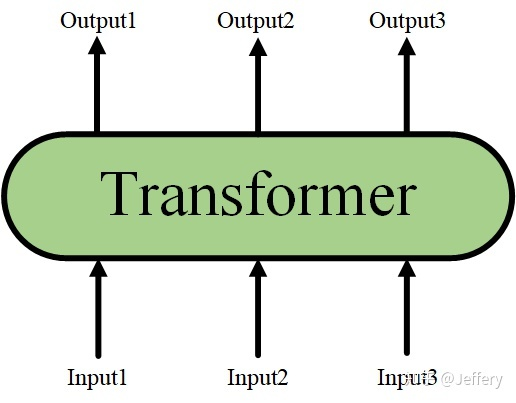
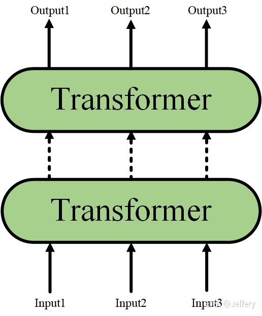
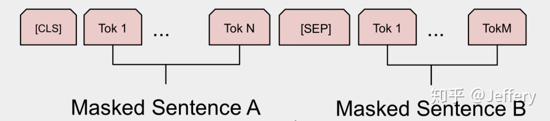
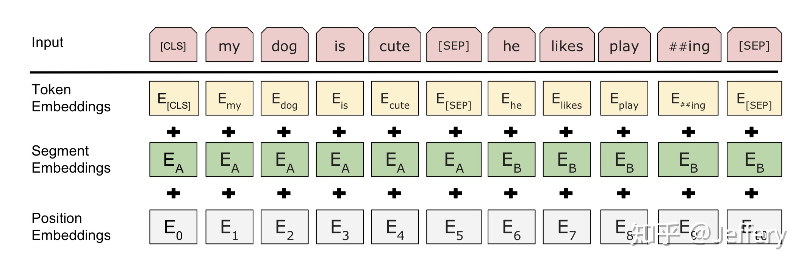

# 【纯转载】什么是BERT？

[原文](https://zhuanlan.zhihu.com/p/98855346)

>前置知识：[Transformer结构](./transformer.md)

>关键点总结：
>* BERT在输入序列的开头放一个空单词用于聚集整个序列表征信息
>* BERT的位置编码(Embeddings)分为分割和位置两种
>* 可学习的Embeddings
>* Masked Language Model(MLM)预训练任务

BERT的全称为Bidirectional Encoder Representation from Transformers，是一个预训练的语言表征模型。它强调了不再像以往一样采用传统的单向语言模型或者把两个单向语言模型进行浅层拼接的方法进行预训练，而是采用新的**masked language model（MLM）**，以致能生成**深度的双向**语言表征。BERT论文发表时提及在11个NLP（Natural Language Processing，自然语言处理）任务中获得了新的state-of-the-art的结果，令人目瞪口呆。

该模型有以下主要优点：

1. 采用MLM对双向的Transformers进行预训练，以生成深层的双向语言表征。
2. 预训练后，只需要添加一个额外的输出层进行fine-tune，就可以在各种各样的下游任务中取得state-of-the-art的表现。在这过程中并不需要对BERT进行任务特定的结构修改。
那BERT是如何实现的呢？

## 1. BERT的结构

以往的预训练模型的结构会受到单向语言模型 *（从左到右或者从右到左）* 的限制，因而也限制了模型的表征能力，使其只能获取单方向的上下文信息。而BERT利用MLM进行预训练并且采用深层的双向Transformer组件 *（单向的Transformer一般被称为Transformer decoder，其每一个token（符号）只会attend到目前往左的token。而双向的Transformer则被称为Transformer encoder，其每一个token会attend到所有的token。）* 来构建整个模型，因此最终生成**能融合左右上下文信息**的深层双向语言表征。关于Transformer的详细解释可以参见 **[Attention Is All You Need](https://arxiv.org/abs/1706.03762)** 或者 **[The Illustrated Transformer](https://jalammar.github.io/illustrated-transformer/)** ***（首推！）*** 。

当隐藏了Transformer的详细结构后，我们就可以用一个只有输入和输出的黑盒子来表示它了：



而Transformer又可以进行堆叠，形成一个更深的神经网络：



最终，经过多层Transformer结构的堆叠后，形成BERT的主体结构：


对于不同的下游任务，BERT的结构可能会有不同的轻微变化，因此接下来只介绍**预训练阶段**的模型结构。

##**1.1 BERT的输入**


BERT的输入为每一个token对应的表征 *（图中的粉红色块就是token，黄色块就是token对应的表征）* ，并且单词字典是采用WordPiece算法来进行构建的。为了完成具体的分类任务，除了单词的token之外，作者还在输入的每一个序列开头都插入特定的**分类token（[CLS]）**，该分类token对应的最后一个Transformer层输出被用来起到聚集整个序列表征信息的作用。

由于BERT是一个预训练模型，其必须要适应各种各样的自然语言任务，因此模型所输入的序列必须有能力包含一句话 *（文本情感分类，序列标注任务）* 或者两句话以上 *（文本摘要，自然语言推断，问答任务）* 。那么如何令模型有能力去分辨哪个范围是属于句子A，哪个范围是属于句子B呢？BERT采用了两种方法去解决：

1. 在序列tokens中把 **分割token（[SEP]）** 插入到每个句子后，以分开不同的句子tokens。
2. 为每一个token表征都添加一个可学习的分割embedding来指示其属于句子A还是句子B。
因此最后模型的输入序列tokens为下图 *（如果输入序列只包含一个句子的话，则没有[SEP]及之后的token）* ：



上面提到了BERT的输入为每一个token对应的表征，实际上该表征是由三部分组成的，分别是对应的**token**，**分割**和**位置**embeddings *（位置embeddings的详细解释可参见[Attention Is All You Need](https://arxiv.org/abs/1706.03762) 或 [The Illustrated Transformer](https://jalammar.github.io/illustrated-transformer/)）* ，如下图：



到此为止，BERT的输入已经介绍完毕，可以看到其设计的思路十分简洁而且有效。

## 1.2 BERT的输出

介绍完BERT的输入，实际上BERT的输出也就呼之欲出了，因为Transformer的特点就是有多少个输入就有多少个对应的输出，如下图：


**C**为分类token（[CLS]）对应最后一个Transformer的输出，$T_i$则代表其他token对应最后一个Transformer的输出。对于一些token级别的任务 *（如，序列标注和问答任务）* ，就把$T_i$输入到额外的输出层中进行预测。对于一些句子级别的任务 *（如，自然语言推断和情感分类任务）* ，就把**C**输入到额外的输出层中，这里也就解释了为什么要在每一个token序列前都要插入特定的分类token。

到此为止，BERT的输入输出都已经介绍完毕了，更多具体的细节可以到原论文中察看。

## 2. BERT的预训练任务

实际上预训练的概念在CV（Computer Vision，计算机视觉）中已经是很成熟了，应用十分广泛。CV中所采用的预训练任务一般是ImageNet图像分类任务，完成图像分类任务的**前提**是必须能抽取出良好的图像特征，同时ImageNet数据集有规模大、质量高的优点，因此常常能够获得很好的效果。

虽然NLP领域没有像ImageNet这样质量高的人工标注数据，但是可以利用大规模文本数据的**自监督性质**来构建预训练任务。因此BERT构建了两个预训练任务，分别是**Masked Language Model**和**Next Sentence Prediction**。

## 2.1 Masked Language Model（MLM）

MLM是BERT能够不受单向语言模型所限制的原因。简单来说就是以15%的概率用mask token （[MASK]）随机地对每一个训练序列中的token进行替换，然后预测出[MASK]位置原有的单词。然而，由于[MASK]并不会出现在下游任务的微调（fine-tuning）阶段，因此预训练阶段和微调阶段之间产生了**不匹配** *（这里很好解释，就是预训练的目标会令产生的语言表征对[MASK]敏感，但是却对其他token不敏感）* 。因此BERT采用了以下策略来解决这个问题：

首先在每一个训练序列中以15%的概率随机地选中某个token位置用于预测，假如是第i个token被选中，则会被替换成以下三个token之一

1. 80%的时候是[MASK]。如，my dog is **hairy**——>my dog is **[MASK]**
2. 10%的时候是随机的其他token。如，my dog is **hairy**——>my dog is **apple**
3. 10%的时候是原来的token *（保持不变，个人认为是作为2所对应的负类）* 。如，my dog is **hairy**——>my dog is **hairy**
再用该位置对应的$T_i$去预测出原来的token（ *输入到全连接，然后用softmax输出每个token的概率，最后用交叉熵计算loss）* 。

该策略令到BERT不再只对[MASK]敏感，而是对所有的token都敏感，以致能抽取出任何token的表征信息。这里给出论文中关于该策略的实验数据：


## 2.2 Next Sentence Prediction（NSP）

一些如问答、自然语言推断等任务需要理解两个句子之间的关系，而MLM任务倾向于抽取**token层次**的表征，因此不能直接获取**句子层次**的表征。为了使模型能够有能力理解句子间的关系，BERT使用了NSP任务来预训练，简单来说就是预测两个句子是否连在一起。具体的做法是：对于每一个训练样例，我们在语料库中挑选出句子A和句子B来组成，50%的时候句子B就是句子A的下一句 *（标注为IsNext）* ，剩下50%的时候句子B是语料库中的随机句子 *（标注为NotNext）* 。接下来把训练样例输入到BERT模型中，用[CLS]对应的C信息去进行二分类的预测。

## 2.3 预训练任务总结

最后训练样例长这样：

```
Input1=[CLS] the man went to [MASK] store [SEP] he bought a gallon [MASK] milk [SEP]
Label1=IsNext
Input2=[CLS] the man [MASK] to the store [SEP] penguin [MASK] are flight ##less birds [SEP]
Label2=NotNext
```
把每一个训练样例输入到BERT中可以相应获得两个任务对应的loss，再把这两个loss加在一起就是整体的预训练loss。 *（也就是两个任务**同时**进行训练）* 

可以明显地看出，这两个任务所需的数据其实都可以从**无标签的**文本数据中构建（自监督性质），比CV中需要人工标注的ImageNet数据集可简单多了。

## 总结

以上就是BERT的简介，如果看完后还想更进一步地了解详细的实验内容，直接看论文原文是你最好的选择。

## 参考资料：

[https://arxiv.org/pdf/1810.04805.pdf](https://arxiv.org/pdf/1810.04805.pdf)

[The Illustrated Transformer​](https://jalammar.github.io/illustrated-transformer/)
