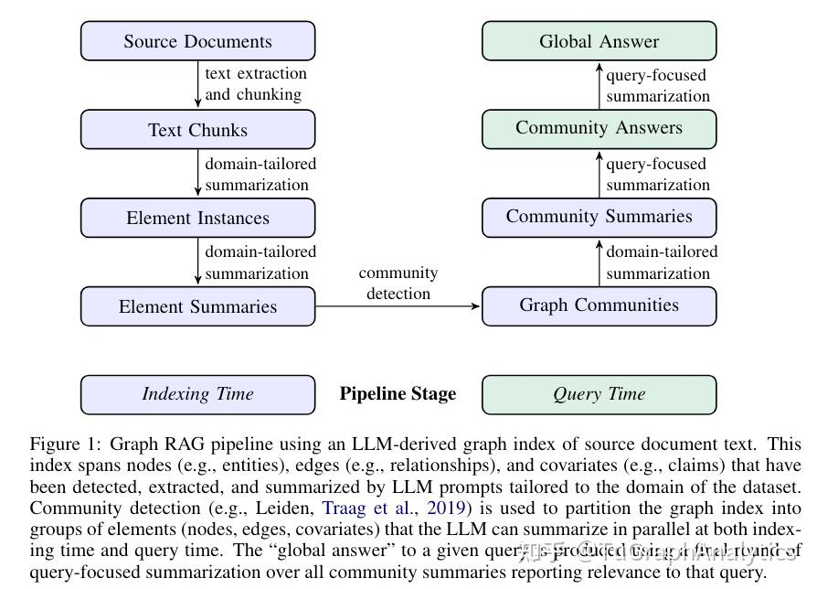
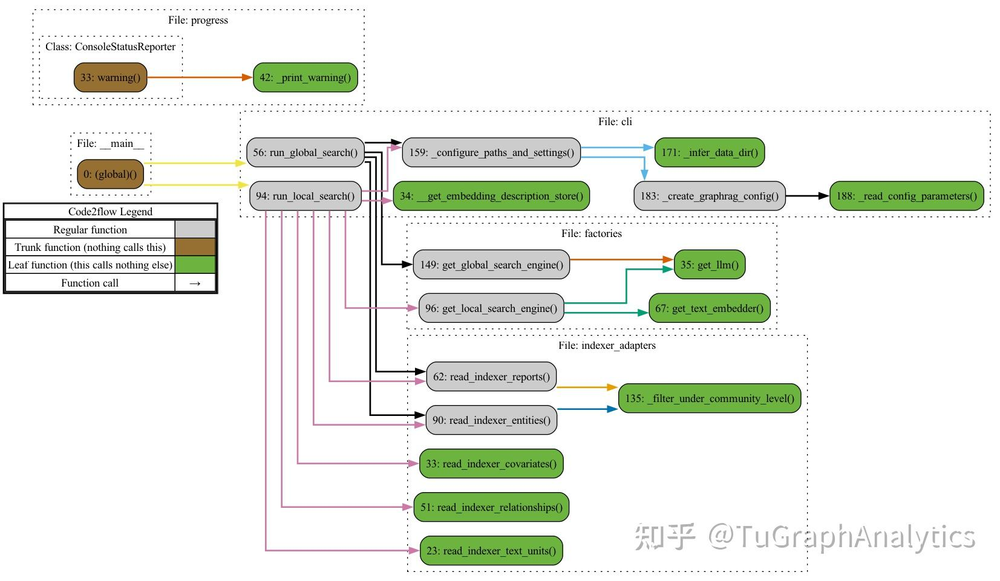

# 【转载】微软GraphRAG框架源码解读

作者：薛明

编者：范志东

两个月前，微软发布了GraphRAG的论文[《From Local to Global: A Graph RAG Approach to Query-Focused Summarization》](https://arxiv.org/abs/2404.16130)，基于知识图谱技术改进查询聚焦摘要（QFS）任务的问答，我也在之前的文章[《Vector | Graph：蚂蚁首个开源Graph RAG框架设计解读》](https://zhuanlan.zhihu.com/p/703735293)中提到借鉴“图社区总结”的思路对框架进行改进。7月2日，微软正式官宣[GraphRAG项目](https://github.com/microsoft/graphrag)开源，短短一周破8K星。相信不少小伙伴已经开始着手分析项目的代码和文档了，这里奉上外网薛同学新鲜出炉的源码解读文章，以飨读者。

> 本文经作者全权授权转载。 
>原文链接：[https://m1n9x.vercel.app/2024/07/09/源码解读%20-%20微软GraphRAG框架/](https://m1n9x.vercel.app/2024/07/09/%E6%BA%90%E7%A0%81%E8%A7%A3%E8%AF%BB%20-%20%E5%BE%AE%E8%BD%AFGraphRAG%E6%A1%86%E6%9E%B6/)

### 1. 引言

这几天微软开源了一个新的基于知识图谱构建的检索增强生成（RAG）系统：GraphRAG。该框架旨在利用大型语言模型（LLMs）从非结构化文本中提取结构化数据，构建具有标签的知识图谱，以支持数据集问题生成、摘要问答等多种应用场景。GraphRAG的一大特色是利用图机器学习算法针对数据集进行语义聚合和层次化分析，因而可以回答一些相对高层级的抽象或总结性问题，这一点恰好是常规RAG系统的短板。 说实话之前一直有在关注这个框架，所以这两天花了点时间研究了一下源码，结合之前的一些技术文档，本文主要是记录GraphRAG源码方面的一些解读，也希望借此进一步理解其系统架构、关键概念以及核心工作流等。

本次拉取的GraphRAG项目源码对应commit ID为 `a22003c302bf4ffeefec76a09533acaf114ae7bb` ，更新日期为2024.07.05。

### 2. 框架概述

### 2.1 解决了什么问题（What & Why）?

讨论代码前，我们先简单了解下GraphRAG项目的目标与定位. 在论文中，作者很明确地提出了一个常规RAG无法处理的应用场景：

> However，RAG fails on global questions directed at an entire text corpus，such as “What are the main themes in the dataset?”，since this is inherently a queryfocused summarization (QFS) task，rather than an explicit retrieval task.

也就是类似该数据集的主题是什么这种high level的总结性问题，作者认为，这种应用场景本质上一种聚焦于查询的总结性(QueryFocused Summarization，QFS)任务，单纯只做数据检索是无法解决的. 相应的，其解决思路也在论文中清楚地描述出来了：

> In contrast with related work that exploits the structured retrieval and traversal affordances of graph indexes (subsection 4.2)，we focus on a previously unexplored quality of graphs in this context: their inherent modularity (Newman，2006) and the ability of community detection algorithms to partition graphs into modular communities of closely-related nodes (e.g.，Louvain，Blondel et al.，2008; Leiden，Traag et al.，2019). LLM-generated summaries of these community descriptions provide complete coverage of the underlying graph index and the input documents it represents. Query-focused summarization of an entire corpus is then made possible using a map-reduce approach: first using each community summary to answer the query independently and in parallel，then summarizing all relevant partial answers into a final global answer.

利用社区检测算法（如Leiden算法）将整个知识图谱划分模块化的社区(包含相关性较高的节点)，然后大模型自下而上对社区进行摘要，最终再采取map-reduce方式实现QFS: 每个社区先并行执行Query，最终汇总成全局性的完整答案.

### 2.2 实现方式是什么（How）?


>




>

论文中给出了解决问题的基本思路，与其他RAG系统类似，GraphRAG整个Pipeline也可划分为索引(Indexing)与查询(Query)两个阶段。索引过程利用LLM提取出节点（如实体）、边（如关系）和协变量（如 claim），然后利用社区检测技术对整个知识图谱进行划分，再利用LLM进一步总结。最终针对特定的查询，可以汇总所有与之相关的社区摘要生成一个全局性的答案。

### 3. 源码解析

官方文档说实话写得已经很清楚了，不过想要理解一些实现上的细节，还得深入到源码当中. 接下来，一块看下代码的具体实现. 项目源码结构树如下：

```language-text
├── cache
├── config
├── emit
├── graph
│ ├── embedding
│ ├── extractors
│ │ ├── claims
│ │ ├── community_reports
│ │ ├── graph
│ │ └── summarize
│ ├── utils
│ └── visualization
├── input
├── llm
├── progress
├── reporting
├── storage
├── text_splitting
├── utils
├── verbs
│ ├── covariates
│ │ └── extract_covariates
│ │ └── strategies
│ │ └── graph_intelligence
│ ├── entities
│ │ ├── extraction
│ │ │ └── strategies
│ │ │ └── graph_intelligence
│ │ └── summarize
│ │ └── strategies
│ │ └── graph_intelligence
│ ├── graph
│ │ ├── clustering
│ │ │ └── strategies
│ │ ├── embed
│ │ │ └── strategies
│ │ ├── layout
│ │ │ └── methods
│ │ ├── merge
│ │ └── report
│ │ └── strategies
│ │ └── graph_intelligence
│ ├── overrides
│ └── text
│ ├── chunk
│ │ └── strategies
│ ├── embed
│ │ └── strategies
│ ├── replace
│ └── translate
│ └── strategies
└── workflows
 └── v1
```

### 3.1 Demo

研究具体功能前，先简单跑下官方demo，上手也很简单，直接参考[Get Started (microsoft.github.io)](https://microsoft.github.io/graphrag/posts/get_started/) 即可。 高能预警: 虽然只是一个简单demo，但是Token消耗可是一点都不含糊，尽管早有预期，并且提前删除了原始文档超过一半的内容，不过我这边完整跑下来还是花了差不多3刀费用，官方完整demo文档跑一遍，预计得消耗5~10刀。

这里实际运行时间还是比较慢的，大模型实际上是来来回回的在过整个文档，其中一些比较重要的事项如下：

* 目录结构


```language-text
├── cache
│ ├── community_reporting
│ │ ├── create_community_report-chat-v2-0d811a75c6decaf2b0dd7b9edff02389
│ │ ├── create_community_report-chat-v2-1205bcb6546a4379cf7ee841498e5bd4
│ │ ├── create_community_report-chat-v2-1445bd6d097492f734b06a09e579e639
│ │ ├── ...
│ ├── entity_extraction
│ │ ├── chat-010c37f5f6dedff6bd4f1f550867e4ee
│ │ ├── chat-017a1f05c2a23f74212fd9caa4fb7936
│ │ ├── chat-09095013f2caa58755e8a2d87eb66fc1
│ │ ├── ...
│ ├── summarize_descriptions
│ │ ├── summarize-chat-v2-00e335e395c5ae2355ef3185793b440d
│ │ ├── summarize-chat-v2-01c2694ab82c62924080f85e8253bb0a
│ │ ├── summarize-chat-v2-03acd7bc38cf2fb24b77f69b016a288a
│ │ ├── ...
│ └── text_embedding
│ ├── embedding-07cb902a76a26b6f98ca44c17157f47f
│ ├── embedding-3e0be6bffd1c1ac6a091f5264858a2a1
│ ├── ...
├── input
│ └── book.txt
├── output
│ └── 20240705-142536
│ ├── artifacts
│ │ ├── create_base_documents.parquet
│ │ ├── create_base_entity_graph.parquet
│ │ ├── create_base_extracted_entities.parquet
│ │ ├── create_base_text_units.parquet
│ │ ├── create_final_communities.parquet
│ │ ├── create_final_community_reports.parquet
│ │ ├── create_final_documents.parquet
│ │ ├── create_final_entities.parquet
│ │ ├── create_final_nodes.parquet
│ │ ├── create_final_relationships.parquet
│ │ ├── create_final_text_units.parquet
│ │ ├── create_summarized_entities.parquet
│ │ ├── join_text_units_to_entity_ids.parquet
│ │ ├── join_text_units_to_relationship_ids.parquet
│ │ └── stats.json
│ └── reports
│ ├── indexing-engine.log
│ └── logs.json
├── prompts
│ ├── claim_extraction.txt
│ ├── community_report.txt
│ ├── entity_extraction.txt
│ └── summarize_descriptions.txt
└── settings.yaml
```

这个文件中的很多文档都值得仔细研究，后续将结合代码详细说明。

此外，console中会打印很多运行日志，其中比较重要的一条就是完整的workflows，会涉及到完整pipeline的编排：

```language-text
⠹ GraphRAG Indexer 
├── Loading Input (InputFileType.text) - 1 files loaded (0 filtered) ━━━━━━━━━━━━━━━━━━━━━━━━━━━━━━━━━━━━━━━━ 100% 0:00:00 0:00:00
├── create_base_text_units
├── create_base_extracted_entities
├── create_summarized_entities
├── create_base_entity_graph
├── create_final_entities
├── create_final_nodes
├── create_final_communities
├── join_text_units_to_entity_ids
├── create_final_relationships
├── join_text_units_to_relationship_ids
├── create_final_community_reports
├── create_final_text_units
├── create_base_documents
└── create_final_documents
 All workflows completed successfully.
```

### 3.2 Index

索引阶段整体看下来应该算是整个项目的核心，整体流程还是比较复杂的。 执行indexing的语句如下：

```language-text
python -m graphrag.index --init --root ./ragtest
python -m graphrag.index --root ./ragtest
```


>


>

简单跟一下，发现实际调用的是 `graphrag/index/__main__.py` 文件中的主函数，使用 `argparse` 解析输入参数，实际调用的是 `graphrag/index/cli.py` 中的 `index_cli` 函数。

继续解读源码前，先简单看下相关函数的调用链路，如上图所示，其中灰色标记的函数是我们需要重点关注的。

*  `cli.py::index_cli()` 函数首先根据用户输入参数，如 `--init` ，确定是否需要初始化当前文件夹，这部分具体由 `cli.py::index_cli()` 执行，其具体实现逻辑比较简单，检查目录下的一些配置、prompt、.env等文件是否存在，没有则创建，具体文件内容，就是上一节目录中展示的  `settings.yaml` 、 `prompts` 等。
* 真正执行indexing操作时，实际上会执行一个内部函数 `cli.py::index_cli()._run_workflow_async()` ，主要会涉及到 `cli.py::_create_default_config()` 与 `run.py::run_pipeline_with_config()` 两个函数。


限于篇幅，我们在此只讨论默认配置运行流程，大致梳理清楚相关逻辑后，可自行修改相关配置。

* 默认配置生成逻辑： `cli.py::_create_default_config()` 首先检查根目录以及配置文件 `settings.yaml` ，然后执行 `cli.py::_read_config_parameters()` 读取系统配置，如llm、chunks、cache、storage等，接下来的操作比较关键，后续会根据当前参数创建一个pipeline的配置，具体代码位于  `create_pipeline_config.py::create_pipeline_config()` ，这块绕了蛮久，可以说是整个项目中逻辑比较复杂的模块了。
* 如果深入 `create_pipeline_config.py::create_pipeline_config()` 的代码，可以发现其核心逻辑如下：


```language-python
result = PipelineConfig(
 root_dir=settings.root_dir,
 input=_get_pipeline_input_config(settings),
 reporting=_get_reporting_config(settings),
 storage=_get_storage_config(settings),
 cache=_get_cache_config(settings),
 workflows=[
 *_document_workflows(settings，embedded_fields),
 *_text_unit_workflows(settings，covariates_enabled，embedded_fields),
 *_graph_workflows(settings，embedded_fields),
 *_community_workflows(settings，covariates_enabled，embedded_fields),
 *(_covariate_workflows(settings) if covariates_enabled else []),
 ],
)
```

这段代码的基本逻辑就是根据不同的功能生成完整的workflow序列，此处需要注意的是这里并不考虑workflow之间的依赖关系，单纯基于 `workflows/v1` 目录下的各workflow的模板生成一系列的workflow。

* Pipeline执行逻辑： `run.py::run_pipeline_with_config()` 首先根据 `load_pipeline_config.py::load_pipeline_config()` 加载现有pipeline的配置(由上一步中 `cli.py::_create_default_config()` 生成)，然后创建目标文件中的其他子目录，如cache，storage，input，output等(详见上一节目录结构树)，然后再利用 `run.py::run_pipeline()` 依次执行每一个工作流，并返回相应结果。


这里有必要再单独说明一下 `run.py::run_pipeline()` ，该函数用于真正的执行所有pipeline，其核心逻辑包含以下两部分：

* 加载workflows： `workflows/load.py::load_workflows()` ，除了常规工作流的创建外，还会涉及到拓扑排序问题。
*  `workflows/load.py::create_workflow()` ：利用已有模板，创建不同的工作流。
*  `graphlib::topological_sort()` ：根据workflow之间的依赖关系，计算DAG的拓扑排序、
* 进一步执行 `inject_workflow_data_dependencies()` 、 `write_workflow_stats()` 、 `emit_workflow_output` 等操作，分别用于依赖注入，数据写入以及保存，真正的 `workflow.run` 操作会在 `write_workflow_stats()` 之前执行，此处的核心逻辑可参考以下代码。


```language-python
await dump_stats()
for workflow_to_run in workflows_to_run:
 # Try to flush out any intermediate dataframes
 gc.collect()
 workflow = workflow_to_run.workflow
 workflow_name: str = workflow.name
 last_workflow = workflow_name
 log.info("Running workflow: %s..."，workflow_name)
 if is_resume_run and await storage.has(
 f"{workflow_to_run.workflow.name}.parquet"
 ):
 log.info("Skipping %s because it already exists"，workflow_name)
 continue
 stats.workflows[workflow_name] = {"overall": 0.0}
 await inject_workflow_data_dependencies(workflow)
 workflow_start_time = time.time()
 result = await workflow.run(context，callbacks)
 await write_workflow_stats(workflow，result，workflow_start_time)
 # Save the output from the workflow
 output = await emit_workflow_output(workflow)
 yield PipelineRunResult(workflow_name，output，None)
 output = None
 workflow.dispose()
 workflow = None
stats.total_runtime = time.time() - start_time
await dump_stats()
```

根据以上信息，我们可以大致梳理出索引环节的完整工作流。

* 初始化：生成必要的配置文件，缓存，input/output目录等。
* 索引：根据配置文件，利用workflow模板创建一系列的pipeline，并依据依赖关系，调整实际执行顺序，再依次执行。


### 3.3 Workflow

截至目前，我们实际上还没有真正分析index阶段的业务逻辑，只是搞清楚了GraphRAG内置的这套pipeline编排系统该如何工作。这里以 `index/workflows/v1/create_final_entities.py` 为例，一起看下具体的一个workflow是如何运行的。

* DataShaper


讨论workflow之前，先简单了解下项目使用的另一个框架: [DataShaper](https://github.com/microsoft/datashaper) 是微软开源的一款用于执行工作流处理的库，内置了很多组件(专业名词叫做Verb). 通俗来讲，DataShaper就像一条流水线，每一步定义了作用于input数据的一种操作，类似pytorch图像变换中clip、rotate、scale等操作，如果还是不能理解，建议直接跑一下官方文档中的demo程序 `examples/single_verb` ，应该就大致清楚怎么回事了。从功能上来讲，个人感觉有点像Prefect。

* 知识图谱构建


对应的工作流是 `create_final_entities.py` ，翻阅源码可以发现，该workflow会依赖于 `workflow:create_base_extracted_entities` ，同时定义了 `cluster_graph` 、 `embed_graph` 等操作，其中 `cluster_graph` 采用了leiden策略，具体代码位于 `index/verbs/graph/clustering/cluster_graph.py` 。

```language-python
from datashaper import TableContainer，VerbCallbacks，VerbInput，progress_iterable，verb
@verb(name="cluster_graph")
def cluster_graph(
 input: VerbInput,
 callbacks: VerbCallbacks,
 strategy: dict[str，Any],
 column: str,
 to: str,
 level_to: str | None = None,
 **_kwargs,
) -> TableContainer:
```

可以看出，实际上就是加了一个verb装饰器而已，进一步跟进 strategy 的实现可以发现，这里的leiden算法实际上也是源自另一个图算法库： [graspologic-org/graspologic: Python package for graph statistics (github.com)](https://github.com/graspologic-org/graspologic)。

* Pipeline


搞清楚了上述workflow的执行逻辑，再根据上节最后提到的编排日志，或者 `artifacts/stats.json` 文件，就可以整理出完整工作流了. 官方文档也放出了非常详细的说明，参见[Indexing Dataflow (microsoft.github.io)](https://microsoft.github.io/graphrag/posts/index/1-default_dataflow/) 不过我这边依据源码提取出来的pipeline好像还是有些差异的，有做过相关工作的可以留言探讨下。

### 3.4 Query

查询阶段的pipeline相对而言要简单些，执行query的语句如下：

```language-text
# Global search
python -m graphrag.query \
--root ./ragtest \
--method global \
"What are the top themes in this story?"
# Local search
python -m graphrag.query \
--root ./ragtest \
--method local \
"Who is Scrooge，and what are his main relationships?"
```

这里需要注意的是有Global/Local search两种模式。还是先生成函数调用关系图，对整体结构能有个大致了解。


>




>

 `graphrag/query/__main__.py` 中的主函数会依据参数不同，分别路由至 `cli::run_local_search()` 以及 `cli::run_global_search()` 。

### 3.4.1 Global Search

 `cli::run_global_search()` 主要调用了 `factories.py::get_global_search_engine()` 函数，返回一个详细定义的 `GlobalSearch` 类，进一步跟进去，发现该类跟 `LocalSearch` 类相似，都是基于工厂模式创建，其核心方法为 `structured_search/global_search/search.py::GlobalSearch.asearch()` ，具体使用了map-reduce方法，首先使用大模型并行地为每个社区的summary生成答案，然后再汇总所有答案生成最终结果，此处建议参考map/reduce的相关prompts，作者给出了非常详细的说明。也正是因为这种map-reduce的机制，导致global search对token的消耗量极大。

### 3.4.2 Local Search

与全局搜索类似， `cli::run_local_search()` 函数主要也是调用了 `factories.py::get_local_search_engine()` ，返回一个 `LocalSearch` 类，这里的 `asearch()` 相对比较简单，会直接根据上下文给出回复，这种模式更接近于常规的RAG语义检索策略，所消耗的Token也比较少。 与全局搜索不同的地方在于，Local 模式综合了nodes，community_reports，text_units，relationships，entities，covariates等多种源数据，这一点在官方文档中也给出了非常详细的说明，不再赘述。

### 4. 一些思考

* GraphRAG最核心的卖点就在于一定程度上解决了聚焦于查询的总结性(QueryFocused Summarization，QFS)任务，这一点就个人了解到的，应该还是首创，在此之前，思路上最接近的应该就是 [parthsarthi03/raptor: The official implementation of RAPTOR: Recursive Abstractive Processing for Tree-Organized Retrieval (github.com)](https://github.com/parthsarthi03/raptor)，不过后者并非针对知识图谱。QFS与Multi-Hop Q&A应该是现阶段RAG系统都暂时无法解决的难点，但是对于很多场景，尤其是数据分析领域，却有着广泛的应用. 虽然当下GraphRAG的使用成本还很高，不过至少提供了一种可能性。
* 此外，个人感觉相较于一般的知识图谱RAG项目，GraphRAG给我印象更为深刻的，是内置了一套相对完整的工作流编排系统，这一点在其他RAG框架中还不多见. 这可能也是后续一个值得深挖的方向，基于模板定义好大部分工作流，提供少部分的配置灵活性，每一个环节都可控可追溯，而不是一味地让大模型执行所有操作。


与之相对地，常规RAG部分，比如embedding，retrieval等环节反而没有太多需要讨论的地方，尽管加了个社区检测算法。

* 当然，本项目在知识图谱的处理颗粒度上也做得很细，比如社区检测的 leiden 算法，综合多源数据的 local search等. 一个有意思的点在于，项目中实体抽取相较于常规的一些基于Pydantic的思路，目前已经是完全采用大模型实现了，并且在三元组的schema方面也未设置任何约束，作者还简单解释了下，因为总是要做相似性聚类的，所以每次大模型抽取即使有些差异，最终社区的生成也不会有很大影响，这一点说实话在鲁棒性方面确实是很大的提升 。
* 我个人觉得目前的GraphRAG也仍旧还有很多值得改进的地方，比如搞了很多让人云里雾里的名词，诸如 Emit，Claim，Verbs，Reporting 之类，同时夹带私货，用了一些微软自家的相对比较小众的库，这也进一步加大了理解上的难度，此外，模块化方面应该也有待加强，尤其是OpenAI那块，耦合严重。


综合来看，微软本次放出的GraphRAG框架确实有不少干货，值得花些时间去仔细研读和思考。

### 5. Reference

* [Welcome to GraphRAG (microsoft.github.io)](https://microsoft.github.io/graphrag/)
* [GraphRAG: LLM-Derived Knowledge Graphs for RAG (youtube.com)](https://www.youtube.com/watch?v=r09tJfON6kE)
* [GraphRAG is now on GitHub | Hacker News (ycombinator.com)](https://news.ycombinator.com/item?id=40857174)
* [GraphRAG & Ollama - intelligent Search of local data : r/LocalLLaMA (reddit.com)](https://www.reddit.com/r/LocalLLaMA/comments/1du6c8d/graphrag_ollama_intelligent_search_of_local_data/)
* [GraphRAG on narrative private data : r/LocalLLaMA (reddit.com)](https://www.reddit.com/r/LocalLLaMA/comments/1az1ies/graphrag_on_narrative_private_data/)

</div></div>