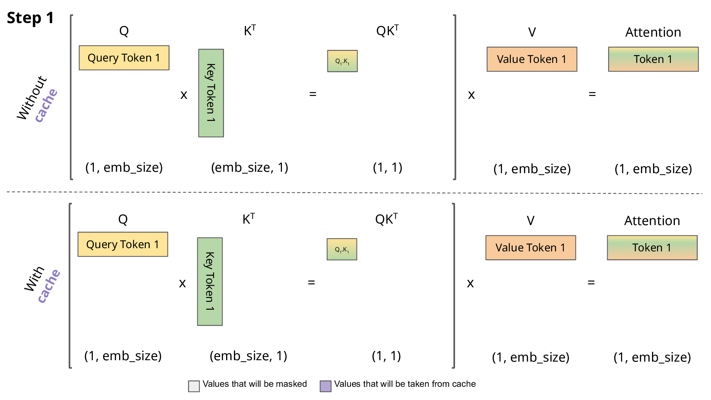
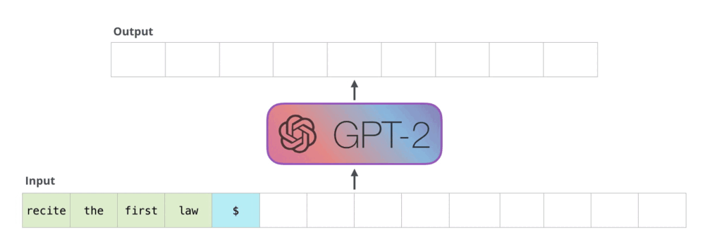

# KV Cache 原理

前置知识：[《机器学习中的Attention机制》](./Attention.md) [《Transformer结构》](./transformer.md) [《什么是BERT？》](./BERT.md)

KV Cache 是针对 Transformer 中 Decoder 组件的 masked self-attention 模块推理过程进行性能优化的一个常用技术，该技术以增加显存占用为代价提高 masked self-attention 推理性能，且不影响其计算精度，多用于 decoder-only 的大模型。

## 复习：masked self-attention 计算

Transformer 架构中的 decoder 运行流程：接收一串 token 输入，输出一个 token，输出的 token 会与输入 token 拼接在一起，然后作为下一次推理的输入，不断反复直到遇到终止符。

当今的大语言模型通常都是 decoder-only，没有 encoder：

而在 decoder 中，主要的性能瓶颈为 masked self-attention 模块的计算。

在[《Transformer结构》](./transformer.md)中，我们已推导出每次新增一个 token 后，输出矩阵中只需要计算一个新增行$MaskedAttention(Q_{1:t},K_{1:t},V_{1:t})_t$即可，其计算公式为：

$$MaskedAttention(Q_{1:t},K_{1:t},V_{1:t})_t=\sum_{i=1}^tsoftmax\left(\left[\frac{Q_tK^{\top}_1}{\sqrt{d_k}},\frac{Q_tK^{\top}_2}{\sqrt{d_k}},\cdots,\frac{Q_tK^{\top}_t}{\sqrt{d_k}}\right]\right)_iV_i$$

