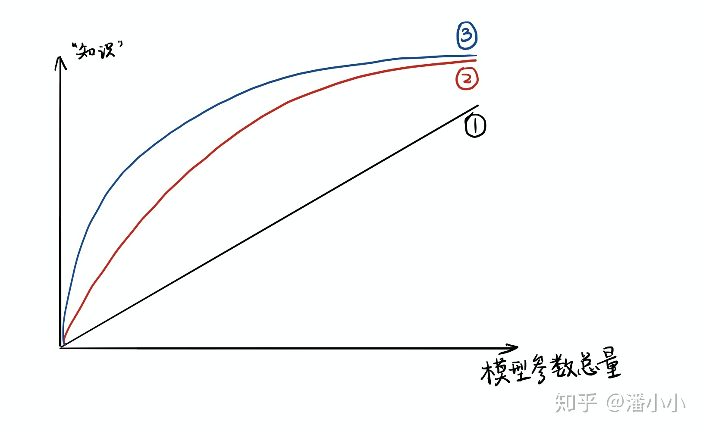
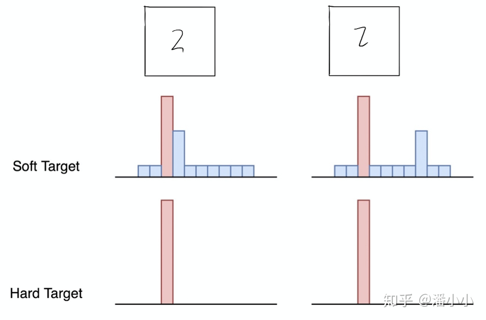

# 【纯转载】【经典简读】知识蒸馏(Knowledge Distillation) 经典之作

知乎原文：[【经典简读】知识蒸馏(Knowledge Distillation) 经典之作](https://zhuanlan.zhihu.com/p/102038521)

知识蒸馏是一种模型压缩方法，是一种基于“教师-学生网络思想”的训练方法，由于其简单，有效，在工业界被广泛应用。这一技术的理论来自于2015年Hinton发表的一篇神作:

[Distilling the Knowledge in a Neural Network](https://arxiv.org/pdf/1503.02531.pdf)

Knowledge Distillation，简称KD，顾名思义，就是将已经训练好的模型包含的知识(”Knowledge”)，蒸馏("Distill")提取到另一个模型里面去。今天，我们就来简单读一下这篇论文，力求用简单的语言描述论文作者的主要思想。在本文中，我们将从背景和动机讲起，然后着重介绍“知识蒸馏”的方法，最后我会讨论“温度“这个名词:

* 温度: 我们都知道“蒸馏”需要在高温下进行，那么这个“蒸馏”的温度代表了什么，又是如何选取合适的温度

## 介绍

### 论文提出的背景

虽然在一般情况下，我们不会去区分训练和部署使用的模型，但是训练和部署之间存在着一定的不一致性:

* 在训练过程中，我们需要使用复杂的模型，大量的计算资源，以便从非常大、高度冗余的数据集中提取出信息。在实验中，效果最好的模型往往规模很大，甚至由多个模型集成得到。而大模型不方便部署到服务中去，常见的瓶颈如下:

1. 推断速度慢
2. 对部署资源要求高(内存，显存等)

* 在部署时，我们对延迟以及计算资源都有着严格的限制。
因此，模型压缩（在保证性能的前提下减少模型的参数量）成为了一个重要的问题。而”模型蒸馏“属于模型压缩的一种方法。

**插句题外话**，我们可以从模型参数量和训练数据量之间的相对关系来理解underfitting和overfitting。AI领域的从业者可能对此已经习以为常，但是为了力求让小白也能读懂本文，还是引用我同事的解释（我印象很深）形象地说明一下:

>模型就像一个容器，训练数据中蕴含的知识就像是要装进容器里的水。当数据知识量(水量)超过模型所能建模的范围时(容器的容积)，加再多的数据也不能提升效果(水再多也装不进容器)，因为模型的表达空间有限(容器容积有限)，就会造成**underfitting**；而当模型的参数量大于已有知识所需要的表达空间时(容积大于水量，水装不满容器)，就会造成**overfitting**，即模型的variance会增大(想象一下摇晃半满的容器，里面水的形状是不稳定的)。

### “思想歧路”

上面容器和水的比喻非常经典和贴切，但是会引起一个误解: 人们在直觉上会觉得，要保留相近的知识量，必须保留相近规模的模型。也就是说，一个模型的参数量基本决定了其所能捕获到的数据内蕴含的“知识”的量。

这样的想法是基本正确的，但是需要注意的是:

1. 模型的参数量和其所能捕获的“知识“量之间并非稳定的线性关系(下图中的1)，而是接近边际收益逐渐减少的一种增长曲线(下图中的2和3)
2. 完全相同的模型架构和模型参数量，使用完全相同的训练数据，能捕获的“知识”量并不一定完全相同，另一个关键因素是训练的方法。合适的训练方法可以使得在模型参数总量比较小时，尽可能地获取到更多的“知识”(下图中的3与2曲线的对比).

## 知识蒸馏的理论依据

### Teacher Model和Student Model

知识蒸馏使用的是Teacher—Student模型，其中teacher是“知识”的输出者，student是“知识”的接受者。知识蒸馏的过程分为2个阶段:

1. 原始模型训练: 训练"Teacher模型", 简称为Net-T，它的特点是模型相对复杂，也可以由多个分别训练的模型集成而成。我们对"Teacher模型"不作任何关于模型架构、参数量、是否集成方面的限制，唯一的要求就是，对于输入X, 其都能输出Y，其中Y经过softmax的映射，输出值对应相应类别的概率值。
1. 精简模型训练: 训练"Student模型", 简称为Net-S，它是参数量较小、模型结构相对简单的单模型。同样的，对于输入X，其都能输出Y，Y经过softmax映射后同样能输出对应相应类别的概率值。

在本论文中，作者将问题限定在**分类问题**下，或者其他本质上属于分类问题的问题，该类问题的共同点是模型最后会有一个softmax层，其输出值对应了相应类别的概率值。

### 知识蒸馏的关键点

如果回归机器学习最最基础的理论，我们可以很清楚地意识到一点(而这一点往往在我们深入研究机器学习之后被忽略): **机器学习最根本的目的**在于训练出在某个问题上泛化能力强的模型。

* **泛化能力强**: 在某问题的所有数据上都能很好地反应输入和输出之间的关系，无论是训练数据，还是测试数据，还是任何属于该问题的未知数据。
而现实中，由于我们不可能收集到某问题的所有数据来作为训练数据，并且新数据总是在源源不断的产生，因此我们只能退而求其次，训练目标变成在已有的训练数据集上建模输入和输出之间的关系。由于训练数据集是对真实数据分布情况的采样，训练数据集上的最优解往往会多少偏离真正的最优解(这里的讨论不考虑模型容量)。

而在知识蒸馏时，由于我们已经有了一个泛化能力较强的Net-T，我们在利用Net-T来蒸馏训练Net-S时，可以直接让Net-S去学习Net-T的泛化能力。

一个很直白且高效的迁移泛化能力的方法就是：使用softmax层输出的类别的概率来作为“soft target”。

### “蒸馏器”：softmax函数

先回顾一下原始的softmax函数:

$$q_i=\frac{e^{z_i}}{\sum_je^{z_j}}$$

但要是直接使用softmax层的输出值作为soft target, 这又会带来一个问题: 当softmax输出的概率分布熵相对较小时，负标签的值都很接近0，对损失函数的贡献非常小，小到可以忽略不计。因此"**温度**"这个变量就派上了用场。

下面的公式时加了温度这个变量之后的softmax函数:

$$q_i=\frac{e^{z_i/T}}{\sum_je^{z_j/T}}$$

这里的T就是**温度**。
原来的softmax函数是T = 1的特例。 T越高，softmax的output probability distribution越趋于平滑，其分布的熵越大，负标签携带的信息会被相对地放大，模型训练将更加关注负标签。

## 知识蒸馏的具体方法

### 通用的知识蒸馏方法

**第一步**是训练Net-T；**第二步**是在高温T下，蒸馏Net-T的知识到Net-S

训练Net-T的过程很简单，下面详细讲讲第二步:高温蒸馏的过程。高温蒸馏过程的目标函数由distill loss(对应soft target)和student loss(对应hard target)加权得到。示意图如上。

$$L=\alpha L_{soft}+\beta L_{hard}$$

* $v_i$: Net-T的logits
* $z_i$: Net-S的logits
* $p_i^T$: Net-T的在温度=T下的softmax输出在第i类上的值
* $q_i^T$: Net-S的在温度=T下的softmax输出在第i类上的值
* $c_i$: 在第i类上的ground truth值,$c_i\in\{0,1\}$, 正标签取1，负标签取0.
* $N$: 总标签数量

Net-T 和 Net-S同时输入训练集(这里可以直接复用训练Net-T用到的训练集), 用Net-T产生的softmax distribution (with high temperature) 来作为soft target，Net-S在相同温度T条件下的softmax输出和soft target的cross entropy就是Loss函数的第一部分$L_{soft}$:

$$L_{soft}=-\sum_j^Np_i^Tlog(q_j^T)$$

$$p_i=\frac{e^{v_i/T}}{\sum_k^Ne^{v_k/T}}$$

$$q_i=\frac{e^{z_i/T}}{\sum_k^Ne^{z_k/T}}$$

Net-S在T=1的条件下的softmax输出和ground truth的cross entropy就是Loss函数的第二部分$L_{hard}$:

$$L_{hard}=-\sum_j^Nc_ilog(q_j^1)$$

$$q_i^1=\frac{e^{z_i}}{\sum_k^Ne^{z_k}}$$

第二部分Loss $L_{hard}$ 的必要性其实很好理解: Net-T也有一定的错误率，使用ground truth可以有效降低错误被传播给Net-S的可能。打个比方，老师虽然学识远远超过学生，但是他仍然有出错的可能，而这时候如果学生在老师的教授之外，可以同时参考到标准答案，就可以有效地降低被老师偶尔的错误“带偏”的可能性。

### 一种特殊情形: 直接match logits(不经过softmax)

直接 match logits 指的是，直接使用 softmax 层的输入logits（而不是输出）作为soft targets，需要最小化的目标函数是Net-T和Net-S的 logits 之间的平方差。

**直接上结论: 直接match logits的做法是$T\rightarrow\infin$的情况下的特殊情形。**

从logits是零均值的假设，很容易推导得到。具体推导见原文。

## 讨论

### KD的训练过程和传统的训练过程的对比

1. 传统训练过程(**hard targets**): 对ground truth求极大似然
2. KD的训练过程(**soft targets**): 用large model的class probabilities作为soft targets

### 举个例子

在手写体数字识别任务MNIST中，输出类别有10个。

假设某个输入的“2”更加形似"3"，softmax的输出值中"3"对应的概率为0.1，而其他负标签对应的值都很小，而另一个"2"更加形似"7"，"7"对应的概率为0.1。这两个"2"对应的hard target的值是相同的，但是它们的soft target却是不同的，由此我们可见soft target蕴含着比hard target多的信息。并且soft target分布的熵相对高时，其soft target蕴含的知识就更丰富。

这就解释了为什么通过蒸馏的方法训练出的Net-S相比使用完全相同的模型结构和训练数据只使用hard target的训练方法得到的模型，拥有更好的泛化能力。

## 关于"温度"的讨论

【问题】 我们都知道“蒸馏”需要在高温下进行，那么这个“蒸馏”的温度代表了什么，又是如何选取合适的温度？

### 温度的特点

在回答这个问题之前，先讨论一下**温度$T$的特点**

1. 原始的softmax函数是$T=1$时的特例，$T<1$时，概率分布比原始更“陡峭”，$T>1$时，概率分布比原始更“平缓”。
1. 温度越高，softmax上各个值的分布就越平均（思考极端情况: (i) $T=\infin$, 此时softmax的值是平均分布的；(ii) $T\rightarrow 0$，此时softmax的值就相当于argmax, 即最大的概率处的值趋近于1，而其他值趋近于0）
1. 不管温度T怎么取值，Soft target都有忽略相对较小的$p_i$携带的信息的倾向

### 温度代表了什么，如何选取合适的温度？

**温度的高低改变的是Net-S训练过程中对负标签的关注程度**: 温度较低时，对负标签的关注，尤其是那些显著低于平均值的负标签的关注较少；而温度较高时，负标签相关的值会相对增大，Net-S会相对多地关注到负标签。

实际上，负标签中包含一定的信息，尤其是那些值显著**高于**平均值的负标签。但由于Net-T的训练过程决定了负标签部分比较noisy，并且负标签的值越低，其信息就越不可靠。因此温度的选取比较empirical，本质上就是在下面两件事之中取舍:

1. 从有部分信息量的负标签中学习 --> 温度要高一些
1. 防止受负标签中噪声的影响 -->温度要低一些

总的来说，T的选择和Net-S的大小有关，Net-S参数量比较小的时候，相对比较低的温度就可以了（因为参数量小的模型不能capture all knowledge，所以可以适当忽略掉一些负标签的信息）