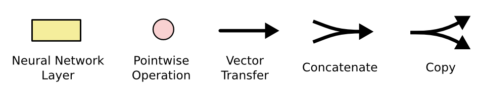

# 【纯转载】《Understanding LSTM Networks》翻译

原文：[http://colah.github.io/posts/2015-08-Understanding-LSTMs/](http://colah.github.io/posts/2015-08-Understanding-LSTMs/)

## 循环神经网络/递归神经网络

我们知道人类并不是从零开始思考东西，就像你读这篇文章的时候，你对每个字的理解都是建立在前几个字上面。你读完每个字后并不是直接丢弃然后又从零开始读下一个字，因为你的思想是具有持续性的，很多东西你要通过上下文才能理解。

然而传统的神经网络并不能做到持续记忆理解这一点，这是传统神经网络的主要缺点。举个例子，你打算使用传统的神经网络去对电影里每个时间点发生的事情进行分类的时候，传统的神经网络先让不能使用前一个事件去推理下一个事件。

RNN（递归神经网络）可以解决这个问题。他们是带有循环的神经网络，允许信息在其中保留。

在上图中，$A$代表神经网络主体，$x_t$表示网络的输入，$h_t$表示网络的输出。循环结构允许信息从当前输出传递到下一次（下个时间点）的网络输入。

这些循环让递归神经网络看起来有点神秘，然而如果你再思考一下，RNN其实和传统的神经网络并没有太多的不同。RNN可以看作是一个网络的多次拷贝，其中每次网络的输出都是下一次的输入。我们可以思考一下我们如果展开这个循环结构会是什么样的：

这种像是链状的网络结构表明RNN和序列以及列表有着天然的联系，他们是处理这些序列数据的天然的神经网络。而且很明显我们可以看出，输入输出的序列是具有相同的时间长度的，其中的每一个权值都是共享的（不要被链式形状误导，本质上只有一个cell）。

在最近的几年，RNN在很多问题上都取得了成功：比如语音识别，语音模型，翻译，图片注释等等。在Andrej Karpathy的这篇博文——[RNN的难以理解的有效性](http://karpathy.github.io/2015/05/21/rnn-effectiveness/)中讨论了RNN取得的惊人成果，他们真的很神奇。这些成功的案例的共同点就是都是用了LSTM，这是一种非常特殊的循环神经网络，对于许多任务来说，它们比基准版本好的多。 几乎所有令人兴奋的结果都是基于循环神经网络实现的，这篇文章将探讨这些LSTM，带你解开LSTM的神秘面纱。

## 长依赖存在的问题

人们希望RNN可以将一些之前的信息连接到当前的任务中来，比如使用之前的视频帧来帮助理解当前帧。如果RNN可以做到将会非常有用。那实际RNN能做到吗？这要视情况而定。

有时候，我们只需要当前的信息来完成当前的任务。举个例子，一个语音模型试图基于之前的单词去预测下一个单词。如果我们尝试预测“the clouds are in the sky”，我们不需要太多的上下文信息——很明显最后一个单词会是sky。在像这样不需要太多的相关信息的场合下，RNN可以学习到之前使用的信息。

但是我们要注意，也有很多场景需要使用更多的上下文。当我们试图去预测“I grew up in France… I speak fluent French”这句话的最后一个单词，最近的信息会表明这应该是一种语言的名字，但是如果我们需要知道具体是哪一种语语言，我们需要France这个在句子中比较靠前的上下文信息，相关信息和需要预测的点的间隔很大的情况是经常发生的。

不幸的是，随着间隔变大，RNN变得无法连接到太前的信息。

理论上RNN完全可以处理这种长期依赖（long-term dependencies）的问题。人们可以通过小心地选择参数来解决这个问题。令人悲伤的是，实践表明RNN并不能很好地解决这个问题。[Hochreiter(1991)[German]](http://people.idsia.ch/~juergen/SeppHochreiter1991ThesisAdvisorSchmidhuber.pdf)和[Bengio, et al. (1994)](http://www-dsi.ing.unifi.it/~paolo/ps/tnn-94-gradient.pdf)，曾经深入的研究过这个问题，他们发现一些根本性的原因，能够解释RNN为什么不work。

谢天谢地，LSTM没有这个问题！

## LSTM Networks

长短记忆神经网络——通常称作LSTM，是一种特殊的RNN，能够学习长的依赖关系。 他们由[Hochreiter &amp; Schmidhuber (1997)](http://www.bioinf.jku.at/publications/older/2604.pdf)引入，并被许多人进行了改进和普及。他们在各种各样的问题上工作的非常好，现在被广泛使用。

LSTM是为了避免长依赖问题而精心设计的。 记住较长的历史信息实际上是他们的默认行为，而不是他们努力学习的东西。

所有循环神经网络都具有神经网络的重复模块链的形式。 在标准的RNN中，该重复模块将具有非常简单的结构，例如单个tanh层。

LSTM也拥有这种链状结构，但是重复模块则拥有不同的结构。与神经网络的简单的一层相比，LSTM拥有四层，这四层以特殊的方式进行交互。

不要过早担心细节问题， 稍后我们将一步一步地剖析LSTM。 现在，让我们先熟悉一下我们将要使用的符号。

在上图中，每一行都带有一个向量，该向量从一个节点输出到其他节点的输入。 粉红色圆圈表示点向运算，如向量加法、点乘，而黄色框是学习神经网络层。 线的合并表示连接，而线的交叉表示其内容正在复制，副本将转到不同的位置。

To be a bit more explicit, we can split up each line into lines carrying individual scalar values:

## LSTM背后的核心理念

LSTM的关键是cell state(神经元状态)，表示cell state的这条线水平的穿过图的顶部。cell state类似于输送带，cell state在整个链上运行，他只有很小的线性作用，但却贯穿了整个链式结果。信息很容易就在这个传送带上流动但是状态却不会改变。cell state上的状态相当于长期记忆，而下面的$h_t$则代表短期记忆。

LSTM确实具有删除或添加信息到cell state的能力，这个能力是由被称为门(Gate)的结构所赋予的。

门(Gate)是一种可选地让信息通过的方式。 它由一个Sigmoid神经网络层和一个逐点相乘运算组成。

Sigmoid神经网络层输出0和1之间的数字，这个数字描述每个组件有多少信息可以通过， 0表示不通过任何信息，1表示全部通过

LSTM有三个门，用于保护和控制cell state。

## 一步步的拆解LSTM

LSTM的第一步是决定我们要从cell state中丢弃什么信息。 该决定由被称为“忘记门”的Sigmoid层实现。它查看$h_{t-1}$(前一个输出)和$x_t$(当前输入)，并为cell state$C_{t-1}$(上一个状态)中的每个数字输出0和1之间的数字。1代表完全保留，而0代表彻底删除。

让我们再次回到一开始举的例子：根据之前的词语去预测下一个单词的语言模型。在这个问题中，cell state或许包括当前主语中的性别信息，所以我们可以使用正确的代词。而当我们看到一个新的主语（输入），我们会去遗忘之前的性别信息。我们使用下图中的公式计算我们的“遗忘系数”$f_t$：

下一步就是决定我们要在cell state中保留什么信息。这包括两个部分。首先，一个被称为“输入门层”的sigmoid层会决定我们要更新的数值。然后一个$tanh$层创建候选向量$\tilde{C}_t$，该向量将会被加到cell state中。 在下一步中，我们将结合这两个向量来创建更新值。

在那个语言模型例子中，我们想给cell state增加主语的性别，来替换我们将要遗忘的旧的主语。

现在是时候去更新上一个状态值$C_{t-1}$了，将其更新为$C_t$。之前我们已经决定了要做什么，下一步我们就去做。

我们给旧的状态乘一个遗忘系数$f_t$，来遗忘掉我们之前决定要遗忘的信息。之后我们将得到的值加上$i_t*\tilde{C}_t$。这个得到的是新的候选值， 按照我们决定更新每个状态值的多少来衡量。

在语言模型中，就像上面描述的，这是我们实际上要丢弃之前主语的性别信息，增加新的主语的性别信息的地方

最后，我们需要决定我们要输出什么。 此输出将基于我们的cell state，但将是一个过滤版本。 首先，我们运行一个sigmoid层，它决定了我们要输出的cell state的哪些部分。 然后，我们将cell state通过$\tanh$（将值规范化到-1和1之间），并将其乘以Sigmoid门的输出，至此我们只输出了我们决定的那些部分。

对于那个语言模型的例子，当我们看到一个新的主语的时候，或许我们想输出相关动词的信息，因为动词是跟在主语后面的。例如，它或许要输出主语是单数还是复数的，然后我们就知道主语后动词的语态了。

## LSTM的变种

到目前为止，所描述的是一个很正常的LSTM。 但并不是所有的LSTM都与上述相同。 事实上，似乎几乎每一篇涉及LSTM的论文都使用了一个略有不同的版本，差异很小，但有一些值得一看。

一个比较流行的LSTM变种是由[Gers &amp; Schmidhuber (2000)](ftp://ftp.idsia.ch/pub/juergen/TimeCount-IJCNN2000.pdf)提出的，添加“peephole connections”。这意味着，我们允许gate层去看cell state。

上面的图中所有的Sigmoid层都给gate层层看，但许多论文实现不是针对所有都增加窥探，而是有针对性的增加。

另一种变化是使用耦合的忘记和输入门，而不是单独决定要忘记什么、添加什么，这个决定需要一起做。 只有当需要输入某些信息的时候，我们才会忘记这个位置的历史信息。只有当我们忘记一些历史信息的时候，我们才在状态中添加新的信息。

LSTM的一个稍微更显着的变化是由[Cho, et al. (2014)](http://arxiv.org/pdf/1406.1078v3.pdf)介绍的门控循环单元(也就是大家常说的GRU)。 它将忘记和输入门组合成一个单一的“更新门”。它还将cell state和隐藏状态合并，并进行了一些其他更改。 所得到的模型比标准LSTM模型更简单，并且越来越受欢迎。

这些只是最显着的LSTM变体中的几个, 还有很多其他的，比如[Yao, et al. (2015)](http://arxiv.org/pdf/1508.03790v2.pdf)提出的Depth Gated RNNs(深度门递归神经网络)，还有一些完全不同的处理长期依赖的方法，例如[Koutnik, et al. (2014)](http://arxiv.org/pdf/1402.3511v1.pdf)提出的Clockwork RNNs(时钟机递归神经网络)。

对于哪些变体最好、差异的重要性等问题，[Greff, et al. (2015)](http://arxiv.org/pdf/1503.04069.pdf)做了一个很好的变体的比较，发现他们都差不多。 [Jozefowicz, et al. (2015)](http://jmlr.org/proceedings/papers/v37/jozefowicz15.pdf)测试了大量的RNN架构，发现一些RNN结构在某些任务上要比LSTM更好。

## 结论

此前，我提到人们通过RNN实现了显着的成果。 基本上所有这些都是使用LSTM实现的。 对于大多数任务而言LSTM很有效。一般介绍LSTM的文章大部分会写一大组方程式，这使得LSTM看起来很吓人。 希望通过这篇文章的逐步讲解，帮助读者更好的理解LSTM。

我们不禁想问：是否有比LSTM更好的模型？学者一致认为：那就是attention注意力机制。核心观点就是让RNN每一步都监视一个更大的信息集合并从中挑选信息。例如：如果你使用RNN去为一个图像生成注释，它会从图像中挑选一部分去预测输出的单词。For example, if you are using an RNN to create a caption describing an image, it might pick a part of the image to look at for every word it outputs. In fact, [Xu, et al. (2015)](http://arxiv.org/pdf/1502.03044v2.pdf) do exactly this – it might be a fun starting point if you want to explore attention! There’s been a number of really exciting results using attention, and it seems like a lot more are around the corner…

Attention isn’t the only exciting thread in RNN research. For example, Grid LSTMs by [Kalchbrenner, <em>et al.</em> (2015)](http://arxiv.org/pdf/1507.01526v1.pdf) seem extremely promising. Work using RNNs in generative models – such as [Gregor, <em>et al.</em> (2015)](http://arxiv.org/pdf/1502.04623.pdf), [Chung, <em>et al.</em> (2015)](http://arxiv.org/pdf/1506.02216v3.pdf), or [Bayer & Osendorfer (2015)](http://arxiv.org/pdf/1411.7610v3.pdf)  – also seems very interesting. The last few years have been an exciting time for recurrent neural networks, and the coming ones promise to only be more so!
