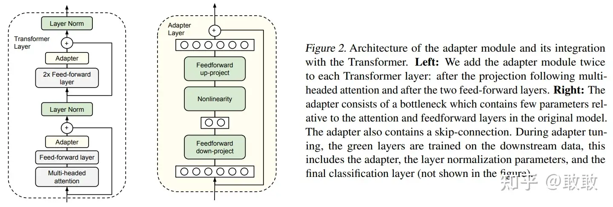
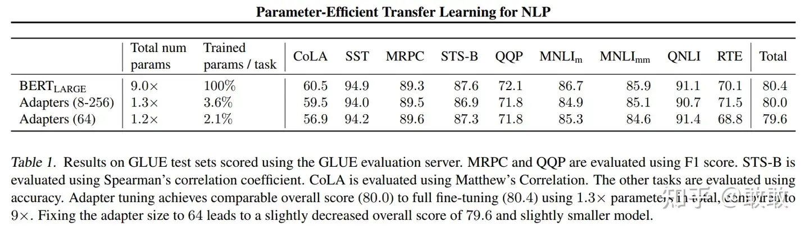

# 【摘录】LoRA（Low-Rank Adaptation）和PEFT （Parameter-Efficient Fine-Tuning）

<iframe width="560" height="315" src="https://www.youtube.com/embed/DhRoTONcyZE?si=C-7G97hajia6lYR3" title="YouTube video player" frameborder="0" allow="accelerometer; autoplay; clipboard-write; encrypted-media; gyroscope; picture-in-picture; web-share" referrerpolicy="strict-origin-when-cross-origin" allowfullscreen></iframe>

随着预训练语言模型参数量越来越大，迁移学习的成本越来越高，parameter-efficient fine-tuning（参数高效的微调方法）成为一个热点研究方向。所谓“参数高效”，本质就是“节约参数”。在以前我们在下游任务使用预训练大模型，一般需要finetune模型的所有参数，每个下游任务都需要复制一份完整的模型参数。

## PEFT和LoRA的起源：Adapters

论文：[Parameter-Efficient Transfer Learning for NLP](https://arxiv.org/abs/1902.00751)（2019.6）

Adapter是最早的一类PEFT方法的代表，2019年Houlsby N等人在这篇论文中首次提出了PEFT的概念并将Adapter引入NLP领域。Adapter主体架构下图所示：

Adapter的本质就是一种Bottlenet，通过全连接对原输入进行降维，之后经过内部的神经网络后再来一个全连接将维度还原。

在finetune过程中，Bert模型中的每一层都加入这种Adapter结构，冻结住原预训练Bert模型的参数，只更新Adapter、layer norm和最后一层的参数，大大减少了finetune阶段需要更新和保存的参数量。

Adapter在NLU和NLG任务上有不错的性能表现，仅添加3.6%的参数就能达到接近full fine-tune的效果：

但是，Adapter需要添加在每一层中训练，这意味着训练时的前向传播仍然需要保存大部分层的梯度供反向传播使用，虽然不用更新预训练参数从而减少训练时的计算量，但**并不能节省训练时的显存占用**，还**降低模型推理时的性能**。

## PEFT中的另一个世界：Prompt Tuning

详阅：[《【摘录】Prompt Tuning》](./PromptTuning.md)

和LoRA在模型尾部做操作不同，Prompt Tuning是对模型的输入做操作，相当于对LLM的Prompt进行训练。
但很显然，对模型输入做操作的finetune在前向传播时需要保存所有层的参数梯度，并不能节省训练时的显存占用。

## LoRA重参数化

LoRA训练完成后，finetune过程中所使用的降维矩阵和升维矩阵可以直接加在原参数上，从而在推理时不会产生额外的推理时延。

