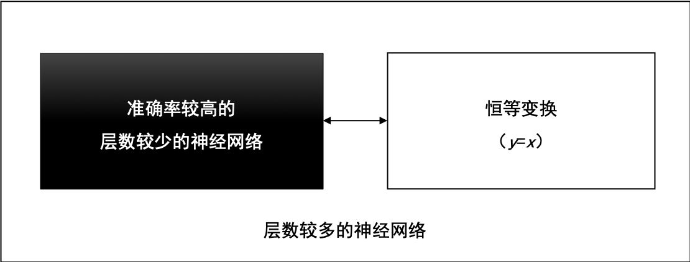
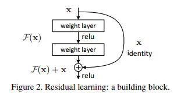
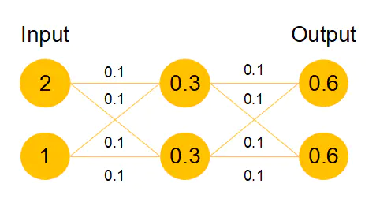
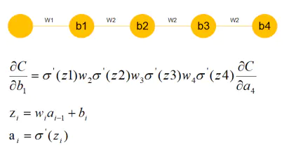
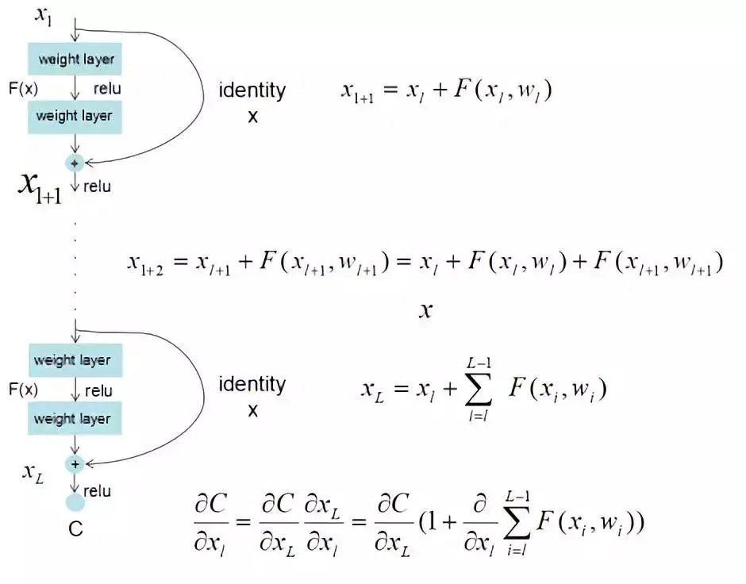

# ResNet

[知乎原文](https://zhuanlan.zhihu.com/p/101332297)

残差神经网络(ResNet)是由微软研究院的何恺明、张祥雨、任少卿、孙剑等人提出的。ResNet 在2015 年的ILSVRC（ImageNet Large Scale Visual Recognition Challenge）中取得了冠军。

残差神经网络的主要贡献是发现了“退化现象（Degradation）”，并针对退化现象发明了 “快捷连接（Shortcut connection）”，极大的消除了深度过大的神经网络训练困难问题。神经网络的“深度”首次突破了100层、最大的神经网络甚至超过了1000层。

## 从一个信念说起
在2012年的ILSVRC挑战赛中，AlexNet取得了冠军，并且大幅度领先于第二名。由此引发了对AlexNet广泛研究，并让大家树立了一个信念——“越深网络准确率越高”。这个信念随着VGGNet、Inception v1、Inception v2、Inception v3不断验证、不断强化，得到越来越多的认可，但是，始终有一个问题无法回避，这个信念正确吗？

它是正确的，至少在理论上是正确的。

假设一个层数较少的神经网络已经达到了较高准确率，我们可以在这个神经网络之后，拼接一段恒等变换的网络层，这些恒等变换的网络层对输入数据不做任何转换，直接返回（y=x），就能得到一个深度较大的神经网络，并且，这个深度较大的神经网络的准确率等于拼接之前的神经网络准确率，准确率没有理由降低。

层数较多的神经网络，可由较浅的神经网络和**恒等变换**网络拼接而成，如图1所示。

## 退化现象与对策

通过实验，ResNet随着网络层不断的加深，模型的准确率先是不断的提高，达到最大值（准确率饱和），然后随着网络深度的继续增加，模型准确率毫无征兆的出现大幅度的降低。

这个现象与“越深的网络准确率越高”的信念显然是矛盾的、冲突的。ResNet团队把这一现象称为“退化（Degradation）”。

ResNet团队把退化现象归因为深层神经网络难以实现“**恒等变换**（y=x）”。乍一看，让人难以置信，原来能够模拟任何函数的深层神经网络，竟然无法实现恒等变换这么简单的映射了？

让我们来回想深度学习的起源，与传统的机器学习相比，深度学习的关键特征在于网络层数更深、非线性转换（激活）、自动的特征提取和特征转换，其中，非线性转换是关键目标，它将数据映射到高纬空间以便于更好的完成“数据分类”。随着网络深度的不断增大，所引入的激活函数也越来越多，数据被映射到更加离散的空间，此时已经难以让数据回到原点（恒等变换）。或者说，神经网络将这些数据映射回原点所需要的计算量，已经远远超过我们所能承受的。

退化现象让我们对非线性转换进行反思，非线性转换极大的提高了数据分类能力，但是，随着网络的深度不断的加大，我们在非线性转换方面已经走的太远，竟然无法实现线性转换。显然，在神经网络中增加线性转换分支成为很好的选择，于是，ResNet团队在ResNet模块中增加了快捷连接分支，在线性转换和非线性转换之间寻求一个平衡。

## ResNet和恒等变换的作用

[知乎原回答](https://www.zhihu.com/question/293243905/answer/484708047)

>泻药，说说个人理解哈。残差模块并不是就是恒等啊，我觉得可以理解为:**当网络需要这个模块是恒等时，它比较容易变成恒等**。而传统的conv模块是很难通过学习变成恒等的，因为大家学过信号与系统都知道，恒等的话filter的冲激响应要为一个冲激函数，而神经网络本质是学概率分布局部一层不太容易变成恒等，而resnet加入了这种模块给了神经网络学习恒等映射的能力。
>
>所以我个人理解resnet除了减弱梯度消失外，我还理解为这是一种自适应深度，也就是网络可以自己调节层数的深浅，不需要太深时，中间恒等映射就多，需要时恒等映射就少。当然了，实际的神经网络并不会有这么强的局部特性，它的训练结果基本是一个整体，并不一定会出现我说的某些block就是恒等的情况

也就是说，**ResNet可以自己学习出有哪些层是冗余的，然后把这些冗余的层学成恒等变换**，这样的话，网络在加深的时候就不会出现越深准确率反而越低的情况了。

## ResNet解决深度网络瓶颈的魔力

[简书原文](https://www.jianshu.com/p/82eab7e1dc82)

### 网络退化问题的解决

我们发现，假设该层是冗余的，在引入ResNet之前，我们想让该层学习到的参数能够满足$h(x)=x$，即输入是$x$，经过该冗余层后，输出仍然为x。但是可以看见，要想学习$h(x)=x$恒等映射时的这层参数时比较困难的。ResNet想到避免去学习该层恒等映射的参数，使用了如上图的结构，让$h(x)=F(x)+x$;这里的$F(x)$我们称作残差项，我们发现，要想让该冗余层能够恒等映射，我们只需要学习$F(x)=0$。学习$F(x)=0$比学习$h(x)=x$要简单，因为一般每层网络中的参数初始化偏向于0，这样在相比于更新该网络层的参数来学习$h(x)=x$，该冗余层学习$F(x)=0$的更新参数能够更快收敛，如图所示：

假设该曾网络只经过线性变换，没有bias也没有激活函数。我们发现因为随机初始化权重一般偏向于0，那么经过该网络的输出值为[0.6 0.6]，很明显会更接近与[0 0]，而不是[2 1]，相比与学习$h(x)=x$，模型要更快到学习$F(x)=0$。

并且ReLU能够将负数激活为0，过滤了负数的线性变化，也能够更快的使得$F(x)=0$。这样当网络自己决定哪些网络层为冗余层时，使用ResNet的网络很大程度上解决了学习恒等映射的问题，用学习残差$F(x)=0$更新该冗余层的参数来代替学习$h(x)=x$更新冗余层的参数。

这样当**网络自行决定了哪些层为冗余层**后，通过学习残差$F(x)=0$来让该层网络恒等映射上一层的输入，使得有**了这些冗余层的网络效果与没有这些冗余层的网络效果相同，这样很大程度上解决了网络的退化问题**。

### 梯度消失或梯度爆炸问题的解决

我们发现很深的网络层，由于参数初始化一般更靠近0，这样在训练的过程中更新浅层网络的参数时，很容易随着网络的深入而导致梯度消失，浅层的参数无法更新。

可以看到，假设现在需要更新$b_1，w_2,w_3,w_4$参数因为随机初始化偏向于0，通过链式求导我们会发现，$w_4w_3w_2$相乘会得到更加接近于0的数，那么所求的这个b_1的梯度就接近于0，也就产生了梯度消失的现象。

ResNet最终更新某一个节点的参数时，由于$h(x)=F(x)+x$，由于链式求导后的结果如图所示，不管括号内右边部分的求导参数有多小，因为左边的1的存在，并且将原来的链式求导中的连乘变成了连加状态（正是 ），都能保证该节点参数更新不会发生梯度消失或梯度爆炸现象。

这样ResNet在解决了阻碍更深层次网络优化问题的两个重要问题后，ResNet就能训练更深层次几百层乃至几千层的网络并取得更高的精确度了。