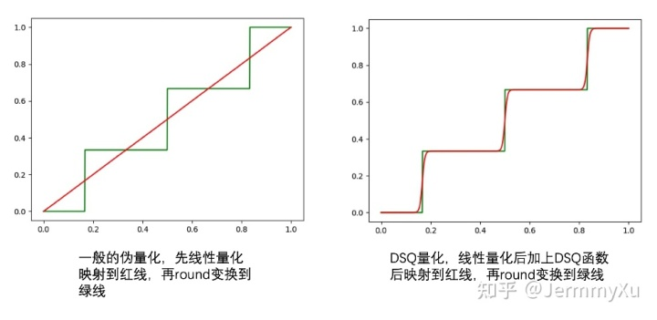

# 【纯转载】量化训练之补偿STE：DSQ和QuantNoise

本文首发于公众号：
[<span class="LinkCard-contents"><span class="LinkCard-title loading" data-text="true"></span><span class="LinkCard-desc loading"></span></span><span class="LinkCard-image LinkCard-image--default"></span>](https://mp.weixin.qq.com/s?__biz=Mzg4ODA3MDkyMA==&mid=2247484205&idx=1&sn=0a346e48ff68682d5198c84ffa4b4103&chksm=cf81f54af8f67c5c28d9fe36baa653fa279b1b813023512d69cc0ac7fe3509413c6ceec8ccb4&token=419397376&lang=zh_CN#rd)
今天讲一点量化训练中关于 STE (Straight Through Estimator) 的问题，同时介绍两种应对问题的方法：DSQ 和 QuantNoise。分别对应两篇论文： **[Differentiable Soft Quantization: Bridging Full-Precision and Low-Bit Neural Networks](https://arxiv.org/abs/1908.05033)**  和  **[Training with Quantization Noise for Extreme Model Compression](https://arxiv.org/abs/2004.07320)** 。

阅读本文需要对量化训练的过程有基本了解，可以参考我之前的这篇文章
[<span class="LinkCard-contents"><span class="LinkCard-title loading" data-text="true"></span><span class="LinkCard-desc loading"></span></span><span class="LinkCard-image LinkCard-image--default"></span>](https://zhuanlan.zhihu.com/p/158776813)
##  **STE的问题** 

在量化训练中，由于 round 函数的存在，我们无法正常求导，因此退而求其次，在反向传播的时候用 STE 跳过了这个函数。这个「跳过」，就是把 STE 的导数默认为 1。

但这种做法有个副作用，由于它无法反应真实的量化误差，所以，不管量化位数有多少 (8 比特、4 比特等等)，导数都是一样的。

看下面这个例子：

```python
class QuantConv(nn.Module):

    def __init__(self, conv_module, bits=8):
        super(QuantConv, self).__init__()
        self.conv_module = conv_module
        self.bits = bits

    def forward(self, x):
        scale, zero_point = calcScaleZeroPoint(self.conv_module.weight.data.min(), \
            self.conv_module.weight.data.max(), num_bits=self.bits)
        weight, bias = self.conv_module.weight, self.conv_module.bias
        # 对weight做伪量化，模拟量化误差
        quant_weight = dequantize_tensor(quantize_tensor(weight, scale, zero_point, self.bits), scale, zero_point)
        # detach这一步就是STE
        return F.conv2d(x, weight + (quant_weight - weight).detach(), bias, 3, 1)
```

我定义了一个量化的卷积  `QuantConv` ，对 weight 做了伪量化，其中  `calcScaleZeroPoint` 、 `quantize_tensor` 、 `dequantize_tensor`  这几个函数的定义可以在之前的文章中找到。

然后，我们用不同的比特数来量化，看看在 BP 的时候，梯度有什么差别：

```python
conv = nn.Conv2d(1, 1, 3, 1)
x = torch.randn((1, 1, 4, 4))  # 使用同一个输入
quantconv = QuantConv(conv)

a = quantconv(x).sum().backward()   # BP计算梯度
print("use 8 bit")
print(quantconv.conv_module.weight.grad)

quantconv.zero_grad()
quantconv.bits = 2
a = quantconv(x).sum().backward()    # BP计算梯度
print("use 2 bit")
print(quantconv.conv_module.weight.grad)
```

输出结果如下：

```
use 8 bit
tensor([[[[ 0.6101, -2.7252, -0.2428],
          [ 2.2399,  0.5673,  1.7511],
          [-0.5968,  1.2209,  0.6866]]]])
use 2 bit
tensor([[[[ 0.6101, -2.7252, -0.2428],
          [ 2.2399,  0.5673,  1.7511],
          [-0.5968,  1.2209,  0.6866]]]])
```

可以发现，对同一个输入，用同样的损失函数计算梯度，不同比特数量化得到的梯度是一样的！但不同比特数带来的量化误差明显有很大差异，This is unreasonable！

当然，这个例子的 loss 比较取巧，如果用其他 loss (比如交叉熵函数)，可能梯度就不会一样了。但不管是哪种 loss，到 STE 这一步就仿佛一套组合拳打在棉花上，最重要的梯度信息都扔掉了。这里面的原因就在于 STE 根本无法体现量化的损失。在低比特量化的时候，这种副作用尤其明显 (所以 QAT 在低比特训练中尤其困难，模型权重根本训不动)。

##  **DSQ** 

###  **基本思想** 

为了解决这个问题，一个很直接的想法是用某个可导的函数来近似 round，从而避免使用 STE。

比如说，我们知道傅立叶级数可以近似任何周期函数：


如果把 round 当成一个周期函数，那我们就可以用傅立叶级数来逼近 round 了，而傅立叶级数是可以求导的。

或者，我们也可以对 round 函数进行泰勒展开，用多项式来近似。

又或者，我们知道神经网络本身可以模拟任何函数，因此甚至可以用一个神经网络来近似 round。

不过，以上这些想法都过于复杂，计算量巨大，操作起来比较困难。

而 DSQ 做的就是引入一个相对简单的函数来模拟 round，做到计算简单，同时尽可能逼近 round 函数。

这个函数是这样定义的：
$$\phi(x)=s\tanh(k(x-m_i)), \quad if\quad x\in P_i \tag{1} $$
其中 $m_i=l+(i+0.5)\Delta$，$s=\frac{1}{\tanh(0.5k\Delta)}$。

这里面 $l$ 是实数域上的最小值，$\Delta$ 是量化对应的每段间隔长度，$P_i$ 对应第 $i$ 个间隔。

这个函数比较复杂，大家不用过于纠结这里面的细节，你只需要知道它长这个样子就可以了：


这是用 1 比特分别量化 [0, 1] 和 [-1, 1] 这两个区间时得到的函数图像。由于只使用了 1 个 bit，所以 $\Delta$ 就是整个区间的长度。

当然，也可以用更多的比特进行量化 (比如 2 bit)：


有读者可能发现，这个 $\phi(x)$ 函数和 tanh 有点像，它会把每个间隔内的数值映射到 [-1, 1] 的范围内。我们可以再看看不同 k 对 $\phi(x)$ 的影响：


结论就是：k 越大，这个函数和 round 越接近。

有了这个函数后，论文提出了一个 soft 的伪量化方式：
$$Q_S(x)=\begin{cases} l &  x < l \\ \notag u & x >u \\ \tag{2} l+\Delta(i+\frac{\phi(x)+1}{2}) & x \in P_i \end{cases} $$
同样地，我们看看这个函数和普通伪量化的差别：


上面分别是用 1 比特和 2 比特量化的结果，绿线是普通 round 函数的伪量化，红线则是 DSQ 的伪量化。

随着 k 增大，DSQ 和一般的伪量化越来越接近，而 DSQ 由于可导，还能近似模拟 round 的梯度。因此，在量化训练的时候，我们可以直接把伪量化换成 DSQ 函数。

不过，虽然 DSQ 能近似 round 的伪量化，但没法百分百一样，因此，需要用一些措施让网络在训练的时候可以感知到这部分误差，并最终让这部分误差尽可能小，这样，DSQ 才能成为真正可导的伪量化函数。

为此，论文的做法是引入一个 $\alpha$ 来衡量 DSQ 和 round 函数之间的误差：
$$\alpha=1-\tanh(0.5k\Delta)=1-\frac{1}{s} \tag{3} $$
并由此推出：
$$k=\frac{1}{\Delta}log(\frac{2}{\alpha}-1) \tag{4} $$
公式 (3)(4) 我冥思苦想了很久，始终想不透是怎么推出来的。后来询问了论文作者昊哥，结果昊哥说，DSQ 比较水，让我不要花太多时间，量化训练直接用  **[LSQ](https://zhuanlan.zhihu.com/p/412957105/edit)**  算法就可以 (意思就是 DSQ 效果可能并没有那么优秀。。。囧)。因此这部分我就没再花精力去推导了，有看懂的小伙伴还请不吝赐教。

总之，有了 $\alpha$ 后，我们就可以度量 DSQ 和真正量化引起的误差了，只要让 $\alpha$ 越小，DSQ 就越准确。因此，论文干脆用 $\alpha$ 来重新表示 DSQ，把 (1)(3) 结合一下就可以得到：
$$\phi(x)=\frac{1}{1-\alpha}\tanh(k(x-m_i)), \quad if\quad x\in P_i \tag{5} $$
再把 (5) 代入 (2) 后得到另一种形式的 DSQ，此时的 DSQ 中就只有 $\alpha$ 这个变量了。

然后，在训练网络的时候，除了原本的损失函数，我们还需要对 $\alpha$ 施加约束，让 $\alpha$ 越小越好：
$$\underset{\alpha} {\operatorname {min}} L(\alpha;x, y) \tag{6} \\  s.t. ||\alpha||_2<\lambda $$
整个训练过程中，DSQ 随着 $\alpha$ 越来越小，和真正的量化函数会越来越接近，同时，由于 DSQ 本身可以求导，我们也可以近似地求出量化函数的梯度，并作用到网络参数上。

此外，论文还对 clip 的边界也进行学习，不过这里只介绍 DSQ 的核心思想，就不详细讲解了。

训练完成后，我们可以按照普通量化的方式做量化推理即可。

###  **代码实现** 

论文作者也开源了这个算法，具体链接请参考
[<span class="LinkCard-contents"><span class="LinkCard-title loading" data-text="true"></span><span class="LinkCard-desc loading"></span></span><span class="LinkCard-image LinkCard-image--default"></span>](https://github.com/TheGreatCold/MQBench/blob/master/mqbench/fake_quantize/dsq.py)
这里多提一句，作者昊哥曾经开发了公司内部第一代量化训练框架 dirichlet，我之前也是通过阅读他们的代码学习到网络量化是怎么回事。后来由于 pytorch 发布了 FX，现在他们基于此开发了第二套工具，所幸的是这套工具是开源的，因此之后想针对这套新工具，讲一下一个量化训练框架该如何搭建。美中不足的是，这套工具需要 pytorch1.8 才能使用，而据我所知，很多小伙伴因为设备的原因，很难更新到这一版本。。。

说回原文，我们来看 DSQ 的核心实现：

```python
def dsq_function_per_tensor(x, scale, zero_point, quant_min, quant_max, alpha):
    tanh_scale = 1 / (1 - alpha)
    tanh_k = math.log((tanh_scale + 1) / (tanh_scale - 1))

    x = x / scale + zero_point
    x = torch.clamp(x, quant_min, quant_max)
    x = x.floor() + (tanh_scale * torch.tanh(tanh_k * (x - x.floor() - 0.5))) * 0.5 + 0.5
    x = (x.round() - x).detach() + x  # detach模拟STE
    x = (x - zero_point) * scale

    return x
```

核心代码只有寥寥几句，对应的是上文 DSQ 的公式 (2)。

其中，最核心的是这句代码：

```python
x = x.floor() + (tanh_scale * torch.tanh(tanh_k * (x - x.floor() - 0.5))) * 0.5 + 0.5
```

这一步就是在计算 $\phi(x)$ 和 $D_S(x)$。不过论文里的公式是在浮点域上处理的，而代码里是先转换到整型域再处理。大家也不要太纠结为什么代码可以这样处理，这篇论文在公式表达上并不是很清晰，我们学习它的思想就可以，至于具体方法和细节，昊哥说了，不建议花太多时间 (此处甩锅。。)

另外，代码有一个  `detach`  来模仿 STE 的操作，有人可能要说了，不是说好 DSQ 可以求导吗，怎么又要用 STE？

我们来看下普通伪量化和 DSQ 的差别：



在普通的伪量化中，我们先经过线性量化后，再 round 变换到绿线：

```python
x=round(clip(x/S-Z, q_min, q_max))
```

而在 DSQ 中，我们则是先线性量化加 DSQ 后，再 round 变换到绿线 (由于 DSQ 不可能和实际的量化函数一致，因此我们还是需要加上 round 操作保证最终结果是一致的)：

```python
x=round(clip(DSQ(x/S-Z), q_min, q_max))
```
前者在求导时，round 引起的巨大误差直接被跳过了，而后者由于有 DSQ 的存在，我们在 round 前就已经非常接近量化函数 (绿线) 的位置了，而 DSQ 是可导的，因此求出的导数更接近 round 的误差，这样网络学习起来就更准确了。

##  **QuantNoise** 

前面说了一大堆，可以看出 DSQ 为了近似 round 函数，还是引入了很多复杂的操作。而 QuantNoise 就简单了，它用了另一种取巧的方式来弥补 STE 带来的损失。

既然 STE 无法反应量化函数的导数，那我们就在量化的时候，不要把所有参数都量化，而是随机量化一部分，另一部分还是保持全精度，这样在做伪量化的时候，信息损失不至于太大，反向传播的时候，部分权重也能以正常求导的方式适应其他量化权重引起的损失。

这个过程和 Dropout，以及之前的论文 Incremental Network 非常相似：


代码实现上也比 DSQ 简单得多：

```python
noise = (quantize(w) - w) * mask
w_q = w + noise.detach()
```
和普通 QAT 相比，这里只是多了一个 mask。

论文给出的实验证明，在低比特量化的时候，这种方式效果很明显。不过遗憾的是，我自己在去噪、GAN 等任务中并没有发现这种方法有什么提升～囧～

##  **总结** 

这篇文章主要介绍了量化训练中，STE 对训练本身带来的问题，并介绍了两种解决问题的思路：DSQ 和 QuantNoise。

其中 DSQ 从问题本质 (round 函数不可导) 出发，引入一个可导的函数来近似 round。而 QuantNoise 虽然没有直面 STE 的问题，但用一种取巧的方式在 round 函数上「钻了个洞」，让一部分权重可以无损地通过，用这部分权重弥补 STE 带来的梯度损失。

从论文标题也可以看出，这两种方法主要针对低比特网络。因为 STE 在低比特训练时，副作用尤其明显，毕竟比特数越低，round 带来的量化损失越明显。

当然，大家不必把这两篇论文奉为圭臬，介绍它们只是给大家提供一些思路，在某些任务中，论文本身的方法未必奏效。但这些思路可以打开我们的视野，兴许哪天你受启发就找到更优秀的方法了。

##  **参考** 
1.  **[Differentiable Soft Quantization: Bridging Full-Precision and Low-Bit Neural Networks](https://arxiv.org/abs/1908.05033)** 
1.  **[Training with Quantization Noise for Extreme Model Compression](https://arxiv.org/abs/2004.07320)** 
1.  **[INCREMENTAL NETWORK QUANTIZATION: TOWARDS LOSSLESS CNNS WITH LOW-PRECISION WEIGHTS](https://arxiv.org/pdf/1702.03044.pdf)** 
1. [<span class="invisible">https://www.</span><span class="visible">yuque.com/yahei/hey-yah</span><span class="invisible">ei/quantization-retrain_improved_qat</span><span class="ellipsis"></span>](https://www.yuque.com/yahei/hey-yahei/quantization-retrain_improved_qat)
1. [<span class="invisible">https://</span><span class="visible">github.com/TheGreatCold</span><span class="invisible">/MQBench/tree/master/mqbench</span><span class="ellipsis"></span>](https://github.com/TheGreatCold/MQBench/tree/master/mqbench)
