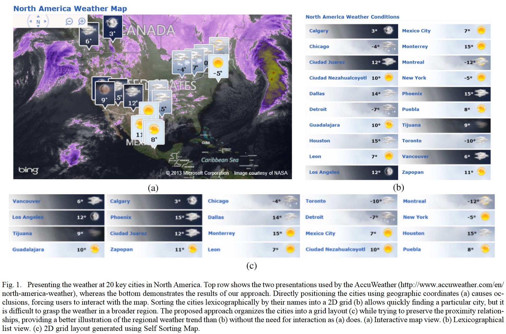

# Self-Sorting Map

前置知识：[Self-Organizing Map](./自组织映射.md)

论文：**Self-Sorting Map: An Efficient Algorithm for Presenting Multimedia Data in Structured Layouts**,IEEE Transactions on Multimedia, 2014

>Given a set of **data items** and a **dissimilarity measure** between each pair of them, the SSM places each item into a unique cell of a structured layout, where the most related items are placed together and the unrelated ones are spread apart.

显然，SOM并不能保证每个训练样本都有一个独立的编号，也不能保证最终的图上的像素值与训练样本完全相等。
而Self-Sorting Map(SSM)正如其名，是按照给定的dissimilarity measur对输入进行的排序，可以保证每个训练样本都有自己的ID，且出来的图上像素值与训练样本完全相等。

>Instead of solving the continuous optimization problem that other dimension reduction approaches do, the SSM transforms it into a **discrete labeling problem**.

并且因为是“排序”，不是SOM那种“训练”和“拟合”，所以构建SSM也不需要像SOM那种iteration求解优化问题，而是一个离散的贴标问题。

典型地，SSM可以做到下面这种效果，即在Self-Organizing的同时还能保证表达数据的精准无误：

其中的图(a)是在地图上标注，图标会重叠，不好看；图(b)是按首字母规则排序，没法按天气聚类，也不好看；图(c)是Self-Sorting Map二维情况，既有按地理位置聚类又有按地域聚类，很棒。