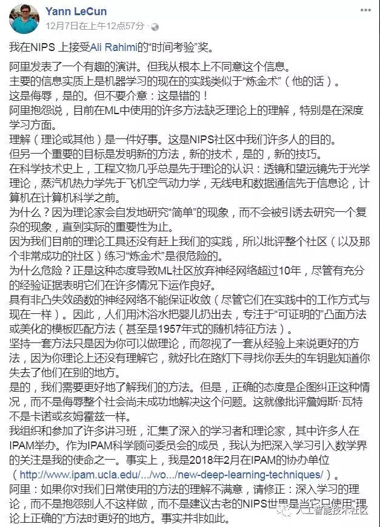

# NIPS2017 Theoretical impediments to machine learning：无人问津的图灵奖得主

[视频](https://www.bilibili.com/video/av67843210)

[PPT](http://causality.cs.ucla.edu/blog/wp-content/uploads/2017/12/nips-dec2017-bw.pdf)

1. 无理论模型指导的AI实践在处理认知任务时，存在天然局限。
2. 上述7个案例，对比了有无理论模型的情况下，我们能解决的与受限制的事情。这些限制与数据量大小无关，不是靠提高数据量能解决的。（暗示需要理论模型进一步发展）
3. 数据科学仅当其能促进对数据的合理解读时才能被称为所谓科学，（暗示不能解读却很有效的东西只不过是炼金术信仰）。数据永远是为现实服务的，数据科学总要平衡模型在数据集上的表现与对现实世界的解读这两者之间的关系。（暗示后者更重要）
4. 背后缺少对现实世界合理建模的数据科学，姑且能称之为“统计”吧，但不可能是一门科学。
5. 以当前这些毫无理论模型指导的机器学习之莽，根本不可能创造出同等于人类水平的AI。

[相关讨论-知乎](https://www.zhihu.com/question/263711574)

[Yann LeCun对此的评论-Facebook](https://www.facebook.com/yann.lecun/posts/10154938130592143)

>My take on Ali Rahimi's "Test of Time" award talk at NIPS. 
Ali gave an entertaining and well-delivered talk. But I fundamentally disagree with the message.
>
>The main message was, in essence, that the current practice in machine learning is akin to "alchemy" (his word).
>
>It's insulting, yes. But never mind that: It's wrong!
>
>Ali complained about the lack of (theoretical) understanding of many methods that are currently used in ML, particularly in deep learning.
>
>Understanding (theoretical or otherwise) is a good thing. It's the very purpose of many of us in the NIPS community.
>
>But another important goal is inventing new methods, new techniques, and yes, new tricks.
>
>In the history of science and technology, the engineering artifacts have almost always preceded the theoretical understanding: the lens and the telescope preceded optics theory, the steam engine preceded thermodynamics, the airplane preceded flight aerodynamics, radio and data communication preceded information theory, the computer preceded computer science. 
>
>Why? Because theorists will spontaneously study "simple" phenomena, and will not be enticed to study a complex one until there a practical importance to it.
>
>Criticizing an entire community (and an incredibly successful one at that) for practicing "alchemy", simply because our current theoretical tools haven't caught up with our practice is dangerous.
>
>Why dangerous? It's exactly this kind of attitude that lead the ML community to abandon neural nets for over 10 years, *despite* ample empirical evidence that they worked very well in many situations.
>
>Neural nets, with their non-convex loss functions, had no guarantees of convergence (though they did work in practice then, just as they do now). So people threw the baby with the bath water and focused on "provable" convex methods or glorified template matching methods (or even 1957-style random feature methods).
>
>Sticking to a set of methods just because you can do theory about it, while ignoring a set of methods that empirically work better just because you don't (yet) understand them theoretically is akin to looking for your lost car keys under the street light knowing you lost them someplace else.
>
>Yes, we need better understanding of our methods. But the correct attitude is to attempt to fix the situation, not to insult a whole community for not having succeeded in fixing it yet. This is like criticizing James Watt for not being Carnot or Helmholtz. 
>
>I have organized and participated in numerous workshops that bring together deep learners and theoreticians, many of them hosted at IPAM. As a member of the scientific advisory board of IPAM, I have seen it as one of my missions to bring deep learning to the attention of the mathematics community. In fact, I'm co-organizer of such a workshop at IPAM in February 2018 ( [http://www.ipam.ucla.edu/.../new-deep-learning-techniques/](https://l.facebook.com/l.php?u=http%3A%2F%2Fwww.ipam.ucla.edu%2Fprograms%2Fworkshops%2Fnew-deep-learning-techniques%2F%3Ffbclid%3DIwAR2H8uUpXdnFIav2h0h2lALlB9bqfc9k0VYk6D6TOP1oVdLPolASgGBwSw4&h=AT0eRJq9K6DcIF7u1_X-l3a19Oqh1lsWat-GhyDKhXN9mEbSEPSd4sc4gfPcUZ3DS14rhp9JQXejHnxAlMCRy_3rkqEuIjp77bD-TuO-VYDa1RJvY7QYw2luKuA7vciaprJB&__tn__=-UK-R&c[0]=AT3ddZdTAb8KeL6JAB_axQhPYDmLbSs6EenQIjGQcPEokS4ymU0dxV4JvU-M0HAg9-Uw0CwW21IoXwirBbDVoPHiFB2F8uFCtByZOxE6CUqFZjVWq8XnEQ3rJt4kQOwcoV5qZqw7LRoUc8rztqXgMtmzsIg) ).
>
>Ali: if you are not happy with our understanding of the methods you use everyday, fix it: work on the theory of deep learning, instead of complaining that others don't do it, and instead of suggesting that the Good Old NIPS world was a better place when it used only "theoretically correct" methods. It wasn't.