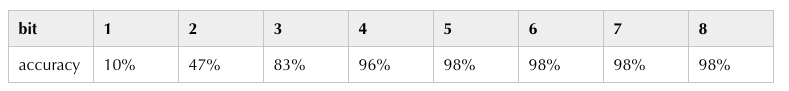

# 【纯转载】神经网络量化入门--量化感知训练

[原文](https://zhuanlan.zhihu.com/p/158776813)

上一篇文章介绍了后训练量化的基本流程，并用 pytorch 演示了最简单的后训练量化算法。
[https://zhuanlan.zhihu.com/p/156835141](https://zhuanlan.zhihu.com/p/156835141)
后训练量化虽然操作简单，并且大部分推理框架都提供了这类离线量化算法 (如  **[tensorrt](https://developer.nvidia.com/tensorrt)** 、 **[ncnn](https://github.com/Tencent/ncnn)** ， **[SNPE](https://developer.qualcomm.com/software/qualcomm-neural-processing-sdk)**  等)，但有时候这种方法并不能保证足够的精度，因此本文介绍另一种比后训练量化更有效地量化方法——量化感知训练。

量化感知训练，顾名思义，就是在量化的过程中，对网络进行训练，从而让网络参数能更好地适应量化带来的信息损失。这种方式更加灵活，因此准确性普遍比后训练量化要高。当然，它的一大缺点是操作起来不方便，这一点后面会详谈。

同样地，这篇文章会讲解最简单的量化训练算法流程，并沿用之前文章的代码框架，用 pytorch 从零构建量化训练算法的流程。

##  **量化训练的困难** 

要理解量化训练的困难之处，需要了解量化训练相比普通的全精度训练有什么区别。为了看清这一点，我们回顾一下上一篇文章中卷积量化的代码：

```python
class QConv2d(QModule):

    def forward(self, x):
        if hasattr(self, 'qi'):
            self.qi.update(x)

        self.qw.update(self.conv_module.weight.data)

        self.conv_module.weight.data = self.qw.quantize_tensor(self.conv_module.weight.data)
        self.conv_module.weight.data = self.qw.dequantize_tensor(self.conv_module.weight.data)

        x = self.conv_module(x)

        if hasattr(self, 'qo'):
            self.qo.update(x)

        return x
```

这里面区别于全精度模型的地方在于，我们在卷积运算前先对 weight 做了一遍量化，然后又再反量化成 float。这一步在后训练量化中其实可有可无，但量化感知训练中却是需要的「之前为了代码上的一致，我提前把这一步加上去了」

那这一步有什么特别吗？可以回顾一下量化的具体操作：

```python
def quantize_tensor(x, scale, zero_point, num_bits=8, signed=False):
    if signed:
        qmin = - 2. ** (num_bits - 1)
        qmax = 2. ** (num_bits - 1) - 1
    else:
        qmin = 0.
        qmax = 2.**num_bits - 1.
 
    q_x = zero_point + x / scale
    q_x.clamp_(qmin, qmax).round_()
    
    return q_x.float()
```

这里面有个  `round`  函数，而这个函数是没法训练的。它的函数图像如下：


这个函数几乎每一处的梯度都是 0，如果网络中存在该函数，会导致反向传播的梯度也变成 0。

可以看个例子：

```python
conv = nn.Conv2d(3, 1, 3, 1)

def quantize(weight):
    w = weight.round()
    return w

class QuantConv(nn.Module):

    def __init__(self, conv_module):
        super(QuantConv, self).__init__()
        self.conv_module = conv_module

    def forward(self, x):
        return F.conv2d(x, quantize(self.conv_module.weight), self.conv_module.bias, 3, 1)


x = torch.randn((1, 3, 4, 4))

quantconv = QuantConv(conv)

a = quantconv(x).sum().backward()

print(quantconv.conv_module.weight.grad)
```

这个例子里面，我将权重 weight 做了一遍  `round`  操作后，再进行卷积运算，但返回的梯度全是 0：

```python
tensor([[[[0., 0., 0.],
          [0., 0., 0.],
          [0., 0., 0.]],

         [[0., 0., 0.],
          [0., 0., 0.],
          [0., 0., 0.]],

         [[0., 0., 0.],
          [0., 0., 0.],
          [0., 0., 0.]]]])
```

换言之，这个函数是没法学习的，从而导致量化训练进行不下去。

##  **Straight Through Estimator** 

那要怎么解决这个问题呢？

一个很容易想到的方法是，直接跳过伪量化的过程，避开  `round` 。直接把卷积层的梯度回传到伪量化之前的 weight 上。这样一来，由于卷积中用的 weight 是经过伪量化操作的，因此可以模拟量化误差，把这些误差的梯度回传到原来的 weight，又可以更新权重，使其适应量化产生的误差，量化训练就可以正常进行下去了。

这个方法就叫做 Straight Through Estimator(STE)。

##  **pytorch实现** 

本文的相关代码都可以在 github 上找到
[https://github.com/Jermmy/pytorch-quantization-demo](https://github.com/Jermmy/pytorch-quantization-demo)
###  **伪量化节点实现** 

上面讲完量化训练最基本的思路，下面我们继续沿用前文的代码框架，加入量化训练的部分。

首先，我们需要修改伪量化的写法，之前的代码是直接对 weight 的数值做了伪量化：

```python
self.conv_module.weight.data = self.qw.quantize_tensor(self.conv_module.weight.data)
self.conv_module.weight.data = self.qw.dequantize_tensor(self.conv_module.weight.data)
```

这在后训练量化里面没有问题，但在 pytorch 中，这种写法是没法回传梯度的，因此量化训练里面，需要重新修改伪量化节点的写法。

另外，STE 需要我们重新定义反向传播的梯度。因此，需要借助 pytorch 中的  `Function`  接口来重新定义伪量化的过程：

```python
from torch.autograd import Function

class FakeQuantize(Function):

    @staticmethod
    def forward(ctx, x, qparam):
        x = qparam.quantize_tensor(x)
        x = qparam.dequantize_tensor(x)
        return x

    @staticmethod
    def backward(ctx, grad_output):
        return grad_output, None
```

这里面的 forward 函数，和之前的写法是类似的，就是把数值量化之后再反量化回去。但在 backward 中，我们直接返回了后一层传过来的梯度  `grad_output` ，相当于直接跳过了伪量化这一层的梯度计算，让梯度直接流到前一层 (Straight Through)。

pytorch 定义  `backward`  函数的返回变量需要与  `forward`  的输入参数对应，分别表示对应输入的梯度。由于  `qparam`  只是统计 min、max，不需要梯度，因此返回给它的梯度是  `None` 。

###  **量化卷积代码** 

量化卷积层的代码除了  `forward`  中需要修改伪量化节点外，其余的和之前的文章基本一致：

```python
class QConv2d(QModule):

    def forward(self, x):
        if hasattr(self, 'qi'):
            self.qi.update(x)
            x = FakeQuantize.apply(x, self.qi)

        self.qw.update(self.conv_module.weight.data)

        x = F.conv2d(x, FakeQuantize.apply(self.conv_module.weight, self.qw),
                     self.conv_module.bias, 
                     stride=self.conv_module.stride,
                     padding=self.conv_module.padding, dilation=self.conv_module.dilation, 
                     groups=self.conv_module.groups)

        if hasattr(self, 'qo'):
            self.qo.update(x)
            x = FakeQuantize.apply(x, self.qo)

        return x
```

由于我们需要先对  `weight`  做一些伪量化的操作，根据 pytorch 中的规则，在做卷积运算的时候，不能像之前一样用  `x = self.conv_module(x)`  的写法，而要用  `F.conv2d`  来调用。另外，之前的代码中输入输出没有加伪量化节点，这在后训练量化中没有问题，但在量化训练中最好加上，方便网络更好地感知量化带来的损失。

由于上一篇文章中做量化推理的时候，我发现精度损失不算太重，3 个 bit 的情况下，准确率依然能达到 96%。为了更好地体会量化训练带来的收益，我们把量化推理的代码再细致一点，加大量化损失：

```python
class QConv2d(QModule):

    def quantize_inference(self, x):
        x = x - self.qi.zero_point
        x = self.conv_module(x)
        x = self.M * x
        x.round_()      # 多加一个round操作
        x = x + self.qo.zero_point        
        x.clamp_(0., 2.**self.num_bits-1.).round_()
        return x
```

相比之前的代码，其实就是多加了个  `round` ，让量化推理更接近真实的推理过程。

###  **量化训练的收益** 

这里仍然沿用之前文章里的小网络，在 mnist 上测试分类准确率。由于量化推理有修改，为了方便对比，我重新跑了一遍后训练量化的准确率：



接下来，测试一下量化训练的效果，下面是  `bit=3`  时输出的 log：

```
Test set: Full Model Accuracy: 98%

Quantization bit: 3
Quantize Aware Training Epoch: 1 [3200/60000]   Loss: 0.087867
Quantize Aware Training Epoch: 1 [6400/60000]   Loss: 0.219696
Quantize Aware Training Epoch: 1 [9600/60000]   Loss: 0.283124
Quantize Aware Training Epoch: 1 [12800/60000]  Loss: 0.172751
Quantize Aware Training Epoch: 1 [16000/60000]  Loss: 0.315173
Quantize Aware Training Epoch: 1 [19200/60000]  Loss: 0.302261
Quantize Aware Training Epoch: 1 [22400/60000]  Loss: 0.218039
Quantize Aware Training Epoch: 1 [25600/60000]  Loss: 0.301568
Quantize Aware Training Epoch: 1 [28800/60000]  Loss: 0.252994
Quantize Aware Training Epoch: 1 [32000/60000]  Loss: 0.138346
Quantize Aware Training Epoch: 1 [35200/60000]  Loss: 0.203350

...

Test set: Quant Model Accuracy: 90%
```

总的实验结果如下：


用曲线把它们 plot 在一起：


灰色线是量化训练，橙色线是后训练量化，可以看到，在 bit = 2、3 的时候，量化训练能带来很明显的提升。

在 bit = 1 的时候，我发现量化训练回传的梯度为 0，训练基本失败了。这是因为 bit = 1 的时候，整个网络已经退化成一个二值网络了，而低比特量化训练本身不是一件容易的事情，虽然我们前面用 STE 解决了梯度的问题，但由于低比特会使得网络的信息损失巨大，因此通常的训练方式很难起到作用。

另外，量化训练本身存在很多 trick，在这个实验中我发现，学习率对结果的影响非常显著，尤其是低比特量化的时候，学习率太高容易导致梯度变为 0，导致量化训练完全不起作用「一度以为代码出错」。

##  **量化训练部署** 

前面说过，量化训练虽然收益明显，但实际应用起来却比后训练量化麻烦得多。

目前大部分主流推理框架在处理后训练量化时，只需要用户把模型和数据扔进去，就可以得到量化模型，然后直接部署。但很少有框架支持量化训练。

目前量化训练缺少统一的规范，各家推理引擎的量化算法虽然本质一样，但很多细节处很难做到一致。而目前大家做模型训练的前端框架是不统一的「当然主流还是 tf 和 pytorch」，如果各家的推理引擎需要支持不同前端的量化训练，就需要针对不同的前端框架，按照后端部署的实现规则「比如哪些层的量化需要合并、weight 是否采用对称量化等」，从头再搭一套量化训练框架，这个工作量想想就吓人。

##  **总结** 

这篇文章主要介绍了量化训练的基本方法，并用 pytorch 构建了一个简单的量化训练实例。下一篇文章会介绍这系列教程的最后一篇文章——关于 fold BatchNorm 相关的知识。

##  **参考** 
1.  **[Torch.round() gradient](https://discuss.pytorch.org/t/torch-round-gradient/28628)** 
1.  **[pytorch实现简单的straight-through estimator(STE)](https://segmentfault.com/a/1190000020993594)** 
