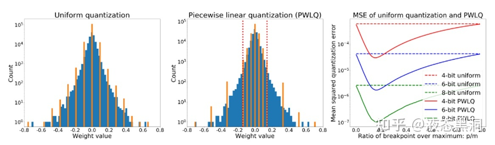
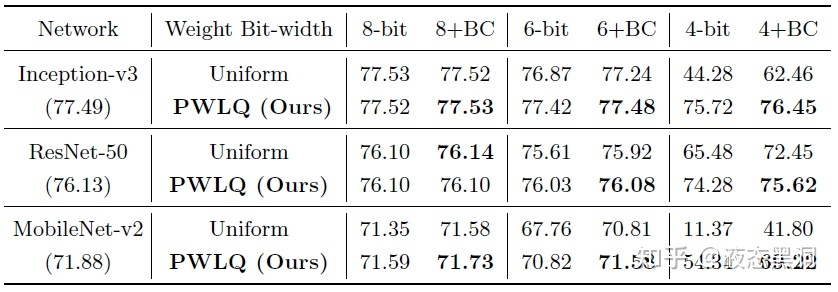

# 【纯转载】模型量化进展长文综述（三）-映射

这篇我们主要讲模型量化中的projection，也就是映射。这里我们也可以理解为量化函数的选择。量化函数在量化中属于核心问题，量化函数选取的好，那么整个量化过程中的很多步骤都可以省略。而一般我们用的量化函数都是线性量化函数，区别无非是对称或非对称，有无min<0的判断等等，其实很多论文中对自己使用的量化函数细节描述的并不清晰，导致可能实验结果的有效性很难验证，希望后面可以有benchmark性质的论文来规范这个方向的发展。

我们还是先回顾一下目录，然后进入正题。

* [1. DataFree](https://zhuanlan.zhihu.com/p/397804163)
 * 1. 图片复原
 * 2. 绕开图片
* [2. GetMaxMin](https://zhuanlan.zhihu.com/p/397854365)
 * 1. 基于统计的方法
 * 2. 基于优化的方法
 * 3. 基于训练的方法
 * 3. ** Projection** 
   *  **1. 通过量化函数映射** 
   *  **2. 基于搜索的方法** 
   *  **3. 矢量量化** 
* [4. WeightTransform](https://zhuanlan.zhihu.com/p/397872400)
 * 1. 手动方法
 * 2. 基于优化的方法
 * 3. 基于训练的方法
* [5. MixPrecision](https://zhuanlan.zhihu.com/p/397887921)
 * 1. 基于优化的算法
 * 2. 基于手动搜索的算法
 * 3. 基于强化学习的算法
 * 4. 基于训练的算法
* [6. 训练过程](https://zhuanlan.zhihu.com/p/397903088)
* [7. 流程优化](https://zhuanlan.zhihu.com/p/397909337)

## 3. Projection

Projection是将原始值映射到量化位宽允许的范围内。

###  1. 通过量化函数映射

#### （1）线性函数（均匀量化）

将weight或者activation根据得到的maxmin值进行线性映射：

$$scale=(r_max-r_min)/(q_max-q_min)，z=round(q_max-r_max/scale)$$

$$x_int=round(x/scale)+z$$

$$x_q=clamp(x_int,q_max,q_min)$$

这种是最基本的线性映射，我们就不多解释了。那么这种方式非常简单，但为什么还不够好呢？其实如果我们把权重和激活的分布直方图画出来就可以看到，他们的分布都是呈钟形的，而线性函数对这种分布的拟合天然就不是很好，因此才有更多其他的映射函数出现。当然我们可以通过改变权重和激活的分布来让线性函数更好地拟合，不过这是属于下一篇WeightTransform中的内容，我们之后介绍，这里面也有很多有趣的方案。

#### （2）非线性函数（NNIE）

$$i=\operatorname{clamp}\left(-\operatorname{round}\left(\ln \left(-256 * x / \mid \text { data }\left.\right|_{\max }\right) * 128 / \ln (256)\right),-127,-1\right), x<=-\mid \text { data }\left.\right|_{\max } \times 2^{1 / 16-9}$$

$$i=\operatorname{clamp}\left(\operatorname{round}\left(\ln \left(256 * x / \mid \text { data }\left.\right|_{\max }\right) * 128 / \ln (256)\right), 0,127\right), x>=\mid \text { data }\left.\right|_{\max } \times 2^{1 / 16-9}$$

这种据说是华为的方案，它采用的是log类的映射，具体我个人也没有用过，感觉对硬件不是特别友好，但是优点是对钟形分布拟合好。

#### （3）分段函数（[Post-Training](https://arxiv.org/pdf/2002.00104.pdf)[ Piecewise Linear Quantization for Deep Neural Networks](https://arxiv.org/pdf/2002.00104.pdf) (ECCV2020)）

参数分布因为是钟形的，因此具有长尾效应，我们可以找一个breakpoint，分段采用不同量化间隔

分段量化函数：

$$pw(r;b,m,p)=\left\{\begin{aligned}
   &sign(r)\times uni(|r|;b-1,0,p,0),&r\in R_1\\
   &sign(r)\times uni(|r|;b-1,0,m,0),&r\in R_2\\
\end{aligned}\right.$$

其中$R_1=[-p,p]$，$R_2=[-m,-p)\cup(p,m]$

量化误差期望为（根据均匀量化的量化误差推导而来）：
$$\begin{aligned}
   E&=C(b-1)((m-p)^2(F(-p)+1-F(p))+p^2(F(p)-F(-p)))\\
   &=C(b-1)((m-p)^2+m(2p-m)(2F(p)-1))
\end{aligned}$$

优化目标是找到一个分隔点$p$，使得$E$最小。在证明了$p$存在于$(0,m/2)$后，通过假设权重服从高斯分布或拉普拉斯分布，使用梯度下降法可以找到$p$，并且证明了$E_{pw}<(9/16)E_{uni}$，在实际使用中，对归一化高斯分布使用快速简单的估计 

$$p/m=ln⁡(0.8614m+0.6079)$$

分段量化在运算时需要两个累乘器三个累加器，权重需要多存储一位，但不会增加额外的乘加运算，从硬件实现考虑，不建议使用超过一个breakpoint 或者对权重和激活都应用PWLQ

实验结果可以表明，相对于均匀量化有明显的提升，尤其是更低比特

#### （4）PoT（[Additive Powers-of-Two Quantization: A Non-uniform Discretization for Neural Networks](https://arxiv.org/pdf/1909.13144.pdf)(ICLR2020)）

为了权衡参数的非均匀分布和硬件友好，Powers-of Two (PoT) quantization把量化间隔约束到2的次幂：

$$\mathcal{Q}^p(\alpha, b)=\alpha \times\left\{0, \pm 2^{-2^{b-1}+1}, \pm 2^{-2^{b-1}+2}, \ldots, \pm 2^{-1}, \pm 1\right\}$$

，$\alpha$是scale factor，b是位宽

但是PoT存在一个问题，当bit数增加的时候收益会减小，如果将位宽从b增加到b+1，那么间隔$[-2^{-2^{b-1}+1},2^{-2^{b-1}+1}]$会被分成$2^{b-1}-1$个子间隔，然而其他所有的间隔没变。也就是说当增大位宽时只有$[-2^{-2^{b-1}+1},2^{-2^{b-1}+1}]$的分辨率会增加，为了解决这个问题，该文提出了Additive Powers-of-Two (APoT) quantization，每个level是n个PoT项的总和：

$$\mathcal{Q}^a(\alpha, k n)=\gamma \times\left\{\sum_{i=0}^{n-1} p_i\right\} \text { where } p_i \in\left\{0, \frac{1}{2^i}, \frac{1}{2^{i+n}}, \ldots, \frac{1}{2^{i+\left(2^k-2\right) n}}\right\}$$

其中$γ$是一个缩放系数来保证最大的level是$\alpha$，$k$叫做基准位宽，是每个加法项的位宽，$n$是加法项的个数，$n=b/k$，APoT量化中加法项的数量可以随位宽$b$的增加而增加，这为非均匀level提供了更高的分辨率。

### 2. 基于搜索的方法

#### （1）基于训练 [Searching for Low-Bit Weights in Quantized Neural Networks](https://arxiv.org/pdf/2009.08695.pdf) - Huawei(NIPS2020)

把任意量化模型的离散权重看成可搜索的变量，优点是不需要估计梯度。对于一个权重，训练时会计算它分配到各个离散值的概率，用加权和作为训练时的权重，推理时选择概率最大的离散值作为量化值，由于这两种权重可能会有差异，因此引入了一种state BN层消除差异。

考虑优化一个n维的size为$(d_1,...,d_n)$的离散变量$W$，其每一个元素ω从m个离散变量$\mathbb{V}=\{v_1,v_2,\dots,v_m\}$中选择，使用一个辅助tensor$A\in\mathbb R^{m\times d_1\times\cdots\times d_n}$来学习$W$的分布，根据以下公式计算$m$个离散变量的概率，

$$P_i=\frac{\exp ^{A_i / \tau}}{\sum_j \exp ^{A_j / \tau}}, \quad i \in\{1, \cdots, m\}$$

其中$P_i$是$W$中的元素属于第$i$个离散值$v_i$的概率，$τ$是控制系统熵的超参。训练时用加权和作为训练时的权重，这样是可微的并且可以end-to-end训练。训练中优化辅助张量，可以准确计算其梯度，从而避免了先前工作中的梯度估计。推理时选择概率最大的离散值作为量化值。

由于训练时和推理时使用的权重会有差异（mean、std不同），引入了一种state BN层消除差异，在训练时计算两组统计特性，$y_c$和$y_q$，分别是使用连续的W和离散的$W$计算的卷积输出，对它们都进行标准化，标准化都都是mean=0,std=1，然后使用同样的放射参数（相当于BN层的第一步分开做，第二步一起做）。

#### （2）基于优化 [Towards Accurate Post-training Network Quantization via Bit-Split and Stitching](http://proceedings.mlr.press/v119/wang20c/wang20c.pdf)(ICML2020)

将一个整数分成多个bit，然后优化每个bit，最后把所有bit缝合回整数，并提出错误补偿激活量化（ECAQ）方法，可以降低激活的量化误差。

对于Mbit的权重量化，目标是学习一个低比特的核q将输入x映射为输出y，量化的优化问题可以写成：

$$\underset{\alpha, q}{\operatorname{minimize}}\left\|y-\alpha q^T X\right\|_F^2$$

$\alpha$是浮点的scale，这个问题很难解，因为$q$有Mbit的限制，但是$q$的每个元素的取值是有限的，但是整个q的联合优化空间太大，因此提出了bit-split的算法，将q的Mbit的限制划分为$M-1$个三值优化问题：

$$\begin{aligned}
& \underset{\alpha,\left\{q_1, \cdots, q_{M-1}\right\}}{\operatorname{minimize}}\left\|y-\alpha\left(2^0 q_1^T+\cdots+2^{M-2} q_{M-1}^T\right) X\right\|_F^2 \text {, } \\
& \text { s.t. } q_m \in\{-1,0,+1\}^{\left(C \cdot K_h \cdot K_w\right)} \text { for } m=1, \cdots, M-1
\end{aligned}$$

，其中$q_m$是$q$的第$m$位。

上式中有$M$个数需要优化，分别是1个scale和$M-1$位$q_m$，$\alpha$的优化在给定$q$后可以轻易得到： 

$$\alpha=\frac{y^TX^Tq}{q^TXX^Tq}$$

$q_m$的优化，当$\alpha$固定时，可得到如下优化问题：

$$\begin{aligned}
& \underset{q_m}{\operatorname{minimize}}\left\|y_m-\alpha_mq_m^T X\right\|_F^2 \text {, } \\
& \text { s.t. } q_m \in\{-1,0,+1\}^{\left(C \cdot K_h \cdot K_w\right)}
\end{aligned}$$

，其中$y_m$和$a_m$独立于$q_m$：

$$\left\{\begin{aligned}
    y_m&=y-\alpha\sum_{i\not =m}2^{m-1}q_i^TX\\
    \alpha_m&=\alpha 2^{m-2}
\end{aligned}\right.$$

令$A=\alpha_m^2XX^T$，$s=2\alpha_{m}Xy_m$，我们可以最小化下式：

$$\begin{aligned}
    J(q_m)&=y_m^Ty_m-2\alpha_my_m^TX^Tq_m+\alpha_m^2q_m^TXX^Tq_m\\
    &=q_m^TAq_m+s^Tq_m+const.
\end{aligned}$$

这个二次优化问题很难解，因此采用迭代的方法求解，在固定其余元素的情况下优化$q_m$的每个元素。$q_m$的第k个元素如下：

$$q_m^{(k)}=\left\{\begin{array}{cc}
-\operatorname{sign}\left(r_{\bar{k}}\right) & \text { if } r_{\bar{k}}>A_{k k} \\
0 & \text { otherwise }
\end{array}\right.$$

其中$r_{\bar{k}}=s_k+\sum_{i\not=k}A_{ki}q_m^{(i)}$

之后需要把优化后的所有位缝合回整数：

$$q'=2^0q_1'+\cdots+2^{M-2}q_{M-1}'$$

对于激活值，使用了一种误差补偿量化方法，不需要额外的计算达到per-channel的效果：把每个输入通道的scale移到相应的2d卷积核上，并且这个操作是在未量化时的浮点权重上做的。

优点：相当于没有用数据，对scale这一步做了调整，并且优化得到clip值，并且量化比特数越少优势越明显

缺点：1).是否过分假设？该方法不仅逐元素优化（假设其他元素确定的前提下优化单一元素），还进行逐比特优化（假设其他比特确定的前提下优化单一比特），假设性非常强，这波贪心搜索非常贪心

2).涉及权重本身微调，是否容易出现过拟合？校准集通常挑的不多，如果有小样本进行校准来微调权重，可能很容易出现过拟合；如果用大样本来微调权重，那为什么不直接做重训练呢

3).优化过程非常缓慢。该优化过程非常复杂，所需时间也很长，远高于常见的post-training方法，据说用开源的代码一个ResNet18的校准过程在V100上要三四个小时（数据来自于csdn某篇文章，找不到链接了..）

####  **3. 矢量量化** 

一般的量化是计算每个点的量化值，称为标量量化，与之对应的是矢量量化。

以全连接层为例，权重$\bm W\in\bm R^{C_{in}\times C_{out}}$，对于权重W的每列，平均划分为m个子向量，所有的子向量具有相同的维度$d=C_{in}/m$，然后对mCout个子向量学习一个码书。然后，W的一列通过映射其每个子向量在码书中的码本来量化。

码书$\mathcal C=\{\bm c_1,\dots,\bm c_k\}$包括维度为d的k个码本，W的任意一列wj会被映射为它的量化版本$\mathbf{q}\left(\mathbf{w}_j\right)=(\bm c_1,\dots,\bm c_k)$，i1表示分配给wj的第一个子向量的码本索引，以此类推。码书可以通过最小化如下目标函数得到：

$$\|\mathbf{W}-\widehat{\mathbf{W}}\|_2^2=\sum_j\left\|\mathbf{w}_j-\mathbf{q}\left(\mathbf{w}_j\right)\right\|_2^2$$

这个目标可以通过k-means优化。当1 < m < Cin时，这种量化方法称为乘积量化（PQ），当m=1时，称为矢量量化（VQ），当m=Cin时，是标量量化。[AND THE BIT GOES DOWN: REVISITING THE QUANTIZATION OF NEURAL NETWORKS](https://arxiv.org/pdf/1907.05686.pdf)(ICLR2020) 中将上述目标改为层输出的重建误差，关注保留层的输出信息而不是权重。

PQ的优势在于，wj的每列会被量化为$\mathcal{C}=\mathcal{C} \times \cdots \times \mathcal{C}$中的一个向量，因此PQ会生成一个size为km的隐式密码本。

这篇文章就介绍到这里，总而言之projection的目的就是找到最能拟合参数分布的量化函数，虽然学术上有这么多的方向，但是实际使用中基本上99%都是用线性量化直接怼，为什么呢？因为简单啊，不需要设计复杂的模块，并且不需要数据finetune，最重要的，在业界用的最多的int8量化下，线性函数看起来已经足够，对于通用的主干网基本都没有精度下降，当然对于部分量化敏感的模型或者更低比特量化，可能还需要更好的量化函数的设计。
