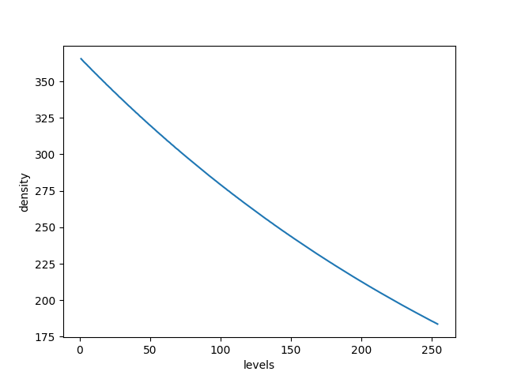
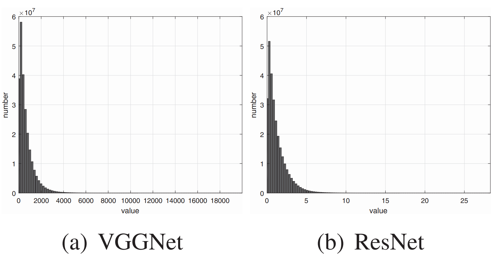

# 一些常见的模型量化方法

## 前言

>### 什么是量化？
>将高精度运算转化到低精度上运算，例如float32转化为int8数据上运算。
>
>### 为什么要量化？
>那就要说说量化的好处了，一般量化有以下好处：
>* 减小模型尺寸和存储空间，如int8量化可减少75%的模型大小；
>* 加快推理速度，访问一次32位浮点型可以访问四次int8型，运算更快；
>* 减少设备功耗，内存耗用少了推理速度快了自然减少了设备功耗；
>* 支持微处理器，有些微处理器属于8位的，低功耗运行浮点运算速度慢，需要进行8bit量化；
>
>但是其也有一些缺点：
>
>* 增加了操作复杂度，有时会有一些特殊处理，甚至会有tradeoff，比如你发明了一个牛13的算子，可惜现有的量化工具不支持，自己实现又头大，只能忍痛割爱；
>* 会损失一定的精度，所以有时会有微调，但也会有损失；不过值得一提的是，每次我用openvino量化，精度不降低反而还会升高一丢丢。这是因为模型参数是非常冗余的，量化可以看成一种正则化技术，会提升模型的泛化能力，可能在测试集上会表现好一点。不过都是事后诸葛的理论分析了，具体还是要看测试指标的。
>
>### 怎么量化？
>虽然量化方法很多，但并无本质区别。记住一点就可以了：将高精度数据映射到低精度表达，在低精度上运算，然后再反量化回去，因为最终的输出我们还是要高精度的数据的。

——摘自[《pytorch量化备忘录》](https://zhuanlan.zhihu.com/p/269808112)

需要注意的是，量化的方法根据其量化目的的不同而有很大的区别：
* 针对计算的量化：主要的需求是减小模型的计算量，要求特征图直接以量化的形式进行计算
* 针对压缩的量化：主要的需求是减小模型或特征占用的空间，特征图不需要以量化的形式进行计算

这两种量化目的带来的最大区别在于量化映射的均匀和非均匀：
* 均匀量化：$y=ax+b$，量化之后的数值进行加减乘除等计算与不量化直接计算在数学上等价(比如做加法：$x_1+x_2=y_1/a_1+y_2/a_2-b_1/a_1-b_2/a_2$)
* 非均匀量化：量化之后的数值进行加减乘除计算后与不量化直接计算在数学上不一定等价

所以很显然，针对计算的量化只能进行线性映射，而针对压缩的量化还可以进行非线性映射。

而在神经网络的计算过程中，特征图上的概率分布大都是非线性的，通常接近与正态分布或指数分布，非线性映射可以处理这种非均匀分布的情况。所以如果不涉及量化计算（模型参数量化等任务），通常用非线性映射的量化（特征压缩等任务）。

>信号幅度的概率分布一般是不均匀的，小信号出现的概率远大于大信号。例如，一般情况下负载电流值都小于额定电流值，而且是正弦波形信号。因此用一种合理的方法，即在小信号范围内提供较多的量化级(△u为一个小值)，而在大信号范围内提供少数的量化级(△u为一个大的值)，这种技术叫做做非均匀量化。当每级发生的概率相同时，非均匀量化系统将更正确地恢复原始信号，使编码信号携带最大信息。在极端情况下，某一级永不出现，那么这一级提供的信息是零。在总量化级保持一定的情况下，非均匀量化系统在较大信号范围内的适应能力优于均匀量化系统。非均匀量化对于测量系统而言保持了相对误差的一致性，即小信号小误差，大信号大误差。

## 均匀量化

重要参考：[量化计算白皮书](http://arxiv.org/abs/1806.08342)

将一个浮点数$x\in(x_{min},x_{max})$映射（量化）为一个整数$x_{Q}\in[0,N_{levels}-1]$。实际情况中常见int8量化，其$N_{levels}=256$。

线性映射量化的参数有缩放比例$\Delta$和零点$z$两个；方法有对称和非对称两种。

### 非对称量化(Uniform Affine Quantizer)

非对称量化是指将浮点数缩放后加上零点$z$：

$$
\begin{aligned}
    x_{int}&= round\big(\frac{x}{\Delta}\big)+z \\
    x_Q&=clamp(0,N_{levels} - 1, x_{int}) 
\end{aligned}
$$

其中：
$$
\begin{aligned}
    clamp(a,b,x)&=a &x\leq a \\
    &=x &a \leq x \leq b \\
    &=b &x \geq b
\end{aligned}
$$

反量化计算为：
$$x_{float}=(x_Q  - z)\Delta$$

#### 带着量化直接算卷积

线性映射的好处就在这，可以直接量化值计算与浮点计算等价，而量化值计算速度快，因此可以加速神经网络模型的训练和推理。

$$
\begin{aligned}
    y(k,l,n)&=\Delta_w \Delta_x conv(w_Q(k,l,m;n)-z_{w}, x_Q(k,l,m)-z_{x}) \\
    y(k,l,n)&=conv(w_Q(k,l,m;n),x_Q(k,l,m))-z_w\sum_{k=0}^{K-1} \sum_{l=0}^{K-1} \sum_{m=0}^{N-1} x_Q(k,l,m) \\
    &-z_x\sum_{k=0}^{K-1} \sum_{l=0}^{K-1} \sum_{m=0}^{N-1} w_Q(k,l,m;n) +z_x z_w
\end{aligned}
$$

### 对称量化(Uniform Affine Quantizer)

对称量化不使用零点$z$，而是直接将浮点数进行缩放，相当于非对称量化中零点$z=0$的特殊情况：

$$
\begin{aligned}
    x_{int}&= round\big(\frac{x}{\Delta}\big) & \\
    x_Q&=clamp(-N_{levels}/2,N_{levels}/2 - 1, x_{int})& \text{if signed}  \\
    x_Q&=clamp(0,N_{levels} - 1, x_{int}) &\text{if un-signed} 
\end{aligned}
$$

反量化计算就很简单：
$$x_{out}=x_Q\Delta$$

## 非均匀量化

很显然，神经网络中的大部分特征的数值不会遵循均匀分布，而是在不同数值区域有不同的密度。

实际上，大部分的神经网络特征图数值都遵循正态分布或是指数分布。

因此一个直观的想法是，量化公式可以为不同的数值区域分配不同密度的量化门限，让分布密集的数值区域精度高一点，分布稀疏的数值区域精度低一点。于是就产生了非线性映射。

那很显然，非线性映射不能保证像线性映射那样能直接加减乘除，所以一般只用于特征压缩，不用于计算加速。

### Logistic映射

$$
x_Q=round(\frac{log(x-min(x)+1)}{max(log(x-min(x)+1))}(N_{levels}-1))
$$

其切分密度随数值大小变化如下：

可以看到，其密度并非均匀，而是随数值增大而不断增大，因此适合于从0开始，概率密度不断减小的分布。比如：

参考论文：
* [Z. Chen, K. Fan, S. Wang, L.-Y. Duan, W. Lin, and A. Kot, “Lossy Intermediate Deep Learning Feature Compression and Evaluation,” in Proceedings of the 27th ACM International Conference on Multimedia, New York, NY, USA, Oct. 2019, pp. 2414–2422. doi: 10.1145/3343031.3350849.](https://doi.org/10.1145/3343031.3350849)
* [Z. Chen, L.-Y. Duan, S. Wang, W. Lin, and A. C. Kot, “Data Representation in Hybrid Coding Framework for Feature Maps Compression,” in 2020 IEEE International Conference on Image Processing (ICIP), 2020, pp. 3094–3098. doi: 10.1109/ICIP40778.2020.9190843.](https://doi.org/10.1109/ICIP40778.2020.9190843)

### K-means矢量量化

现实中的很多数据都是由矢量组成的，比如图片中的像素就是三维矢量。
K-means矢量量化的原理就是用K-means将矢量数据聚为指定数量的类，然后每一个类用一个量化值代替即可。

比如我想将一个由32位浮点型的三维矢量$(r,g,b)$组成的图片$I:I_{k}=(r_k,g_k,b_k)$量化为32位整型数值$q\in[0,2^{32}-1]$组成的图片，那么K-means矢量量化可以表示为：
1. $q=K_{means}(r,g,b)\in[0,2^{32}-1]$：用K-means算法将图片中的所有像素$(r,g,b)$聚为$2^{32}$个类别，每个类别对应一个32位整型数值$q$
2. $(r_q,g_q,b_q)=C(q)$：记下每个类别的聚类中心

于是需要保存数据就是一张记录了每个聚类中心的位置及其对应的整形数值的查找表$(r_q,g_q,b_q)=C(q)$

整个图片的量化过程$Q(\cdot)$就是用聚类中心对应的整形数值代替32位浮点型的三维矢量：
$$I^{q}=Q(I): I^{q}_k=K_{means}(r_k,g_k,b_k)$$

而反量化过程就是根据整形数值查找对应的聚类中心：
$$I^d=D(I^{q}): I^d_k=C(I^{q}_k)$$