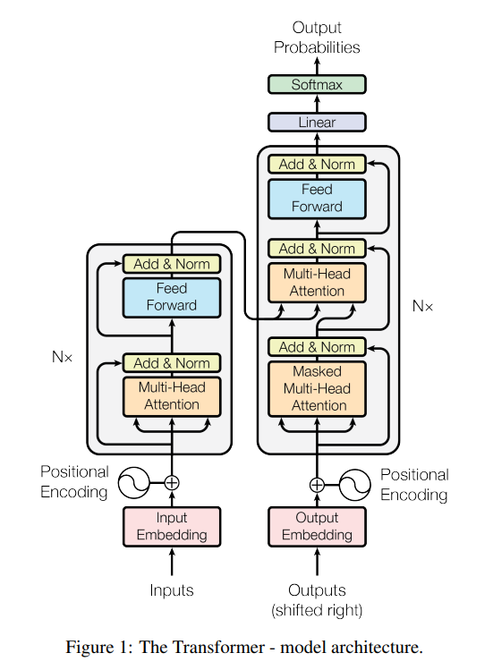
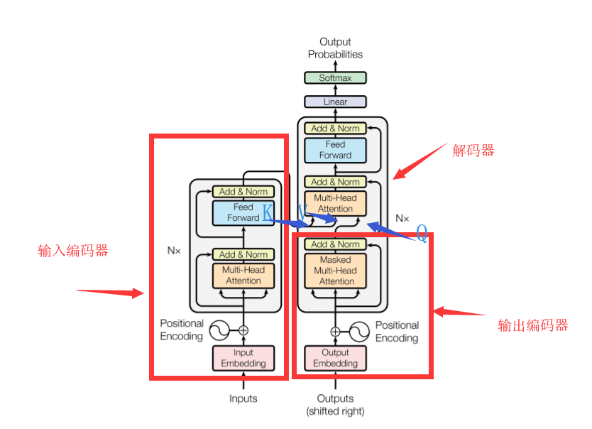

# Transformer结构

原文：[《Attention Is All You Need》](https://arxiv.org/pdf/1706.03762.pdf)

学Transformer之前请先理解[《机器学习中的Attention机制》](Attention.md)，Transformer会用到里面讲的自注意力和多头注意力机制。

先看论文里给出的结构：

一看，也是和[《机器学习中的Attention机制》](Attention.md)里介绍的RNN很相似的Encoder-Decoder结构。结合网上的各自解析我们可以知道，这个Encoder和Decoder都是由一个个基本单位叠起来的（可以看到原图中也写了这个“Nx”表示堆叠了多个像这样的单元）。

## Encoder单元

Encoder单元内部长这样：

输入的词经过自注意力+多头注意力之后经过一个全连接层。并且这自注意力和全连接层还吸收了残差网络的思想做了Add和Normalize：

注意这里Encoder有全连接层为什么还能输入任意长度？因为可以看到这个全连接层一次只处理一个词的输出，从[《机器学习中的Attention机制》](Attention.md)里介绍的自注意力+多头注意力可以知道每个词的自注意力输出的大小是固定的。

## Decoder单元

下面这图左边就是Decoder单元：

右边是Encoder单元的对堆叠方式，因为Self Attention和Feed Forward都没改变输入的尺寸，所以Encoder单元的输出可以直接作为下一个Encoder单元的输入，Decoder单元也是同样的原理堆叠方式也是一样。

此外，还可以看到，这个Decoder的中间有一个Attention层既接收了编码器的输入又接收了解码器前面的输入，那么这一层的$K$、$Q$、$V$都是多少？看这就知道了：

## 具体的运行过程

大佬做的动图，首先是把Encoder输出的$K$、$V$矩阵放进Decoder里，然后输入一个起始字符：

第一步的输出就是输出句子的一个词向量。

接下来的步骤就和RNN里的Decoder有异曲同工之妙，就是把之前的输出作为输入再输进Decoder里：

疑问：
* 如果按照上面几张图的Decoder结构，Decoder模块的输出向量数量应该和输入的一样多，即输到最后的Linear+Softmax的矩阵大小是不断增长的不可能由一个固定的Linear+Softmax完成，是我漏看了什么吗？
  * 可能是只取出输出向量中的最后一个？这样输出就是固定的词向量长度了