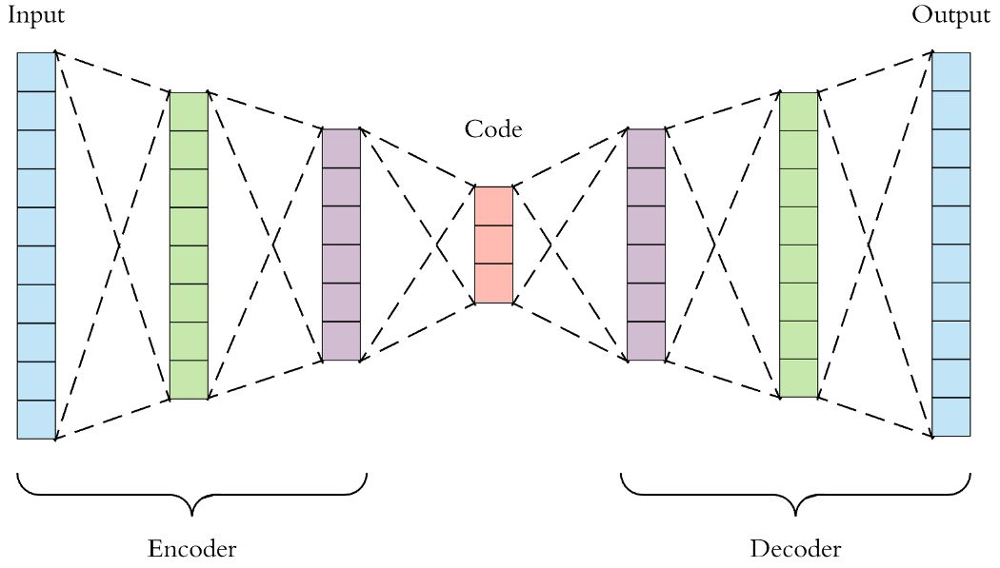
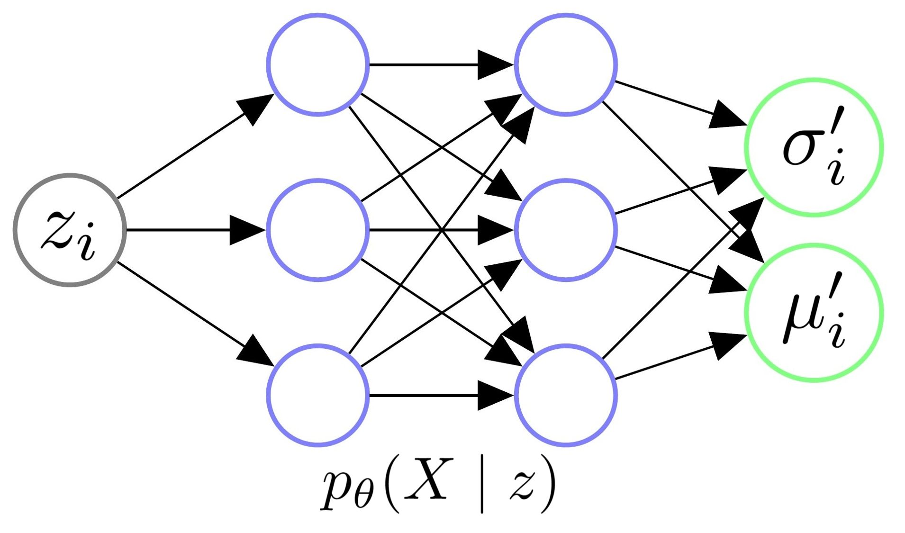
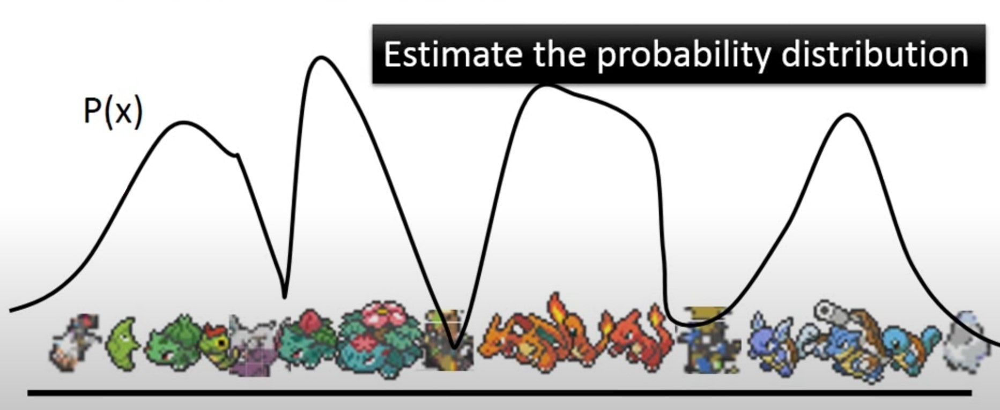
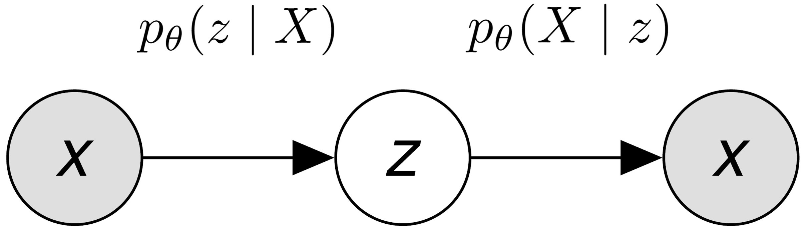
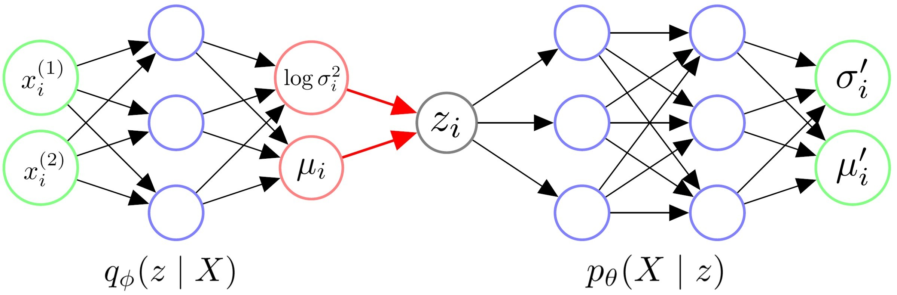
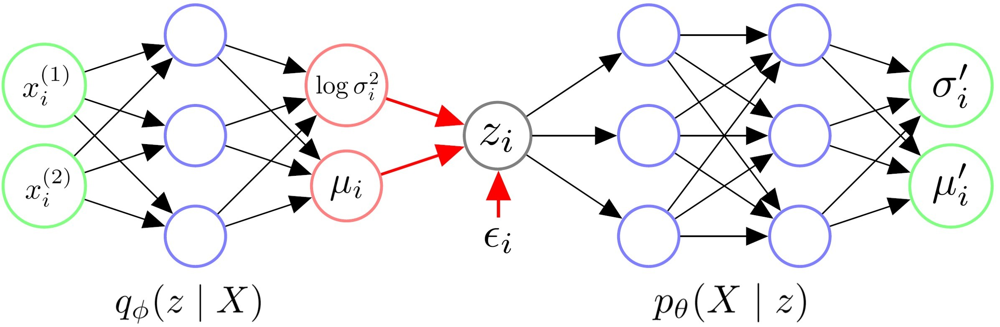
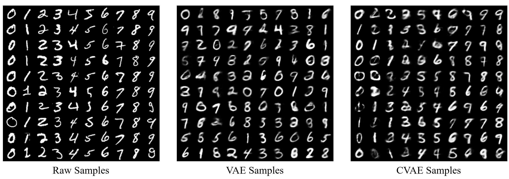

# 【转载】机器学习理论—优雅的模型（一）：变分自编码器（VAE）

[原文](https://zhuanlan.zhihu.com/p/348498294)

##  **1. Introduction** 

有了之前 **[损失函数（一）：交叉熵与KL散度](https://zhuanlan.zhihu.com/p/346518942)** 、 **[损失函数（二）：MSE、0-1 Loss与Logistic Loss](https://zhuanlan.zhihu.com/p/346935187)** 两篇文章的基础，我们现在可以开始做一些真的模型了。

中文社区里有一些对于VAE的介绍，但是我感觉这些往往流于表面，没有很好的把每一步的动机解释清楚。这篇文章将详细对VAE模型进行介绍，包括它的产生动机、数学推导、Conditional VAE扩展，以及它的实现与细节讨论。

希望这篇文章能够更加清楚的写出，为什么我们需要VAE、为什么VAE这样设计。文章较长、推导较多，难免有疏忽和错误，也请读者不吝指正。

##  **2. Motivation** 

在说VAE之前，自然要先说到传统的自编码器 (Autoencoder)。上图即是一个自编码的实例。自编码器类似于一个非线性的PCA，是一个利用神经网络来给复杂数据降维的模型。现在我们记$X$为整个数据集的集合，$x_i$是数据集中的一个样本。

自编码器包含一个编码器$z = g(X)$，它的输出$z$我们称作编码，$z$的维度往往远远小于输入$X$的维度。它还包含一个解码器$\tilde{X} = f(z)$，这个解码器能够通过编码$z$得到$\tilde{X}。$

我们希望解码器解码得到的$\tilde{X}$能够尽可能的接近$X，$所以自编码器一个常用的损失函数是$\ell = \|X - \tilde{X}\|^2。$这样一来，模型训练结束后，我们就可以认为编码$z$囊括了输入数据$X$的大部分信息，也因此我们可以直接利用$z$表达原始数据，从而达到数据降维的目的。

出于方便，假设现在我们的输入$X \in \mathbb{R}^{C \times H \times W}$是一些图片，我们可以训练一个自编码器。它的编码器$z = g(X)$将每个图片编码成$z \in \mathbb{R}^d，$它的解码器$\tilde{X} = f(z)$利用$z$将输入的图片重建为$\tilde{X} \in \mathbb{R}^{C \times H \times W}$。

我们现在仔细研究一下这个模型的解码器$g: \mathbb{R}^d  \rightarrow \mathbb{R}^{C \times H \times W}。$这个解码器只需要输入某些低维向量$z，$就能够输出高维的图片数据$X。$那我们能否把这个模型直接当做生成模型，在低维空间$\mathbb{R}^d$中随机生成某些向量$z$，再喂给解码器$f(z)$来生成图片呢？

答案是，我们可以这么做，运气好的话我们可以得到一些有用的图片，但是对绝大多数随机生成的$z$，$f(z)$只会生成一些没有意义的噪声。

为什么会这样呢？这是因为我们没有显性的对$z$的分布$p(z)$进行建模，我们并不知道哪些$z$能够生成有用的图片。我们用来训练$f(z)$的数据是有限的，$f$可能只会对极有限的$z$有响应。而$\mathbb{R}^d$又是一个太大的空间，如果我们只在这个空间上随机采样的话，我们自然不能指望总能恰好采样到能够生成有用的图片的$z。$

在Autoencoder的基础上，显性的对$z$的分布$p(z)$进行建模，使得自编码器成为一个合格的生成模型，我们就得到了Variational Autoencoders，即今天的主题，变分自编码器。

##  **3. Derivation** 

我们在这一章正式对VAE进行推导。对于自编码器来说，$z$的分布是不确定的，因此只能在$\mathbb{R}^d$上采样、碰运气。我们为什么不给定$z$一个简单的分布，将采样的空间缩的很小呢？

我们不妨假设$z \sim \mathcal{N}(0, I)，$其中$I$代表一个单位矩阵。也就是说，我们将$z$看作是一个服从标准多元高斯分布的多维随机变量。

现在我们记$z$、$X$为随机变量，$z_i$、$x_i$代表随机变量的样本。

在这个架构下，我们可以认为数据集是由某个随机过程生成的，而$z$是这个随机过程中的一个不可观测到的隐变量。这个生成数据的随机过程包含两个步骤：
1. 从先验分布$p(z)$中采样得到一个$z_i$
1. 根据$z_i，$从条件分布$p(X \mid z_i)$中采样得到一个数据点$x_i$

如果我们能基于这个随机过程进行建模，那么我们可能可以更轻易的得到一个生成模型。

###  **3.1 Decoder** 

首先，让我们从生成模型的角度来考虑Decoder的架构。

上图是一个Decoder架构的示意图。我们给Decoder输入一个从$\mathcal{N}(0, I)$中采样得到的$z_i，$其实是希望由$\theta$参数化的Decoder能够学会一个映射，输出$z_i$对应的$X$的分布，即$p_{\theta}(X \mid z_i)。$

让我们假设，给定任意$z_i$后，$X$都服从某个各向同性的多元高斯分布，即：

$$p_{\theta}(X \mid z_i) = \mathcal{N}(X \mid \mu_i^{\prime}(z_i; \theta), \sigma_i^{\prime2}(z_i; \theta) * I).\\ \\$$

这样一来，我们只需要输入$z_i$给Decoder，然后让它拟合出$\mu_i^{\prime}和\sigma_i^{\prime2}，$我们就能知道$X \mid z_i $的具体分布了。

我们举个例子来更直观的理解这个过程。我们根据分布$p(z)$采样出一个$z_i，$一个$z_i$应当对应图片集$X$中的某一部分类似的图片。比如说，我们的图片集$X$可能是世界上所有的猫，那么抽样得到的一个$z_i$可能代表颜色为橘色，耳朵为立耳的猫；而下次抽样得到的另一个$z_j$可能代表颜色为白色，耳朵为折耳的猫。

我们再假设，在这个$z_i$下，这类立耳橘猫的图片像素值的分布$X\mid z_i$服从一个多元高斯分布$\mathcal{N}(\mu_i^{\prime}, \sigma_i^{\prime2} * I)。$这样一来，我们的Decoder只需要通过神经网络，将$z_i$变换为适当的${\mu}_i^{\prime}和 {\sigma}_i^{\prime2}，$我们就得到了这个多元高斯分布。之后我们就可以从$\mathcal{N}(\mu_i^{\prime}, \sigma_i^{\prime2} * I)$中采样，得到立耳橘猫的图片了！

###  **3.2 Objective** 

因为本质上我们希望训练一个生成模型，我们也不妨以一个更加统计的视角来看一个生成模型的目标函数。

对于一个生成模型，我们的终极目标是什么？对，我们就是想对数据本身的分布$p(X)$进行建模。如果能成功得到一个逼近真实分布$p(X)$的$p_{\theta}(X)，$那么我们就能从中进行采样，生成一些可能的数据点。

如上图，我们举个当$X$代表所有宝可梦的图片的例子。在得到$p_{\theta}(X)$后，我们就可以生成一些令$p_{\theta}(x_i)$比较大的$x_i$，这些$x_i$就很可能会是正常的宝可梦的图片。

现在的问题就是，我们怎么对$p_{\theta}(X)$进行建模呢？

有了之前的铺垫，现在我们有$p(z) = \mathcal{N}(0, I)，p_{\theta}(X \mid z) = \mathcal{N}(X \mid \mu_i^{\prime}(z; \theta), \sigma_i^{\prime2}(z; \theta) * I)。$易得，

$$\begin{aligned} p_{\theta}(X) &= \int_z p_{\theta}(X \mid z) p(z) d z \\      &\approx \frac{1}{m} \sum_{j=1}^m p_{\theta}(X \mid z_j). \end{aligned}\\$$

这样问题是不是就解决了呢？我们只要从$p(z) = \mathcal{N}(z \mid 0, I)$里采样许多$z_i$出来，就能算出$p_{\theta}(X)。$在之前的文章 **[机器学习理论—统计：MLE与MAP](https://zhuanlan.zhihu.com/p/345024301)** 中，我们已经介绍过了MLE。在这里，我们就可以利用MLE的思想，让数据集出现的概率最大化，也就是：

$$\begin{aligned} \theta^* &=  \operatorname{argmin}_{\theta} - \sum_{i=1}^n \log p_{\theta}(x_i) \\          &=  \operatorname{argmin}_{\theta} - \sum_{i=1}^n \log \left( \frac{1}{m} \sum_{j=1}^m p_{\theta}(x_i \mid z_j) \right). \end{aligned}\\$$

我们确实可以这样做，但是这样做的代价是极大的。因为往往$x_i$的维度会很大，$z_i$的维度也不会很低，并且，对于某个$x_i$而言，与之强相关的$z_i$的数量是相对有限的，但是为了找到这些有限的$z_i，$我们可能要进行大量的采样。

所以如果我们希望较为准确的估计$p_{\theta}(X)$的话，我们可能需要采样 **极大量** 的$z_i$，只有这样，我们才能让模型知道究竟哪一些$z_i$是与哪一些$x_i$对应着的。

因此，直接从$p(z)$中采样$z_i，$用来估计$p_{\theta}(X)$的策略几乎是不可行的。不过解决这个问题的思路也很直觉，那就是在Encoder中引入后验分布$p_{\theta}(z \mid x_i)。$

###  **3.3 Encoder** 

具体来说，我们怎么在Encoder中利用后验分布呢？假设我们现在有后验分布$p_{\theta}(z \mid x_i)，$这样的话，如下图，每次前向传播的时候，我们可以先将$x_i$喂给Encoder，算出$z\mid x_i$服从的分布。之后，我们就可以直接在这个分布中采样出$z_i，$喂给Decoder，然后得到$X\mid z_i$的分布，最后基于MLE优化模型。

在这个策略下，从$p_{\theta}(z \mid x_i)$中采样出来的$z_i$几乎都会和$x_i$相关的，对比之前，我们可能就省去了很多采样的步骤，极大的提高了效率。

那现在的问题就是，我们怎么计算$p_{\theta}(z \mid x_i)$呢？我们不妨先尝试下贝叶斯公式：

$$\begin{aligned} p_{\theta}(z \mid x_i) &= \frac{p_{\theta}(x_i \mid z) p(z)}{p_{\theta}(x_i)} \\                        &= \frac{p_{\theta}(x_i \mid z) p(z)}{\int_{\hat{z}} p_{\theta}(x_i \mid \hat{z}) p(\hat{z}) d \hat{z}}. \end{aligned}\\$$

辛运的是，我们之前已经假设了$p_{\theta}(X \mid z)和p(z)$的分布，所以对于上式的分子，我们是可以直接算出来的。不幸的是，上式的分母又有一个积分，如果去估计这个积分的话，又会需要从$p(z)$中采样大量的$z_i。$这显然是代价极大，不太可行的。

这时候我们就可以应用变分贝叶斯算法了！我们不妨令由$\phi$参数化的Encoder去拟合对任意$x_i$的分布$q_{\phi}(z \mid x_i)，$我们希望这个分布能够尽可能的逼近真实的后验分布$p_{\theta}(z \mid x_i)。$如果$q_{\phi}(z \mid x_i)$能够足够逼近真实的后验分布的话，我们就可以直接通过Encoder得到$z \mid x_i$的分布了！

我们怎么用神经网络去拟合后验分布呢？和之前一样，我们只要知道这个后验是服从的什么分布，然后让模型拟合这个分布所需的参数就行了。举个例子，如果这个后验分布本质上是一个多元高斯分布，那么我们让Encoder输出$\mu$和$\Sigma^2$就能拟合这个分布了。

回忆一下，我们之前已经对似然$p_{\theta}(X \mid z)$和先验$p(z)$的分布做了假设——它们都服从高斯分布。在这种情况下，不难证明，真实的后验分布$p_{\theta}(z \mid X)$也服从高斯分布。

那不妨令近似后验分布对任意$x_i$都有

$$q_{\phi}(z \mid x_i) = \mathcal{N}(z \mid \mu(x_i; \phi), \sigma^2(x_i; \phi) * I),\\ \\$$

即，它也是一个各向同性的多元高斯分布。这样一来，整个VAE的架构就非常明了了。

###  **3.4 Architecture** 

下图即是VAE的架构示例。其中$x_i^{(j)}$代表第$i$个数据点的第$j$的特征。

总结一下VAE的架构：
1. 我们首先给Encoder输入一个数据点$x_i，$通过神经网络，我们得到隐变量$z$服从的近似后验分布$q_{\phi}(z \mid x_i)$的参数。我们往往认为后验分布是一个各向同性的高斯分布，因此令Encoder输出$z\mid x_i$服从的高斯分布的参数$\sigma_i^2$和$\mu_i$即可。 
1. 有了$z \mid x_i$分布的参数$\sigma_i^2$和$\mu_i$后，我们从对应的高斯分布中采样出一个$z_i，$这个$z_i$应当代表与$x_i$相似的一类样本。 
1. 我们令Decoder拟合似然的分布$p_{\theta}(X \mid z_i)。$喂给Decoder一个$z_i，$它应当返回$X \mid z_i$服从的分布的参数。我们往往认为似然也服从一个各向同性的高斯分布，因此令Decoder输出$X\mid z_i$服从的高斯分布的参数$\sigma^{\prime2}_i$和$\mu^{\prime}_i$即可。 
1. 在得到$X\mid z_i$的分布的参数后，理论上我们需要从这个分布中进行采样，来生成可能的数据点$x_i$。 

上述第四点中值得注意的是，在大部分实现中，人们往往不进行采样，而是直接将模型输出的$\mu^{\prime}_i$当作是给定$z_i$生成的数据点$x_i。$

除此之外，人们也往往认为$p_{\theta}(X \mid z_i)$是一个固定方差的各向同性多元高斯分布，即$p_{\theta}(X \mid z_i) = \mathcal{N}(X \mid \mu_i^{\prime}(z_i; \theta), \sigma^{\prime2} * I)，$其中$\sigma^{\prime2}$是一个人为给定的超参数。这意味着我们实际中并不真的让模型输出$\sigma^{\prime2}_i，$模型只要输出$\mu_i^{\prime}$就行了。

###  **3.5 Reparameterization Trick** 

上述VAE的架构应该是比较清晰的，但让我们再仔细研究一下这个架构。尽管现在我们还没有推导得到最终的损失函数，但让我们先假设，在上述步骤4后，我们会接某个损失函数$\mathcal{L}$来训练神经网络。

这样的话，从神经网络训练的角度来看，这个架构的前向传播过程是没有问题的，上述步骤1-4均可顺利的进行前向传播，然后计算出损失的值。

然而，令人在意的一个问题是：我们在前向传播的第2步，居然调用了一个"采样函数"，从$z\mid x_i$中采样出来了$z_i$喂给Decoder！那采样函数能够进行反向传播吗？

答案显然是不能的。因此，为了让整个网络能够正常的训练，作者们提出了Reparameterization Trick。这一技巧将上述第2步改为：
1. 有了$z \mid x_i$分布的参数$\sigma_i^2$和$\mu_i$后，我们先从$\mathcal{N}(0,I)$中采样得到一个$\epsilon_i$，然后我们令$z_i = \mu_i + \sigma_i \odot \epsilon_i，$这个$z_i$应当代表与$x_i$相似的一类样本。

其中，$\odot$代表逐元素相乘操作。不难证明，此时$z_i$背后的分布依然是由$\sigma_i^2$和$\mu_i$参数化的一个高斯分布。

利用了Reparameterization Trick后，VAE的架构变成了下图中的模样，其中$\epsilon_i$可以看作是伴随$z_i$喂给Decoder的一个特征。这样一来，这个架构的前向、反向传播就都能跑通了。

###  **3.6 Evidence Lower Bound** 

好了，我们已经把VAE的架构定下来了。现在我们只要顺着3.2节中MLE的思想，然后在最大化$\log p_{\theta}(X)$时，加入变分推断的思想，引入ELBO (Evidence Lower Bound)，我们就能得到一个靠谱的目标函数了。

让我们来推一下：

$$\begin{aligned} \log p_{\theta}(X) &=\int_{z} q_{\phi}(z \mid X) \log p_{\theta}(X) dz \quad 全概率定理\\                    &=\int_{z} q_{\phi}(z \mid X) \log \frac{p_{\theta}(X, z)}{p_{\theta}(z \mid X)} dz \quad 贝叶斯定理\\                    &=\int_{z} q_{\phi}(z \mid X) \log \left(\frac{p_{\theta}(X, z)}{q_{\phi}(z \mid X)} \cdot \frac{q_{\phi}(z \mid X)}{p_{\theta}(z \mid X)}\right) dz\\                    &=\int_{z} q_{\phi}(z \mid X) \log \frac{p_{\theta}(X, z)}{q_{\phi}(z \mid X)} dz + \int_{z} q_{\phi}(z \mid X) \log \frac{q_{\phi}(z \mid X)}{p_{\theta}(z \mid X)} dz\\                    &=\ell\left(p_{\theta}, q_{\phi}\right)+D_{K L}\left(q_{\phi}, p_{\theta}\right) \\                    & \geq \ell\left(p_{\theta}, q_{\phi}\right) \quad KL散度非负. \end{aligned}\\$$

我们已经在之前的文章 **[机器学习理论—信息论：自信息、熵、交叉熵与KL散度 ](https://zhuanlan.zhihu.com/p/345025351)** 中的第四章证明了KL散度是恒大于等于零的，因此显然上式中$\ell\left(p_{\theta}, q_{\phi}\right)$是$\log p_{\theta}(X)$的一个下界，也因此我们称$\ell$为ELBO (Empirical Lower Bound)。

我们不妨在把上式变换一下，易得：

$$\ell\left(p_{\theta}, q_{\phi}\right) = \log p_{\theta}(X) - D_{K L}\left(q_{\phi}, p_{\theta}\right).\\ \\$$

这个式子实在是太完美了！这个式子告诉我们，我们只需要最大化$\ell，$就能最大化$\log p_{\theta}(X)，$并且最小化$D_{K L}\left(q_{\phi}, p_{\theta}\right)。$

最大化$\log p_{\theta}(X)$的理由是显然的，因为我们希望最大化似然。我们为什么希望最小化$D_{K L}\left(q_{\phi}, p_{\theta}\right)$呢？其实原因也是显然的，因为我们希望近似后验$q_{\phi}(z\mid X)$能够逼近真实后验$p_{\theta}(z \mid X)，$否则的话Encoder可能只能输出一些无意义的分布。

既然我们希望最大化$\ell，$现在我们进一步对其进行展开，不难得到：

$$\begin{aligned} \ell\left(p_{\theta}, q_{\phi}\right) &= \int_{z} q_{\phi}(z \mid X) \log \frac{p_{\theta}(X, z)}{q_{\phi}(z \mid X)} dz \\         &=\int_{z} q_{\phi}(z \mid X) \log \frac{p_{\theta}(X \mid z) p(z)}{q_{\phi}(z \mid X)} dz \quad 贝叶斯定理 \\         &=\int_{z} q_{\phi}(z \mid X) \log \frac{p(z)}{q_{\phi}(z \mid X)} dz + \int_{z} q_{\phi}(z \mid X) \log p_{\theta}(X \mid z) dz \\         &=-D_{K L}\left(q_{\phi}, p\right)+\mathbb{E}_{q_{\phi}}\left[\log p_{\theta}(X \mid z)\right]. \end{aligned}\\$$

让我们再将上述两项分别展开。

首先，让我们看下$-D_{K L}\left(q_{\phi}, p\right)$这一项。人们通常称这一项为Latent Loss或者将其看做一个正则项。回忆一下，我们之前已经假设了$q_{\phi}(z \mid X) $和$p(z)$均服从高斯分布，辛运的是，在这种情况下，我们能够得到$D_{K L}\left(q_{\phi}, p\right)$的解析解。

更加幸运的是，我们把它们都设成了各向同性的高斯分布，所以我们可以直接从一维的情况进行推导：

$$\begin{aligned} D_{K L}(\mathcal{N}\left(\mu, \sigma^{2}\right)\| \mathcal{N}(0,1))     &=\int_{z} \frac{1}{\sqrt{2 \pi \sigma^{2}}} \exp \left(-\frac{\left(z-\mu\right)^{2}}{2 \sigma^{2}}\right) \log \frac{\frac{1}{\sqrt{2 \pi \sigma^{2}}} \exp \left(-\frac{\left(z-\mu\right)^{2}}{2 \sigma^{2}}\right)}{\frac{1}{\sqrt{2 \pi}} \exp \left(-\frac{z^{2}}{2}\right)} d z \\ &=\int_{z}\left(\frac{-\left(z-\mu\right)^{2}}{2 \sigma^{2}}+\frac{z^{2}}{2}-\log \sigma\right) \mathcal{N}\left(\mu, \sigma^{2}\right) d z \\     &=-\int_{z} \frac{\left(z-\mu\right)^{2}}{2 \sigma^{2}} \mathcal{N}\left(\mu, \sigma^{2}\right) d z+\int_{z} \frac{z^{2}}{2} \mathcal{N}\left(\mu, \sigma^{2}\right) d z-\int_{z} \log \sigma \mathcal{N}\left(\mu, \sigma^{2}\right)  d z \\     &=-\frac{\mathbb{E}\left[\left(z-\mu\right)^{2}\right]}{2 \sigma^{2}}+\frac{\mathbb{E}\left[z^{2}\right]}{2}-\log \sigma \\     &= \frac{1}{2}(-1 + \sigma^2 + \mu^2 - \log \sigma^2). \end{aligned}$$

当它们都是$d$元高斯分布时，易得：

$$D_{K L}\left(q_{\phi}(z\mid X), p(z)\right) = \sum_{j=1}^d \frac{1}{2}(-1 + {\sigma^{(j)}}^{2} + {\mu^{(j)}}^{2} - \log {\sigma^{(j)}}^{2}).\\ \\$$

其中${a^{(j)}}^{2}$代表向量$a$的第$j$个元素的平方。

至此，最后的问题就是，$\mathbb{E}_{q_{\phi}}\left[\log p_{\theta}(X \mid z)\right]$怎么求呢？这一项往往被称为Reconstruction Loss，人们通常从$q_{\phi}(z\mid X)$中采样多个$z_i$来近似求解这一项，即：

$$\mathbb{E}_{q_{\phi}}\left[\log p_{\theta}(X \mid z)\right] \approx \frac{1}{m} \sum_{i=1}^{m} \log p_{\theta}\left(X \mid z_{i}\right), \\$$

其中，$z_{i} \sim q_{\phi}\left(z \mid x_{i}\right)=\mathcal{N}\left(z \mid \mu\left(x_{i} ; \phi\right), \sigma^2\left(x_{i} ; \phi\right) * I\right)。$

现在我们来看$\log p_{\theta}\left(X \mid z_{i}\right)$这一项怎么展开。我们之前已经假设过$X\mid z_i$服从一个固定方差的各向同性多元高斯分布，即$p_{\theta}(X \mid z_i) = \mathcal{N}(X \mid \mu_i^{\prime}(z_i; \theta), \sigma^{\prime2} * I)。$

有了之前的文章 **[损失函数（二）：MSE、0-1 Loss与Logistic Loss](https://zhuanlan.zhihu.com/p/346935187)** 中的2.2节的基础后，我们知道，若假设数据为固定方差的高斯分布，MLE后得到的目标函数，等价于MSE。但我们这里还是先把它写开，设每个数据点$x_i$的维度为$K$，即$X\mid z_i$服从一个$K$维高斯分布，易得：

$$\begin{aligned} \log p_{\theta}\left(X \mid z_{i}\right) &= \log \frac{\exp \left(-\frac{1}{2}(X-\mu^{\prime})^{\mathrm{T}} {\Sigma}^{\prime-1}({X}-{\mu^{\prime}})\right)}{\sqrt{(2 \pi)^{k}|{\Sigma^{\prime}}|}} \\     &= -\frac{1}{2}(X-\mu^{\prime})^{\mathrm{T}} {\Sigma}^{\prime-1}({X}-{\mu^{\prime}}) - \log \sqrt{(2 \pi)^{k}|\Sigma^{\prime}|} \\     &= -\frac{1}{2} \sum_{k=1}^K \frac{(X^{(k)}-\mu^{\prime(k)})^2}{\sigma^{\prime(k)}}  - \log \sqrt{(2 \pi)^{K}\prod_{k=1}^{K} \sigma^{\prime(k)}}. \end{aligned}\\$$

这样，我们就有了最终的损失函数所需要的所有模块了。

###  **3.7 Loss Function** 

让我们把上一节中的推导整合起来。现在希望最小化损失函数：

$$\begin{aligned} \mathcal{L} &= - \frac{1}{n} \sum_{i=1}^n \ell(p_{\theta}, q_{\phi}) \\             &= \frac{1}{n} \sum_{i=1}^nD_{K L}\left(q_{\phi}, p\right) - \frac{1}{n} \sum_{i=1}^n \mathbb{E}_{q_{\phi}}\left[\log p_{\theta}(x_i \mid z)\right] \\             &= \frac{1}{n} \sum_{i=1}^nD_{K L}\left(q_{\phi}, p\right) - \frac{1}{nm} \sum_{i=1}^n \sum_{j=1}^{m} \log p_{\theta}\left(x_i \mid z_{j}\right). \end{aligned}\\$$

上式即是通过从$q_{\phi}(z \mid x_i)$中采样$m$次$z_j，$来逼近$\mathbb{E}_{q_{\phi}}\left[\log p_{\theta}(x_i \mid z)\right]。$也许我们会好奇，之前两次我们都说积分太难求了，采样逼近代价太大了，所以不能采样逼近，为什么这里又可以采样逼近了呢？

答案就是：之前我们都只能从$p(z)$中采样$z_j，$这样的话，采样到和$x_i$有关联的$z_j$的概率实在是很低，所以为了更好的逼近积分只能采样大量的$z_j$，这样的代价自然是极大的；然而，在上式中，我们其实是从$q_{\phi}(z \mid x_i)$中采样得到$z_j。$随着网络的训练，近似后验$q_{\phi}(z \mid x_i)，$很快就会比较接近真实的后验分布。这样一来，我们有很大可能能够在有限次数的采样中，采样到与$x_i$关联的$z_j。$

事实上，从经验来看，从$q_{\phi}(z \mid x_i)$中采样$z_j$估计$\mathbb{E}_{q_{\phi}}\left[\log p_{\theta}(x_i \mid z)\right]$是比较高效的。在实践中我们往往对一个$x_i$只采样一个$z_j$，即$m=1，$就能达到可观的效果。所以我们可以将损失改写，并继续往下展开：

$$\begin{aligned} \mathcal{L} &= \frac{1}{n} \sum_{i=1}^nD_{K L}\left(q_{\phi}, p\right) - \frac{1}{n} \sum_{i=1}^n  \log p_{\theta}\left(x_i \mid z_{i}\right) \\             &= \frac{1}{n} \sum_{i=1}^n \sum_{j=1}^d \frac{1}{2}(-1 + {\sigma_i^{(j)}}^{2} + {\mu_i^{(j)}}^{2} - \log {\sigma_i^{(j)}}^{2}) \\             &\quad\quad\quad - \frac{1}{n} \sum_{i=1}^n \left( -\frac{1}{2} \sum_{k=1}^K \frac{(x_i^{(k)}-\mu_i^{\prime(k)})^2}{\sigma_i^{\prime(k)}}  - \log \sqrt{(2 \pi)^{K}\prod_{k=1}^{K} \sigma_i^{\prime(k)}} \right). \end{aligned}\\$$

值得注意的是，我们已经假设了$p_{\theta}(X \mid z_i)$对任意$z_i$均是方差固定的各向同性$K$维高斯分布，我们不妨令超参数$\sigma^{\prime}$为元素值全为$\frac{1}{2}$的$K$维向量。这样一来，损失可以改写为：

$$\mathcal{L} = \frac{1}{n} \sum_{i=1}^n \sum_{j=1}^d \frac{1}{2}(-1 + {\sigma_i^{(j)}}^{2} + {\mu_i^{(j)}}^{2} - \log {\sigma_i^{(j)}}^{2}) + \frac{1}{n} \sum_{i=1}^n  \|x_i - \mu_i^{\prime}\|^2. \tag{1}\\ $$

其中，$x_i$代表第$i$个样本，是Encoder的输入。$\mu_i$和$\sigma_i^2$是Encoder的输出，代表$z \mid x_i$的分布的参数。$z_i$是从$z\mid x_i$中采样得到的一个样本，它是Decoder的输入。$\mu_i^{\prime}$是Decoder的输出，代表利用$z_i$解码后对应的数据点$\tilde{x}_i。$

到这里，我们终于得到了在假设先验、后验、似然均是高斯分布的情况下，VAE最终的损失函数。值得一提的是，通常人们采用高斯分布只是因为其简便性。我们也可以根据数据的情况，假设更加复杂分布来推导、训练VAE。在这种情况下，VAE可能计算会更加复杂，但也可能会得到更强的表达能力。

##  **4. Conditional VAE** 

根据上面的推导，我们已经可以训练得到一个原版的VAE了。模型训练结束后，我们从$p(z)$中采样得到$z_i$，再喂给Decoder，就能生成可能的数据点了。

但这里有个问题，尽管现在我们几乎可以确保从$p(z)$中采样得到的$z_i，$总能重建出某个$x_i，$但是我们无法控制生成的是哪一类$x_i。$

举个MNIST手写数字的例子，原版VAE只能采样得到$z_i$后随机生成数字。然而，更多的时候我们可能会希望模型能够生成我们 **指定** 的数字。这就引出了CVAE (Conditional VAE)。

假设我们现在的数据集为$X，$我们现在希望利用它的标注$Y$来控制生成的结果。在MNIST的场景下，就是我们希望能够告诉Decoder：我现在想生成一个标注为"7"的数字，你帮我生成一个看看。

CVAE的思路非常简单，这里我们简单介绍一下。
1. 原来MLE是最大化数据集出现的概率，也就是对$p_{\theta}(X)$建模，那么现在我们需要对$p_{\theta}(X|Y)$建模。 
1. 原来我们对$p(z)$进行建模，现在对$p(z\mid y_i)$建模。 
1. 原来Decoder是对似然$p_{\theta}\left(X \mid z_{i}\right)$建模，现在即是对$p_{\theta}\left(X \mid z_{i}, y_i\right)$建模。 
1. 原来Encoder是对近似后验$q_{\phi}\left(z \mid x_{i}\right)$建模，现在则需要对$q_{\phi}\left(z \mid x_{i}, y_i\right)$建模。 

顺着推导，到最后我们其实只需要让Encoder和Decoder由$y_i$"参数化"就好。这里做法就很多了，一个直观的做法是将$y_i$作为Encoder和Decoder的输入，这样它们不就等于被$y_i$"参数化"了嘛。

##  **5. Implementation** 

我们在 **[VAE.py](https://github.com/siqim/Machine-Learning-with-Graphs/blob/main/examples/MLMath/VAE.py)** 中实现了VAE和CVAE。VAE的实现非常简单，主要就是损失函数的实现。我们在代码中的变量名与该文章中的符号是一致的。

下图是我在MNIST上跑的一组示例。

也许我们会注意到，VAE的实现中，人们往往令Encoder输出$\log \sigma^2，$而不直接输出$\sigma。$这是因为根据定义，我们必须让模型输出$\sigma \geq 0。$出于方便，我们通过取对数后再取指数的方法，获得$\sigma。$而取平方只是为了计算损失的时候不再需要取平方。

除此之外，在VAE损失函数的实现中，有一个更需要注意的地方。我们先把之前推的损失函数抄下来：

$$\mathcal{L} = \frac{1}{n} \sum_{i=1}^n \sum_{j=1}^d \frac{1}{2}(-1 + {\sigma_i^{(j)}}^{2} + {\mu_i^{(j)}}^{2} - \log {\sigma_i^{(j)}}^{2}) + \frac{1}{n} \sum_{i=1}^n  \|x_i - \mu_i^{\prime}\|^2.\\ \\$$

可见，上式中第二部分有一个类似MSE的项$\frac{1}{n} \sum_{i=1}^n  \|x_i - \mu_i^{\prime}\|^2。$也因此，很多基于Pytorch实现VAE的Repo，直接采用 `F.mse_loss(mu_prime, x, reduction='mean')` 来计算这一项。这是 **错误** 的！

设$x_i$的维度为$K，$Pytorch中的 `F.mse_loss` 等价于：

$$\frac{1}{nK} \sum_{i=1}^n  \|x_i - \mu_i^{\prime}\|^2.\\ \\$$

如果单纯的使用MSE损失训练模型的话，常数项的改变并不会影响模型的结果。但是在VAE中，Reconstruction Loss这一项的常数项是有意义的。

直观的来说，这一的常数项控制Reconstruction Loss和Latent Loss之间的权重。如果利用 `F.mse_loss` 实现的话，等价于将Reconstruction Loss的权重降的很低，Decoder将无法准确重建$x_i。$

抽象的来说，这一常数项代表Decoder拟合的分布$p_{\theta}\left(X \mid z_{i}\right)$的方差$\sigma^{\prime2}$。对于图片生成模型，$K$往往非常大，比如MNIST里$K=28 \times 28。$平白无故的多除以了个$K$等价于我们将$p_{\theta}\left(X \mid z_{i}\right)$的方差设的非常大，那它生成的图片全都是噪声也不会令人惊讶。也因此，我们往往在设置超参数$\sigma^{\prime}$的时候，必然将其设置的较小。

##  **6. Discussion** 

VAE中最老生常谈的问题就是，它为什么生成的图片是模糊的？

我在寻找这个问题的答案的时候，从Reddit的一个 **[Post](https://www.reddit.com/r/MachineLearning/comments/9t712f/dwhy_are_images_created_by_gan_sharper_than/)** 上看到一个高赞回答：

> Vanilla VAEs with Gaussian posteriors / priors and factorized pixel distributions aren't blurry, they're noisy. People tend to show the mean value of p(x|z) rather than drawing samples from it. Hence the reported blurry samples aren't actually samples from the model, and they don't reveal the extent to which variability is captured by pixel noise. Real samples would typically demonstrate salt and pepper noise due to independent samples from the pixel distributions. 

知乎上也有引用这段话的关于VAE的 **[文章](https://zhuanlan.zhihu.com/p/52974147)** 。

这一类回答的意思是：高斯分布假设下，VAE生成的图像并不模糊，而是因为有噪声。为什么呢？因为我们本应该利用Decoder拟合一个高斯分布，然后从这个分布中采样得到$x_i$的。但是人们偷懒，直接认为拟合出的高斯分布的均值$\mu^{\prime}$就是生成的数据$x_i。$你想，本来Decoder告诉你的是给定$z_i$后$X$可能的 **分布** ，你到好，直接把这个分布的 **均值** 作为生成的图像了，那能不模糊吗？

知乎上另一类回答说，VAE产生的图像之所以模糊，就是因为高斯分布的假设，比如 **[回答1](https://www.zhihu.com/question/317623081/answer/1062727034)** 、 **[回答2](https://www.zhihu.com/question/368413722/answer/991708331)** 。这类回答的点在于：如果对$p_{\theta}\left(X \mid z_{i}\right)$进行高斯分布的假设，那么我们等同于假设数据是一个单峰分布，但是现实中数据往往的多峰 (Multimodal) 的，你用单峰的分布去拟合多峰的分布，那模型只能把多峰进行平均来降低损失了，这样一来，拟合的分布对应的图像，自然也就是模糊的了。

这两类回答看问题的角度是不一样的。但我觉得它们都存在一定的问题，至少不能把我完全说服，我列一下各自可能的疑点：
1. 对于第一类回答：确实，本来让你采样，现在你直接拿分布的均值出来，似乎图片注定会变得模糊。但是给你一个模糊的均值，再给你一个高斯的方差，你去采样不依然很可能是模糊的？ 
1. 对于第二类答案：我数据肯定是多峰的，但我假设$p_{\theta}\left(X \mid z_{i}\right)$是单峰的为什么不行？只要我能确保每个$z_i$对应的$X$的分布是单峰的不就行了？那这样来看，这个问题的本质是因为模型拟合能力不行，输出隐变量无法捕捉充分的信息，而高斯分布也只是受害者？ 

综上，目前最能说服我的观点是这样的：

模型拟合能力就是没那么强，模型习得的隐变量就是无法完全对应出单峰的$X$来。在这种前提下，你再假设是高斯分布，那模型只能把多峰的分布给平均了。所以一个更成功的生成模型，就是允许$X\mid z_i$是一个更复杂的分布，从而使得模型容错率变高：就算你$z_i$对应的$X$是多峰的，我这个复杂的分布也能拟合这个多峰的分布。

至于直接取均值而不采样，故而导致模糊的观点，我觉得只能是非常次要的原因。毕竟你输出的均值就已经是模糊的了，再采样也没有意义。

##  **7. References** 

[1] Doersch, Carl. "Tutorial on variational autoencoders." arXiv preprint arXiv:1606.05908 (2016).

[2] Slides from UIUC CS446: Machine Learning

[3]  **[Slides from Hung-yi Lee's ML Lecture](https://www.youtube.com/watch?v=8zomhgKrsmQ)** 

[4] Zhao, Shengjia, Jiaming Song, and Stefano Ermon. "Towards deeper understanding of variational autoencoding models." arXiv preprint arXiv:1702.08658 (2017).
