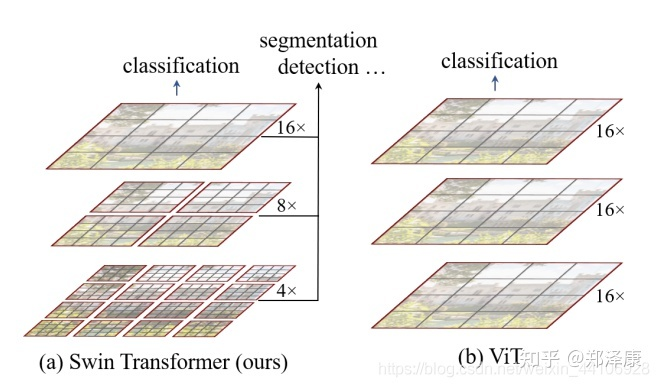
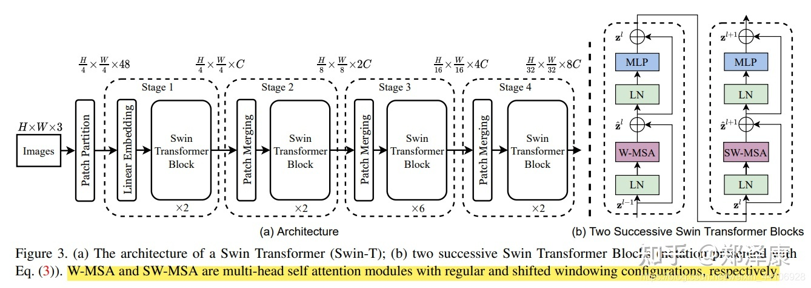
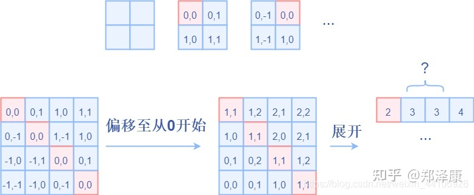
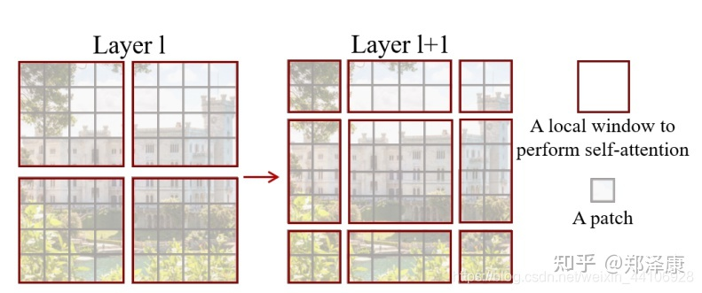
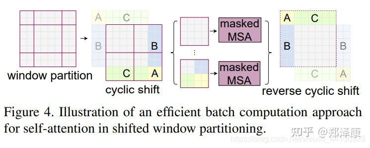
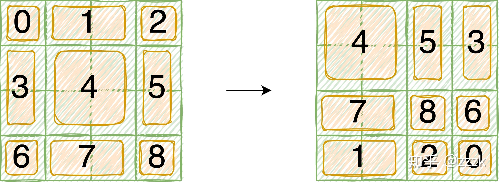
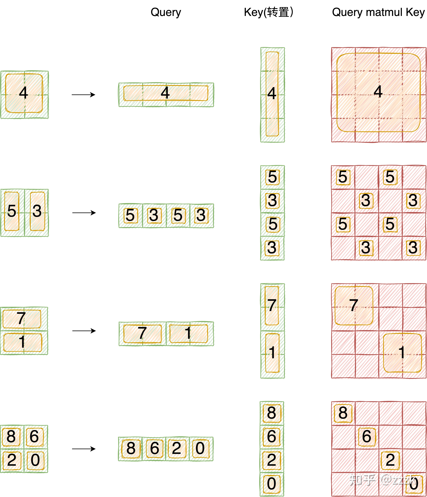
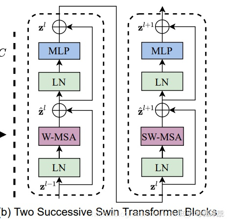

# 【纯转载】图解Swin Transformer

[原文](https://zhuanlan.zhihu.com/p/367111046)

##  **引言** 

目前Transformer应用到图像领域主要有两大挑战：

1. 视觉实体变化大，在不同场景下视觉Transformer性能未必很好
1. 图像分辨率高，像素点多，Transformer基于全局自注意力的计算导致计算量较大

针对上述两个问题，我们提出了一种 **包含滑窗操作，具有层级设计** 的Swin Transformer。

其中滑窗操作包括 **不重叠的local window，和重叠的cross-window** 。将注意力计算限制在一个窗口中， **一方面能引入CNN卷积操作的局部性，另一方面能节省计算量** 。 



在各大图像任务上，Swin Transformer都具有很好的性能。

本文比较长，会根据官方的[开源代码](https://link.zhihu.com/?target=https%3A//github.com/microsoft/Swin-Transformer)进行讲解，有兴趣的可以去阅读下[论文原文](https://link.zhihu.com/?target=https%3A//arxiv.org/pdf/2103.14030.pdf)。

##  **整体架构** 

我们先看下Swin Transformer的整体架构 



 整个模型采取层次化的设计，一共包含4个Stage，每个stage都会缩小输入特征图的分辨率，像CNN一样逐层扩大感受野。

1. 在输入开始的时候，做了一个`Patch Embedding`，将图片切成一个个图块，并嵌入到`Embedding`。
1. 在每个Stage里，由`Patch Merging`和多个Block组成。
1. 其中`Patch Merging`模块主要在每个Stage一开始降低图片分辨率。
1. 而Block具体结构如右图所示，主要是`LayerNorm`，`MLP`，`Window Attention` 和 `Shifted Window Attention`组成 (为了方便讲解，我会省略掉一些参数)

```python
class SwinTransformer(nn.Module):
    def __init__(...):
        super().__init__()
        ...
        # absolute position embedding
        if self.ape:
            self.absolute_pos_embed = nn.Parameter(torch.zeros(1, num_patches, embed_dim))
            
        self.pos_drop = nn.Dropout(p=drop_rate)

        # build layers
        self.layers = nn.ModuleList()
        for i_layer in range(self.num_layers):
            layer = BasicLayer(...)
            self.layers.append(layer)

        self.norm = norm_layer(self.num_features)
        self.avgpool = nn.AdaptiveAvgPool1d(1)
        self.head = nn.Linear(self.num_features, num_classes) if num_classes &gt; 0 else nn.Identity()

    def forward_features(self, x):
        x = self.patch_embed(x)
        if self.ape:
            x = x + self.absolute_pos_embed
        x = self.pos_drop(x)

        for layer in self.layers:
            x = layer(x)

        x = self.norm(x)  # B L C
        x = self.avgpool(x.transpose(1, 2))  # B C 1
        x = torch.flatten(x, 1)
        return x

    def forward(self, x):
        x = self.forward_features(x)
        x = self.head(x)
        return x
```

其中有几个地方处理方法与ViT不同：

1. ViT在输入会给embedding进行位置编码。而Swin-T这里则是作为一个 **可选项** （`self.ape`），Swin-T是在计算Attention的时候做了一个`相对位置编码`
1. ViT会单独加上一个可学习参数，作为分类的token。而Swin-T则是 **直接做平均** ，输出分类，有点类似CNN最后的全局平均池化层

接下来我们看下各个组件的构成

##  **Patch Embedding** 

在输入进Block前，我们需要将图片切成一个个patch，然后嵌入向量。

具体做法是对原始图片裁成一个个 `patch_size * patch_size`的窗口大小，然后进行嵌入。

这里可以通过二维卷积层， **将stride，kernelsize设置为patch_size大小** 。设定输出通道来确定嵌入向量的大小。最后将H,W维度展开，并移动到第一维度

```python
import torch
import torch.nn as nn

class PatchEmbed(nn.Module):
    def __init__(self, img_size=224, patch_size=4, in_chans=3, embed_dim=96, norm_layer=None):
        super().__init__()
        img_size = to_2tuple(img_size) # -&gt; (img_size, img_size)
        patch_size = to_2tuple(patch_size) # -&gt; (patch_size, patch_size)
        patches_resolution = [img_size[0] // patch_size[0], img_size[1] // patch_size[1]]
        self.img_size = img_size
        self.patch_size = patch_size
        self.patches_resolution = patches_resolution
        self.num_patches = patches_resolution[0] * patches_resolution[1]

        self.in_chans = in_chans
        self.embed_dim = embed_dim

        self.proj = nn.Conv2d(in_chans, embed_dim, kernel_size=patch_size, stride=patch_size)
        if norm_layer is not None:
            self.norm = norm_layer(embed_dim)
        else:
            self.norm = None

    def forward(self, x):
        # 假设采取默认参数
        x = self.proj(x) # 出来的是(N, 96, 224/4, 224/4) 
        x = torch.flatten(x, 2) # 把HW维展开，(N, 96, 56*56)
        x = torch.transpose(x, 1, 2)  # 把通道维放到最后 (N, 56*56, 96)
        if self.norm is not None:
            x = self.norm(x)
        return x
```

##  **Patch Merging** 

该模块的作用是在每个Stage开始前做降采样，用于缩小分辨率，调整通道数 进而形成层次化的设计，同时也能节省一定运算量。

>在CNN中，则是在每个Stage开始前用`stride=2`的卷积/池化层来降低分辨率。

每次降采样是两倍，因此 **在行方向和列方向上，间隔2选取元素** 。

然后拼接在一起作为一整个张量，最后展开。 **此时通道维度会变成原先的4倍** （因为H,W各缩小2倍），此时再通过一个 **全连接层再调整通道维度为原来的两倍** 

```python
class PatchMerging(nn.Module):
    def __init__(self, input_resolution, dim, norm_layer=nn.LayerNorm):
        super().__init__()
        self.input_resolution = input_resolution
        self.dim = dim
        self.reduction = nn.Linear(4 * dim, 2 * dim, bias=False)
        self.norm = norm_layer(4 * dim)

    def forward(self, x):
        """
        x: B, H*W, C
        """
        H, W = self.input_resolution
        B, L, C = x.shape
        assert L == H * W, "input feature has wrong size"
        assert H % 2 == 0 and W % 2 == 0, f"x size ({H}*{W}) are not even."

        x = x.view(B, H, W, C)

        x0 = x[:, 0::2, 0::2, :]  # B H/2 W/2 C
        x1 = x[:, 1::2, 0::2, :]  # B H/2 W/2 C
        x2 = x[:, 0::2, 1::2, :]  # B H/2 W/2 C
        x3 = x[:, 1::2, 1::2, :]  # B H/2 W/2 C
        x = torch.cat([x0, x1, x2, x3], -1)  # B H/2 W/2 4*C
        x = x.view(B, -1, 4 * C)  # B H/2*W/2 4*C

        x = self.norm(x)
        x = self.reduction(x)

        return x
```

下面是一个示意图（输入张量N=1, H=W=8, C=1，不包含最后的全连接层调整） 


>个人感觉这像是PixelShuffle的反操作

##  **Window Partition/Reverse** 

`window partition`函数是用于对张量划分窗口，指定窗口大小。将原本的张量从 `N H W C`, 划分成 `num_windows*B, window_size, window_size, C`，其中  **num_windows = H*W / (window_size*window_size)** ，即窗口的个数。而`window reverse`函数则是对应的逆过程。这两个函数会在后面的`Window Attention`用到。

```python
def window_partition(x, window_size):
    B, H, W, C = x.shape
    x = x.view(B, H // window_size, window_size, W // window_size, window_size, C)
    windows = x.permute(0, 1, 3, 2, 4, 5).contiguous().view(-1, window_size, window_size, C)
    return windows

def window_reverse(windows, window_size, H, W):
    B = int(windows.shape[0] / (H * W / window_size / window_size))
    x = windows.view(B, H // window_size, W // window_size, window_size, window_size, -1)
    x = x.permute(0, 1, 3, 2, 4, 5).contiguous().view(B, H, W, -1)
    return x
```

##  **Window Attention** 

这是这篇文章的关键。传统的Transformer都是 **基于全局来计算注意力的** ，因此计算复杂度十分高。而Swin Transformer则将 **注意力的计算限制在每个窗口内** ，进而减少了计算量。

我们先简单看下公式

$$Attention(Q, K, V) = Softmax(\frac{QK^T}{\sqrt{d}}+B)V \\$$

主要区别是在原始计算Attention的公式中的Q,K时 **加入了相对位置编码** 。后续实验有证明相对位置编码的加入提升了模型性能。

```python
class WindowAttention(nn.Module):
    r""" Window based multi-head self attention (W-MSA) module with relative position bias.
    It supports both of shifted and non-shifted window.

    Args:
        dim (int): Number of input channels.
        window_size (tuple[int]): The height and width of the window.
        num_heads (int): Number of attention heads.
        qkv_bias (bool, optional):  If True, add a learnable bias to query, key, value. Default: True
        qk_scale (float | None, optional): Override default qk scale of head_dim ** -0.5 if set
        attn_drop (float, optional): Dropout ratio of attention weight. Default: 0.0
        proj_drop (float, optional): Dropout ratio of output. Default: 0.0
    """

    def __init__(self, dim, window_size, num_heads, qkv_bias=True, qk_scale=None, attn_drop=0., proj_drop=0.):

        super().__init__()
        self.dim = dim
        self.window_size = window_size  # Wh, Ww
        self.num_heads = num_heads # nH
        head_dim = dim // num_heads # 每个注意力头对应的通道数
        self.scale = qk_scale or head_dim ** -0.5

        # define a parameter table of relative position bias
        self.relative_position_bias_table = nn.Parameter(
            torch.zeros((2 * window_size[0] - 1) * (2 * window_size[1] - 1), num_heads))  # 设置一个形状为（2*(Wh-1) * 2*(Ww-1), nH）的可学习变量，用于后续的位置编码
  
        self.qkv = nn.Linear(dim, dim * 3, bias=qkv_bias)
        self.attn_drop = nn.Dropout(attn_drop)
        self.proj = nn.Linear(dim, dim)
        self.proj_drop = nn.Dropout(proj_drop)

        trunc_normal_(self.relative_position_bias_table, std=.02)
        self.softmax = nn.Softmax(dim=-1)
     # 相关位置编码...
```

下面我把涉及到相关位置编码的逻辑给单独拿出来，这部分比较绕

首先QK计算出来的Attention张量形状为`(numWindows*B, num_heads, window_size*window_size, window_size*window_size)`。

而对于Attention张量来说， **以不同元素为原点，其他元素的坐标也是不同的** ，以`window_size=2`为例，其相对位置编码如下图所示 


 首先我们利用`torch.arange`和`torch.meshgrid`函数生成对应的坐标，这里我们以`windowsize=2`为例子

```python
coords_h = torch.arange(self.window_size[0])
coords_w = torch.arange(self.window_size[1])
coords = torch.meshgrid([coords_h, coords_w]) # -&gt; 2*(wh, ww)
"""
  (tensor([[0, 0],
           [1, 1]]), 
   tensor([[0, 1],
           [0, 1]]))
"""
```

然后堆叠起来，展开为一个二维向量

```python
coords = torch.stack(coords)  # 2, Wh, Ww
coords_flatten = torch.flatten(coords, 1)  # 2, Wh*Ww
"""
tensor([[0, 0, 1, 1],
        [0, 1, 0, 1]])
"""
```

利用广播机制，分别在第一维，第二维，插入一个维度，进行广播相减，得到 `2, wh*ww, wh*ww`的张量

```python
relative_coords_first = coords_flatten[:, :, None]  # 2, wh*ww, 1
relative_coords_second = coords_flatten[:, None, :] # 2, 1, wh*ww
relative_coords = relative_coords_first - relative_coords_second # 最终得到 2, wh*ww, wh*ww 形状的张量
```

因为采取的是相减，所以得到的索引是从负数开始的， **我们加上偏移量，让其从0开始** 。

```python
relative_coords = relative_coords.permute(1, 2, 0).contiguous() # Wh*Ww, Wh*Ww, 2
relative_coords[:, :, 0] += self.window_size[0] - 1
relative_coords[:, :, 1] += self.window_size[1] - 1
```

后续我们需要将其展开成一维偏移量。而对于(1，2）和（2，1）这两个坐标。在二维上是不同的， **但是通过将x,y坐标相加转换为一维偏移的时候，他的偏移量是相等的** 。 



 所以最后我们对其中做了个乘法操作，以进行区分

```python
relative_coords[:, :, 0] *= 2 * self.window_size[1] - 1
```


 然后再最后一维上进行求和，展开成一个一维坐标，并注册为一个不参与网络学习的变量

```python
relative_position_index = relative_coords.sum(-1)  # Wh*Ww, Wh*Ww
self.register_buffer("relative_position_index", relative_position_index)
```

接着我们看前向代码

```python
    def forward(self, x, mask=None):
        """
        Args:
            x: input features with shape of (num_windows*B, N, C)
            mask: (0/-inf) mask with shape of (num_windows, Wh*Ww, Wh*Ww) or None
        """
        B_, N, C = x.shape
        
        qkv = self.qkv(x).reshape(B_, N, 3, self.num_heads, C // self.num_heads).permute(2, 0, 3, 1, 4)
        q, k, v = qkv[0], qkv[1], qkv[2]  # make torchscript happy (cannot use tensor as tuple)

        q = q * self.scale
        attn = (q @ k.transpose(-2, -1))

        relative_position_bias = self.relative_position_bias_table[self.relative_position_index.view(-1)].view(
            self.window_size[0] * self.window_size[1], self.window_size[0] * self.window_size[1], -1)  # Wh*Ww,Wh*Ww,nH
        relative_position_bias = relative_position_bias.permute(2, 0, 1).contiguous()  # nH, Wh*Ww, Wh*Ww
        attn = attn + relative_position_bias.unsqueeze(0) # (1, num_heads, windowsize, windowsize)

        if mask is not None: # 下文会分析到
            ...
        else:
            attn = self.softmax(attn)

        attn = self.attn_drop(attn)

        x = (attn @ v).transpose(1, 2).reshape(B_, N, C)
        x = self.proj(x)
        x = self.proj_drop(x)
        return x
```

1. 首先输入张量形状为 `numWindows*B, window_size * window_size, C`（后续会解释） 
2. 然后经过`self.qkv`这个全连接层后，进行reshape，调整轴的顺序，得到形状为`3, numWindows*B, num_heads, window_size*window_size, c//num_heads`，并分配给`q,k,v`。 
3. 根据公式，我们对`q`乘以一个`scale`缩放系数，然后与`k`（为了满足矩阵乘要求，需要将最后两个维度调换）进行相乘。得到形状为`(numWindows*B, num_heads, window_size*window_size, window_size*window_size)`的`attn`张量 
4. 之前我们针对位置编码设置了个形状为`(2*window_size-1*2*window_size-1, numHeads)`的可学习变量。我们用计算得到的相对编码位置索引`self.relative_position_index`选取，得到形状为`(window_size*window_size, window_size*window_size, numHeads)`的编码，加到`attn`张量上 
5. 暂不考虑mask的情况，剩下就是跟transformer一样的softmax，dropout，与`V`矩阵乘，再经过一层全连接层和dropout 

##  **Shifted Window Attention** 

前面的Window Attention是在每个窗口下计算注意力的，为了更好的和其他window进行信息交互，Swin Transformer还引入了shifted window操作。 



 左边是没有重叠的Window Attention，而右边则是将窗口进行移位的Shift Window Attention。可以看到移位后的窗口包含了原本相邻窗口的元素。但这也引入了一个新问题，即 **window的个数翻倍了** ，由原本四个窗口变成了9个窗口。

在实际代码里，我们是 **通过对特征图移位，并给Attention设置mask来间接实现的** 。能在 **保持原有的window个数下** ，最后的计算结果等价。 



##  **特征图移位操作** 

代码里对特征图移位是通过`torch.roll`来实现的，下面是示意图 


>如果需要`reverse cyclic shift`的话只需把参数`shifts`设置为对应的正数值。

##  **Attention Mask** 

我认为这是Swin Transformer的精华，通过设置合理的mask，让`Shifted Window Attention`在与`Window Attention`相同的窗口个数下，达到等价的计算结果。

首先我们对Shift Window后的每个窗口都给上index，并且做一个`roll`操作（window_size=2, shift_size=-1） 



 我们希望在计算Attention的时候， **让具有相同index QK进行计算，而忽略不同index QK计算结果** 。

最后正确的结果如下图所示 



 而要想在原始四个窗口下得到正确的结果，我们就必须给Attention的结果加入一个mask（如上图最右边所示）

相关代码如下：

```python
        if self.shift_size &gt; 0:
            # calculate attention mask for SW-MSA
            H, W = self.input_resolution
            img_mask = torch.zeros((1, H, W, 1))  # 1 H W 1
            h_slices = (slice(0, -self.window_size),
                        slice(-self.window_size, -self.shift_size),
                        slice(-self.shift_size, None))
            w_slices = (slice(0, -self.window_size),
                        slice(-self.window_size, -self.shift_size),
                        slice(-self.shift_size, None))
            cnt = 0
            for h in h_slices:
                for w in w_slices:
                    img_mask[:, h, w, :] = cnt
                    cnt += 1

            mask_windows = window_partition(img_mask, self.window_size)  # nW, window_size, window_size, 1
            mask_windows = mask_windows.view(-1, self.window_size * self.window_size)
            attn_mask = mask_windows.unsqueeze(1) - mask_windows.unsqueeze(2)
            attn_mask = attn_mask.masked_fill(attn_mask != 0, float(-100.0)).masked_fill(attn_mask == 0, float(0.0))
```

以上图的设置，我们用这段代码会得到这样的一个mask

```python
tensor([[[[[   0.,    0.,    0.,    0.],
           [   0.,    0.,    0.,    0.],
           [   0.,    0.,    0.,    0.],
           [   0.,    0.,    0.,    0.]]],

         [[[   0., -100.,    0., -100.],
           [-100.,    0., -100.,    0.],
           [   0., -100.,    0., -100.],
           [-100.,    0., -100.,    0.]]],

         [[[   0.,    0., -100., -100.],
           [   0.,    0., -100., -100.],
           [-100., -100.,    0.,    0.],
           [-100., -100.,    0.,    0.]]],

         [[[   0., -100., -100., -100.],
           [-100.,    0., -100., -100.],
           [-100., -100.,    0., -100.],
           [-100., -100., -100.,    0.]]]]])
```

在之前的window attention模块的前向代码里，包含这么一段

```python
        if mask is not None:
            nW = mask.shape[0]
            attn = attn.view(B_ // nW, nW, self.num_heads, N, N) + mask.unsqueeze(1).unsqueeze(0)
            attn = attn.view(-1, self.num_heads, N, N)
            attn = self.softmax(attn)
```

将mask加到attention的计算结果，并进行softmax。mask的值设置为-100，softmax后就会忽略掉对应的值

##  **Transformer Block整体架构** 



 两个连续的Block架构如上图所示，需要注意的是一个Stage包含的Block个数必须是偶数，因为需要交替包含一个含有`Window Attention`的Layer和含有`Shifted Window Attention`的Layer。

我们看下Block的前向代码

```python
    def forward(self, x):
        H, W = self.input_resolution
        B, L, C = x.shape
        assert L == H * W, "input feature has wrong size"

        shortcut = x
        x = self.norm1(x)
        x = x.view(B, H, W, C)

        # cyclic shift
        if self.shift_size &gt; 0:
            shifted_x = torch.roll(x, shifts=(-self.shift_size, -self.shift_size), dims=(1, 2))
        else:
            shifted_x = x

        # partition windows
        x_windows = window_partition(shifted_x, self.window_size)  # nW*B, window_size, window_size, C
        x_windows = x_windows.view(-1, self.window_size * self.window_size, C)  # nW*B, window_size*window_size, C

        # W-MSA/SW-MSA
        attn_windows = self.attn(x_windows, mask=self.attn_mask)  # nW*B, window_size*window_size, C

        # merge windows
        attn_windows = attn_windows.view(-1, self.window_size, self.window_size, C)
        shifted_x = window_reverse(attn_windows, self.window_size, H, W)  # B H' W' C

        # reverse cyclic shift
        if self.shift_size &gt; 0:
            x = torch.roll(shifted_x, shifts=(self.shift_size, self.shift_size), dims=(1, 2))
        else:
            x = shifted_x
        x = x.view(B, H * W, C)

        # FFN
        x = shortcut + self.drop_path(x)
        x = x + self.drop_path(self.mlp(self.norm2(x)))

        return x
```

整体流程如下

1. 先对特征图进行LayerNorm
1. 通过`self.shift_size`决定是否需要对特征图进行shift
1. 然后将特征图切成一个个窗口
1. 计算Attention，通过`self.attn_mask`来区分`Window Attention`还是`Shift Window Attention`
1. 将各个窗口合并回来
1. 如果之前有做shift操作，此时进行`reverse shift`，把之前的shift操作恢复
1. 做dropout和残差连接
1. 再通过一层LayerNorm+全连接层，以及dropout和残差连接

##  **实验结果** 


 在ImageNet22K数据集上，准确率能达到惊人的86.4%。另外在检测，分割等任务上表现也很优异，感兴趣的可以翻看论文最后的实验部分。

##  **总结** 

这篇文章创新点很棒，引入window这一个概念，将CNN的局部性引入，还能控制模型整体计算量。在Shift Window Attention部分，用一个mask和移位操作，很巧妙的实现计算等价。作者的代码也写得十分赏心悦目，推荐阅读！

